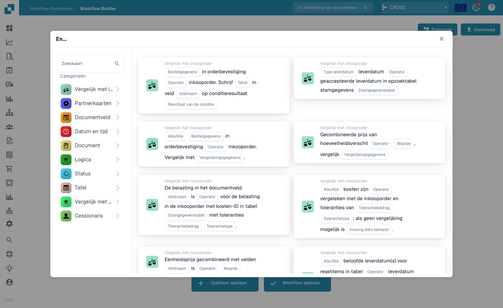

# Patrón de cotejo de PO

**Tipo de patrón:** Validación y comparación
**Complejidad:** Media-Alta
**Configuración estimada:** 60-90 minutos
**Casos de uso habituales:** Cotejo a tres bandas, validación de facturas, comprobación de desviaciones, gestión de tolerancias

---

Este patrón se monta en el **Workflow Builder** (Workflow Dashboard → Workflow List → Add Workflow). Haga clic en **Add Card** y abra la categoría **Compare with Purchase Order**: contiene todas las tarjetas de cotejo que usa este patrón (tarjetas de comparación de precio, cantidad, tolerancia y líneas):

<figure><figcaption><p>La categoría <strong>Compare with Purchase Order</strong>: tarjetas de cotejo de precio, cantidad, tolerancia y líneas usadas en todo este patrón.</p></figcaption></figure>

---

## Resumen del patrón

Este patrón muestra cómo implementar flujos de trabajo completos de cotejo de pedidos de compra (PO) en DocBits. El cotejo de PO es un proceso de control crítico que compara los datos de la factura con los datos del pedido de compra para detectar discrepancias antes de la aprobación del pago.

**Qué hace este patrón:**
1. Recupera los datos de la PO según el número de PO de la factura
2. Compara las líneas de la factura con las líneas de la PO
3. Calcula las desviaciones (precio, cantidad, totales)
4. Aplica reglas de tolerancia
5. Enruta para aprobación o escalado según los resultados del cotejo
6. Hace seguimiento del historial de cotejos y de las excepciones

---

## Cuándo usar este patrón

Use este patrón cuando necesite:
- ✅ Validar facturas contra pedidos de compra
- ✅ Detectar errores de precio antes del pago
- ✅ Identificar discrepancias de cantidad
- ✅ Aplicar controles de compras
- ✅ Evitar pagos duplicados
- ✅ Automatizar el cotejo a tres bandas
- ✅ Reducir la carga de revisión manual de facturas

**No use este patrón cuando:**
- ❌ No exista ninguna PO para la factura (facturas sin PO)
- ❌ Los datos de la PO no estén disponibles en DocBits
- ❌ Se prefiera la revisión manual a la automatización
- ❌ La política de negocio no requiera el cotejo de PO

---

## Comprender el cotejo de PO

### El cotejo a tres bandas

**Control de compras tradicional:**
```
Purchase Order (PO)  →  Created when ordering
        ↓
Goods Receipt (GR)   →  Created when receiving
        ↓
Invoice              →  Created by supplier

THREE-WAY MATCH = PO + GR + Invoice all match
```

**Implementación en DocBits (cotejo a dos bandas):**
```
Purchase Order (PO)  →  Imported to DocBits
        ↓
Invoice              →  Scanned by DocBits
        ↓
COMPARISON           →  Invoice vs PO validation
```

---

## Fórmulas de cálculo de desviaciones

### Desviación del precio unitario

**Fórmula:**
```
Variance % = |(Invoice Unit Price - PO Unit Price)| / PO Unit Price × 100
```

**Ejemplo:**
```
PO Unit Price:       €100.00
Invoice Unit Price:  €103.00

Variance = |103 - 100| / 100 × 100
        = 3 / 100 × 100
        = 3%

Tolerance: 5%
Result: 3% ≤ 5% → PASS ✅
```

---

### Desviación de cantidad

**Fórmula:**
```
Variance % = |(Invoice Quantity - PO Quantity)| / PO Quantity × 100
```

**Ejemplo:**
```
PO Quantity:        100 units
Invoice Quantity:   98 units

Variance = |98 - 100| / 100 × 100
        = 2 / 100 × 100
        = 2%

Tolerance: 10%
Result: 2% ≤ 10% → PASS ✅
```

---

### Desviación del importe total

**Fórmula:**
```
Variance % = |(Invoice Total - PO Total)| / PO Total × 100
```

**Ejemplo:**
```
PO Total:       €10,000.00
Invoice Total:  €10,450.00

Variance = |10450 - 10000| / 10000 × 100
        = 450 / 10000 × 100
        = 4.5%

Tolerance: 5%
Result: 4.5% ≤ 5% → PASS ✅
```

---

## Ejemplo de flujo de trabajo completo

### Escenario: Validación de facturas con enrutamiento basado en tolerancia

**Requisito de negocio:**
- Todas las facturas con referencia de PO deben validarse
- Tolerancia de desviación de precio: 5 %
- Tolerancia de desviación de cantidad: 10 %
- Tolerancia de desviación del importe total: 3 %
- Dentro de la tolerancia: Aprobación automática
- Fuera de la tolerancia: Crear tarea de revisión
- Sin PO: Escalar a compras

**Tarjetas de flujo de trabajo utilizadas:**
1. CONDITION_DOC_FIELD_EXISTS - Comprueba si el número de PO está presente
2. PURCHASE_ORDER_FULL_MATCH - Intenta el cotejo completo
3. CONDITION_DOC_TO_PO_UNIT_PRICE - Comprueba la desviación de precio
4. CONDITION_DOC_TO_PO_QUANTITY - Comprueba la desviación de cantidad
5. CONDITION_DOC_TO_PO_TAX_LINES - Comprueba la alineación de los impuestos
6. ACTION_SET_FIELD_TO_TEXT - Almacena los resultados del cotejo
7. tasks_create - Crea las tareas de revisión
8. ACTION_SEND_EMAIL_TO_GROUPS - Envía las notificaciones

---

## Implementación paso a paso

### Paso 1: Comprobar la referencia de PO

**Tarjeta:** CONDITION_DOC_FIELD_EXISTS o CONDITION_DOC_FIELD_CONTAINS

**Configuración:**
```
Field: PO_Number
Operator: IS NOT EMPTY
```

**Lógica:**
```
IF PO_Number exists:
  → Continue to PO matching
ELSE:
  → Route to "Non-PO Invoice" workflow
  → Create manual review task
  → Skip PO matching
```

**Referencia de guía:** [Guía de tarjetas de condición](../and/condition-cards-complete-guide.md)

---

### Paso 2: Recuperar los datos de la PO

**Automático en DocBits:**
- El sistema busca la PO por el campo PO_Number
- Recupera las líneas de la PO
- Pone los datos a disposición para la comparación

**Configuración manual (si es necesaria):**
```
PO Source: DocBits Master Data
PO Lookup Field: PO_Number
Match Type: Exact Match
Include Closed POs: No (or Yes if policy allows)
```

---

### Paso 3: Comprobación de cotejo completo de PO

**Tarjeta:** PURCHASE_ORDER_FULL_MATCH

**Propósito:** Comprobación rápida de si todo coincide perfectamente

**Configuración:**
```
Match Level: Full Match
Include: All line items, prices, quantities, totals
Tolerance: None (exact match)
```

**Lógica:**
```
IF Full Match = TRUE:
  → Set "PO_Match_Status" = "FULL MATCH"
  → Auto-approve document
  → Skip detailed checks
  → END ✅

IF Full Match = FALSE:
  → Continue to detailed variance checks
  → Identify specific variances
```

**Resultado:**
- **TRUE**: Coincidencia perfecta, aprobación automática
- **FALSE**: Continuar con las comprobaciones detalladas

---

### Paso 4: Comprobar la desviación del precio unitario

**Tarjeta:** CONDITION_DOC_TO_PO_UNIT_PRICE (se recomienda la v5)

**Configuración:**
```
Comparison Mode: Percentage Variance
Tolerance: 5%
Operator: Variance is Less Than or Equal To
Apply To: All line items
```

**Paso a paso:**
```
For each line item:
  1. Get Invoice Unit Price
  2. Get PO Unit Price (matched by product code)
  3. Calculate: Variance % = |Invoice - PO| / PO × 100
  4. Check: Variance % ≤ 5%?
  5. Store result
```

**Ejemplo de cálculo:**
```
Line Item 1:
  Product: ABC123
  Invoice Price: €52.00
  PO Price: €50.00
  Variance = |52-50|/50 × 100 = 4%
  Tolerance: 5%
  Result: PASS ✅

Line Item 2:
  Product: XYZ789
  Invoice Price: €120.00
  PO Price: €100.00
  Variance = |120-100|/100 × 100 = 20%
  Tolerance: 5%
  Result: FAIL ❌

Overall Result: FAIL (one or more items failed)
```

**Referencia de guía:** [Guía completa de cotejo de PO - Precio unitario](../and/compare-with-purchase-order/po-matching-complete-guide.md#unit-price-comparison)

---

### Paso 5: Comprobar la desviación de cantidad

**Tarjeta:** CONDITION_DOC_TO_PO_QUANTITY

**Configuración:**
```
Comparison Mode: Percentage Variance
Tolerance: 10%
Operator: Variance is Less Than or Equal To
Apply To: All line items
Allow Under-Delivery: Yes (within tolerance)
Allow Over-Delivery: No (strict)
```

**Lógica:**
```
For each line item:
  1. Get Invoice Quantity
  2. Get PO Quantity
  3. Calculate: Variance % = |Invoice - PO| / PO × 100
  4. Check: Variance % ≤ 10%?
  5. Special rules:
     - Under-delivery: Allow within tolerance
     - Over-delivery: Reject (or apply stricter tolerance)
```

**Ejemplo:**
```
Line Item 1:
  Product: ABC123
  Invoice Qty: 98 units
  PO Qty: 100 units
  Variance = |98-100|/100 × 100 = 2%
  Under-delivery: 2% (within 10% tolerance)
  Result: PASS ✅

Line Item 2:
  Product: XYZ789
  Invoice Qty: 115 units
  PO Qty: 100 units
  Variance = |115-100|/100 × 100 = 15%
  Over-delivery: 15% (exceeds 10% tolerance)
  Result: FAIL ❌ (Escalate)
```

**Referencia de guía:** [Guía completa de cotejo de PO - Cantidad](../and/compare-with-purchase-order/po-matching-complete-guide.md#quantity-comparison)

---

### Paso 6: Comprobar la alineación de las líneas de impuestos

**Tarjeta:** CONDITION_DOC_TO_PO_TAX_LINES

**Configuración:**
```
Match Tax Codes: Yes
Match Tax Rates: Yes
Match Tax Amounts: With 1% tolerance
Tax Calculation: Verify recalculation
```

**Validación:**
```
1. Check tax codes match (e.g., "VAT19" on both)
2. Check tax rates match (19% on both)
3. Verify tax amount calculation:
   Tax Amount = Net Amount × Tax Rate
4. Allow small rounding differences
```

**Ejemplo:**
```
Invoice:
  Net Amount: €100.00
  Tax Rate: 19%
  Tax Amount: €19.00
  Total: €119.00

PO:
  Net Amount: €100.00
  Tax Rate: 19%
  Tax Amount: €19.00
  Total: €119.00

Result: Tax alignment PASS ✅
```

---

### Paso 7: Almacenar los resultados del cotejo

**Tarjeta:** ACTION_SET_FIELD_TO_TEXT (varias instancias)

**Configuración:**

**Campo 1: PO_Match_Status**
```
Field: PO_Match_Status
Value: {{CALCULATED}}
Options: "FULL MATCH" | "WITHIN TOLERANCE" | "OUT OF TOLERANCE" | "NO MATCH"
```

**Campo 2: Price_Variance_Percent**
```
Field: Price_Variance_Percent
Value: {{CALCULATED_PRICE_VARIANCE}}
Format: "4.5%" (example)
```

**Campo 3: Quantity_Variance_Percent**
```
Field: Quantity_Variance_Percent
Value: {{CALCULATED_QUANTITY_VARIANCE}}
Format: "2.0%" (example)
```

**Campo 4: Match_Details**
```
Field: Match_Details
Value: "Price Variance: 4.5% (within 5% tolerance)\nQuantity Variance: 2.0% (within 10% tolerance)\nTotal: PASS"
```

**Referencia de guía:** [Guía de manipulación de campos](../then/document-field/field-manipulation-guide.md)

---

### Paso 8: Enrutar según los resultados del cotejo

**Escenario A: Coincidencia perfecta (cotejo completo)**
```
IF PO_Match_Status = "FULL MATCH":
  1. Set Approval_Status = "AUTO APPROVED"
  2. Set Match_Type = "FULL"
  3. ACTION_APPROVE_DOCUMENT
  4. Export to ERP
  5. Send confirmation email
  → END ✅
```

**Escenario B: Dentro de la tolerancia**
```
IF PO_Match_Status = "WITHIN TOLERANCE":
  1. Set Approval_Status = "AUTO APPROVED"
  2. Set Match_Type = "TOLERANCE"
  3. Log variance details
  4. ACTION_APPROVE_DOCUMENT
  5. Export to ERP
  → END ✅
```

**Escenario C: Fuera de la tolerancia (menor)**
```
IF Variance < 15% (minor exceptions):
  1. Set Match_Status = "REVIEW REQUIRED"
  2. Create Task: "Review PO Variance"
     - Assign to: Accounts Payable Officer
     - Priority: Medium
     - Deadline: 3 days
  3. Send email with variance details
  4. Wait for task completion
  5. IF Approved: Continue processing
     IF Rejected: Return to supplier
```

**Escenario D: Fuera de la tolerancia (mayor)**
```
IF Variance ≥ 15% (major exceptions):
  1. Set Match_Status = "ESCALATION REQUIRED"
  2. Create Task: "URGENT: Major PO Variance"
     - Assign to: Procurement Manager
     - Priority: High
     - Deadline: 1 day
  3. Send urgent email to:
     - Procurement Manager
     - Finance Manager
     - Supplier contact
  4. Block document from processing
  5. Wait for resolution
```

**Escenario E: PO ausente o sin coincidencia**
```
IF PO not found OR no items match:
  1. Set Match_Status = "NO MATCH"
  2. Create Task: "PO Not Found"
     - Assign to: Procurement Team
     - Priority: High
  3. Send email to procurement
  4. Block document
  5. Request PO creation or correction
```

---

## Diagrama del flujo de trabajo completo

```
INVOICE ARRIVES
│
├─ CHECK: Does invoice have PO number?
│  │
│  ├─ NO PO NUMBER ❌
│  │  │
│  │  ├─ Set Match_Status = "NO PO"
│  │  ├─ Route to Non-PO workflow
│  │  └─ Create manual review task
│  │     → END (Non-PO Invoice)
│  │
│  └─ PO NUMBER EXISTS ✅
│     │
│     ├─ RETRIEVE PO DATA
│     │  - Lookup PO by PO_Number
│     │  - Get PO line items
│     │  - Get PO totals
│     │  │
│     │  ├─ PO FOUND ✅
│     │  │  │
│     │  │  ├─ STEP 1: Check Full Match
│     │  │  │  Card: PURCHASE_ORDER_FULL_MATCH
│     │  │  │  │
│     │  │  │  ├─ FULL MATCH ✅✅✅
│     │  │  │  │  │
│     │  │  │  │  ├─ Set Match_Status = "FULL MATCH"
│     │  │  │  │  ├─ Auto-Approve
│     │  │  │  │  └─ Export to ERP
│     │  │  │  │     → END (Perfect Match)
│     │  │  │  │
│     │  │  │  └─ NO FULL MATCH ⚠️
│     │  │  │     │
│     │  │  │     ├─ STEP 2: Check Unit Price Variance
│     │  │  │     │  Card: CONDITION_DOC_TO_PO_UNIT_PRICE
│     │  │  │     │  Tolerance: 5%
│     │  │  │     │  │
│     │  │  │     │  ├─ Calculate for each line:
│     │  │  │     │  │  Variance % = |Invoice-PO|/PO × 100
│     │  │  │     │  │
│     │  │  │     │  ├─ PRICE VARIANCE ≤ 5% ✅
│     │  │  │     │  │  Store variance: 3.2% (example)
│     │  │  │     │  │  Price Check: PASS
│     │  │  │     │  │
│     │  │  │     │  └─ PRICE VARIANCE > 5% ❌
│     │  │  │     │     Store variance: 12.5% (example)
│     │  │  │     │     Price Check: FAIL
│     │  │  │     │     → Flag for review
│     │  │  │     │
│     │  │  │     ├─ STEP 3: Check Quantity Variance
│     │  │  │     │  Card: CONDITION_DOC_TO_PO_QUANTITY
│     │  │  │     │  Tolerance: 10%
│     │  │  │     │  │
│     │  │  │     │  ├─ Calculate for each line:
│     │  │  │     │  │  Variance % = |Inv Qty-PO Qty|/PO Qty × 100
│     │  │  │     │  │
│     │  │  │     │  ├─ QUANTITY VARIANCE ≤ 10% ✅
│     │  │  │     │  │  Store variance: 2.0% (example)
│     │  │  │     │  │  Quantity Check: PASS
│     │  │  │     │  │
│     │  │  │     │  └─ QUANTITY VARIANCE > 10% ❌
│     │  │  │     │     Store variance: 15.0% (example)
│     │  │  │     │     Quantity Check: FAIL
│     │  │  │     │     → Flag for review
│     │  │  │     │
│     │  │  │     ├─ STEP 4: Check Tax Lines
│     │  │  │     │  Card: CONDITION_DOC_TO_PO_TAX_LINES
│     │  │  │     │  │
│     │  │  │     │  ├─ TAX ALIGNED ✅
│     │  │  │     │  │  Tax Check: PASS
│     │  │  │     │  │
│     │  │  │     │  └─ TAX MISMATCH ❌
│     │  │  │     │     Tax Check: FAIL
│     │  │  │     │     → Flag for review
│     │  │  │     │
│     │  │  │     ├─ EVALUATE RESULTS
│     │  │  │     │  │
│     │  │  │     │  ├─ ALL CHECKS PASS ✅
│     │  │  │     │  │  (Within tolerance)
│     │  │  │     │  │  │
│     │  │  │     │  │  ├─ Set Match_Status = "WITHIN TOLERANCE"
│     │  │  │     │  │  ├─ Log variance details
│     │  │  │     │  │  ├─ Auto-Approve
│     │  │  │     │  │  └─ Export to ERP
│     │  │  │     │  │     → END (Approved with Variance)
│     │  │  │     │  │
│     │  │  │     │  ├─ MINOR FAILURES (Variance < 15%) ⚠️
│     │  │  │     │  │  │
│     │  │  │     │  │  ├─ Set Match_Status = "REVIEW REQUIRED"
│     │  │  │     │  │  ├─ Create Review Task
│     │  │  │     │  │  │  - Assign to: AP Officer
│     │  │  │     │  │  │  - Priority: Medium
│     │  │  │     │  │  │  - Deadline: 3 days
│     │  │  │     │  │  ├─ Send email with details
│     │  │  │     │  │  │
│     │  │  │     │  │  └─ WAIT FOR TASK COMPLETION
│     │  │  │     │  │     │
│     │  │  │     │  │     ├─ TASK APPROVED ✅
│     │  │  │     │  │     │  Approve & Export
│     │  │  │     │  │     │  → END (Manual Approval)
│     │  │  │     │  │     │
│     │  │  │     │  │     └─ TASK REJECTED ❌
│     │  │  │     │  │        Reject & Return to Supplier
│     │  │  │     │  │        → END (Rejected)
│     │  │  │     │  │
│     │  │  │     │  └─ MAJOR FAILURES (Variance ≥ 15%) 🚨
│     │  │  │     │     │
│     │  │  │     │     ├─ Set Match_Status = "ESCALATION"
│     │  │  │     │     ├─ Create Urgent Task
│     │  │  │     │     │  - Assign to: Procurement Manager
│     │  │  │     │     │  - Priority: High
│     │  │  │     │     │  - Deadline: 1 day
│     │  │  │     │     ├─ Send urgent emails to:
│     │  │  │     │     │  * Procurement Manager
│     │  │  │     │     │  * Finance Manager
│     │  │  │     │     │  * Supplier
│     │  │  │     │     ├─ Block document processing
│     │  │  │     │     │
│     │  │  │     │     └─ WAIT FOR RESOLUTION
│     │  │  │     │        → END (Pending Escalation)
│     │  │  │     │
│     │  │  │     └─ [Variance checks complete]
│     │  │  │
│     │  │  └─ [Full match check complete]
│     │  │
│     │  └─ PO NOT FOUND ❌
│     │     │
│     │     ├─ Set Match_Status = "PO NOT FOUND"
│     │     ├─ Create Task: "Missing PO"
│     │     │  - Assign to: Procurement Team
│     │     │  - Priority: High
│     │     ├─ Send email to procurement
│     │     └─ Block document
│     │        → END (Missing PO)
│     │
│     └─ [PO retrieval complete]
│
└─ [PO check complete]
```

---

## Plantillas de configuración

### Plantilla 1: Cotejo de PO estándar (conservador)

```json
{
  "full_match_check": true,
  "price_variance": {
    "enabled": true,
    "tolerance_percent": 3,
    "tolerance_type": "percentage"
  },
  "quantity_variance": {
    "enabled": true,
    "tolerance_percent": 5,
    "tolerance_type": "percentage",
    "allow_under_delivery": true,
    "allow_over_delivery": false
  },
  "tax_validation": {
    "enabled": true,
    "match_tax_codes": true,
    "match_tax_rates": true,
    "tax_amount_tolerance": 0.5
  },
  "auto_approve": {
    "full_match": true,
    "within_tolerance": true
  },
  "escalation": {
    "threshold_percent": 10,
    "assign_to": "procurement_manager"
  }
}
```

**Uso:** Entorno de control estricto, baja tolerancia a la desviación

---

### Plantilla 2: Cotejo de PO flexible (permisivo)

```json
{
  "full_match_check": true,
  "price_variance": {
    "enabled": true,
    "tolerance_percent": 10,
    "tolerance_type": "percentage"
  },
  "quantity_variance": {
    "enabled": true,
    "tolerance_percent": 15,
    "tolerance_type": "percentage",
    "allow_under_delivery": true,
    "allow_over_delivery": true
  },
  "tax_validation": {
    "enabled": true,
    "match_tax_codes": false,
    "match_tax_rates": true,
    "tax_amount_tolerance": 2
  },
  "auto_approve": {
    "full_match": true,
    "within_tolerance": true
  },
  "escalation": {
    "threshold_percent": 20,
    "assign_to": "accounts_payable"
  }
}
```

**Uso:** Entorno flexible, proveedores de confianza, mayor tolerancia

---

### Plantilla 3: Cotejo solo de precio

```json
{
  "full_match_check": false,
  "price_variance": {
    "enabled": true,
    "tolerance_percent": 5,
    "tolerance_type": "percentage"
  },
  "quantity_variance": {
    "enabled": false
  },
  "tax_validation": {
    "enabled": false
  },
  "auto_approve": {
    "full_match": false,
    "within_tolerance": true
  }
}
```

**Uso:** Cuando solo importa el precio y se esperan variaciones de cantidad

---

## Escenarios avanzados

### Escenario 1: Gestión de entregas parciales

**Reto:** Factura por una entrega parcial de la PO

**Solución:**
```
1. Allow quantity under-delivery within tolerance
2. Track cumulative invoiced quantity vs PO quantity
3. Update PO remaining quantity
4. Create field: "PO_Percentage_Invoiced"
5. When 100% invoiced: Close PO automatically
```

**Implementación:**
```
IF Cumulative_Invoiced_Quantity ≤ PO_Quantity:
  Calculate: Percentage = (Cumulative/PO) × 100
  Store in: PO_Percentage_Invoiced
  IF Percentage ≥ 100:
    Set PO_Status = "FULLY INVOICED"
    Close PO
```

---

### Escenario 2: Cotejo de PO multidivisa

**Reto:** La divisa de la factura es distinta de la de la PO

**Solución:**
```
1. Detect currency mismatch
2. Get exchange rate (from API or master data)
3. Convert invoice amount to PO currency
4. Compare converted amounts
5. Store both original and converted amounts
```

**Implementación:**
```
IF Invoice_Currency ≠ PO_Currency:
  1. Get exchange rate for Invoice_Currency → PO_Currency
  2. Convert: Invoice_Amount_Converted = Invoice_Amount × Rate
  3. Compare: Invoice_Amount_Converted vs PO_Amount
  4. Store: Original_Currency_Amount and Converted_Amount
  5. Flag: "Currency_Conversion_Applied"
```

---

### Escenario 3: PO global / Contrato marco

**Reto:** Varias facturas contra una sola PO

**Solución:**
```
1. Identify PO type = "Blanket"
2. Track cumulative invoiced value
3. Check: Cumulative ≤ Blanket PO Total
4. Update remaining PO value after each invoice
5. Alert when approaching PO limit
```

**Implementación:**
```
IF PO_Type = "Blanket":
  Calculate: Total_Invoiced_To_Date
  Check: Total_Invoiced_To_Date + Current_Invoice ≤ PO_Total_Value
  IF Within limit:
    Approve invoice
    Update: Remaining_PO_Value
  ELSE:
    Escalate: "Blanket PO limit exceeded"
```

---

## Gestión de errores y casos límite

### Caso límite 1: Falta una línea en la factura

**Problema:** La factura tiene un artículo que no está en la PO

**Solución:**
```
1. Identify unmatched line items
2. Calculate: Unmatched_Amount
3. IF Unmatched_Amount < €100 (threshold):
     Create review task (minor issue)
   ELSE:
     Escalate immediately (major issue)
4. Store unmatched item details
5. Flag: "Additional_Items_Present"
```

---

### Caso límite 2: PO cerrada pero llega una factura

**Problema:** La PO ya está cerrada y se recibe una factura tardía

**Solución:**
```
1. Check: PO_Status = "CLOSED"
2. Check: Invoice_Date vs PO_Close_Date
3. IF Invoice within 30 days of close:
     Reopen PO temporarily
     Process invoice
     Close PO again
   ELSE:
     Create task: "Late Invoice for Closed PO"
     Assign to procurement
     Manual decision required
```

---

### Caso límite 3: Varias PO en una sola factura

**Problema:** La factura hace referencia a varias PO

**Solución:**
```
1. Parse invoice for multiple PO numbers
2. For each PO:
     Retrieve PO data
     Match respective line items
3. Aggregate match results
4. Overall match = ALL individual POs must match
5. Report on each PO separately
```

---

## Consejos de rendimiento

✅ **Buenas prácticas:**
- Almacene en caché los datos de la PO para reducir las búsquedas
- Establezca tolerancias adecuadas (ni demasiado estrictas ni demasiado permisivas)
- Use primero la comprobación de cotejo completo (más rápida)
- Registre todos los cálculos de desviación
- Revise la configuración de tolerancias trimestralmente
- Supervise las tasas de aprobación automática
- Haga seguimiento de los motivos de desviación habituales

❌ **Evite:**
- La tolerancia cero (demasiado estricta, demasiadas revisiones manuales)
- Una tolerancia extremadamente alta (anula el propósito)
- Ignorar las desviaciones sistemáticas
- No hacer seguimiento de las tendencias de desviación
- Procesar sin PO (cuando es obligatoria)

---

## Supervisión e informes

### Métricas clave para hacer seguimiento

1. **Tasa de coincidencia:**
   - Full Match: X%
   - Within Tolerance: Y%
   - Outside Tolerance: Z%

2. **Análisis de desviaciones:**
   - Desviación de precio media
   - Desviación de cantidad media
   - Motivos de desviación habituales

3. **Eficiencia del procesamiento:**
   - Tasa de aprobación automática
   - Tasa de revisión manual
   - Tiempo medio de revisión

4. **Rendimiento del proveedor:**
   - Desviaciones por proveedor
   - Tasa de coincidencia por proveedor
   - Proveedores problemáticos

---

## Lista de comprobación para pruebas

- [ ] Escenario de coincidencia perfecta (cotejo completo)
- [ ] Escenario dentro de la tolerancia (desviación menor)
- [ ] Escenario fuera de la tolerancia (desviación mayor)
- [ ] Escenario de PO ausente
- [ ] Escenario de número de PO incorrecto
- [ ] Escenario de entrega parcial
- [ ] Escenario de entrega excesiva
- [ ] Escenario de discrepancia de divisa
- [ ] Escenario de varias PO
- [ ] Escenario de PO cerrada
- [ ] Escenario de desviación de impuestos
- [ ] Flujo de trabajo de escalado
- [ ] Creación de tareas
- [ ] Notificaciones por correo electrónico
- [ ] Actualizaciones de campos
- [ ] Exportación tras la aprobación

---

## Patrones relacionados

### Patrones que funcionan bien juntos:

- **[Patrón de gestión de tareas](task-management-pattern.md)** - Crea tareas de revisión para las desviaciones
- **[Patrón de lógica de decisión](decision-logic-pattern.md)** - Enrutamiento complejo según los niveles de desviación
- **[Patrón de integración de API](api-integration-pattern.md)** - Obtiene el precio actual para la comparación
- **[Patrón de transformación de datos](data-transformation-pattern.md)** - Conversión de divisas y de unidades

---

## Guías relacionadas

### Requisitos previos
- [Guía completa de cotejo de PO](../and/compare-with-purchase-order/po-matching-complete-guide.md) - Todas las tarjetas de cotejo de PO
- [Guía de tarjetas de condición](../and/condition-cards-complete-guide.md) - Lógica de condiciones
- [Guía de manipulación de campos](../then/document-field/field-manipulation-guide.md) - Operaciones con campos

### Tarjetas relacionadas
- **PURCHASE_ORDER_FULL_MATCH** - [Guía de cotejo de PO](../and/compare-with-purchase-order/po-matching-complete-guide.md#full-match)
- **CONDITION_DOC_TO_PO_UNIT_PRICE** - [Guía de cotejo de PO](../and/compare-with-purchase-order/po-matching-complete-guide.md#unit-price)
- **CONDITION_DOC_TO_PO_QUANTITY** - [Guía de cotejo de PO](../and/compare-with-purchase-order/po-matching-complete-guide.md#quantity)
- **CONDITION_DOC_TO_PO_TAX_LINES** - [Guía de cotejo de PO](../and/compare-with-purchase-order/po-matching-complete-guide.md#tax-lines)
- **tasks_create** - [Guía de asignación de tareas](../then/task/task-assignment-guide.md)

### Próximos pasos
- Crear tareas de revisión: [Patrón de gestión de tareas](task-management-pattern.md)
- Añadir notificaciones por correo electrónico: [Guía de envío de correo](../then/action/send-email-groups-guide.md)
- Implementar enrutamiento complejo: [Patrón de lógica de decisión](decision-logic-pattern.md)

---

**Versión del patrón:** 1.0
**Última actualización:** 23 de octubre de 2025
**Dificultad:** Media-Alta
**Tiempo estimado:** 60-90 minutos
**Tasa de éxito:** Alta (cuando se configura correctamente)
