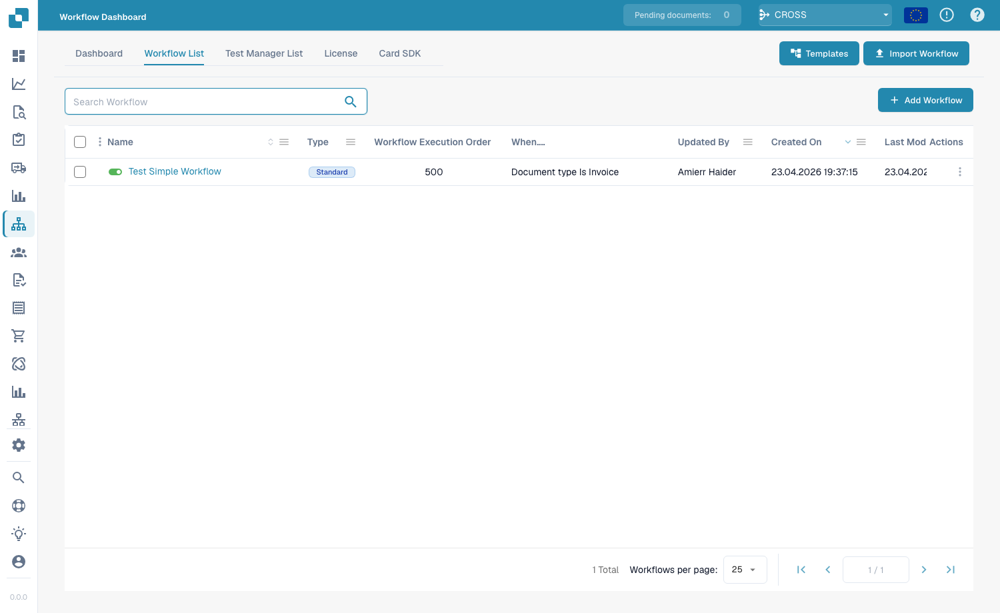

# Standard Workflow

De **Standard Workflow** builder is de lineaire, op kaarten gebaseerde editor voor het automatiseren van documentverwerking. Een workflow bestaat uit drie groepen kaarten — **When** (de trigger), **And** (aanvullende voorwaarden) en **Then** (de acties die worden uitgevoerd). Wanneer een document voldoet aan de When/And-voorwaarden, worden de Then-acties automatisch uitgevoerd.

## Toegang krijgen

Open **Workflow Dashboard → Workflow List** en klik vervolgens op **Add Workflow** om een nieuwe Standard-workflow aan te maken, of klik op een bestaande workflow om deze te bewerken.

<figure><figcaption>
De Workflow List — elke rij is een workflow die u kunt openen, in-/uitschakelen of bewerken.
</figcaption></figure>

## Het When / And / Then-model

<figure><figcaption>
Het Standard Workflow-canvas. Dit voorbeeld triggert op facturen in een suborganisatie en wijst ze toe aan een gebruiker.
</figcaption></figure>

- **When** — de trigger die de workflow start (bijv. *Document type is Invoice*).
- **And** — extra voorwaarden die ook waar moeten zijn (bijv. *Document is part of sub-organization*). Laat leeg om bij elke match van de When-kaart uit te voeren.
- **Then** — de acties die moeten worden uitgevoerd (bijv. *Assign the document to the user*, een taak aanmaken, een API aanroepen, een e-mail verzenden).

## Kaarten toevoegen

Klik in een willekeurige groep op **Add Card** om de kaartbibliotheek te openen. Kaarten zijn per categorie geordend, zodat u de bouwsteen vindt die u nodig hebt:

<figure><figcaption>
De <strong>Add Card</strong>-bibliotheek — voorwaardekaarten, vergelijkingskaarten, actiekaarten en meer, gegroepeerd per categorie.
</figcaption></figure>

Sla op met **Save Workflow**, of sla de lay-out op als herbruikbare template met **Save Template**.

## Volgende stappen

- Bekijk in het **Cards**-gedeelte wat elke kaart doet.
- Combineer kaarten tot beproefde oplossingen met de **Workflow Pattern Guides**.
- Voor vertakkende flows met parallelle paden (Wait ALL / Wait ANY / OR) gebruikt u de **Advanced Workflow** builder.
