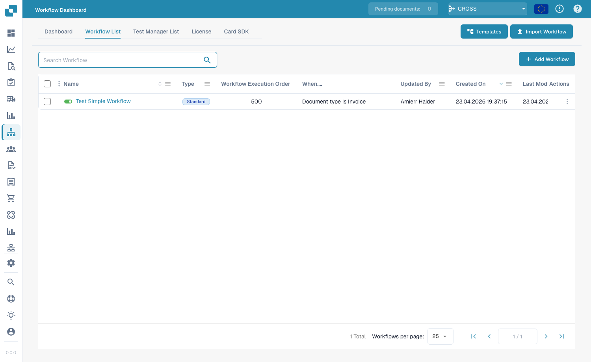
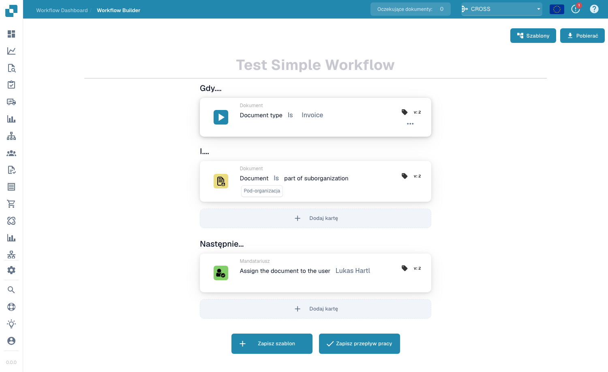
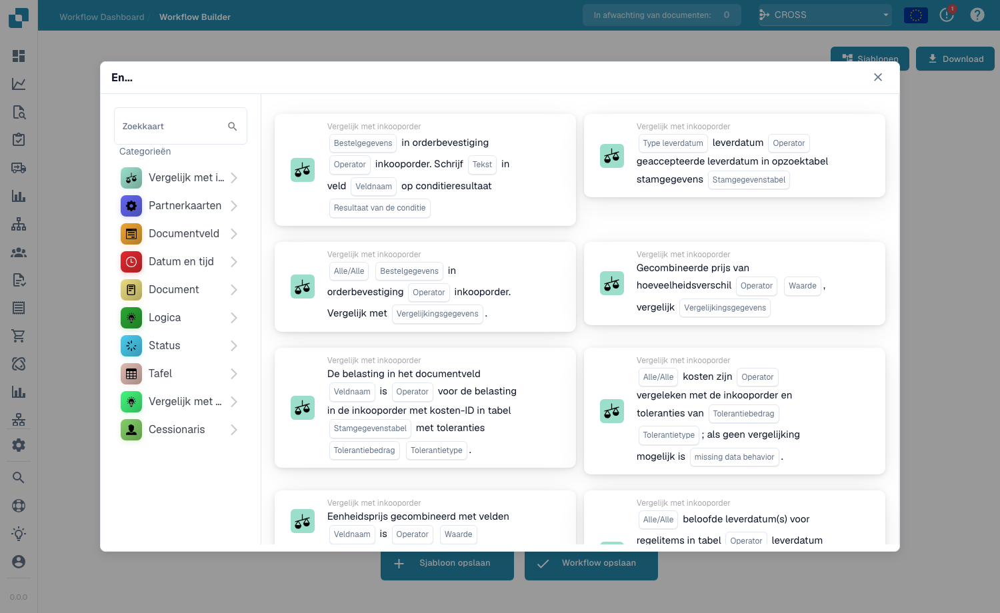
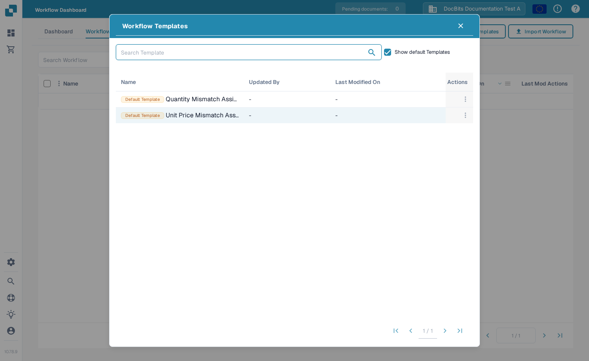

# Standard Workflow

The **Standard Workflow** builder is the linear, card-based editor for automating document processing. A workflow is made of three groups of cards — **When** (the trigger), **And** (additional conditions) and **Then** (the actions to run). When a document matches the When/And conditions, the Then actions run automatically.

## How to access

Open **Workflow Dashboard → Workflow List**, then click **New Workflow** to create a new Standard workflow, or click an existing workflow to edit it.

<figure><figcaption>
The Workflow List — each row is a workflow you can open, toggle on/off or edit.
</figcaption></figure>

## The When / And / Then model

<figure><figcaption>
The Standard Workflow canvas. This example triggers on invoices in a sub-organization and assigns them to a user.
</figcaption></figure>

- **When** — the trigger that starts the workflow (e.g. *Document type is Invoice*).
- **And** — extra conditions that must also be true (e.g. *Document is part of sub-organization*). Leave empty to run on every match of the When card.
- **Then** — the actions to perform (e.g. *Assign the document to the user*, create a task, call an API, send an email).

## Adding cards

Click **Add Card** in any group to open the card library. Cards are organised by category so you can find the building block you need:

<figure><figcaption>
The <strong>Add Card</strong> library — condition cards, comparison cards, action cards and more, grouped by category.
</figcaption></figure>

Save with **Save Workflow**, or save the layout as a reusable template with **Save Template**.

## Workflow Templates

The **Templates** button in the workflow toolbar opens the **Workflow Templates** library, where you can manage the templates that are saved in your organization:

<figure><figcaption>
The <strong>Workflow Templates</strong> dialog — saved templates and, with <strong>Show default Templates</strong> enabled, the built-in default templates.
</figcaption></figure>

- The list shows each template's **Name**, **Updated By** and **Last Modified On**.
- Turn on **Show default Templates** to include the built-in default templates in the list.
- Use the row's **Actions** menu to **Duplicate** a template, or to **Delete** a saved template — the built-in defaults cannot be deleted.
- Click a template row to open it in the **Template Designer**, which uses the same When/And/Then canvas as the Standard Workflow designer. Save your changes with **Save Template**.
- To start a new workflow from a template, open the template in the designer, adjust the cards, and save it as a workflow with **Save Workflow**.

## Next steps

- See what each card does in the **Cards** section.
- Combine cards into proven solutions with the **Workflow Pattern Guides**.
- For branching flows with parallel paths (Wait ALL / Wait ANY / OR), use the **Advanced Workflow** builder.
