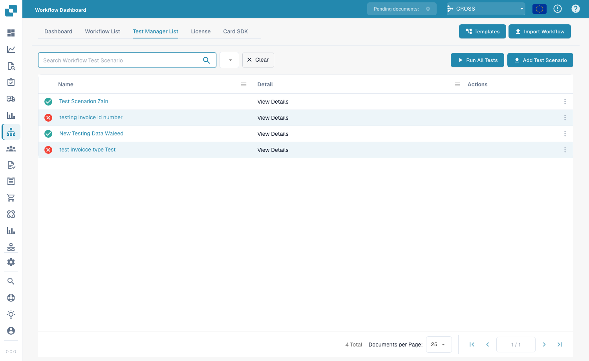
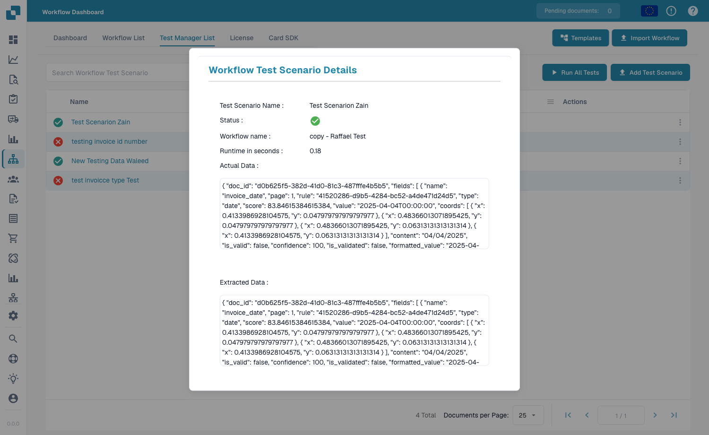

# Test Manager

Met de **Test Manager** kunt u herbruikbare **testscenario's** voor uw workflows opslaan en samen uitvoeren — zodat u kunt bevestigen dat een workflow nog steeds correct werkt nadat u deze hebt gewijzigd. Het werkt voor zowel Standaard- als Geavanceerde workflows.

Open hem via **Workflow Dashboard → Test Manager List**.

<figure><figcaption>
De Test Manager List — elk opgeslagen scenario toont een geslaagd/mislukt-resultaat.
</figcaption></figure>

## Wat een testscenario is

Een testscenario legt een workflow, een voorbeeldinvoer en de **verwachte uitkomst** vast. Wanneer u het uitvoert, speelt de Test Manager de workflow opnieuw af tegen die invoer en vergelijkt het resultaat met wat u verwachtte — waardoor de rij **groen** (geslaagd) of **rood** (mislukt) wordt.

## Werken met scenario's

- **Add Test Scenario** — maak een nieuw scenario op basis van een workflow en een voorbeelddocument.
- **Run All Tests** — voer alle scenario's tegelijk uit en zie in één oogopslag welke workflows nog steeds slagen.
- **View Details** — open een scenario om het resultaat te inspecteren.

<figure><figcaption>
Scenariodetails — naam, status, uitvoeringstijd en de werkelijke versus geëxtraheerde gegevens die de uitvoering opleverde.
</figcaption></figure>

De detailweergave toont de scenarionaam en **status**, de **workflownaam**, de **uitvoeringstijd** en de **werkelijke** en **geëxtraheerde gegevens** die de uitvoering opleverde — zodat u precies kunt zien waarom een scenario is geslaagd of mislukt.

## Test Manager versus testen in de builder

Dit zijn twee verschillende dingen:

- **Test Manager** (deze pagina) — *opgeslagen, herhaalbare* scenario's met verwachte uitkomsten, samen uitgevoerd met **Run All Tests**. Gebruik dit voor regressietests na wijzigingen.
- **Testen in de builder** — de inline **Validate**- en **Test**-knoppen in de Advanced Workflow-builder, voor snelle controles terwijl u aan het bouwen bent. Zie [Validatie & Testen](advanced-workflow/validation-and-testing.md).
