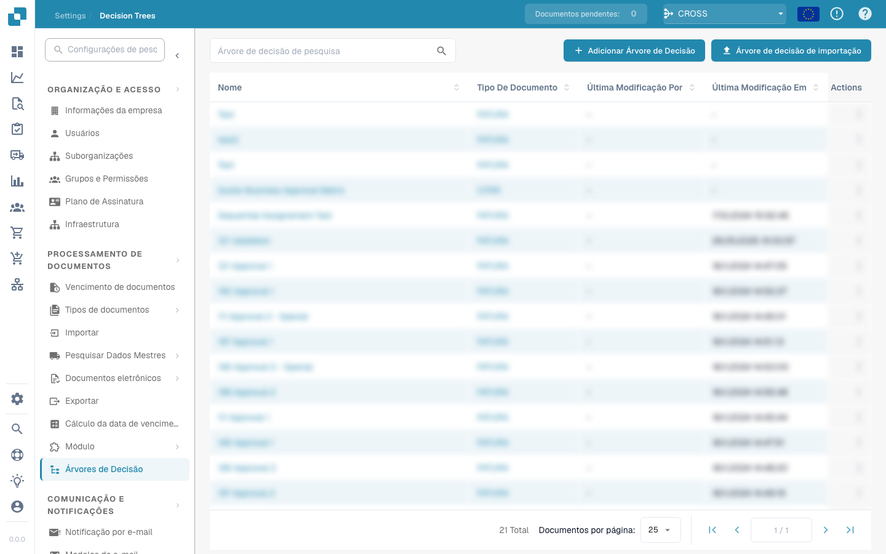

# Then

## Visão geral dos cartões de ação "Then..."

### **1. Ações de Document Field:**

* **Invert Checkbox:** Esta ação alterna o estado de um campo de caixa de verificação num documento.
* **Set Checkbox:** Define o estado de um campo de caixa de verificação como verdadeiro (assinalado) ou falso (não assinalado).
* **Set Field to Text:** Esta ação define um campo de documento especificado para um determinado valor de texto.

<figure><figcaption></figcaption></figure>

### **2. Ações de Document:**

* **Approve the Document:** Marca um documento como aprovado no sistema.
* **Reject the Document:** Marca um documento como rejeitado.

<figure><figcaption></figcaption></figure>

### **3. Ações de Export:**

* **Export document with export configuration:**   Inicia o processo de exportação com uma configuração de exportação específica.
* **Start Export:** Inicia o processo de exportação.

<figure><figcaption></figcaption></figure>

### **4. Ações de Status:**

* **Change Status:** Altera o estado de um documento ou tarefa para um novo estado especificado.

<figure><figcaption></figcaption></figure>

### **5. Ações de Task:**

* Atribuições e notificações:
  * **Assign Task:** Cria e atribui uma tarefa com detalhes específicos a um indivíduo ou grupo, incluindo opções para os notificar por e-mail.
  * **Create a New Task:** Semelhante a atribuir, mas focado na criação de uma tarefa totalmente nova no sistema.

<figure><figcaption></figcaption></figure>

### **6. Ações de Table:**

* **Calculate in Table:** Realiza cálculos sobre dados de tabelas com base em condições especificadas e guarda os resultados numa coluna designada.
* **Change Entries:** Atualiza entradas numa tabela com base em condições especificadas.

<figure><figcaption></figcaption></figure>

### **7. Ações de Assignee:**

* **Assign User from Field:** Atribui um utilizador a uma tarefa ou documento com base nos dados de utilizador guardados num campo específico, com a opção de um utilizador alternativo caso o principal não esteja disponível.
* **Assign Document to User or Group:** Atribui diretamente um documento a um utilizador ou grupo, garantindo que a responsabilidade é devidamente designada.

<figure><figcaption></figcaption></figure>

### **8. Ações de Interação Externa:**

* **Call API:** Envia um pedido a uma API externa, que pode ser personalizado com métodos, parâmetros e dados específicos.
* **Send HTTPS Request:** Semelhante às chamadas de API, mas formatado especificamente para protocolos HTTPS.

<figure><figcaption></figcaption></figure>

### **9. Processamento Avançado:**

* **Run Workflow:** Aciona outro fluxo de trabalho dentro do sistema, permitindo o encadeamento de processos complexos.

#### Aplicação prática

Estes cartões de ação são utilizados para automatizar respostas com base em gatilhos específicos identificados nas partes anteriores da configuração do fluxo de trabalho. Por exemplo:

* Se um documento for identificado como necessitando de revisão, a ação "Approve the Document" pode ser acionada automaticamente assim que ele cumprir todas as condições especificadas.
* Para tarefas de gestão de dados, as ações "Set Checkbox" ou "Set Field to Text" garantem que os campos do documento são atualizados automaticamente, reduzindo a introdução manual de dados e o potencial de erros.
* Tarefas complexas, como interações de API ou alterações de estado, simplificam as interações não só dentro do sistema ERP, mas também com serviços e ferramentas externas, melhorando a integração e a funcionalidade.

### Conclusão

A secção "Then..." do seu sistema de fluxo de trabalho fornece ferramentas robustas para definir ações precisas que devem ocorrer como resultado do cumprimento de condições no fluxo de trabalho. Ao utilizar eficazmente estas ações, as empresas podem automatizar processos de rotina, garantir a precisão dos dados e responder dinamicamente a alterações de informação e de estados do sistema. Compreender como configurar e utilizar estas ações é fundamental para maximizar a eficiência e a eficácia das capacidades de fluxo de trabalho do seu sistema ERP.
