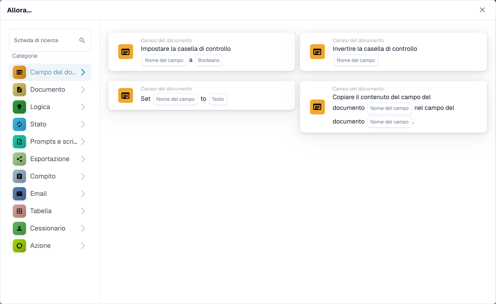
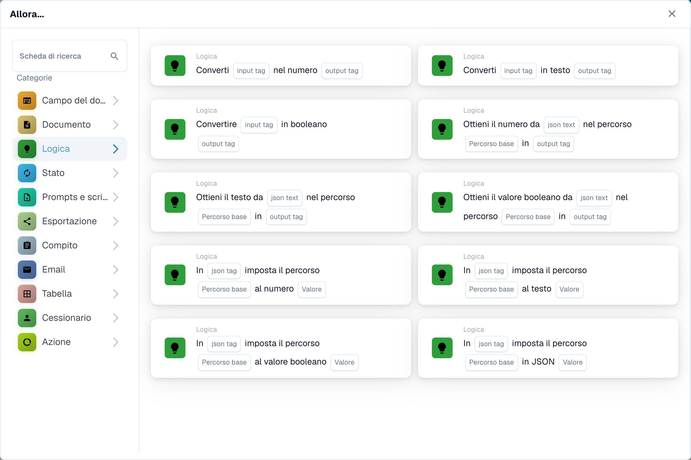
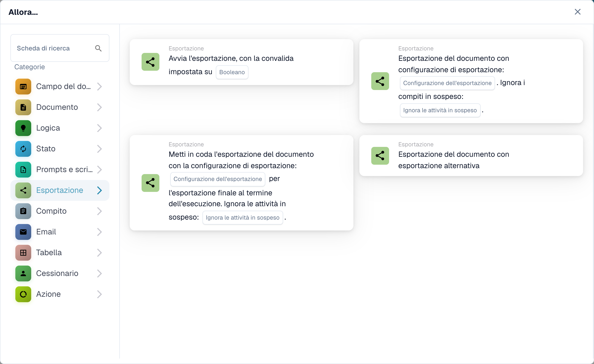
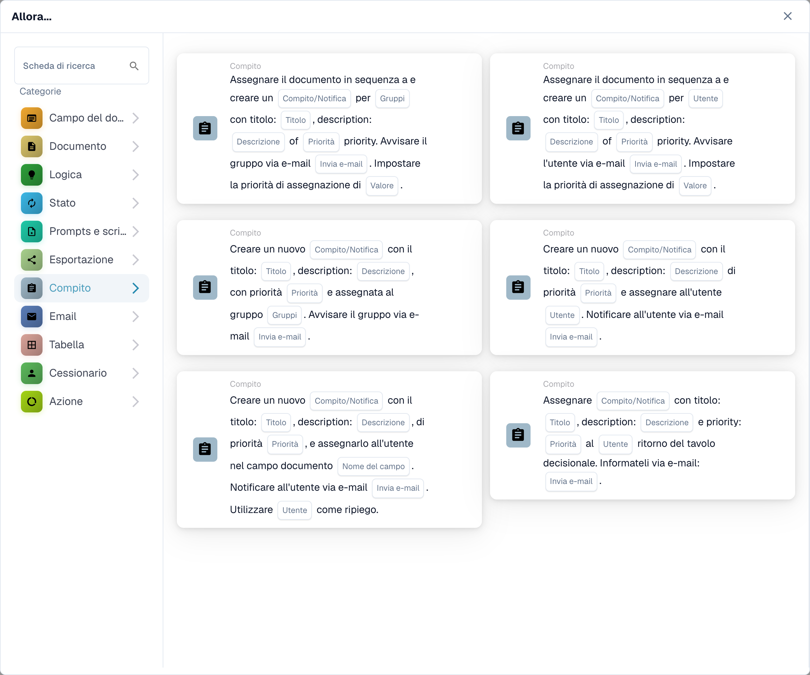
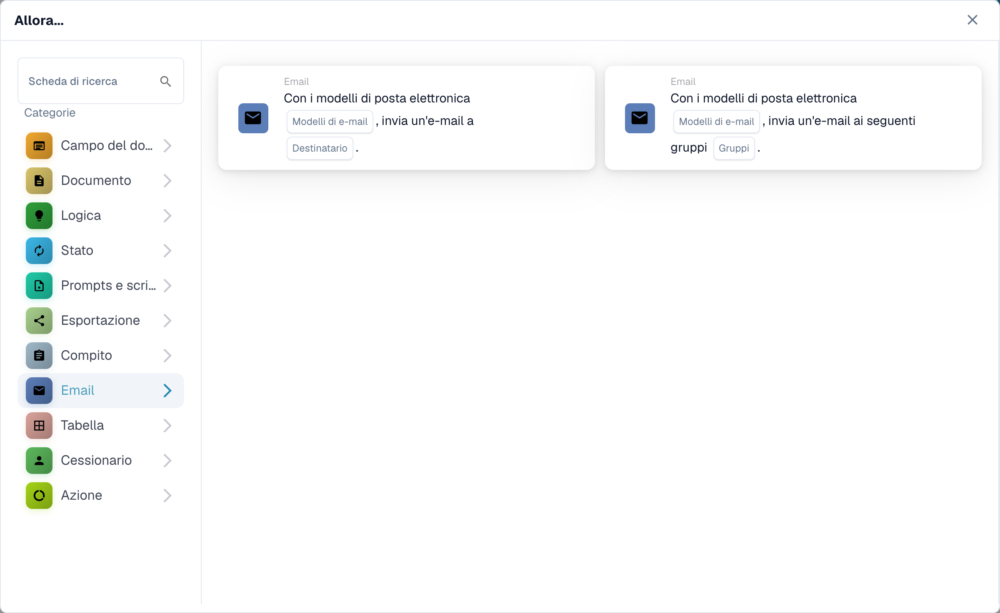
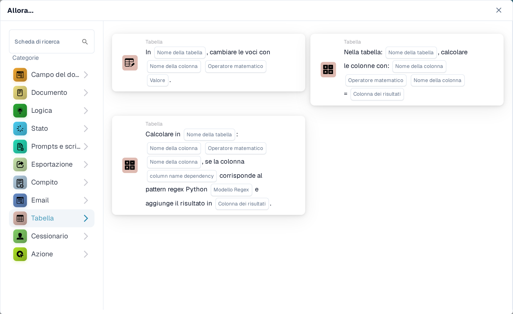
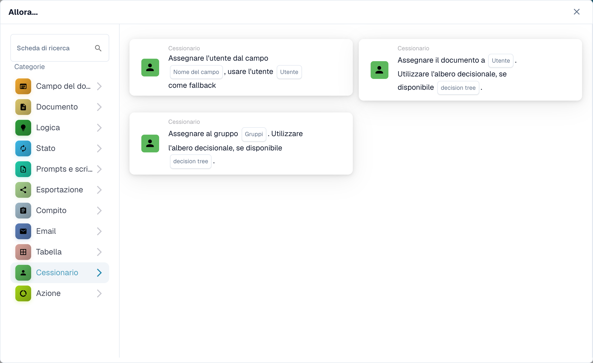

# Then: scegli una carta di azione

Una carta **Then** indica al workflow cosa fare dopo il trigger **When** e le eventuali condizioni **And**. In **Costruttore di flussi di lavoro**, seleziona **Aggiungi scheda** sotto **Allora...**. Scegli una categoria a sinistra oppure digita un nome in **Scheda di ricerca**. Seleziona un'anteprima di carta per aggiungerla, compila i campi mostrati sulla carta e salva il workflow. Scorri all'interno del selettore per vedere altre carte. Seleziona **×** per chiuderlo senza aggiungere una carta. Vedi [Flusso di lavoro](../README.md) per la sequenza completa.

Le anteprime qui sotto mostrano le azioni disponibili, non impostazioni già completate. Scegli l'azione che corrisponde al risultato che vuoi ottenere.

## Campo del documento

Imposta o inverte una casella di controllo, inserisci un testo in un campo oppure copia un campo in un altro. Scegli i nomi dei campi e il valore richiesti dalla carta. Vedi [Campo del documento](document-field/README.md).

<figure><figcaption>Modifica un campo o copiane il contenuto.</figcaption></figure>

## Documento

Scegli **Approvare il documento** o **Rifiutare il documento** quando il workflow deve prendere questa decisione. Usa prima una condizione **And** se l'approvazione deve dipendere da un controllo. Vedi [Documento](document/README.md).

<figure><figcaption>Approva o rifiuta il documento corrente.</figcaption></figure>

## Logica

Usa queste carte per convertire valori tra formato numerico, testo e booleano, oppure per leggere un valore da JSON. Scegli i campi di input e output sulla carta selezionata.

<figure><figcaption>Trasforma i valori per un passaggio successivo del workflow.</figcaption></figure>

## Stato

Scegli **Cambiare lo stato in** per portare il documento a uno stato selezionato. La carta può anche attivare un altro workflow. Vedi [Stato](status/README.md).

<figure><figcaption>Porta il documento a un altro stato.</figcaption></figure>

## Prompts e scripts

Scegli questa categoria per eseguire uno script di prompt DocOperator. Seleziona lo script e le variabili richiesti dalla carta. La carta offre anche impostazioni di esecuzione come i tentativi.

<figure><figcaption>Esegui uno script di prompt DocOperator configurato.</figcaption></figure>

## Esportazione

Avvia un'esportazione, esporta con una configurazione scelta oppure metti in coda un'esportazione finale. Scegli la configurazione di esportazione e l'opzione per le attività in sospeso mostrata sulla tua carta. Vedi [Esportazione](export/README.md).

<figure><figcaption>Scegli quando e come viene esportato il documento.</figcaption></figure>

## Compito

Crea un compito o una notifica e assegnalo a un utente o a un gruppo. Inserisci titolo, descrizione, priorità e impostazioni di notifica richiesti dalla carta. Alcune carte assegnano in sequenza. Vedi [Compito](task/README.md).

<figure><figcaption>Crea lavoro di follow-up per una persona o un gruppo.</figcaption></figure>

## Email

Invia un'e-mail usando un modello selezionato, verso destinatari oppure verso gruppi. Scegli il modello e la destinazione sulla carta.

<figure><figcaption>Invia un'e-mail con modello.</figcaption></figure>

## Tabella

Modifica le voci o calcola i valori in una tabella del documento. Seleziona la tabella, le colonne, l'operatore e la colonna dei risultati richiesti dalla carta. Vedi [Tabella](table/README.md).

<figure><figcaption>Aggiorna o calcola i dati della tabella.</figcaption></figure>

## Cessionario

Assegna il documento a un utente, un gruppo, un destinatario o una sub-organizzazione. Alcune carte usano un campo o una tabella decisionale e offrono un ripiego. Scegli la destinazione giusta e il ripiego sulla carta selezionata. Vedi [Cessionario](assignee/README.md).

<figure><figcaption>Invia il documento alla persona o al gruppo responsabile successivo.</figcaption></figure>

## Azione

Esegui un altro workflow, invia una richiesta HTTPS, chiama un'API oppure usa la carta di calcolo dell'incremento dei costi. Queste azioni possono influire su altri sistemi; chiedi all'amministratore quale endpoint e quali impostazioni usare. Vedi [Azione](action/README.md).

<figure><figcaption>Avvia un altro workflow o un'azione di integrazione.</figcaption></figure>
