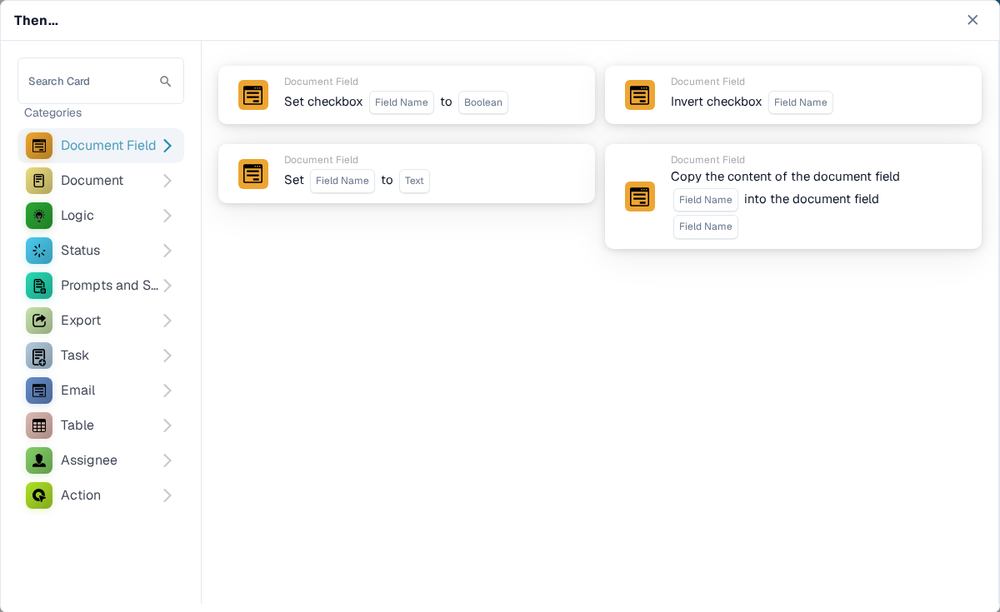
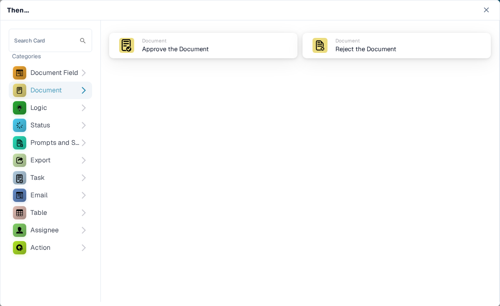
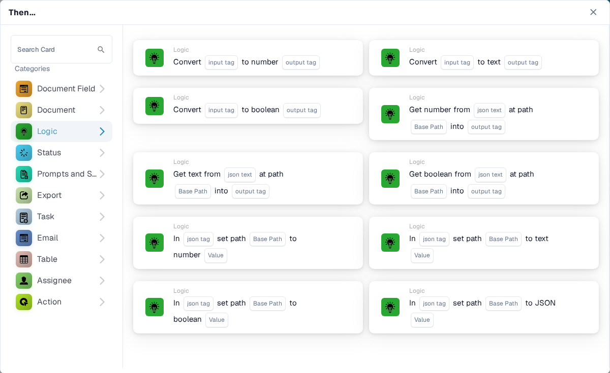
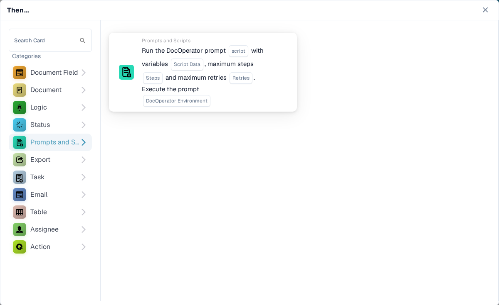
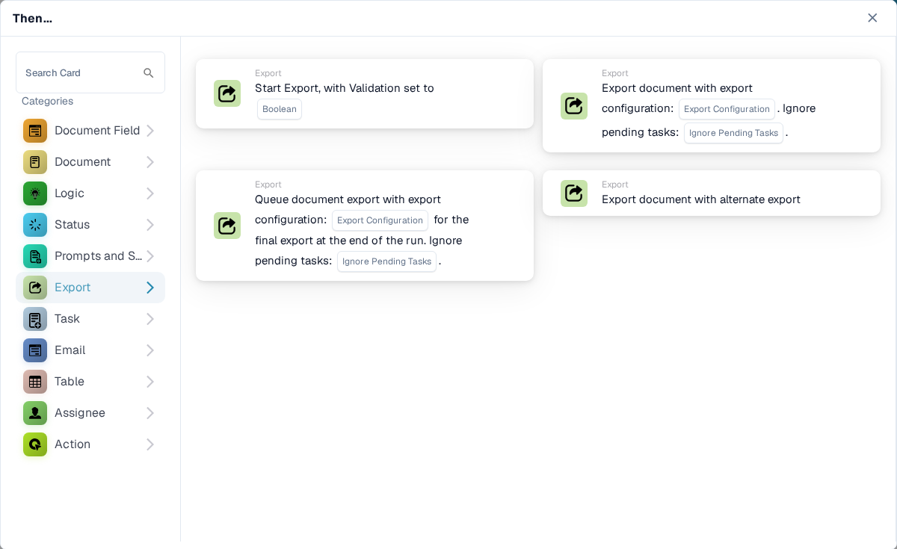
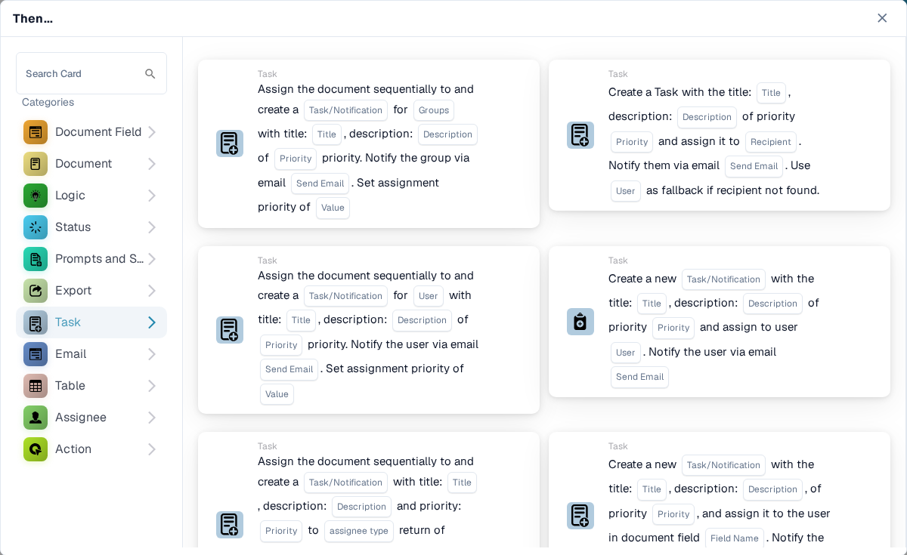
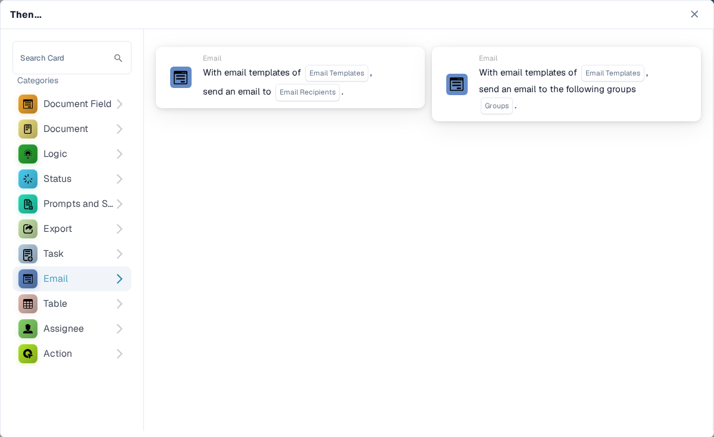
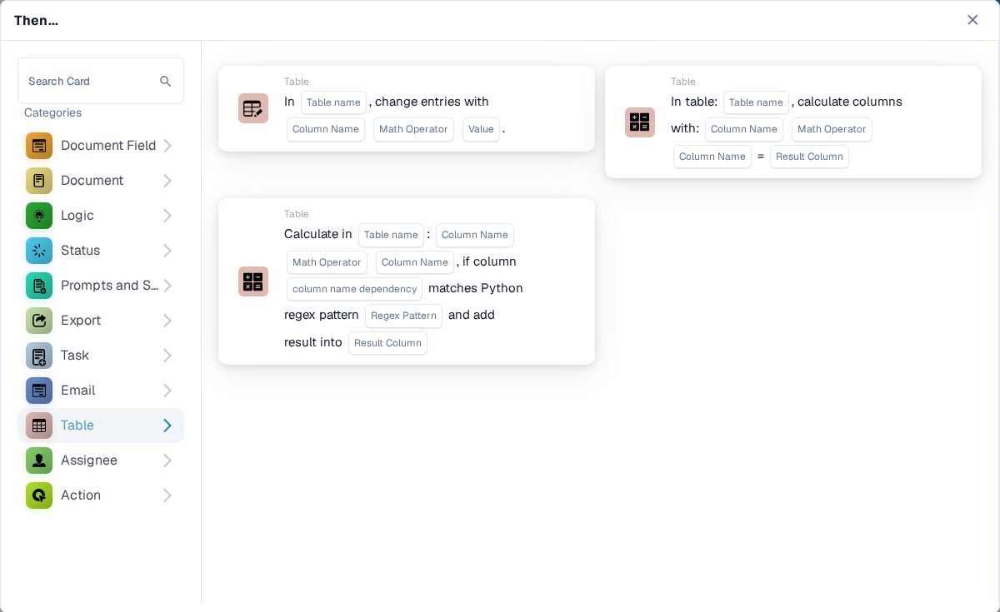
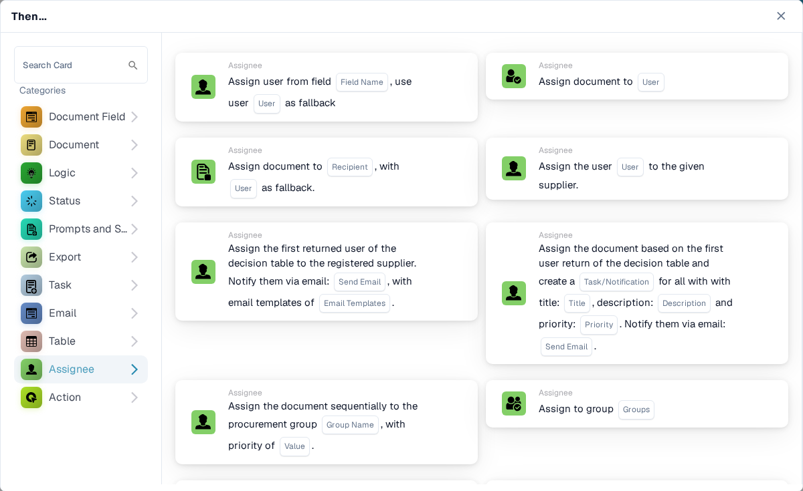
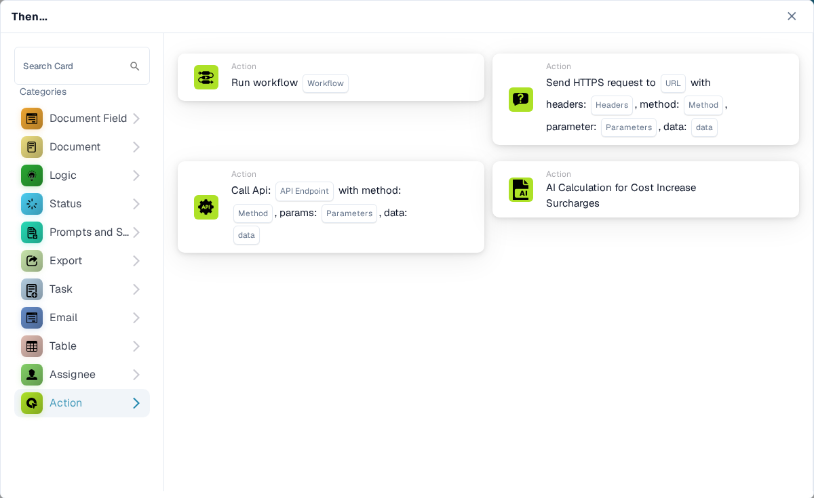

# Then: choose an action card

A **Then** card tells a workflow what to do after its **When** trigger and any **And** conditions. In the **Workflow Builder**, select **Add Card** under **Then...**. Choose a category on the left or type a name in **Search Card**. Select a card preview to add it, fill in the fields shown on the card, and save the workflow. Scroll within the picker to see more cards. Select **×** to close it without adding a card. See [Workflow](../README.md) for the complete sequence.

The previews below show available actions, not completed settings. Pick the action that matches the outcome you want.

## Document Field

Set or invert a checkbox, put text into a field, or copy one field into another. Choose the field names and value requested by the card. See [Document Field](document-field/README.md).

<figure><figcaption>Change a field or copy its contents.</figcaption></figure>

## Document

Choose **Approve the Document** or **Reject the Document** when the workflow should make that decision. Use an **And** condition first if approval should depend on a check. See [Document](document/README.md).

<figure><figcaption>Approve or reject the current document.</figcaption></figure>

## Logic

Use these cards to convert values between number, text, and boolean formats, or read a value from JSON. Choose the input and output fields on the selected card.

<figure><figcaption>Transform values for a later workflow step.</figcaption></figure>

## Status

Choose **Change Status** to move the document to a selected status. The card can also trigger another workflow. See [Status](status/README.md).

<figure><figcaption>Move the document to another status.</figcaption></figure>

## Prompts and Scripts

Choose this category to run a DocOperator prompt script. Select the script and the variables requested by the card. The card also offers execution settings such as retries.

<figure><figcaption>Run a configured DocOperator prompt script.</figcaption></figure>

## Export

Start an export, export with a chosen configuration, or queue a final export. Choose the export configuration and pending-task option shown on your card. See [Export](export/README.md).

<figure><figcaption>Select when and how the document is exported.</figcaption></figure>

## Task

Create a task or notification and assign it to a user or group. Enter the title, description, priority, and notification settings requested by the card. Some cards assign sequentially. See [Task](task/README.md).

<figure><figcaption>Create follow-up work for a person or group.</figcaption></figure>

## Email

Send an email using a selected template, either to recipients or to groups. Choose the template and destination on the card.

<figure><figcaption>Send a templated email.</figcaption></figure>

## Table

Change entries or calculate values in a document table. Select the table, columns, operator, and result column requested by the card. See [Table](table/README.md).

<figure><figcaption>Update or calculate table data.</figcaption></figure>

## Assignee

Assign the document to a user, group, recipient, or sub-organization. Some cards use a field or decision table and offer a fallback. Choose the right destination and fallback on the selected card. See [Assignee](assignee/README.md).

<figure><figcaption>Route the document to the next responsible person or group.</figcaption></figure>

## Action

Run another workflow, send an HTTPS request, call an API, or use the cost-increase calculation card. These actions can affect other systems; ask your administrator which endpoint and settings to use. See [Action](action/README.md).

<figure><figcaption>Start another workflow or integration action.</figcaption></figure>
