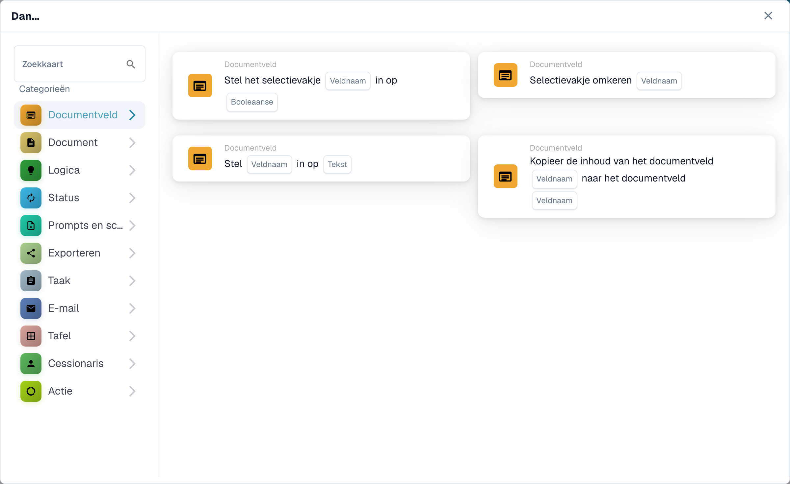
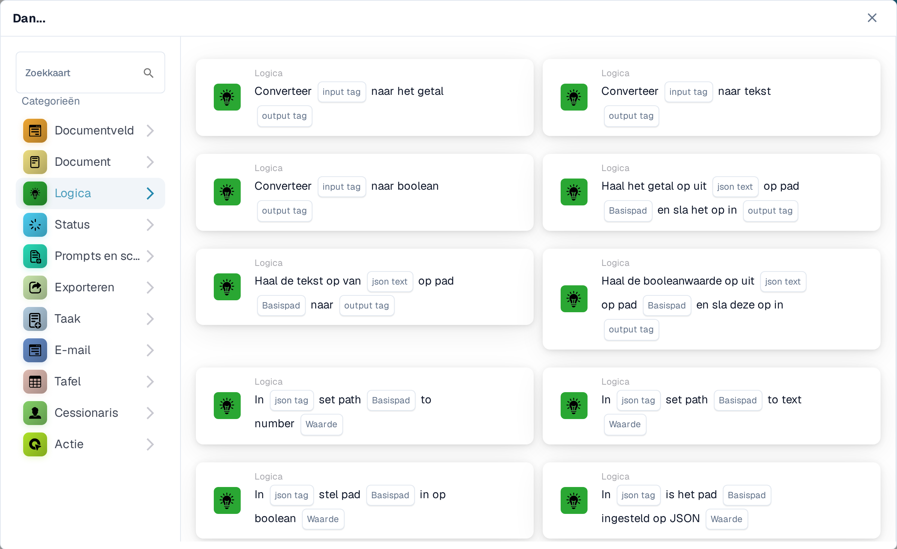
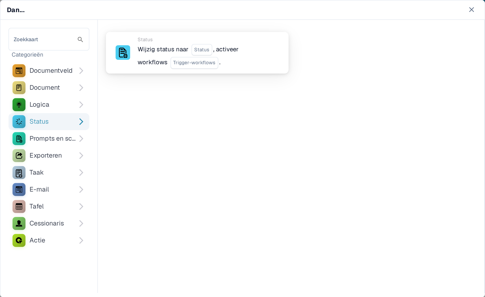
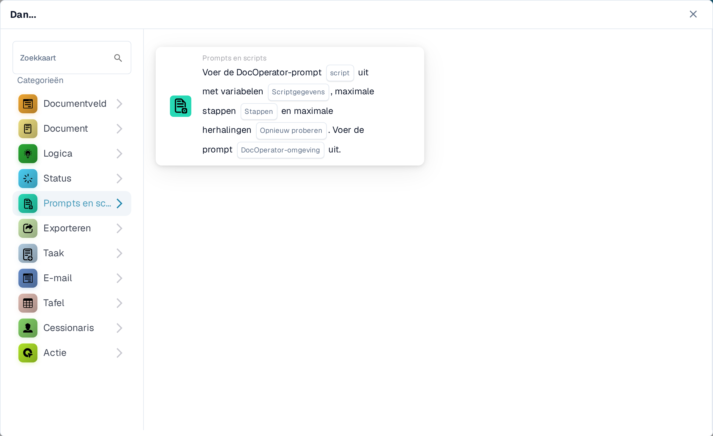
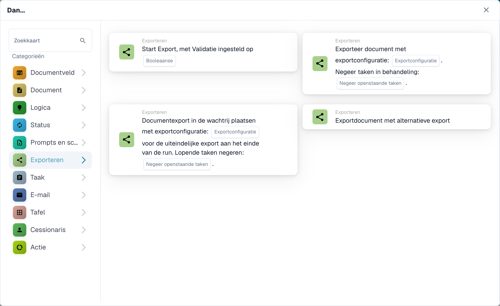
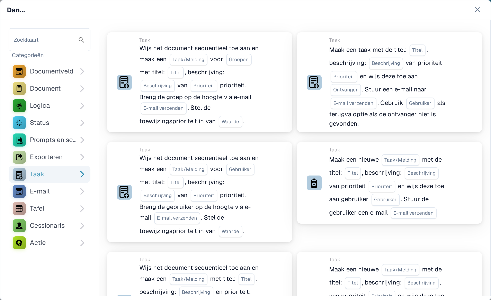
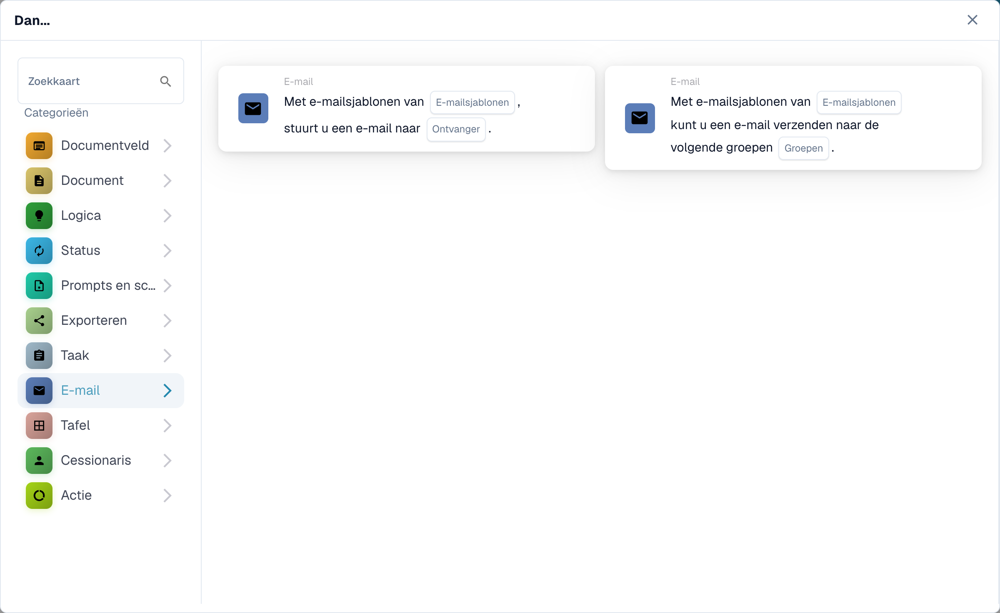
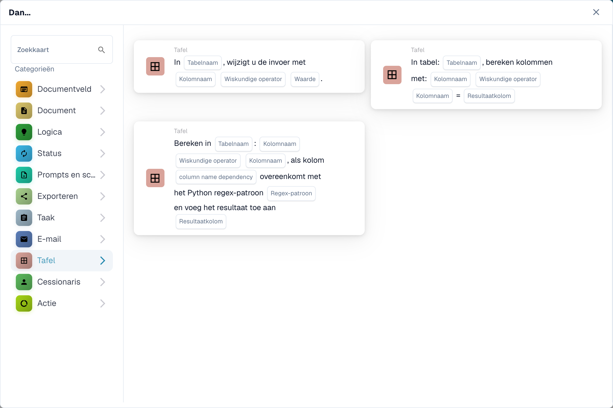
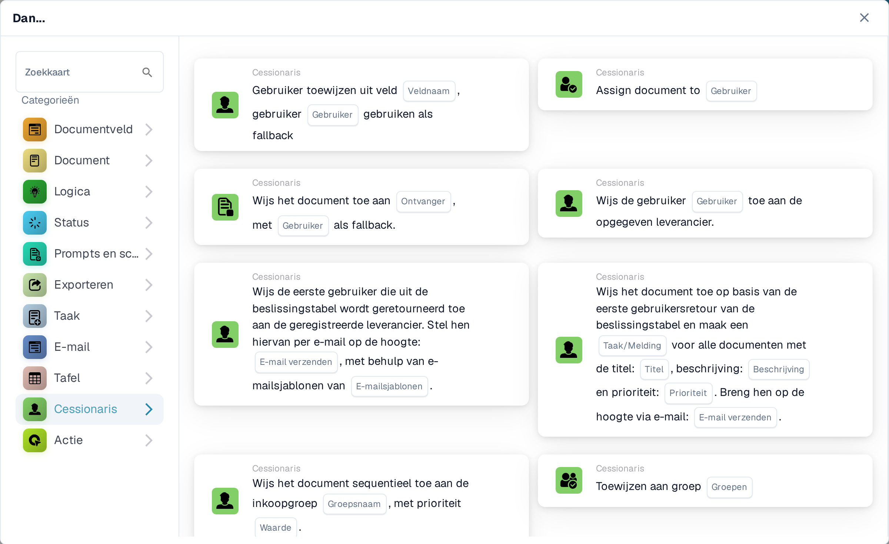

# Then: kies een actiekaart

Een **Then**-kaart geeft aan wat een workflow moet doen na de **When**-trigger en eventuele **And**-voorwaarden. Selecteer in de **Workflow Builder** **Kaart toevoegen** onder **Dan...**. Kies links een categorie of typ een naam in **Zoekkaart**. Selecteer een kaartvoorbeeld om het toe te voegen, vul de velden in die op de kaart staan, en sla de workflow op. Scroll binnen de kiezer om meer kaarten te zien. Selecteer **×** om te sluiten zonder een kaart toe te voegen. Zie [Workflow](../README.md) voor de volledige volgorde.

De voorbeelden hieronder tonen beschikbare acties, geen voltooide instellingen. Kies de actie die past bij het resultaat dat u wilt.

## Document Field

Zet een selectievakje aan of uit, plaats tekst in een veld, of kopieer de inhoud van het ene veld naar het andere. Kies de veldnamen en waarden die de kaart vraagt. Zie [Document Field](document-field/README.md).

<figure><figcaption>Wijzig een veld of kopieer de inhoud ervan.</figcaption></figure>

## Document

Kies **Het document goedkeuren** of **Het document afwijzen** wanneer de workflow die beslissing moet nemen. Gebruik eerst een **And**-voorwaarde als de goedkeuring van een controle moet afhangen. Zie [Document](document/README.md).

<figure><figcaption>Keur het huidige document goed of wijs het af.</figcaption></figure>

## Logica

Gebruik deze kaarten om waarden tussen getal-, tekst- en booleaanse formaten om te zetten, of om een waarde uit JSON te lezen. Kies de invoer- en uitvoervelden op de geselecteerde kaart.

<figure><figcaption>Zet waarden om voor een latere workflowstap.</figcaption></figure>

## Status

Kies **Change Status** om het document naar een gekozen status te verplaatsen. De kaart kan ook een andere workflow triggeren. Zie [Status](status/README.md).

<figure><figcaption>Verplaats het document naar een andere status.</figcaption></figure>

## Prompts en scripts

Kies deze categorie om een DocOperator-prompts script uit te voeren. Selecteer het script en de variabelen die de kaart vraagt. De kaart biedt ook uitvoerinstellingen zoals pogingen om opnieuw te proberen.

<figure><figcaption>Voer een geconfigureerd DocOperator-prompts script uit.</figcaption></figure>

## Exporteren

Start een export, exporteer met een gekozen configuratie, of zet een definitieve export in de wachtrij. Kies de exportconfiguratie en de optie voor openstaande taken die op uw kaart staat. Zie [Export](export/README.md).

<figure><figcaption>Kies wanneer en hoe het document wordt geëxporteerd.</figcaption></figure>

## Taak

Maak een taak of melding en wijs deze toe aan een gebruiker of groep. Voer de titel, beschrijving, prioriteit en meldingsinstellingen in die de kaart vraagt. Sommige kaarten wijzen sequentieel toe. Zie [Task](task/README.md).

<figure><figcaption>Maak opvolgwerk voor een persoon of groep.</figcaption></figure>

## E-mail

Verstuur een e-mail met een gekozen sjabloon, naar ontvangers of naar groepen. Kies het sjabloon en de bestemming op de kaart.

<figure><figcaption>Verstuur een e-mail met sjabloon.</figcaption></figure>

## Tafel

Wijzig vermeldingen of bereken waarden in een documenttabel. Selecteer de tabel, kolommen, operator en resultaatkolom die de kaart vraagt. Zie [Table](table/README.md).

<figure><figcaption>Werk tabelgegevens bij of bereken ze.</figcaption></figure>

## Cessionaris

Wijs het document toe aan een gebruiker, groep, ontvanger of sub-organisatie. Sommige kaarten gebruiken een veld of beslistabel en bieden een fallback. Kies de juiste bestemming en fallback op de geselecteerde kaart. Zie [Assignee](assignee/README.md).

<figure><figcaption>Routeer het document naar de volgende verantwoordelijke persoon of groep.</figcaption></figure>

## Actie

Voer een andere workflow uit, stuur een HTTPS-verzoek, roep een API aan, of gebruik de kaart voor de berekening van kostenverhogingstoeslagen. Deze acties kunnen andere systemen beïnvloeden; vraag uw beheerder welk eindpunt en welke instellingen te gebruiken. Zie [Action](action/README.md).

<figure><figcaption>Start een andere workflow of integratie-actie.</figcaption></figure>
