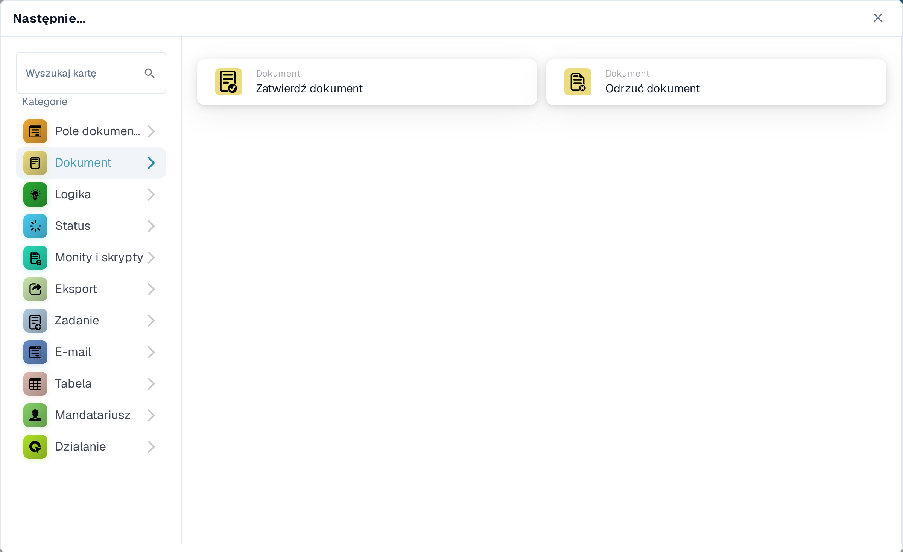
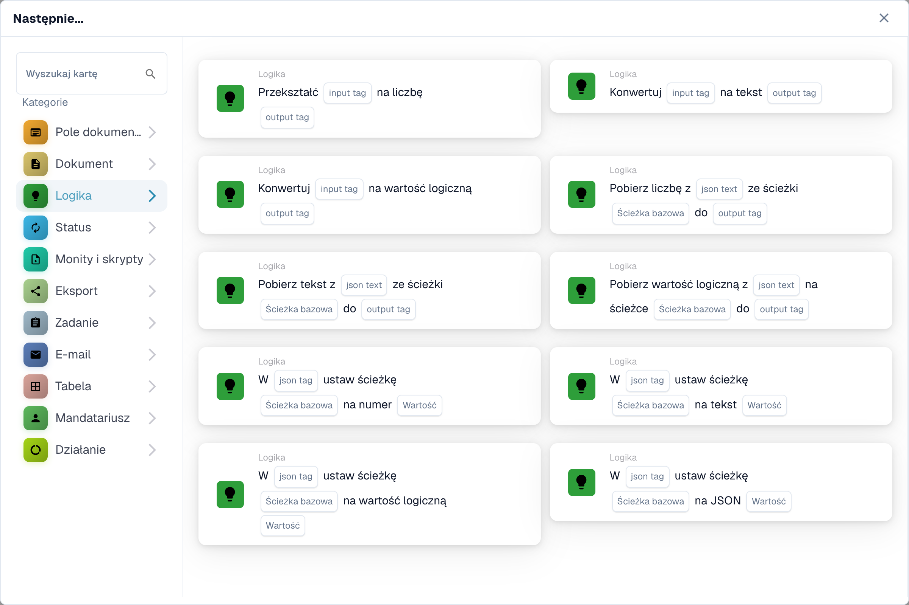
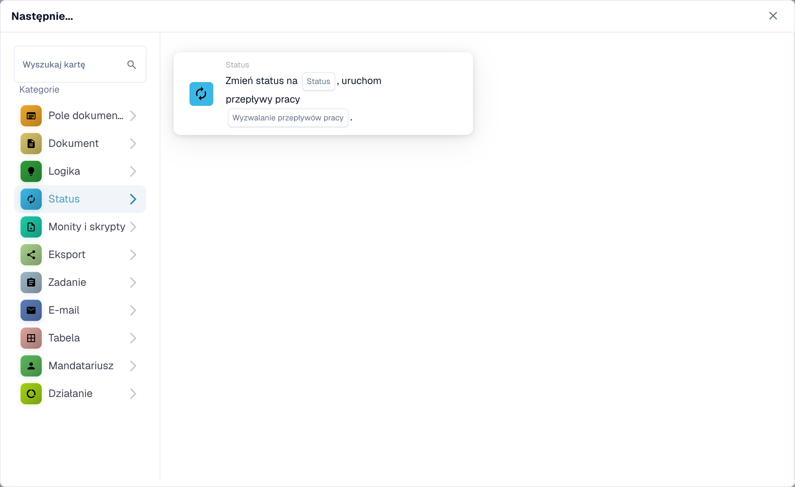
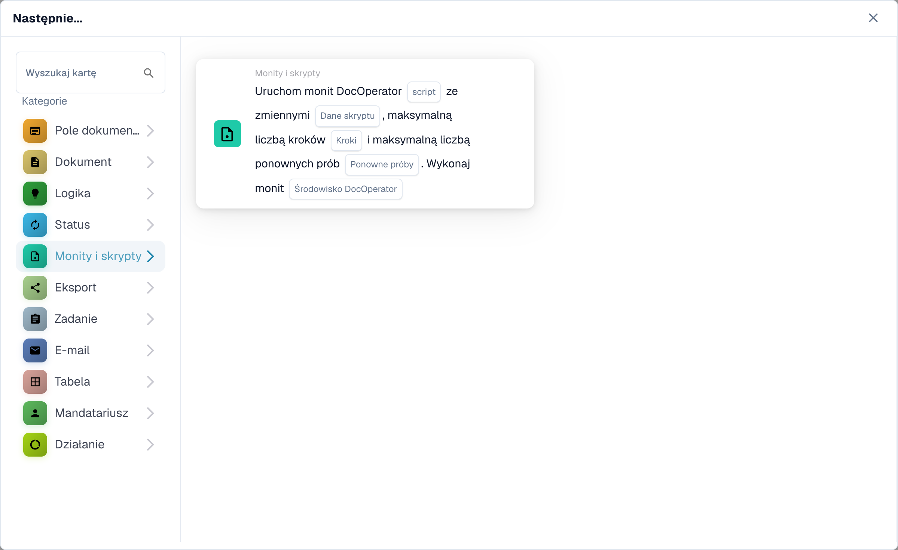
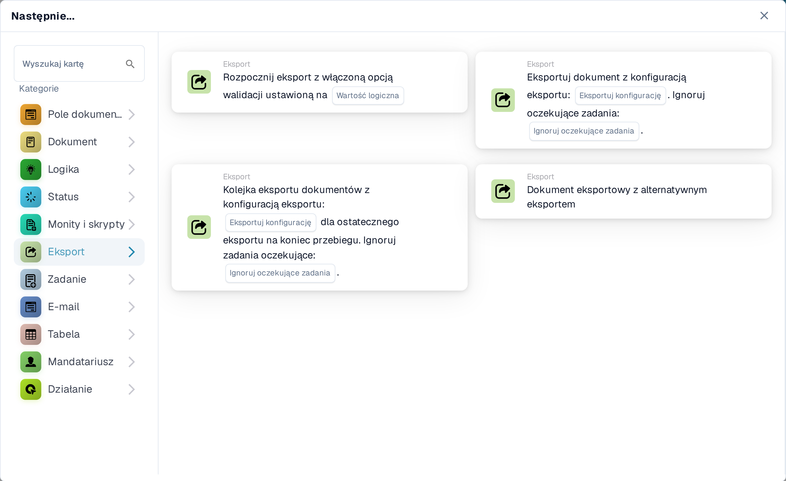
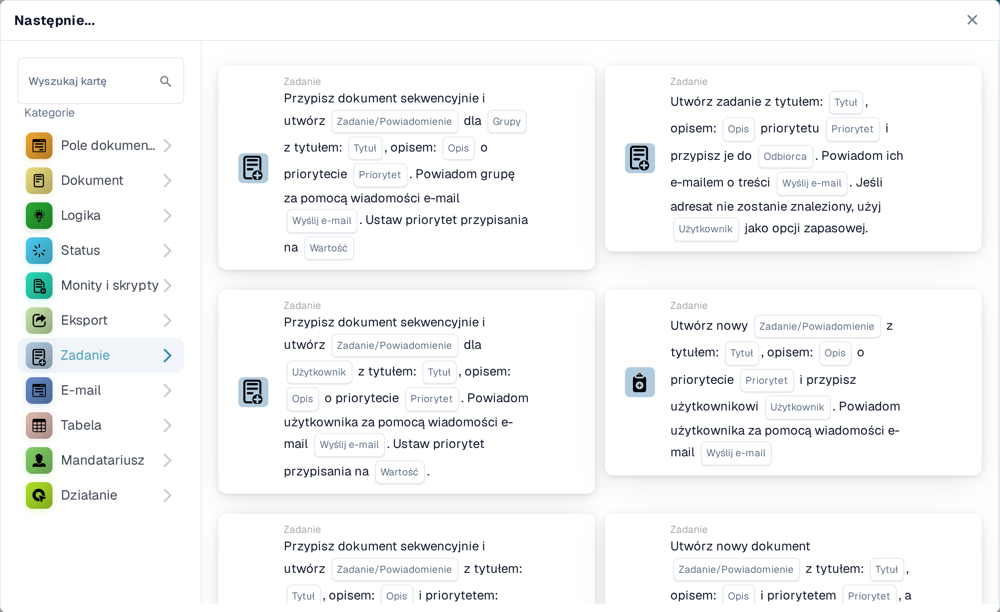
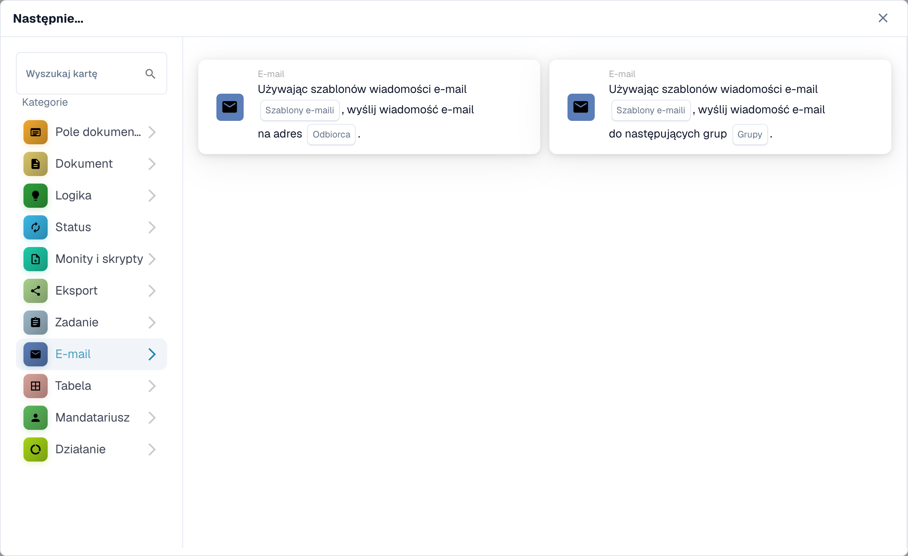
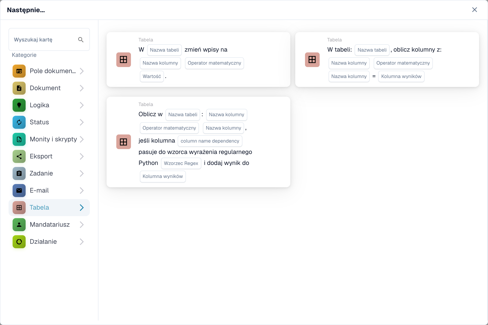
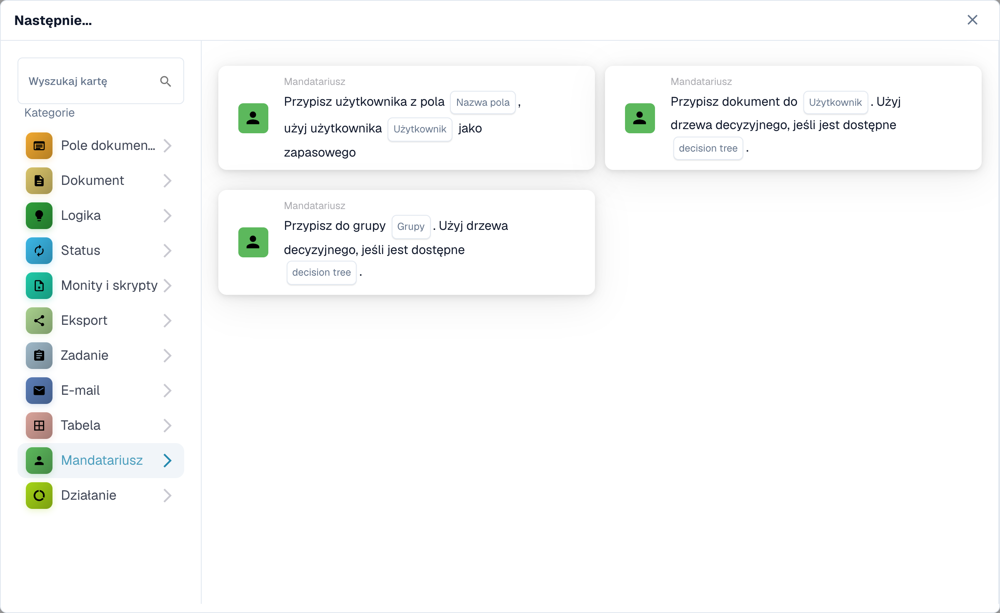
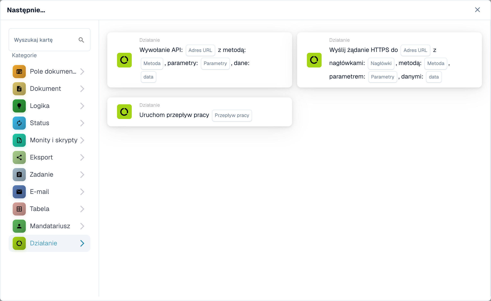

# Then: wybierz kartę akcji

Karta **Then** mówi przepływowi pracy, co zrobić po jego wyzwalaczu **When** i ewentualnych warunkach **And**. W **Kreatorze przepływu pracy** wybierz **Dodaj kartę** pod sekcją **Następnie...**. Wybierz kategorię po lewej stronie lub wpisz nazwę w polu **Wyszukaj kartę**. Wybierz podgląd karty, aby ją dodać, wypełnij pola wyświetlone na karcie i zapisz przepływ pracy. Przewiń listę, aby zobaczyć więcej kart. Wybierz **×**, aby zamknąć listę bez dodawania karty. Pełną kolejność opisuje rozdział [Przepływ pracy](../README.md).

Poniższe podglądy pokazują dostępne akcje, a nie ukończone ustawienia. Wybierz akcję, która odpowiada oczekiwanemu efektowi.

## Pole dokumentu

Ustaw lub odwróć pole wyboru, wstaw tekst do pola albo skopiuj jedno pole do drugiego. Wybierz nazwy pól i wartości wymagane przez kartę. Zobacz [Pole dokumentu](document-field/README.md).

<figure><figcaption>Zmień pole lub skopiuj jego zawartość.</figcaption></figure>

## Dokument

Wybierz **Zatwierdź dokument** albo **Odrzuć dokument**, gdy przepływ pracy ma podjąć taką decyzję. Jeśli zatwierdzenie ma zależeć od sprawdzenia, użyj wcześniej warunku **And**. Zobacz [Dokument](document/README.md).

<figure><figcaption>Zatwierdź lub odrzuć bieżący dokument.</figcaption></figure>

## Logika

Użyj tych kart, aby konwertować wartości między formatem liczbowym, tekstowym i logicznym albo odczytać wartość z JSON. Na wybranej karcie wskaż pola wejściowe i wyjściowe.

<figure><figcaption>Przekształć wartości dla kolejnego kroku przepływu pracy.</figcaption></figure>

## Status

Wybierz **Zmień status**, aby przenieść dokument do wybranej wartości statusu. Karta może też uruchomić inny przepływ pracy. Zobacz [Status](status/README.md).

<figure><figcaption>Przenieś dokument do innego statusu.</figcaption></figure>

## Monity i skrypty

Wybierz tę kategorię, aby uruchomić skrypt monitu DocOperator. Na karcie wskaż skrypt i wymagane zmienne. Karta oferuje też ustawienia wykonania, takie jak ponowne próby.

<figure><figcaption>Uruchom skonfigurowany skrypt monitu DocOperator.</figcaption></figure>

## Eksport

Uruchom eksport, wykonaj eksport z wybraną konfiguracją albo dodaj eksport końcowy do kolejki. Na karcie wybierz konfigurację eksportu i opcję oczekujących zadań. Zobacz [Eksport](export/README.md).

<figure><figcaption>Wybierz kiedy i jak dokument zostanie wyeksportowany.</figcaption></figure>

## Zadanie

Utwórz zadanie lub powiadomienie i przypisz je użytkownikowi albo grupie. Wpisz tytuł, opis, priorytet i ustawienia powiadomień wymagane przez kartę. Niektóre karty przypisują zadania po kolei. Zobacz [Zadanie](task/README.md).

<figure><figcaption>Utwórz pracę do wykonania dla osoby lub grupy.</figcaption></figure>

## E-mail

Wyślij wiadomość e-mail w wybranej szacie — do odbiorców lub do grup. Na karcie wybierz szablon i adresata.

<figure><figcaption>Wyślij wiadomość e-mail na szablonie.</figcaption></figure>

## Tabela

Zmień wpisy lub obliczaj wartości w tabeli dokumentu. Na karcie wybierz tabelę, kolumny, operator i kolumnę wyników. Zobacz [Tabela](table/README.md).

<figure><figcaption>Zaktualizuj lub oblicz dane tabeli.</figcaption></figure>

## Mandatariusz

Przypisz dokument użytkownikowi, grupie, odbiorcy lub podorganizacji. Niektóre karty korzystają z pola lub tabeli decyzyjnej i oferują rozwiązanie zapasowe. Na wybranej karcie wskaż właściwy cel i rozwiązanie zapasowe. Zobacz [Mandatariusz](assignee/README.md).

<figure><figcaption>Przekaż dokument następnej odpowiedzialnej osobie lub grupie.</figcaption></figure>

## Działanie

Uruchom inny przepływ pracy, wyślij żądanie HTTPS, wywołaj interfejs API albo użyj karty obliczeń AI dla dopłat za wzrost kosztów. Te akcje mogą wpływać na inne systemy — zapytaj administratora, którego punktu końcowego i jakich ustawień użyć. Zobacz [Działanie](action/README.md).

<figure><figcaption>Uruchom inny przepływ pracy lub działanie integracji.</figcaption></figure>
