# Then : choisir une carte d'action

Une carte **Then** indique à un workflow quoi faire après son déclencheur **When** et ses éventuelles conditions **And**. Dans le **Workflow Builder**, sélectionnez **Ajouter une carte** sous **Dans ce cas...**. Choisissez une catégorie à gauche ou tapez un nom dans **Carte de recherche**. Sélectionnez un aperçu de carte pour l'ajouter, remplissez les champs affichés sur la carte, puis enregistrez le workflow. Faites défiler la fenêtre de sélection pour voir d'autres cartes. Sélectionnez **×** pour la fermer sans ajouter de carte. Voir [Workflow](../README.md) pour la séquence complète.

Les aperçus ci-dessous montrent des actions disponibles, pas des paramètres déjà configurés. Choisissez l'action qui correspond au résultat souhaité.

## Champ du document

Définir ou inverser une case à cocher, saisir du texte dans un champ, ou copier un champ dans un autre. Choisissez les noms de champs et les valeurs demandés par la carte. Voir [Champ du document](document-field/README.md).

<figure>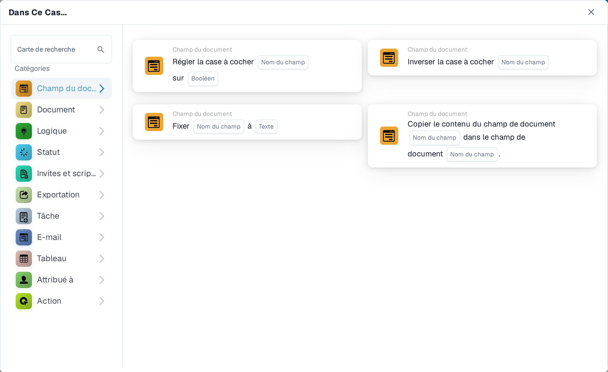<figcaption>Modifier un champ ou copier son contenu.</figcaption></figure>

## Document

Choisissez **Approuver le document** ou **Rejeter le document** lorsque le workflow doit prendre cette décision. Ajoutez d'abord une condition **And** si l'approbation doit dépendre d'un contrôle. Voir [Document](document/README.md).

<figure>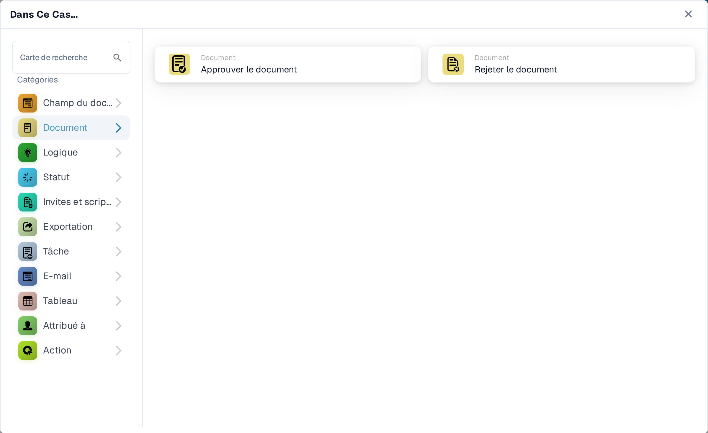<figcaption>Approuver ou rejeter le document actuel.</figcaption></figure>

## Logique

Utilisez ces cartes pour convertir des valeurs entre formats numérique, texte et booléen, ou pour lire une valeur dans un JSON. Choisissez les champs d'entrée et de sortie sur la carte sélectionnée.

<figure>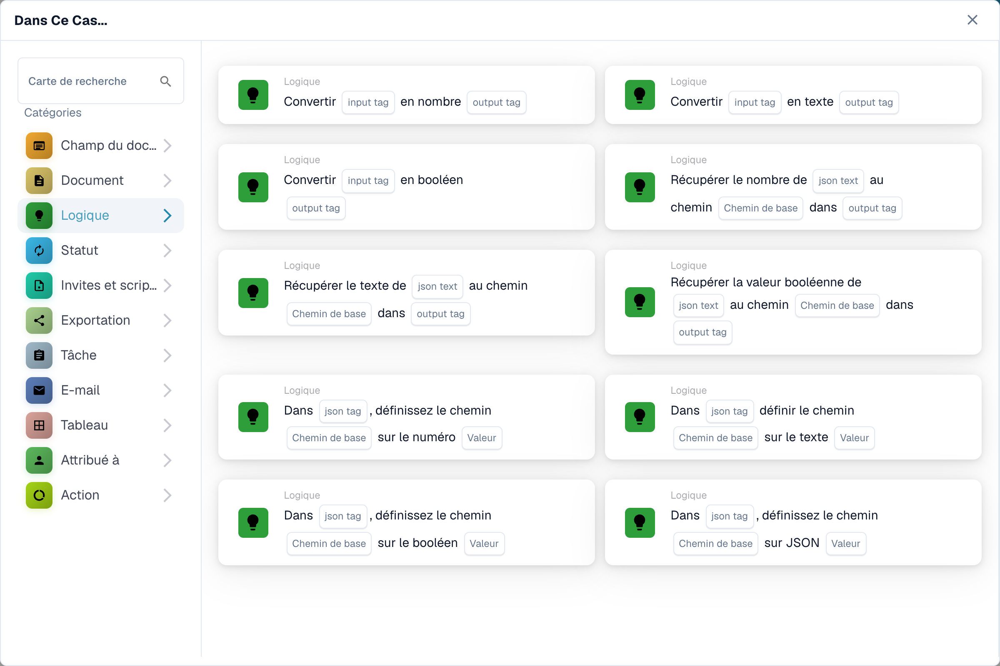<figcaption>Transformer des valeurs pour une étape ultérieure du workflow.</figcaption></figure>

## Statut

Choisissez **Modifier le statut** pour faire passer le document au statut sélectionné. La carte peut aussi déclencher un autre workflow. Voir [Statut](status/README.md).

<figure>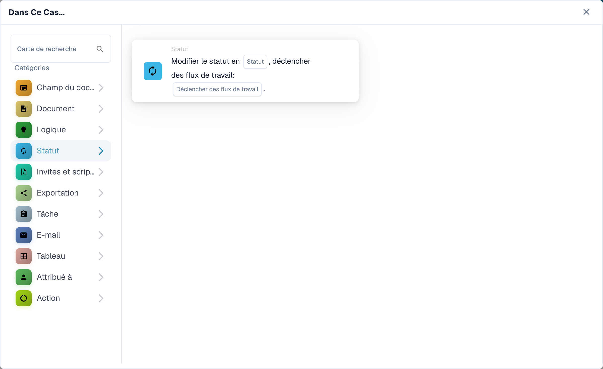<figcaption>Faire passer le document à un autre statut.</figcaption></figure>

## Invites et scripts

Choisissez cette catégorie pour exécuter un script d'invite DocOperator. Sélectionnez le script et les variables demandés par la carte. La carte propose aussi des paramètres d'exécution tels que les tentatives.

<figure>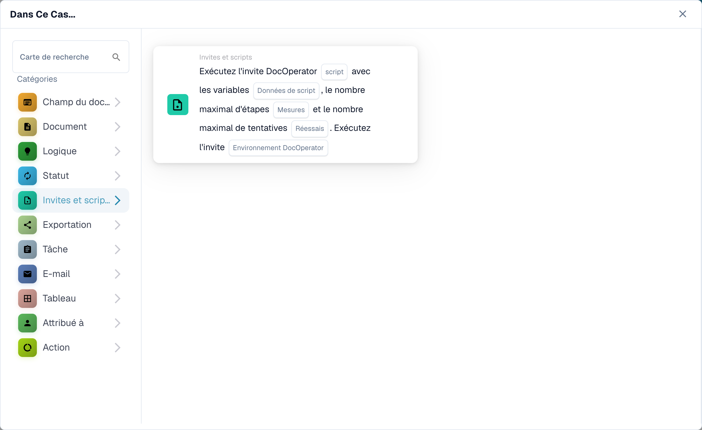<figcaption>Exécuter un script d'invite DocOperator configuré.</figcaption></figure>

## Exportation

Lancer une exportation, exporter avec une configuration choisie, ou mettre en file d'attente une exportation finale. Choisissez la configuration d'exportation et l'option de tâches en attente affichés sur votre carte. Voir [Exportation](export/README.md).

<figure>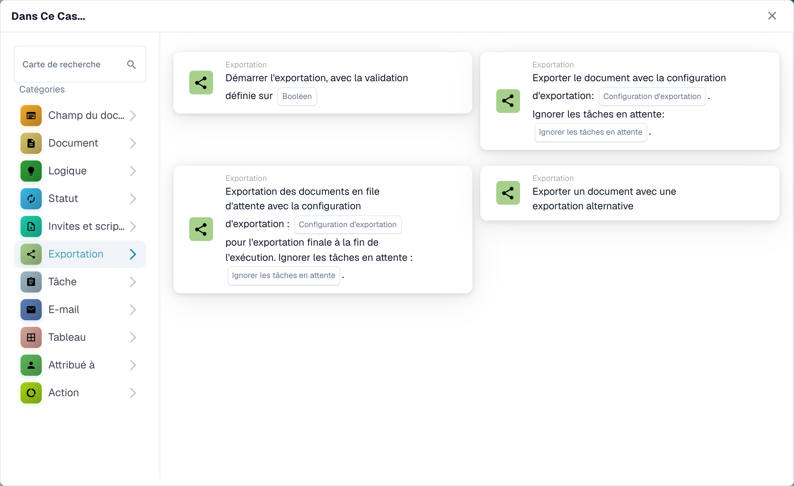<figcaption>Choisir quand et comment le document est exporté.</figcaption></figure>

## Tâche

Créer une tâche ou une notification et l'assigner à un utilisateur ou à un groupe. Saisissez le titre, la description, la priorité et les paramètres de notification demandés par la carte. Certaines cartes assignent de façon séquentielle. Voir [Tâche](task/README.md).

<figure>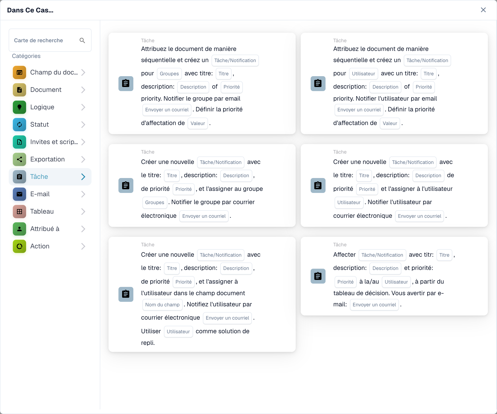<figcaption>Créer un travail de suivi pour une personne ou un groupe.</figcaption></figure>

## E-mail

Envoyer un e-mail à l'aide d'un modèle sélectionné, soit à des destinataires, soit à des groupes. Choisissez le modèle et la destination sur la carte.

<figure>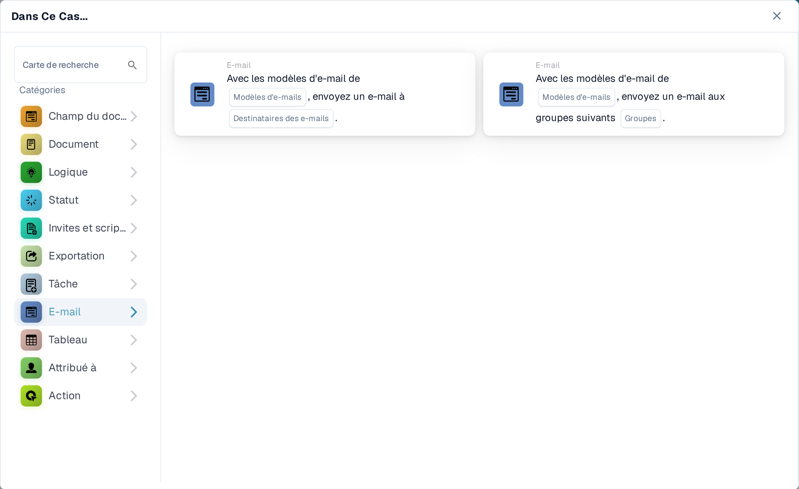<figcaption>Envoyer un e-mail avec un modèle.</figcaption></figure>

## Tableau

Modifier des entrées ou calculer des valeurs dans un tableau de document. Sélectionnez le tableau, les colonnes, l'opérateur et la colonne de résultat demandés par la carte. Voir [Tableau](table/README.md).

<figure>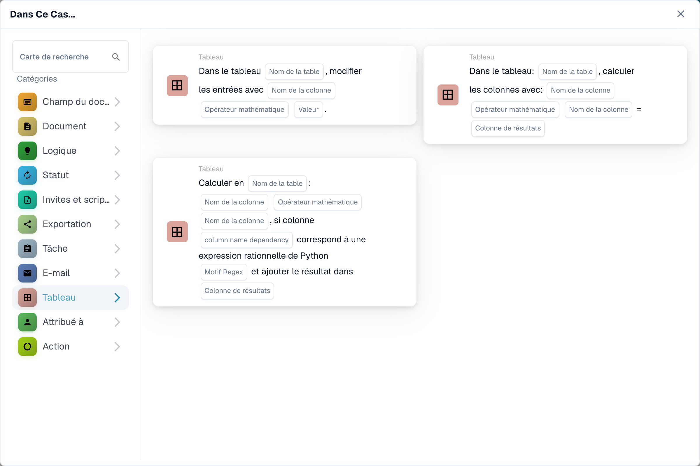<figcaption>Mettre à jour ou calculer les données d'un tableau.</figcaption></figure>

## Attribué à

Assigner le document à un utilisateur, un groupe, un bénéficiaire ou une sous-organisation. Certaines cartes utilisent un champ ou une table de décision et proposent une solution de repli. Choisissez la bonne destination et la solution de repli sur la carte sélectionnée. Voir [Attribué à](assignee/README.md).

<figure>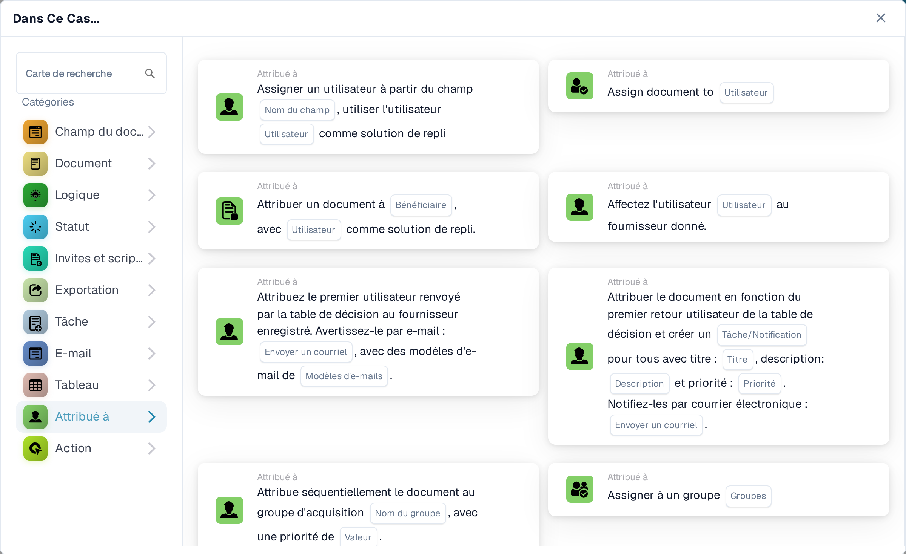<figcaption>Acheminer le document vers la prochaine personne ou le prochain groupe responsable.</figcaption></figure>

## Action

Exécuter un autre workflow, envoyer une requête HTTPS, appeler une API, ou utiliser la carte de calcul d'IA pour les majorations de coûts. Ces actions peuvent affecter d'autres systèmes ; demandez à votre administrateur quel point d'accès et quels paramètres utiliser. Voir [Action](action/README.md).

<figure>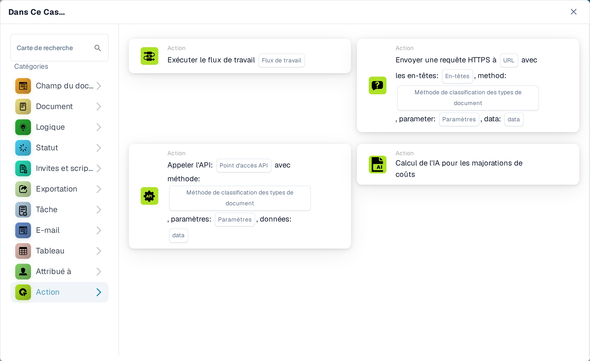<figcaption>Démarrer un autre workflow ou une action d'intégration.</figcaption></figure>
