# Then: elige una tarjeta de acción

Una tarjeta **Then** le indica al flujo de trabajo qué hacer después de su disparador **When** y de cualquier condición **And**. En el **Constructor de flujo de trabajo**, selecciona **Añadir tarjeta** bajo **Entonces...**. Elige una categoría a la izquierda o escribe un nombre en **Buscar tarjeta**. Selecciona una vista previa de tarjeta para añadirla, rellena los campos que muestra la tarjeta y guarda el flujo de trabajo. Desplázate dentro del selector para ver más tarjetas. Selecciona **×** para cerrarlo sin añadir ninguna tarjeta. Consulta [Flujo de trabajo](../README.md) para ver la secuencia completa.

Las vistas previas siguientes muestran acciones disponibles, no configuraciones completadas. Elige la acción que corresponda al resultado que buscas.

## Campo del documento

Establece o invierte una casilla de verificación, escribe texto en un campo o copia el contenido de un campo a otro. Elige los nombres de campo y el valor que solicita la tarjeta. Consulta [Campo del documento](document-field/README.md).

<figure>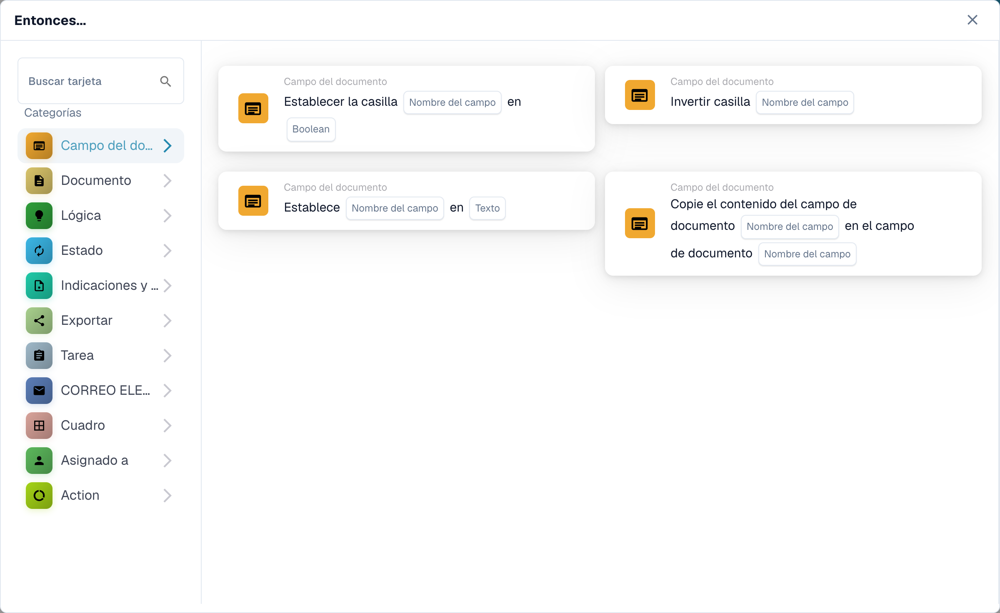<figcaption>Cambia un campo o copia su contenido.</figcaption></figure>

## Documento

Elige **Aprobar el documento** o **Rechazar el documento** cuando el flujo de trabajo deba tomar esa decisión. Usa primero una condición **And** si la aprobación debe depender de una comprobación. Consulta [Documento](document/README.md).

<figure>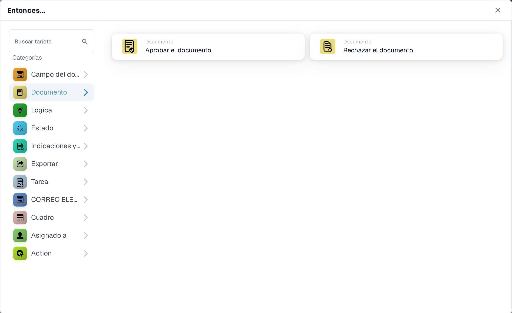<figcaption>Aprueba o rechaza el documento actual.</figcaption></figure>

## Lógica

Usa estas tarjetas para convertir valores entre formatos de número, texto y booleano, o para leer un valor de JSON. Elige los campos de entrada y salida en la tarjeta seleccionada.

<figure>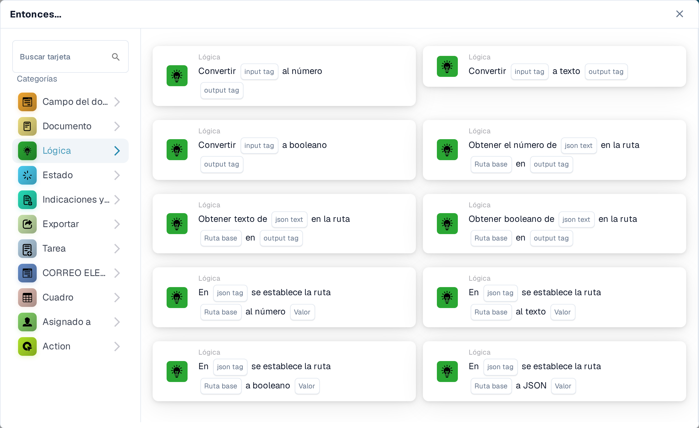<figcaption>Transforma valores para un paso posterior del flujo de trabajo.</figcaption></figure>

## Estado

Elige **Cambiar estado** para mover el documento a un estado seleccionado. La tarjeta también puede desencadenar otro flujo de trabajo. Consulta [Estado](status/README.md).

<figure>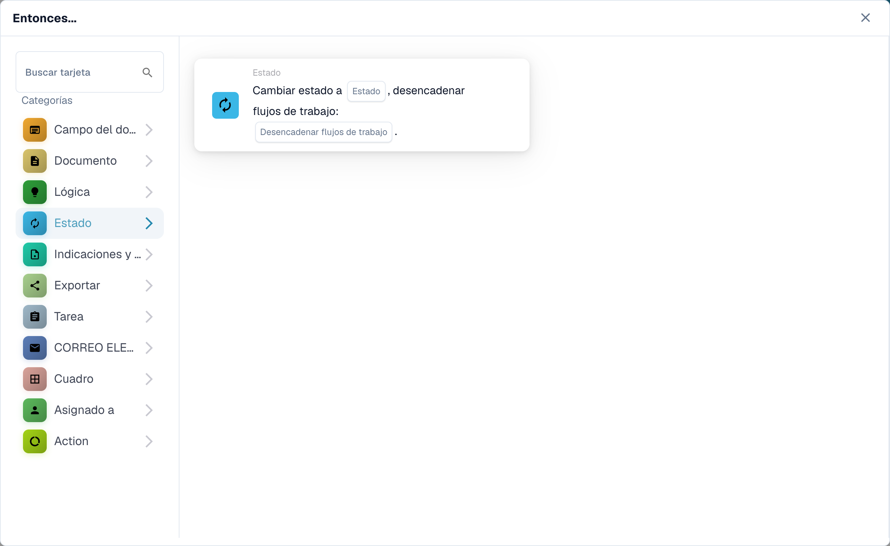<figcaption>Mueve el documento a otro estado.</figcaption></figure>

## Indicaciones y guiones

Elige esta categoría para ejecutar un guion de indicación de DocOperator. Selecciona el guion y las variables que solicita la tarjeta. La tarjeta también ofrece ajustes de ejecución como reintentos.

<figure>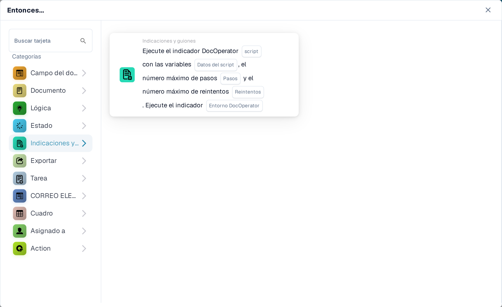<figcaption>Ejecuta un guion de indicación de DocOperator configurado.</figcaption></figure>

## Exportar

Inicia una exportación, exporta con una configuración elegida o pone en cola una exportación final. Elige la configuración de exportación y la opción de tarea pendiente que muestra tu tarjeta. Consulta [Exportar](export/README.md).

<figure>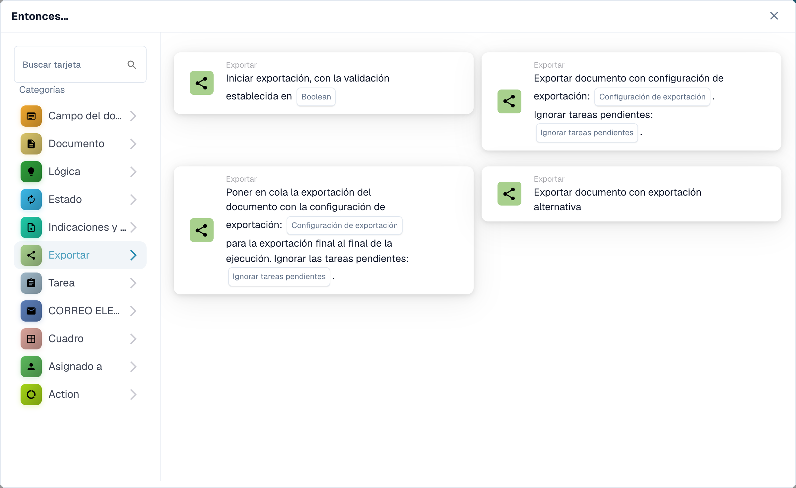<figcaption>Elige cuándo y cómo se exporta el documento.</figcaption></figure>

## Tarea

Crea una tarea o notificación y asígnala a un usuario o grupo. Introduce el título, la descripción, la prioridad y los ajustes de notificación que solicita la tarjeta. Algunas tarjetas asignan de forma secuencial. Consulta [Tarea](task/README.md).

<figure>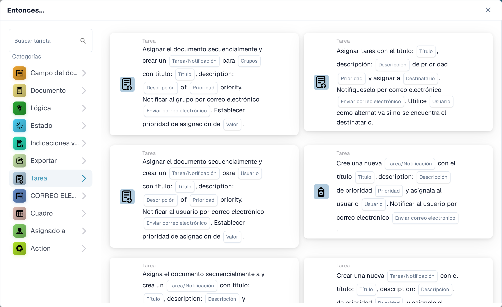<figcaption>Crea trabajo de seguimiento para una persona o grupo.</figcaption></figure>

## Correo electrónico

Envía un correo electrónico con una plantilla seleccionada, ya sea a destinatarios o a grupos. Elige la plantilla y el destino en la tarjeta.

<figure>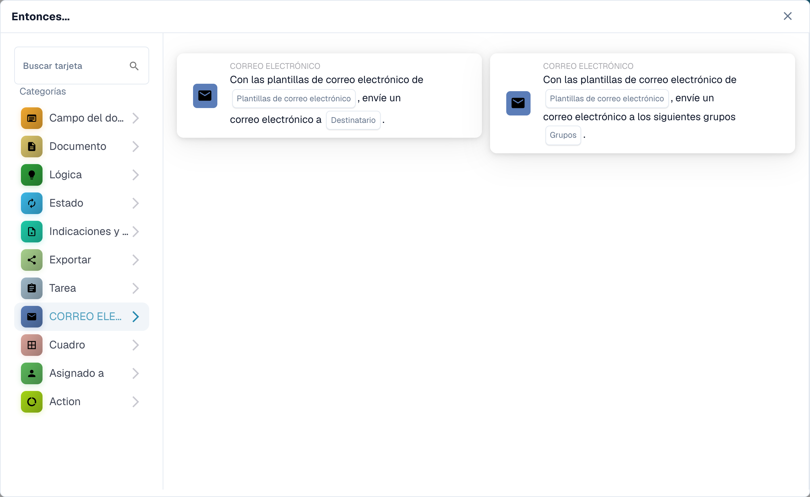<figcaption>Envía un correo electrónico con plantilla.</figcaption></figure>

## Cuadro

Cambia entradas o calcula valores en un cuadro del documento. Selecciona el cuadro, las columnas, el operador y la columna de resultado que solicita la tarjeta. Consulta [Cuadro](table/README.md).

<figure>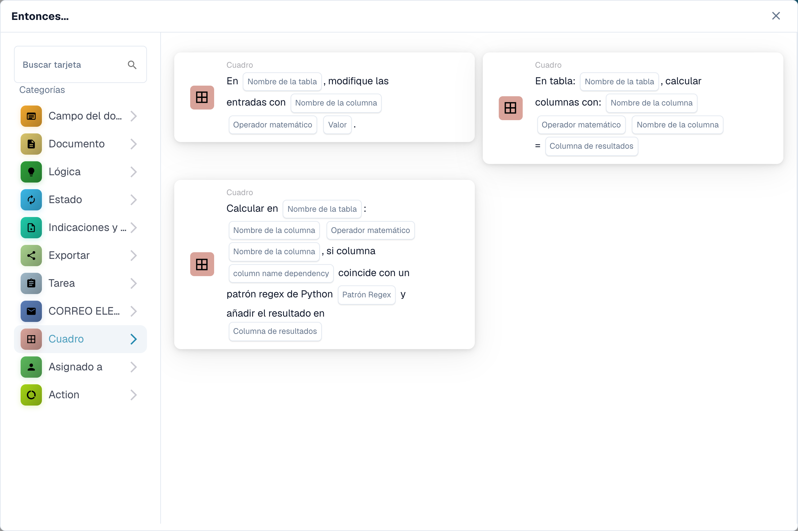<figcaption>Actualiza o calcula datos del cuadro.</figcaption></figure>

## Asignado a

Asigna el documento a un usuario, grupo, destinatario o suborganización. Algunas tarjetas usan un campo o una tabla de decisiones y ofrecen una alternativa. Elige el destino y la alternativa correctos en la tarjeta seleccionada. Consulta [Asignado a](assignee/README.md).

<figure>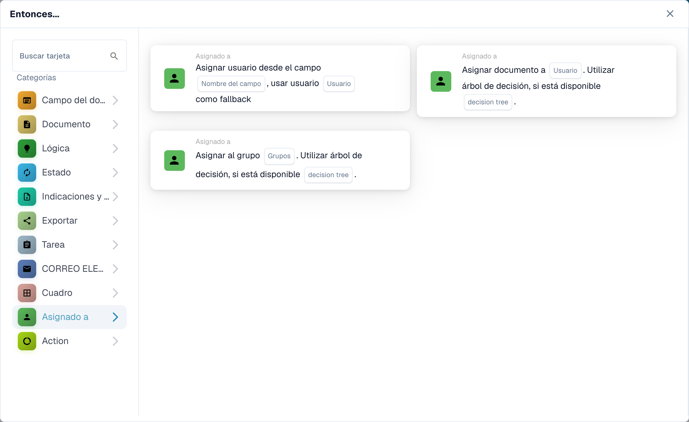<figcaption>Envía el documento a la siguiente persona o grupo responsable.</figcaption></figure>

## Action

Ejecuta otro flujo de trabajo, envía una petición HTTPS, llama a una API o usa la tarjeta de cálculo de aumento de costes. Estas acciones pueden afectar a otros sistemas; pregunta a tu administrador qué endpoint y ajustes usar. Consulta [Action](action/README.md).

<figure>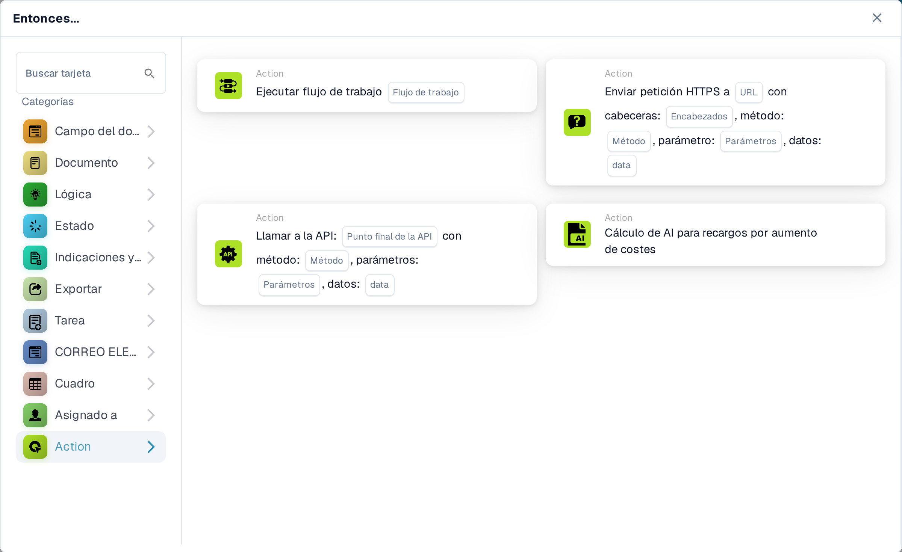<figcaption>Inicia otro flujo de trabajo o una acción de integración.</figcaption></figure>
