# Then: Aktionskarte auswählen

Eine **Then**-Karte sagt einem Workflow, was nach seinem **When**-Auslöser und etwaigen **And**-Bedingungen zu tun ist. Wählen Sie im **Workflow Builder** unter **Dann...** die Option **Karte hinzufügen**. Wählen Sie links eine Kategorie oder geben Sie einen Namen in **Karte suchen** ein. Wählen Sie eine Kartenvorschau aus, um sie hinzuzufügen, füllen Sie die auf der Karte angezeigten Felder aus und speichern Sie den Workflow. Scrollen Sie innerhalb der Auswahl, um weitere Karten zu sehen. Wählen Sie **×**, um die Auswahl zu schließen, ohne eine Karte hinzuzufügen. Siehe [Workflow](../README.md) für die vollständige Abfolge.

Die folgenden Vorschauen zeigen verfügbare Aktionen, keine abgeschlossenen Einstellungen. Wählen Sie die Aktion, die zum gewünschten Ergebnis passt.

## Dokument Feld

Ein Kontrollkästchen setzen oder umkehren, Text in ein Feld schreiben oder ein Feld in ein anderes kopieren. Wählen Sie die Feldnamen und Werte, die die Karte verlangt. Siehe [Document Field](document-field/README.md).

<figure>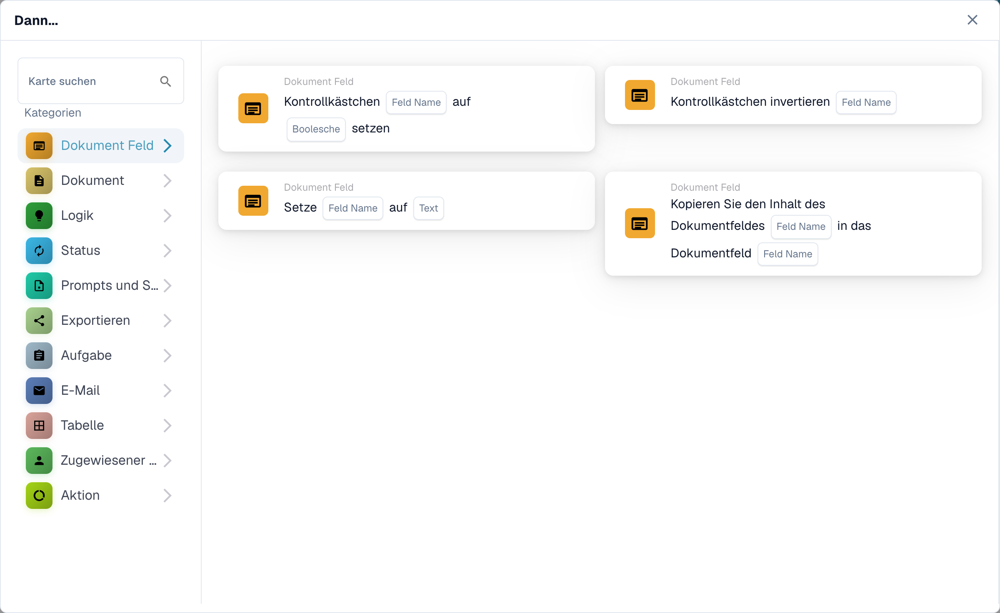<figcaption>Ein Feld ändern oder seinen Inhalt kopieren.</figcaption></figure>

## Dokument

Wählen Sie **Genehmigen Sie das Dokument** oder **Dokument ablehnen**, wenn der Workflow diese Entscheidung treffen soll. Prüfen Sie vorher mit einer **And**-Bedingung, ob die Genehmigung von einer Prüfung abhängen soll. Siehe [Document](document/README.md).

<figure>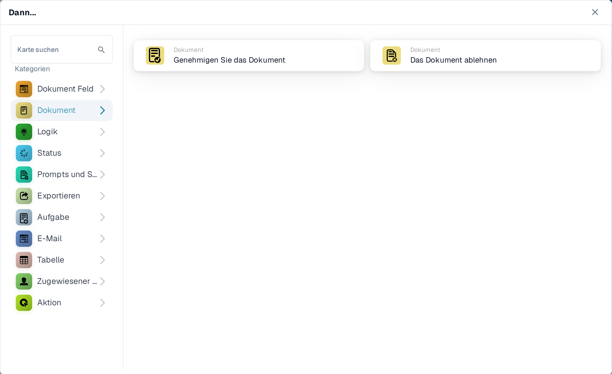<figcaption>Das aktuelle Dokument genehmigen oder ablehnen.</figcaption></figure>

## Logik

Nutzen Sie diese Karten, um Werte zwischen Zahlen-, Text- und Boolesch-Formaten umzuwandeln oder einen Wert aus JSON zu lesen. Wählen Sie die Eingabe- und Ausgabefelder auf der ausgewählten Karte.

<figure>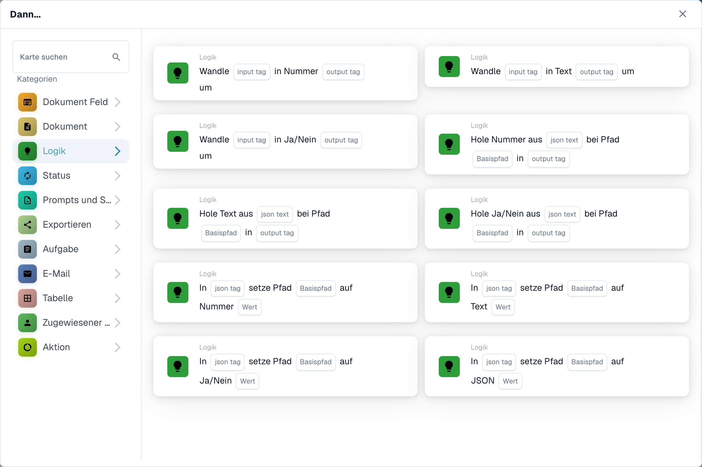<figcaption>Werte für einen späteren Workflow-Schritt umwandeln.</figcaption></figure>

## Status

Wählen Sie **Status ändern**, um das Dokument in einen ausgewählten Status zu verschieben. Die Karte kann auch einen weiteren Workflow auslösen. Siehe [Status](status/README.md).

<figure>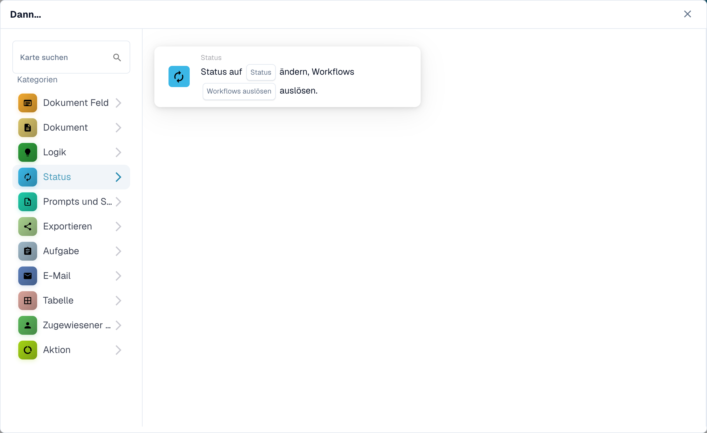<figcaption>Das Dokument in einen anderen Status verschieben.</figcaption></figure>

## Prompts und Skripte

Wählen Sie diese Kategorie, um ein DocOperator-Prompt-Skript auszuführen. Wählen Sie das Skript und die von der Karte verlangten Variablen. Die Karte bietet außerdem Ausführungseinstellungen wie Wiederholungen.

<figure>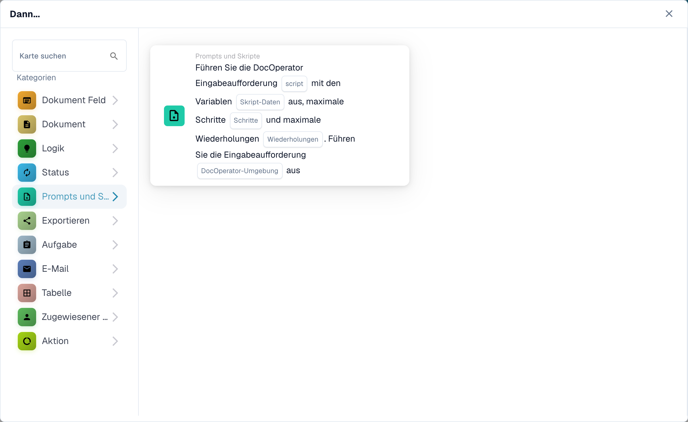<figcaption>Ein konfiguriertes DocOperator-Prompt-Skript ausführen.</figcaption></figure>

## Exportieren

Starten Sie einen Export, exportieren Sie mit einer gewählten Konfiguration oder stellen Sie einen finalen Export in die Warteschlange. Wählen Sie die Exportkonfiguration und die Option zu offenen Aufgaben, die Ihre Karte anzeigt. Siehe [Export](export/README.md).

<figure>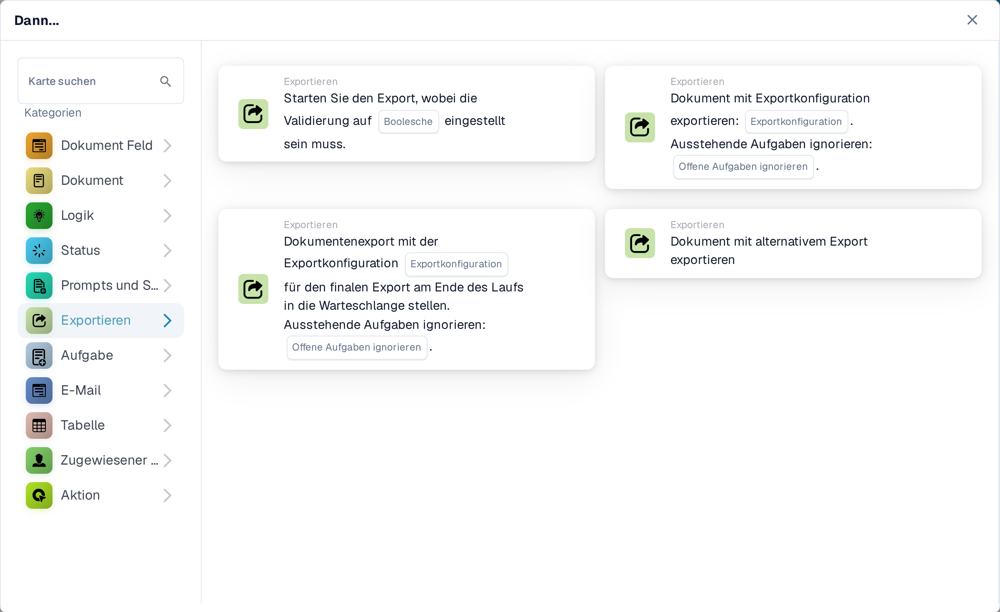<figcaption>Auswählen, wann und wie das Dokument exportiert wird.</figcaption></figure>

## Aufgabe

Erstellen Sie eine Aufgabe oder Benachrichtigung und weisen Sie sie einer Person oder Gruppe zu. Geben Sie Titel, Beschreibung, Priorität und Benachrichtigungseinstellungen ein, die die Karte verlangt. Manche Karten weisen der Reihe nach zu. Siehe [Task](task/README.md).

<figure>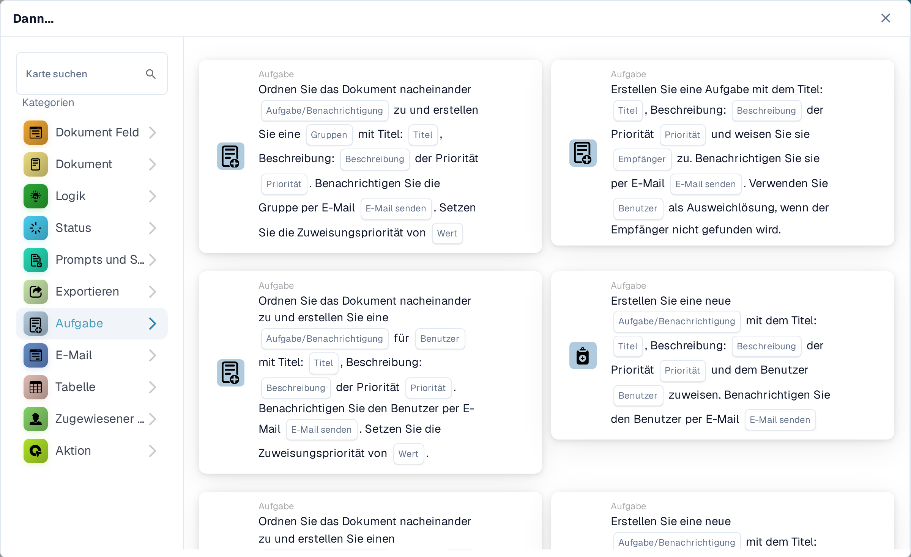<figcaption>Folgearbeit für eine Person oder Gruppe anlegen.</figcaption></figure>

## E-Mail

Senden Sie eine E-Mail mit einer ausgewählten Vorlage, entweder an Empfänger oder an Gruppen. Wählen Sie die Vorlage und das Ziel auf der Karte.

<figure>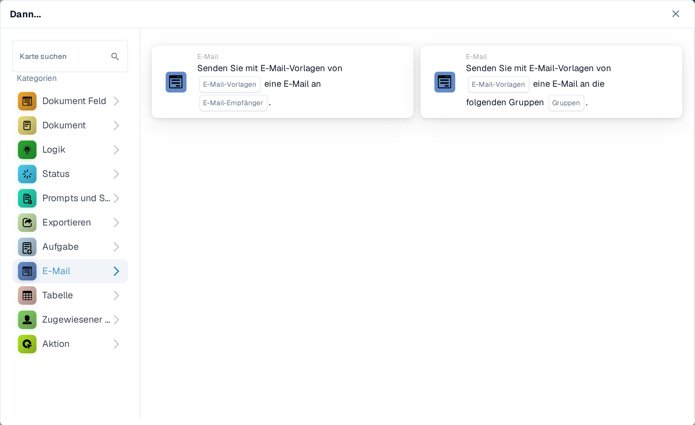<figcaption>Eine E-Mail mit Vorlage senden.</figcaption></figure>

## Tabelle

Ändern Sie Einträge oder berechnen Sie Werte in einer Dokumenttabelle. Wählen Sie die Tabelle, Spalten, den Operator und die Ergebnis-Spalte, die die Karte verlangt. Siehe [Table](table/README.md).

<figure>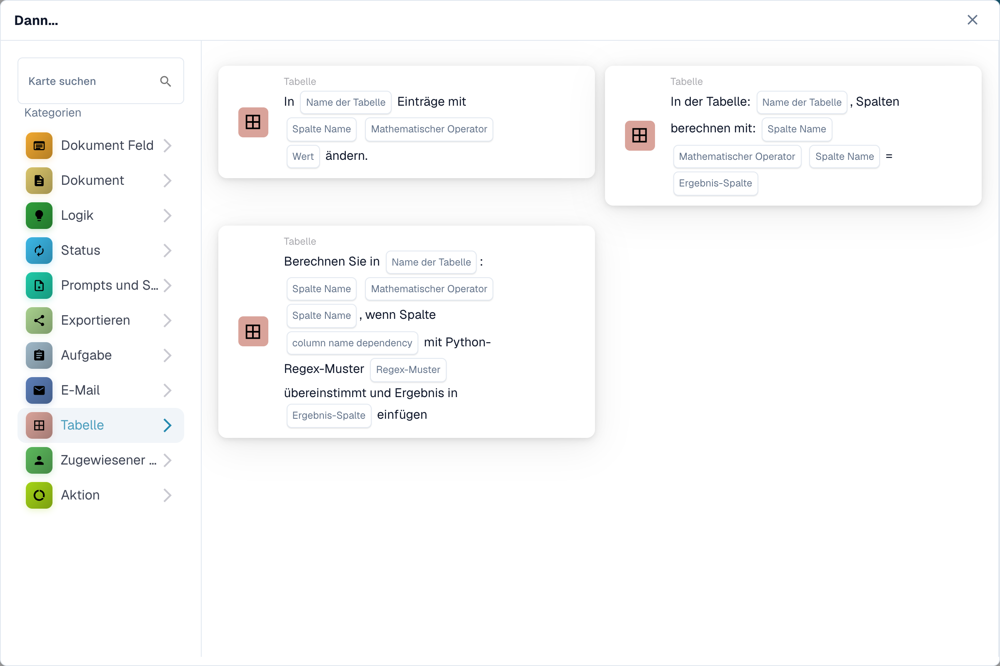<figcaption>Daten in Tabellen aktualisieren oder berechnen.</figcaption></figure>

## Zugewiesener Benutzer

Weisen Sie das Dokument einer Person, Gruppe, einem Empfänger oder einer Sub-Organisation zu. Manche Karten nutzen ein Feld oder eine Entscheidungstabelle und bieten eine Ausweichoption. Wählen Sie das richtige Ziel und die Ausweichoption auf der ausgewählten Karte. Siehe [Assignee](assignee/README.md).

<figure>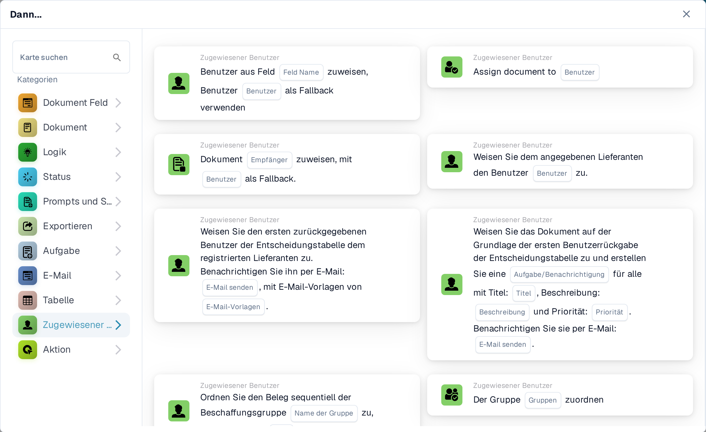<figcaption>Das Dokument der nächsten verantwortlichen Person oder Gruppe zuweisen.</figcaption></figure>

## Aktion

Führen Sie einen weiteren Workflow aus, senden Sie eine HTTPS-Anfrage, rufen Sie eine API auf oder nutzen Sie die Karte zur Kostensteigerungs-Berechnung. Diese Aktionen können andere Systeme beeinflussen; fragen Sie Ihre Administration, welchen Endpunkt und welche Einstellungen Sie verwenden sollen. Siehe [Action](action/README.md).

<figure>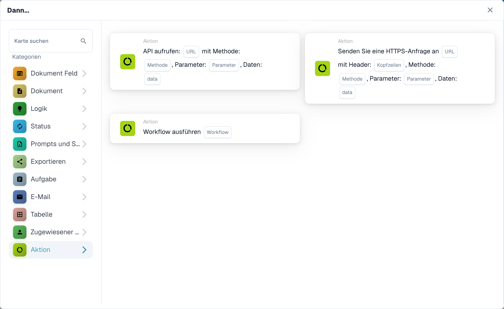<figcaption>Einen weiteren Workflow oder eine Integrationsaktion starten.</figcaption></figure>
