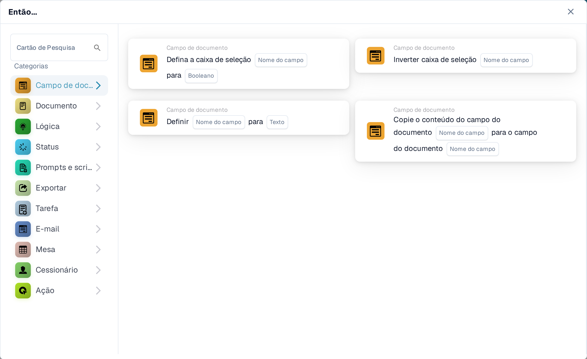
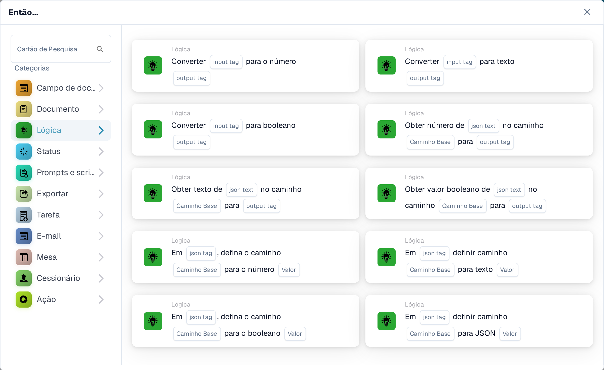
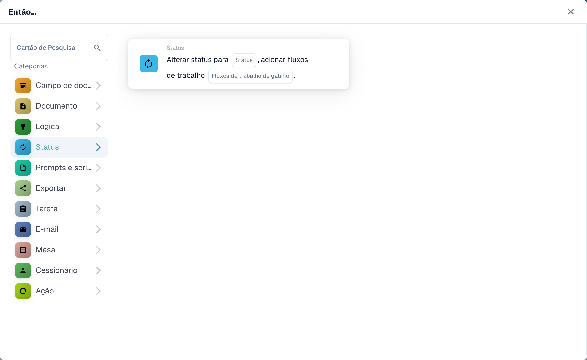
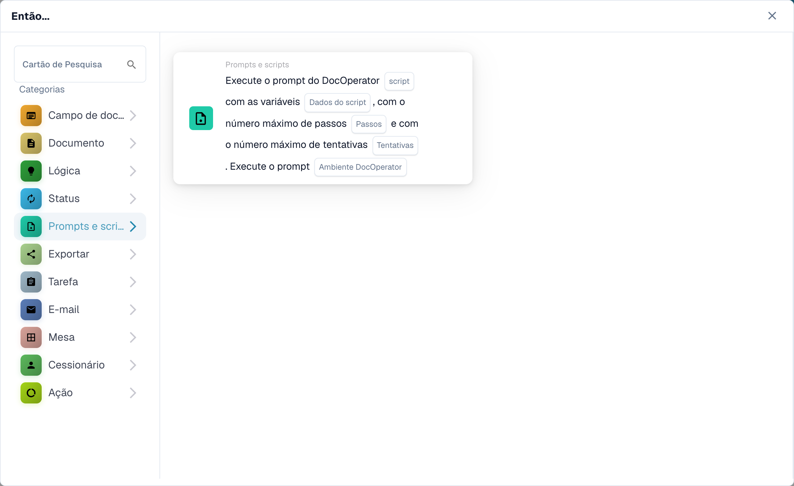
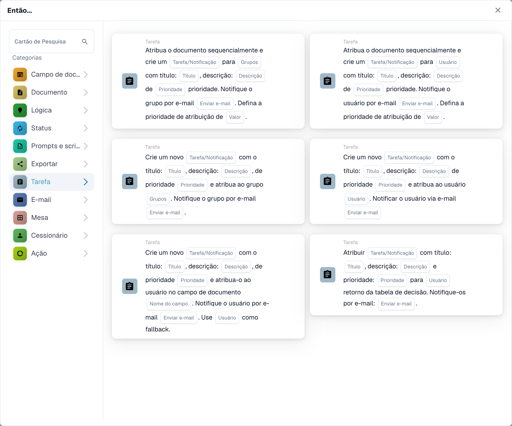
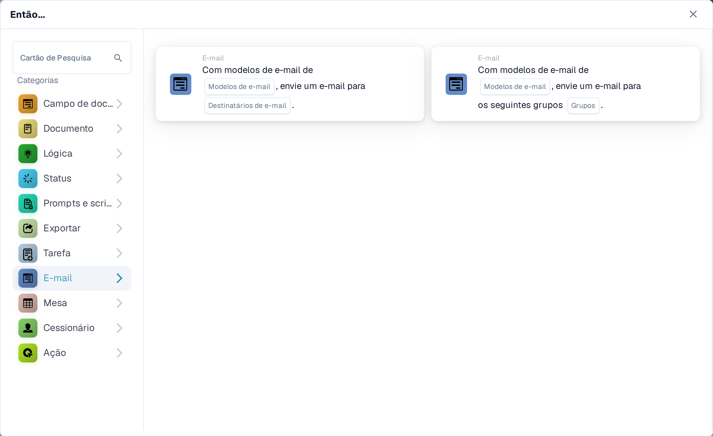
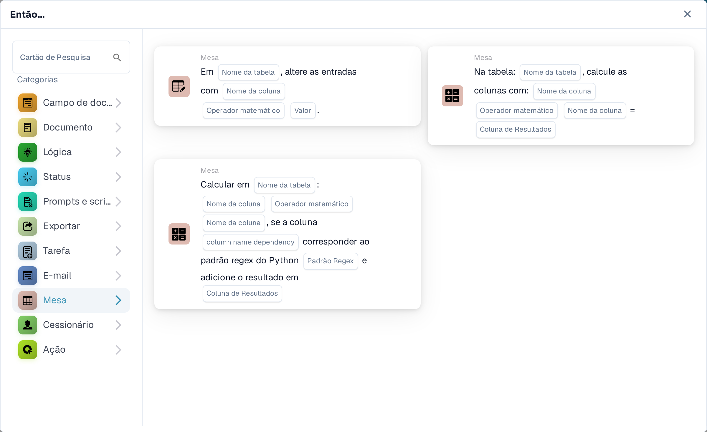
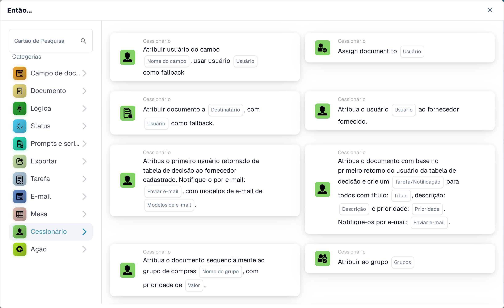
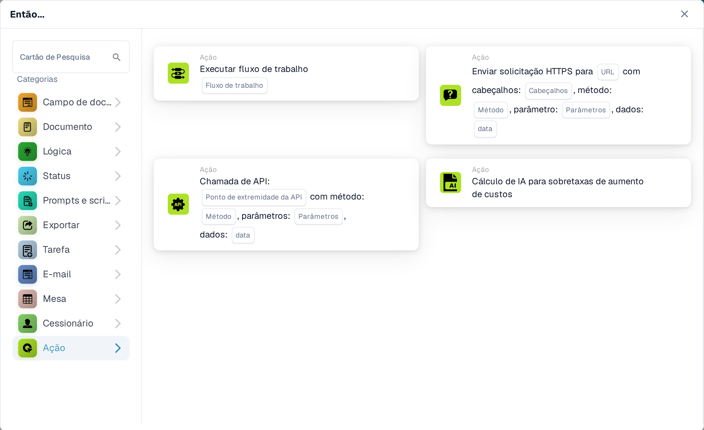

# Then

## Visão geral dos cartões de ação "Then..."

Um cartão **Then** indica ao fluxo de trabalho o que fazer depois do gatilho **When** e das eventuais condições **And**. No **Workflow Builder**, selecione **Adicionar cartão** sob **Então...**. Escolha uma categoria à esquerda ou digite um nome em **Cartão de Pesquisa**. Selecione uma pré-visualização de cartão para adicioná-lo, preencha os campos mostrados no cartão e guarde o fluxo de trabalho. Desloque-se dentro do seletor para ver mais cartões. Selecione **×** para fechar sem adicionar um cartão. Veja [Fluxo de trabalho](../README.md) para a sequência completa.

As pré-visualizações abaixo mostram as ações disponíveis, não configurações já concluídas. Escolha a ação que corresponde ao resultado que pretende obter.

## Campo de documento

Defina ou inverta uma caixa de seleção, coloque texto num campo ou copie um campo para outro. Escolha os nomes dos campos e o valor solicitados pelo cartão. Veja [Campo de documento](document-field/README.md).

<figure><figcaption>Altere um campo ou copie o seu conteúdo.</figcaption></figure>

## Documento

Escolha **Aprovar o Documento** ou **Rejeitar o documento** quando o fluxo de trabalho deve tomar essa decisão. Use primeiro uma condição **And** se a aprovação depender de uma verificação. Veja [Documento](document/README.md).

<figure><figcaption>Aprove ou rejeite o documento atual.</figcaption></figure>

## Lógica

Use estes cartões para converter valores entre formato numérico, texto e booleano, ou para ler um valor de JSON. Escolha os campos de input e output no cartão selecionado.

<figure><figcaption>Transforme valores para um passo posterior do fluxo de trabalho.</figcaption></figure>

## Status

Escolha **Alterar status para** para levar o documento a um status selecionado. O cartão também pode acionar outro fluxo de trabalho. Veja [Status](status/README.md).

<figure><figcaption>Leve o documento a outro status.</figcaption></figure>

## Prompts e scripts

Escolha esta categoria para executar um script de prompt DocOperator. Selecione o script e as variáveis solicitados pelo cartão. O cartão também oferece definições de execução, como tentativas.

<figure><figcaption>Execute um script de prompt DocOperator configurado.</figcaption></figure>

## Exportar

Inicie uma exportação, exporte com uma configuração escolhida ou coloque uma exportação final na fila. Escolha a configuração de exportação e a opção de tarefas pendentes mostrada no seu cartão. Veja [Exportar](export/README.md).

<figure><figcaption>Escolha quando e como o documento é exportado.</figcaption></figure>

## Tarefa

Crie uma tarefa ou notificação e atribua-a a um utilizador ou grupo. Introduza o título, a descrição, a prioridade e as definições de notificação solicitados pelo cartão. Alguns cartões fazem atribuição sequencial. Veja [Tarefa](task/README.md).

<figure><figcaption>Crie trabalho de acompanhamento para uma pessoa ou grupo.</figcaption></figure>

## E-mail

Envie um e-mail usando um modelo selecionado, para destinatários ou para grupos. Escolha o modelo e o destino no cartão.

<figure><figcaption>Envie um e-mail com modelo.</figcaption></figure>

## Mesa

Altere entradas ou calcule valores numa tabela do documento. Selecione a tabela, as colunas, o operador e a coluna de resultado solicitados pelo cartão. Veja [Mesa](table/README.md).

<figure><figcaption>Atualize ou calcule dados da tabela.</figcaption></figure>

## Cessionário

Atribua o documento a um utilizador, grupo, destinatário ou sub-organização. Alguns cartões usam um campo ou uma tabela de decisão e oferecem um valor de recurso. Escolha o destino correto e o recurso no cartão selecionado. Veja [Cessionário](assignee/README.md).

<figure><figcaption>Encaminhe o documento para a próxima pessoa ou grupo responsável.</figcaption></figure>

## Ação

Execute outro fluxo de trabalho, envie uma solicitação HTTPS, faça uma chamada de API ou use o cartão de cálculo de aumento de custos. Estas ações podem afetar outros sistemas; pergunte ao seu administrador qual endpoint e definições usar. Veja [Ação](action/README.md).

<figure><figcaption>Inicie outro fluxo de trabalho ou ação de integração.</figcaption></figure>
