# Then: bir eylem kartı seçin

Bir **Then** kartı, bir iş akışına **When** tetikleyicisinden ve varsa **And** koşullarından sonra ne yapacağını söyler. **İş Akışı Oluşturucu**'da **Daha sonra...** altındaki **Kart Ekle** seçeneğine tıklayın. Soldan bir kategori seçin veya **Arama Kartı** alanına bir ad yazın. Eklemek için bir kart ön izlemesi seçin, kartta gösterilen alanları doldurun ve iş akışını kaydedin. Daha fazla kart görmek için seçici içinde kaydırın. Kart eklemeden kapatmak için **×** seçeneğine tıklayın. Tam sıralama için [İş Akışı](../README.md) sayfasına bakın.

Aşağıdaki ön izlemeler kullanılabilecek eylemleri gösterir, tamamlanmış ayarları değil. İstediğiniz sonuca uyan eylemi seçin.

## Belge Alanı

Bir onay kutusunu ayarlayın veya ters çevirin, bir alana metin yazın, ya da bir alanın içeriğini başka bir alana kopyalayın. Kartta istenen alan adlarını ve değeri seçin. Bkz. [Belge Alanı](document-field/README.md).

<figure>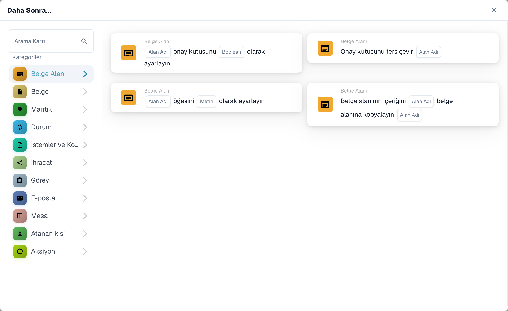<figcaption>Bir alanı değiştirin veya içeriğini kopyalayın.</figcaption></figure>

## Belge

İş akışı bu kararı vermeliyse **Belgeyi Onayla** veya **Belgeyi Reddet** seçeneğini seçin. Onay bir denetime bağlı olacaksa önce bir **And** koşulu ekleyin. Bkz. [Belge](document/README.md).

<figure>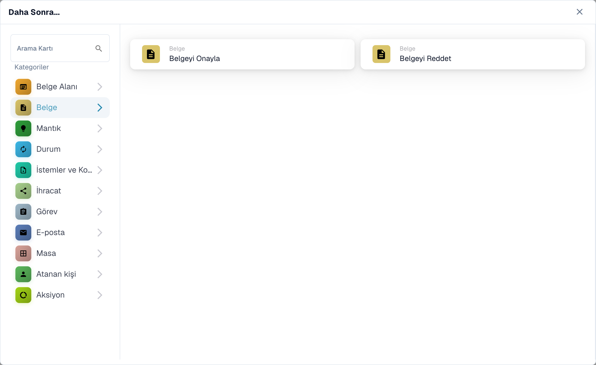<figcaption>Geçerli belgeyi onaylayın veya reddedin.</figcaption></figure>

## Mantık

Bu kartlarla değerleri sayı, metin ve boolean biçimleri arasında dönüştürün ya da JSON içinden bir değer okuyun. Seçilen kartta girdi ve çıktı alanlarını belirleyin.

<figure>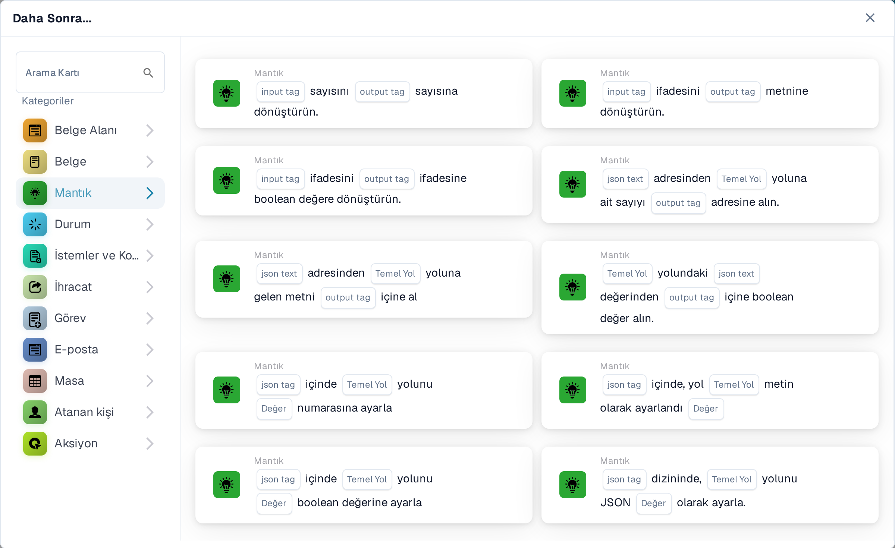<figcaption>Bir sonraki iş akışı adımı için değerleri dönüştürün.</figcaption></figure>

## Durum

Belgeyi seçilen bir duruma taşımak için **Durumu Değiştir** seçeneğini seçin. Bu kart ayrıca başka bir iş akışını da tetikleyebilir. Bkz. [Durum](status/README.md).

<figure>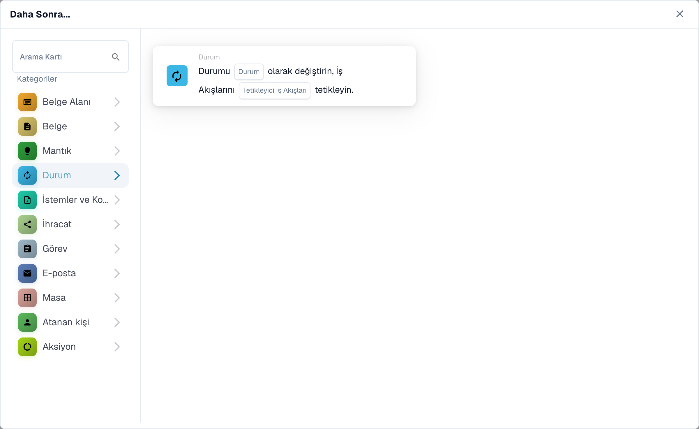<figcaption>Belgeyi başka bir duruma taşıyın.</figcaption></figure>

## İstemler ve Komut Dosyaları

Bir DocOperator istem komut dosyasını çalıştırmak için bu kategoriyi seçin. Kartta istenen komut dosyasını ve değişkenleri seçin. Kart ayrıca yeniden denemeler gibi çalıştırma ayarları da sunar.

<figure>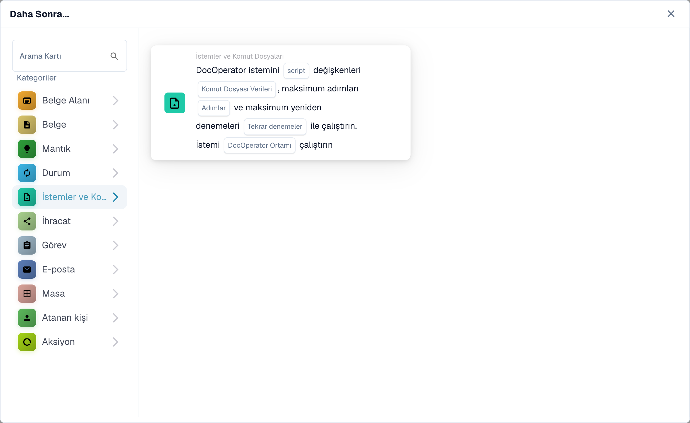<figcaption>Yapılandırılmış bir DocOperator istem komut dosyasını çalıştırın.</figcaption></figure>

## İhracat

Bir dışa aktarma başlatın, seçilen bir yapılandırmayla dışa aktarın veya nihai bir dışa aktarmayı kuyruğa alın. Kartta gösterilen dışa aktarma yapılandırmasını ve bekleyen görev seçeneğini belirleyin. Bkz. [İhracat](export/README.md).

<figure>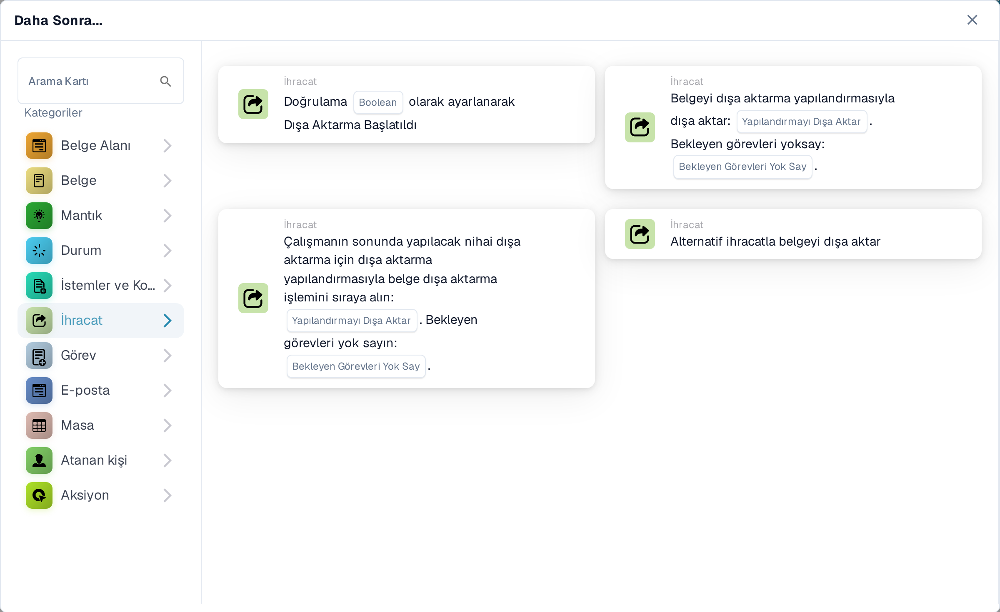<figcaption>Belgenin ne zaman ve nasıl dışa aktarılacağını seçin.</figcaption></figure>

## Görev

Bir görev veya bildirim oluşturun ve bir kullanıcıya ya da gruba atayın. Kartta istenen başlığı, tanımı, önceliği ve bildirim ayarlarını girin. Bazı kartlar sırayla atama yapar. Bkz. [Görev](task/README.md).

<figure>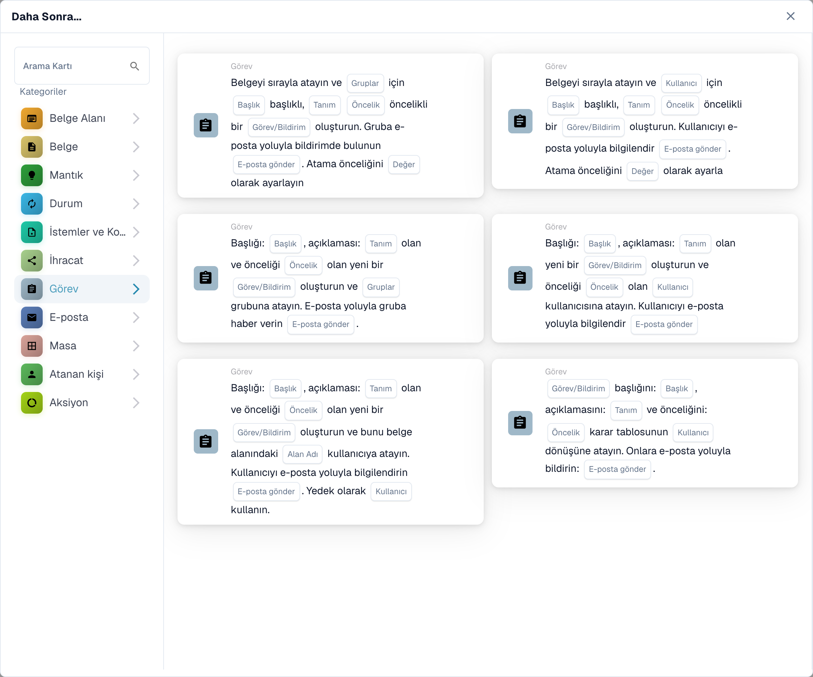<figcaption>Bir kişi veya grup için izleme işi oluşturun.</figcaption></figure>

## E-posta

Seçilen bir şablonla, alıcılara veya gruplara e-posta gönderin. Kartta şablonu ve hedefi seçin.

<figure>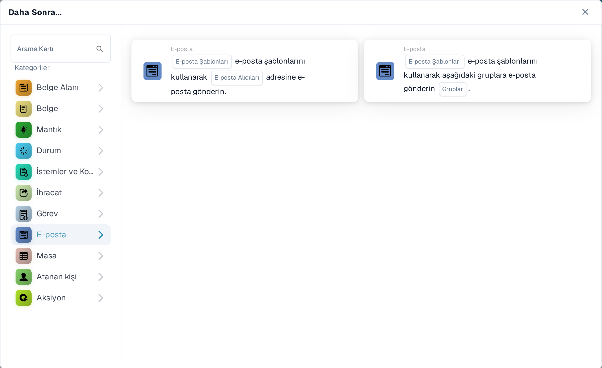<figcaption>Şablonlu bir e-posta gönderin.</figcaption></figure>

## Masa

Bir belge tablosundaki girdileri değiştirin veya değerleri hesaplayın. Kartta istenen tabloyu, sütunları, operatörü ve sonuç sütununu seçin. Bkz. [Masa](table/README.md).

<figure>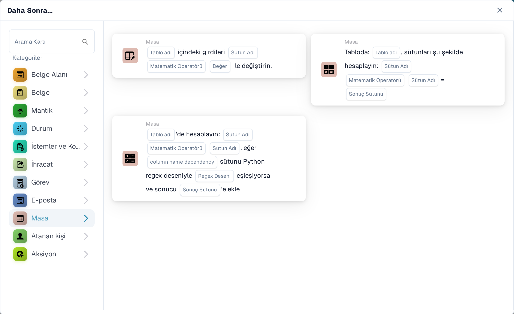<figcaption>Tablo verilerini güncelleyin veya hesaplayın.</figcaption></figure>

## Atanan kişi

Belgeyi bir kullanıcıya, gruba, alıcıya veya alt kuruluşa atayın. Bazı kartlar bir alan veya karar tablosu kullanır ve bir yedek seçenek sunar. Seçilen kartta doğru hedefi ve yedeği belirleyin. Bkz. [Atanan kişi](assignee/README.md).

<figure>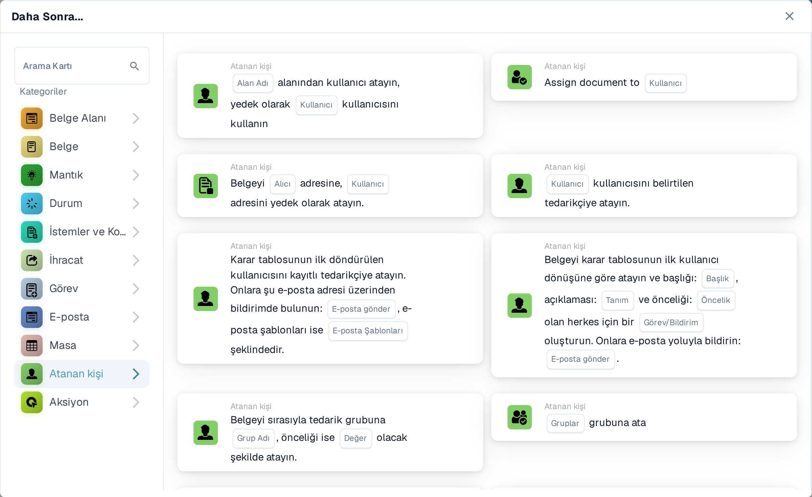<figcaption>Belgeyi sıradaki sorumlu kişiye veya gruba yönlendirin.</figcaption></figure>

## Aksiyon

Başka bir iş akışını çalıştırın, HTTPS isteği gönderin, bir API'yi çağırın veya maliyet artışı hesaplama kartını kullanın. Bu eylemler diğer sistemleri etkileyebilir; hangi uç nokta ve ayarların kullanılacağını yöneticinizden öğrenin. Bkz. [Aksiyon](action/README.md).

<figure>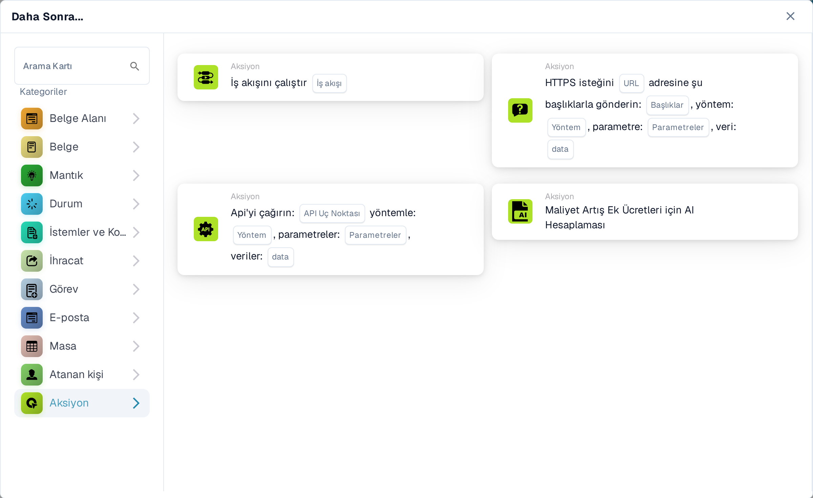<figcaption>Başka bir iş akışı veya entegrasyon eylemi başlatın.</figcaption></figure>
