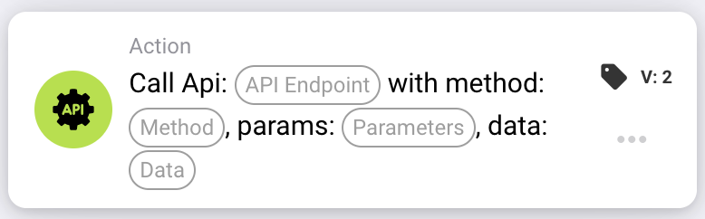

# Call Api

<figure><figcaption></figcaption></figure>

## Svrha:

Kartica radnog toka **"Call API"** omogućava korisnicima da upućuju HTTP zahteve navedenim API krajnjim tačkama direktno iz radnog toka. Ova kartica podržava različite HTTP metode i omogućava dinamičku interakciju sa eksternim sistemima slanjem parametara i podataka. Pojednostavljuje integraciju sa servisima trećih strana i prilagođenim API-jima, obezbeđujući neometanu komunikaciju.

## Komponente kartice:

1. **API Endpoint**
   * **Opis:** Ciljna krajnja tačka **DocBits API**-ja sa kojom će ova kartica komunicirati.
   * **Detalj:** Tekstualno polje u kojem korisnici navode krajnju tačku za API zahtev.
2. **HTTP Method**
   * **Opis:** Tip HTTP zahteva koji treba uputiti.
   * **Opcije:**
     1. **GET:** Preuzima podatke sa navedene krajnje tačke.
     2. **POST:** Šalje podatke krajnjoj tački.
     3. **PUT:** Ažurira postojeće podatke na krajnjoj tački.
     4. **DELETE:** Uklanja podatke sa krajnje tačke.
3. **Parameters**
   * **Opis:** Parametri upita koji se uključuju u API zahtev.
   * **Detalj:** Tekstualno polje ili lista za unos parova ključ-vrednost za URL zahteva.
4. **Data**
   1. **Opis:** Sadržaj koji se šalje u telu API zahteva (primenljivo za POST i PUT metode).
   2. **Detalj:** Polje za unos podataka u JSON formatu.

## Funkcionalnost:

**Procena uslova:** Sistem procenjuje uslove definisane u odeljcima "Where" i "And":

* Ako su oba uslova **tačna**, API zahtev se izvršava kao što je konfigurisan.
* Ako je bilo koji uslov **netačan**, kartica se ne izvršava, i ne upućuje se nijedan API poziv.

**Izvršavanje API zahteva:**

* Kartica šalje HTTP zahtev navedenoj krajnjoj tački koristeći izabranu metodu.
* Svi navedeni parametri se dodaju URL-u, a podaci se uključuju u telo zahteva (ako je primenljivo).

## Podešavanje i konfiguracija:

1. **Definisanje API Endpoint-a:**\
   Unesite URL API-ja koji želite da pozovete.
2. **Izbor HTTP metode:**\
   Izaberite jednu od podržanih metoda (GET, POST, PUT, DELETE) na osnovu zahteva vašeg API-ja.
3. **Navođenje parametara:**\
   Dodajte sve potrebne parametre upita kao parove ključ-vrednost.
4. **Uključivanje podataka (ako je primenljivo):**\
   Za POST ili PUT metode, navedite podatke koji se šalju u telu zahteva.
5. **Konfiguracija uslova:**\
   Konfigurišite odeljke "Where" i "And" da definišete kada API poziv treba da se dogodi.

## Zaključak:

Kartica radnog toka **"Call API"** poboljšava automatizaciju radnog toka omogućavanjem direktne interakcije sa eksternim sistemima. Pružanjem fleksibilnih konfiguracija za krajnje tačke, metode i podatke, ona obezbeđuje da se radni tokovi neometano integrišu sa API-jima trećih strana ili prilagođenim pozadinskim sistemima. Mogućnost uslovnog izvršavanja API poziva obezbeđuje preciznost i efikasnost u automatizaciji eksterne komunikacije.

***
