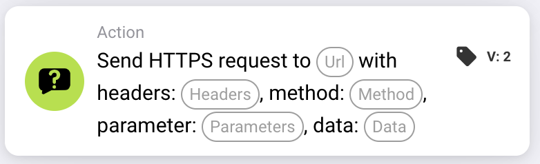
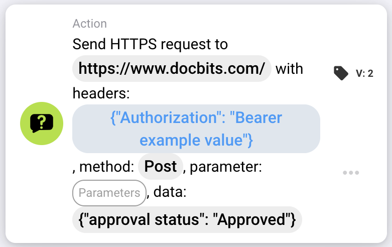

# Send HTTPS request to

<figure><figcaption></figcaption></figure>

## Zweck:

Die Workflow-Karte **"Send HTTPS Request"** ermöglicht es Benutzern, HTTPS-Anfragen an eine angegebene URL mit anpassbaren Headern, Parametern und Datennutzlast zu senden. Diese Karte eignet sich ideal, um externe APIs oder Webdienste direkt in den Workflow zu integrieren.

## Bestandteile der Karte:

1. **URL**
   * **Beschreibung:** Gibt den Endpunkt an, an den die HTTPS-Anfrage gesendet wird.
   * **Detail:** Geben Sie die vollständige URL der API oder des Webdienstes ein, mit dem eine Verbindung hergestellt werden soll.
2. **Header**
   * **Beschreibung:** Legt die Header fest, die in die HTTPS-Anfrage aufgenommen werden.
   * **Detail:** Geben Sie **Schlüssel-Wert-Paare** in einem **gültigen JSON-Format** an, um Header wie Authentifizierungstoken oder Inhaltstypen festzulegen. Beispiel: {"Authorization": "Bearer example\_value"}
3. **Methode**
   * **Beschreibung:** Gibt die für die Anfrage zu verwendende HTTP-Methode an.
   * **Optionen:**
     * **GET:** Ruft Daten vom Endpunkt ab.
     * **POST:** Sendet Daten an den Endpunkt, um Ressourcen zu erstellen oder zu aktualisieren.
     * **PUT:** Aktualisiert vorhandene Ressourcen am Endpunkt.
     * **DELETE:** Entfernt Ressourcen vom Endpunkt.
4. **Parameter**
   * **Beschreibung:** Schlüssel-Wert-Paare, die als Abfrageparameter in die URL aufgenommen werden.
   * **Detail:** Verwenden Sie dies, um Filter oder zusätzliche Daten, die der Endpunkt benötigt, in einem gültigen JSON-Format zu senden. Siehe Beispiel bei den Headern.
5. **Daten**
   * **Beschreibung:** Der Body der HTTPS-Anfrage.
   * **Detail:** Geben Sie die Nutzlast in einem gültigen JSON-Format an. Siehe Beispiel bei den Headern.

## Funktionalität:

* **Bedingungsauswertung:** Die Karte sendet die HTTPS-Anfrage nur, wenn der **"Where"**- und der **"And"**-Abschnitt als erfüllt ausgewertet werden.&#x20;
  * Ist eine der Bedingungen nicht erfüllt, wird die Anfrage nicht gesendet.
* **Ausführung der Anfrage:**
  * Sind die Bedingungen erfüllt, sendet das System die HTTPS-Anfrage mit den angegebenen Konfigurationen.

## Einrichtung und Konfiguration:

1. **URL definieren:** Geben Sie den Endpunkt ein, an den die HTTPS-Anfrage gesendet werden soll.
2. **Header festlegen:** Geben Sie die erforderlichen Header als Schlüssel-Wert-Paare an.
3. **HTTP-Methode auswählen:** Wählen Sie die passende Methode (**GET**, **POST**, **PUT** oder **DELETE**) entsprechend der durchzuführenden Aktion.
4. **Parameter hinzufügen:** Geben Sie alle vom Endpunkt benötigten Abfrageparameter an.
5. **Datennutzlast angeben:** Geben Sie bei Bedarf den Anfrage-Body im erforderlichen Format (z. B. JSON) ein.
6. **Bedingungen konfigurieren:** Definieren Sie die Abschnitte **"Where"** und **"And"**, um sicherzustellen, dass die Anfrage nur gesendet wird, wenn bestimmte Bedingungen erfüllt sind.

## Beispielkarte:

<figure><figcaption></figcaption></figure>

## Fazit:

Die Workflow-Karte **"Send HTTPS Request"** vereinfacht die API-Integration, indem sie es Benutzern ermöglicht, direkt aus ihren Workflows angepasste Anfragen an externe Dienste zu senden. Indem sie den Prozess des Sendens von HTTPS-Anfragen und der Verwaltung von Antworten automatisiert, steigert diese Karte die Flexibilität und Funktionalität von Workflows.
