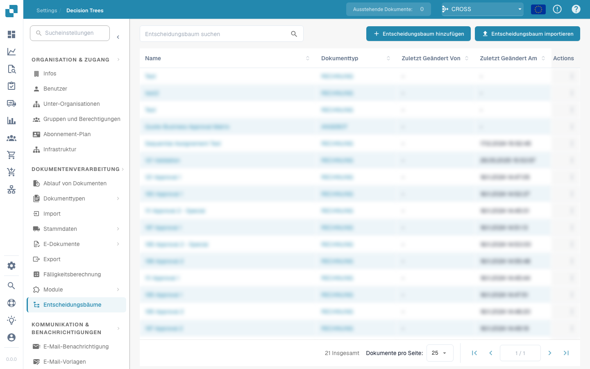

# Assign Document and Create Task/Notification

<figure><figcaption></figcaption></figure>

## **Doel**

De workflow-kaart "**Assign Document and Create Task/Notification Based on Decision Table**" wijst een document toe en maakt een taak of melding aan met configureerbare details. De toegewezene wordt bepaald door de retourwaarde van een decision table, en de kaart maakt het mogelijk prioriteiten in te stellen en e-mailmeldingen te verzenden.

## **Onderdelen van de kaart**

1. **Assignee Type**
   * **Beschrijving:** Geeft op of de retourwaarde van de decision table het document en de taak/melding aan een gebruiker of groep toewijst.
   * **Detail:** Een veld om het toegewezene-type te configureren als ofwel "User" ofwel "Group" op basis van de uitvoer van de decision table.
2. **Task/Notification**
   * **Beschrijving:** Geeft het type actie op dat voor de toegewezene wordt aangemaakt.
   * **Detail:** Een dropdown om ofwel "Task" ofwel "Notification" te selecteren op basis van de workflow-behoeften.
3. **Title**
   * **Beschrijving:** De titel van de taak of melding.
   * **Detail:** Een veld om een beknopte titel te bieden die de taak of melding identificeert.
4. **Description**
   * **Beschrijving:** Aanvullende details over de taak of melding.
   * **Detail:** Een veld om het doel en de context van de taak of melding te beschrijven.
5. **Priority**
   * **Beschrijving:** Definieert het urgentieniveau van de taak of melding.
   * **Opties:**
     * **High:** Vereist onmiddellijke aandacht.
     * **Medium:** Belangrijk maar niet urgent.
     * **Low:** Kan later worden afgehandeld.
6. **Assignee Type**
   * **Beschrijving:** Dit veld bepaalt het type toegewezene (User of Group) aan wie het document en de taak/melding worden toegewezen.
   * **Detail:** Een dropdownmenu om te selecteren of de taak/melding aan een gebruiker of een groep wordt toegewezen op basis van de uitvoer van de decision table.
7. **Send Mail**
   * **Beschrijving:** Configureert of er een e-mailmelding naar de toegewezene wordt verzonden.
   * **Opties:**
     * **True:** Verzendt een e-mailmelding.
     * **False:** Er wordt geen e-mailmelding verzonden.
8. **Value**
   * **Beschrijving:** Stelt de numerieke prioriteit voor de documenttoewijzing in.
   * **Detail:** Een veld om een numerieke waarde in te voeren, waarbij lagere getallen een hogere prioriteit aangeven.

## **Functionaliteit**

* **Voorwaarde-evaluatie:**\
  De kaart voert de acties alleen uit als aan de workflow-voorwaarden wordt voldaan.
* **Decision table-evaluatie:**\
  De decision table bepaalt of het document en de taak/melding aan een gebruiker of groep worden toegewezen.
* **Documenttoewijzing en aanmaak van taak/melding:**\
  Het document wordt toegewezen aan het resultaat van de decision table. Er wordt een taak of melding aangemaakt met de opgegeven titel, beschrijving en prioriteitsniveau.
* **E-mailmelding:**\
  Als "Send Mail" op True is ingesteld, wordt er een e-mailmelding naar de toegewezene verzonden.

## **Opzet en configuratie**

1. **Assignee Type definiëren:**
   * Configureer het veld Assignee Type als ofwel "User" ofwel "Group" op basis van de uitvoer van de decision table.
2. **Task/Notification selecteren:**
   * Kies "Task" of "Notification" in de Task/Notification-dropdown.
3. **Taak-/meldingsdetails instellen:**
   * Voer de Title en Description voor de taak of melding in.
   * Selecteer de Priority (High, Medium of Low) in de dropdown.
4. **E-mailmelding inschakelen:**
   * Stel de optie Send Mail in op True of False, afhankelijk van of er een e-mailmelding moet worden verzonden.
5. **Numerieke prioriteit instellen:**
   * Voer een numerieke waarde in het veld Value in om de toewijzingsprioriteit te bepalen, waarbij lagere getallen het eerst worden verwerkt.
6. Sla de kaartconfiguratie op en activeer de workflow.

## **Conclusie**

De workflow-kaart "Assign Document and Create Task/Notification Based on Decision Table" zorgt ervoor dat taken of meldingen dynamisch aan de juiste gebruiker of groep worden toegewezen op basis van de resultaten van de decision table. Deze kaart faciliteert efficiënte taakdelegatie, aanpasbare prioriteiten en optionele e-mailmeldingen om de responsiviteit van de workflow te verbeteren.
