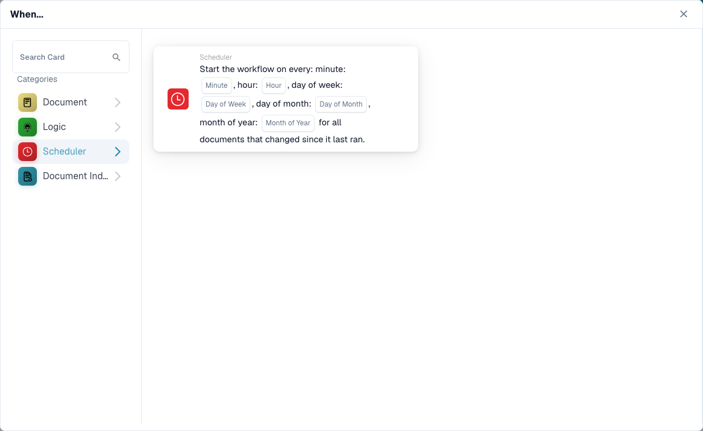

# When

Kartice ove kategorije u **Add Card** biraču Workflow Builder-a:

<figure><figcaption>
Kartice ove kategorije.
</figcaption></figure>

<figure><figcaption></figcaption></figure>

#### Razumevanje "When" u konfiguracijama radnog toka

**Svrha "When"**

* "When" odeljak u konfiguraciji radnog toka definiše uslove okidača koji pokreću određenu akciju radnog toka. Ovi uslovi se zasnivaju na navedenim kriterijumima vezanim za atribute dokumenta ili korisničke aktivnosti unutar ERP sistema.

**Kako funkcioniše**

* U vašem interfejsu, "When" predstavlja polaznu tačku na kojoj korisnici mogu da izaberu različite kartice okidača. Svaka kartica navodi uslove pod kojima će se izvršiti naredne akcije (definisane u "And" odeljku).

**Kartice uslova za tip dokumenta**

* Kartice sa ikonom dokumenta prikazane na snimku ekrana su varijacije "Document Type" uslova, koji se koriste za pokretanje radnih tokova na osnovu tipa dokumenta koji se obrađuje. Evo pregleda svakog tipa prikazane kartice uslova:
  * **Document type (Operator) one of (Type)**: Ova kartica pokreće akciju kada se tip dokumenta poklapa sa jednim od navedenih tipova u listi. Operator može uključivati opcije kao što su "is" ili "is not", omogućavajući inkluzivne ili ekskluzivne uslove.
  * **Document type (Operator) (Type)**: Ova jednostavnija varijanta pokreće akciju na osnovu uslova jednog tipa dokumenta. Tipično bi proveravala da li tip dokumenta "is" ili "is not" određeni tip, bez opcije izbora iz više tipova.
  *

**Celery Beat**

* Kartica sa ikonom sata na snimku ekrana je "Celery Beat" uslov, koji se koristi za pokretanje radnih tokova na osnovu datuma i vremena.

#### Podešavanje "When" kartice okidača

1. **Izbor tipa uslova**: Korisnici počinju izborom tipa uslova koji je relevantan za radni tok koji žele da automatizuju. U ovom slučaju, fokus su tipovi dokumenata.
2. **Definisanje operatora**: Korisnici moraju da odluče logički operator — kao što su "is" ili "is not" — koji postavlja osnovu za poređenje stvarnih tipova dokumenata sa definisanim uslovima.
3. **Navođenje tipova dokumenata**: U zavisnosti od kartice, korisnici mogu izabrati jedan ili više tipova dokumenata koji će pokrenuti radni tok kada se obrađuju dokumenti tih tipova.
4. **Finaliziranje okidača**: Kada se uslov podesi, on postaje osnova za pokretanje određenih akcija definisanih u radnom toku. Ako dokument ispuni zadati uslov, definisane akcije će se automatski pokrenuti.

#### Praktična primena

U praksi, ove kartice okidača su ključne za automatizaciju procesa kao što su odobrenja, obaveštenja ili bilo koja procedura koja zavisi od tipa dokumenta koji se obrađuje. Na primer, ako je tip dokumenta "is" "Invoice", i poklapa se sa uslovima zadatim u "When" kartici, radni tok bi mogao automatski usmeriti dokument na obradu plaćanja.

Ovo podešavanje obezbeđuje da radni tokovi budu ne samo efikasni već i prilagođeni specifičnim operativnim potrebama organizacije, smanjujući ručni nadzor i ubrzavajući procese rukovanja dokumentima.

Ukratko, "When" deo vaše konfiguracije radnog toka odnosi se na postavljanje osnove za automatizovane akcije na osnovu određenih, unapred definisanih uslova. To je moćan alat za obezbeđivanje da vaš ERP sistem dinamično reaguje na potrebe poslovanja, poboljšavajući i produktivnost i tačnost u upravljanju dokumentima.
