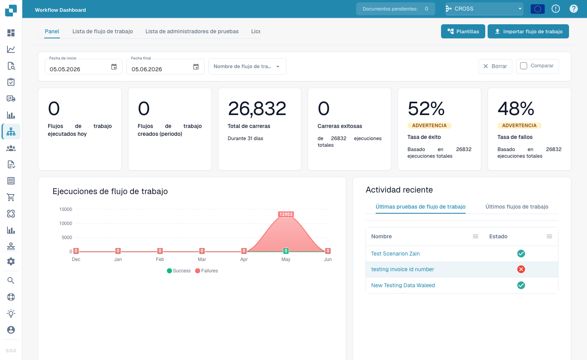

# Dashboard

**Workflow Dashboard** je polazna tačka oblasti radnih tokova. Prikazuje koliko uspešno funkcionišu vaši radni tokovi — ukupan broj izvršavanja, stope uspeha i neuspeha, grafikon izvršavanja tokom vremena i nedavne aktivnosti — i omogućava vam pristup listi radnih tokova, menadžeru testova i Card SDK-u.

<figure><figcaption>
Workflow Dashboard — ukupan broj izvršavanja, stope uspeha/neuspeha i nedavne aktivnosti za svaki radni tok.
</figcaption></figure>

## Tabs

- **Dashboard** — metrike izvršavanja i nedavne aktivnosti (prikazano iznad).
- **Workflow List** — svaki radni tok sa njegovim tipom, redosledom izvršavanja i okidačem. Kreirajte novi pomoću **Add Workflow**.
- **Test Manager List** — testni scenariji koji proveravaju vaše radne tokove; pokrenite ih pomoću **Run All Tests**.
- **License** — informacije o licenciranju radnih tokova.
- **Card SDK** — izradite i otpremite prilagođene kartice radnog toka (pogledajte [Card SDK](card-sdk.md)).

**Test Manager** vam omogućava da sačuvate testne scenarije po radnom toku i pokrenete ih zajedno, kako biste potvrdili da se vaši radni tokovi i dalje ponašaju ispravno nakon izmena:

<figure><figcaption>
Test Manager List — svaki scenario prikazuje rezultat prošao/pao; koristite <strong>Run All Tests</strong> da ih sve ponovo pokrenete.
</figcaption></figure>

## Sledeći koraci

- Izgradite linearnu automatizaciju pomoću **Standard Workflow** alata za izradu.
- Izgradite tok sa grananjem pomoću **Advanced Workflow** alata za izradu.
