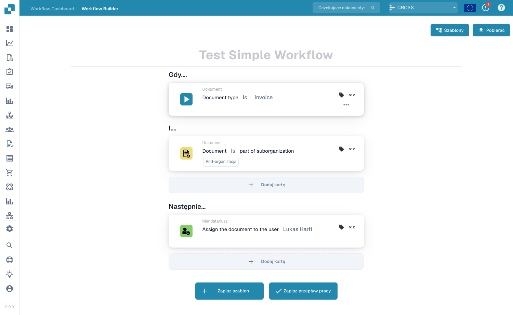
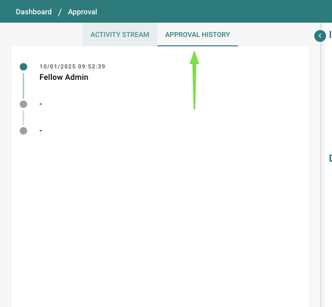
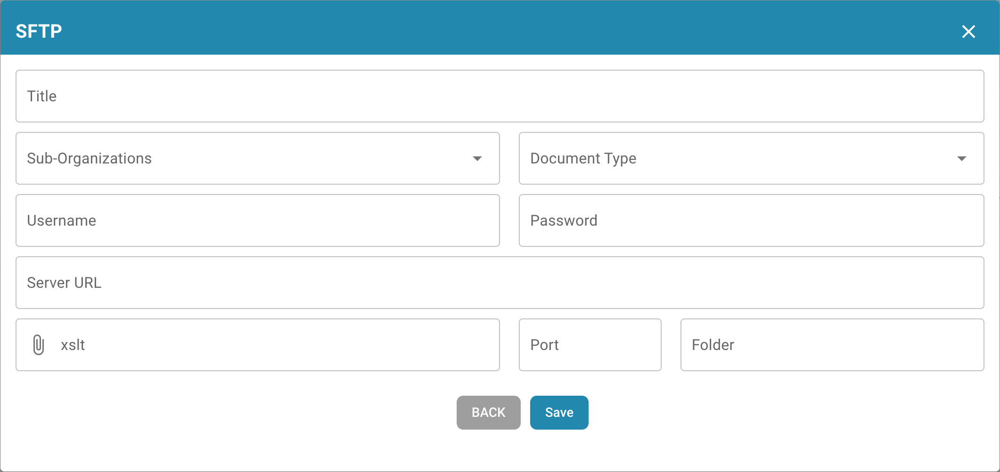
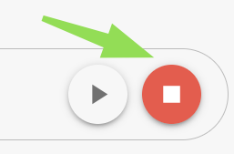
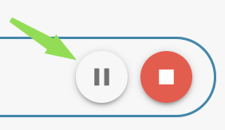
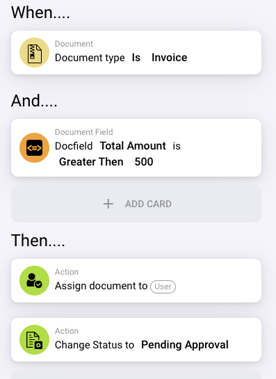
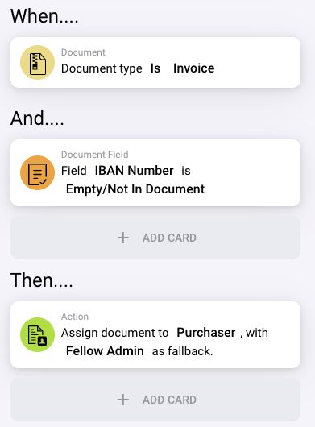
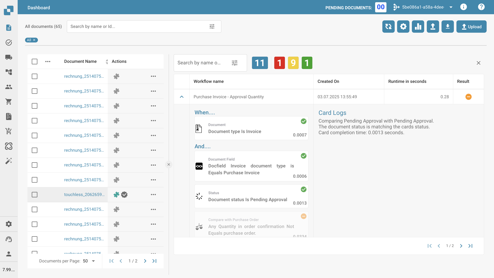
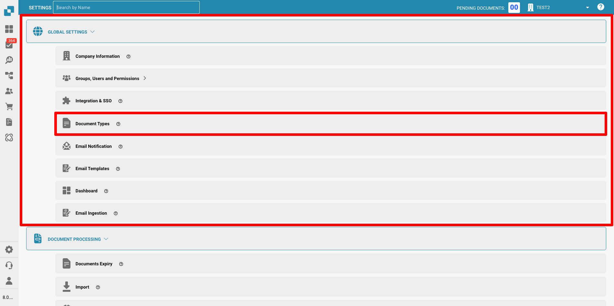
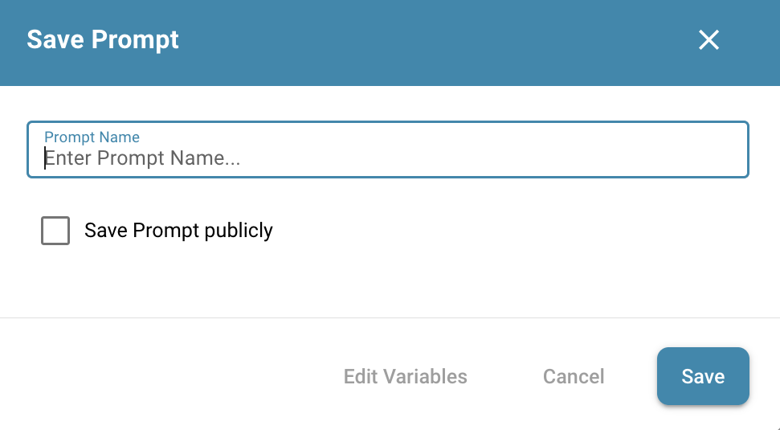

# Dodela i statusa — Praktični primeri

Da biste zadržali pregled, radnim tokovima možete dati različite naslove kako biste odmah znali o kom zadatku se u tom radnom toku radi.

Kreirajte novi radni tok: Kliknite na + ADD WORKFLOW

Ove radne tokove (Test 1,2,3) možete koristiti za automatsko dodeljivanje različitih dokumenata pravom zaposlenom u kompaniji.

Ako faktura ili drugi dokument prelazi određeni ukupan iznos koji zahteva prethodni pregled i odobrenje, ovi dokumenti se mogu odmah dodeliti odgovarajućoj osobi.

<figure><figcaption></figcaption></figure>

**Test 1: Logic Card**

When: **Assignee is:** Amier Haider

And: **Document type is:** Invoice

Then: **Assign document to:** Stefan Reppermund

.png>)

**Test 2: Logic Card**

When: **Assignee is:** Amier Haider

And: **Document type is:** Delivery Note

Then: **Assign document to:** James Edwards

.png>)

**Test 3: Logic Card**

**When:** **Assignee is:** Amier Haider

**And:** **Document type is:** Order Confirmation

**Then:** **Assign document to:** Anian Sollinger

.png>)

Takođe je moguće, ako dokument nije dodeljen pojedinačnoj osobi, da se od početka dodeli određenom zaposlenom.

<figure><figcaption></figcaption></figure>

Radi lakšeg pregleda onoga što treba da se desi sa dokumentom, u ovom radnom toku možete postaviti status za dolazne dokumente. Ovaj radni tok omogućava da se odmah vidi da li postoji, na primer, odobrenje na čekanju.

**Test 4: Logic Card**

**When:** **Document type is:** Delivery Note

**And:** **Assignee is:** Amier Haider

**Then:** **Change Status to:** Pending Approval

<figure><figcaption></figcaption></figure>

.png>)

**Test 5: Logic Card**

When: **Document type is:** Invoice

And: **Assignee is:** Stefan Reppermund

Then: **Change Status to:** Pending Second Approval

<figure><figcaption></figcaption></figure>

.png>)

Ako faktura ili drugi dokument prelazi određeni ukupan iznos koji zahteva prethodni pregled i odobrenje, ovi dokumenti se mogu odmah dodeliti pravoj osobi.

.png>)

**Test 6: Logic Card**

When: **Assignee is:** Amier Haider

And: Docfield **total\_amount** is **Greater than 500**

Then: **Assign document to:** Asad Usman Khan

<figure><figcaption></figcaption></figure>

.png>)

Takođe je moguće uneti status u radni tok, tako da dodeljena osoba odmah može videti u kom statusu je ovaj dokument i šta dalje treba da se desi sa njim.

**Test 7: Logic Card**

**When:** **Assignee is:** Amier Haider

**And:** Docfield **total\_amount** is **Greater then 500**

**Then:** **Assign document to:** Asad Usman Khan

**Change Status to:** Pending Approval

<figure><figcaption></figcaption></figure>

<figure><figcaption></figcaption></figure>

Na primer, ako neke ili važne informacije nedostaju u dokumentu, ali su važne i moraju biti uključene za dalju obradu, možete podesiti radni tok tako da se ti dokumenti odmah proslede kupcu i zameni (zamenskoj osobi).

<figure><figcaption></figcaption></figure>

**Test 9:**

Radni tok sa ovim logičkim karticama je dizajniran da automatski proveri da li količina, jedinična cena ili popust navedeni u potvrdi porudžbine odgovaraju odgovarajućim vrednostima u narudžbenici. Ova verifikacija obezbeđuje konzistentnost i tačnost između onoga što je naručeno i onoga što dobavljač potvrđuje da će isporučiti.

Ovim dokumentima možete dati određeni status ili ih dodeliti određenom zaposlenom.

<figure><figcaption></figcaption></figure>

<figure><figcaption></figcaption></figure>

**Logic Card: Quantity or Unit Price or Discount Match**

Ova logička kartica je dizajnirana da automatski proveri da li količina, jedinična cena ili popust navedeni u potvrdi porudžbine odgovaraju odgovarajućim vrednostima u narudžbenici. Ova verifikacija obezbeđuje konzistentnost i tačnost između onoga što je naručeno i onoga što dobavljač potvrđuje da će isporučiti.

**Trigger Condition**

Logika se aktivira kada je bilo koji od sledećih uslova ispunjen u potvrdi porudžbine u odnosu na originalnu narudžbenicu:

* **Quantity**: Količina naručenih stavki odgovara količini koju je dobavljač potvrdio.
* **Unit Price**: Dogovorena cena po stavki odgovara potvrdi dobavljača.
* **Discount**: Svi primenjeni popusti su konzistentni između narudžbenice i potvrde porudžbine.
* **Define Comparison Parameters**: Podesite određena polja (količina, jedinična cena, popust) koja će logička kartica proveravati radi podudaranja.
* **Automate Verification**: Konfigurišite sistem da automatski upoređuje ove detalje po prijemu potvrde porudžbine.
* **Customize Alerts**: Odlučite o radnom toku za rešavanje neslaganja, uključujući prilagođavanje upozorenja za ručni pregled.

Ova logička kartica je od ključnog značaja za obezbeđivanje da detalji potvrde porudžbine budu usklađeni sa originalnom narudžbenicom, čuvajući integritet ciklusa nabavke.

**Test 10:**

Ako imate drugačiji obračun za doplate ili ih imate samo na nekim stavkama, možete koristiti generičke kartice za obračun tabela, od kojih neke takođe omogućavaju filtriranje po regularnim izrazima.

<figure><figcaption></figcaption></figure>

Iznad je primer obračuna za MTZ sa filterom za brojeve stavki koji počinju sa 01, 06, 9, 001 ili 000.

Kod ručnog podešavanja se savetuje da se obračuni koji zavise od novih kolona podele u zaseban radni tok. Da biste nastavili sa obračunom, možete koristiti karticu Run Workflow.

**Run Workflow**

<figure><figcaption></figcaption></figure>

Ovom karticom možete navesti ime radnog toka koji treba pokrenuti nakon trenutnog radnog toka ako su njegovi uslovi ispunjeni i nakon prethodnih „then“ kartica trenutnog radnog toka. Iako daje prioritet izvršivim, aktivnim radnim tokovima, takođe vam omogućava da pokrenete deaktivirane radne tokove ako dokument ispunjava uslove radnih tokova.

### **Dodavanje obračunatih doplata u postojeću kolonu** 

<figure><figcaption></figcaption></figure>

Ako želite da sve doplate dodate kao negativan popust u kolonu popusta, možete koristiti karticu za obračun. U ovoj koloni mogu postojati unosi; možete je postaviti kao jednu od promenljivih na kartici, oduzeti MTZ od nje i dodati rezultat nazad u ovu kolonu. U slučaju da postoje prazna polja (doplate samo za neke stavke), za svoj obračun pretpostaviće vrednost 0

**Notify user to authorize the order confirmation in DocBits**

Nakon obračuna doplata možda ćete želeti da obavestite određenog korisnika da odobri potvrdu porudžbine. Za to možete koristiti karticu za obaveštenja

<figure><figcaption></figcaption></figure>

U zavisnosti od podešavanja, korisniku se dodeljuje novi zadatak u DocBits-u i opciono e-poruka da bi bio obavešten o svom novom zadatku.
