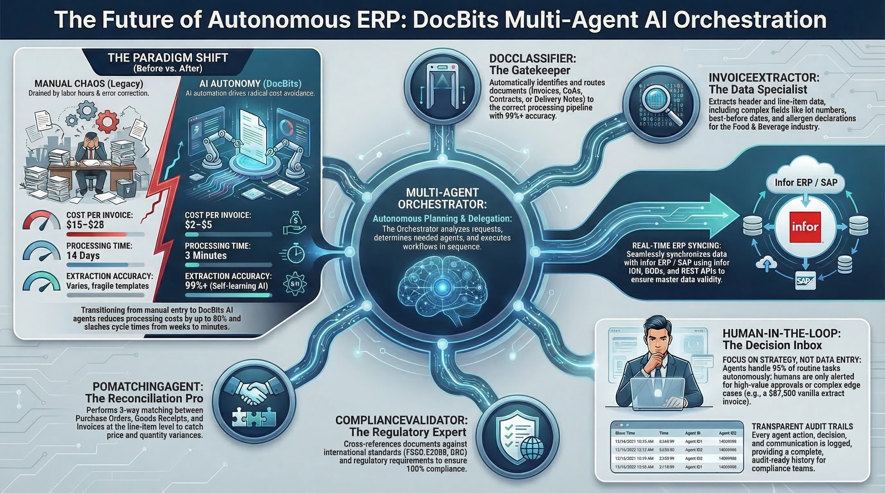

# AI Workforce

<figure><figcaption>
Sistema multiagente de DocBits para el procesamiento autónomo de documentos
</figcaption></figure>

## Descripción general

**AI Workforce** es la capa de orquestación dentro de DocBits que convierte el trabajo entrante en agentes de IA coordinados. En lugar de que una persona guíe manualmente cada paso, toma una unidad de trabajo entrante —un correo electrónico, un mensaje de chat en Microsoft Teams o Discord, una acción manual en la interfaz o una llamada a la API— y la lleva hasta su finalización: clasifica el documento, extrae y valida los campos, hace la conciliación con las órdenes de compra y los datos maestros, y exporta al ERP, con personas supervisando el proceso donde importa.

Piense en ello como un equipo que usted dirige, no como una herramienta que usted opera. Cada elemento de trabajo fluye a través de la misma estructura fija:

* Un **Orquestador** recibe una **Misión** (una unidad de trabajo), la planifica y delega.
* El plan se descompone en **Asuntos** (tareas individuales), cada uno gestionado por un **agente Especialista** o por una **persona**.
* Los Especialistas informan de sus resultados y el Orquestador sintetiza el resultado final.

Los _agentes_ que desempeñan esos roles no son fijos: DocBits incluye un **DocBits Orchestrator** listo para usar y dos especialistas predeterminados, y usted puede crear los suyos propios (consulte [Agentes](./#agents)).

Una ejecución típica, de principio a fin: llega una factura por correo electrónico → se crea una Misión → el Orquestador la planifica y despacha Asuntos a los especialistas (clasificar, extraer, validar, conciliar con la orden de compra) → un paso sensible se detiene en la **Bandeja de entrada** para que una persona lo apruebe → tras la aprobación, el documento se exporta y la Misión se completa. Usted observa todo el proceso desde el **Panel**, mantiene juntas las ejecuciones relacionadas en **Proyectos** e interviene a través de la **Bandeja de entrada** y los **Asuntos** siempre que se necesite una decisión humana.

## Cómo activarla

AI Workforce se habilita por organización desde los ajustes principales.

1. Vaya a **Ajustes → Módulos**.
2. Active el módulo **AI Workforce**.
3. Confirme la suscripción en el cuadro de diálogo que aparece.

Una vez habilitada, **AI Workforce** aparece en la barra lateral de navegación principal y el espacio de trabajo queda disponible para su organización.

## Panel

El **Panel** es su vista general de la AI Workforce: KPI, gráficos y listas de actividad de un vistazo. Usted elige qué métricas se muestran.

Para configurar las métricas activas, abra los **Ajustes** (icono de engranaje) y utilice el panel **Widgets del panel**. Active o desactive cada widget y pulse **Guardar**; su selección se almacena como una preferencia personal, de modo que cada usuario puede adaptar su propia vista.

Los widgets disponibles incluyen:

* **Supervisión de la flota**: estado en vivo de todos sus agentes.
* **Tarjetas de KPI**: Asuntos abiertos, Misiones activas, Agentes habilitados, Ejecuciones de hoy, Uso de tokens y Aprobaciones pendientes.
* **Gráficos**: tendencia de asuntos a lo largo del tiempo, misiones por estado, recepción de correos electrónicos, asuntos por prioridad, ejecuciones por día y uso de tokens por agente.
* **Listas**: misiones activas, actividad reciente, aprobaciones pendientes, sus asuntos abiertos, agentes en trabajo y elementos bloqueados.

## Bandeja de entrada

La **Bandeja de entrada** es donde el trabajo espera la **atención humana**. Cuando un agente está a punto de ejecutar una herramienta que necesita autorización, detiene la tarea y genera aquí una **solicitud de aprobación**. Esto es la supervisión humana (HITL, Human-in-the-Loop): la acción no se ejecuta hasta que una persona lo decide. Que una herramienta concreta necesite autorización lo determinan el **modo de aprobación** del agente y los marcadores de **crítico** de sus herramientas (consulte [Ajustes del agente](./#agent-settings)).

Cada elemento de la Bandeja de entrada muestra el título de la solicitud, el agente que la generó y una breve descripción de lo que requiere una decisión. Desde el elemento puede:

* **Aprobar**: permitir que el agente continúe con la acción.
* **Rechazar**: detener la acción.
* **Comentar / enviar un mensaje**: dar al agente instrucciones alternativas antes de que continúe.
* **Abrir Misión**: ir a la misión a la que pertenece este elemento para obtener el contexto completo.

Los elementos permanecen **Pendientes** hasta que alguien actúa sobre ellos, y luego pasan a **Resueltos** (o **Descartados** si el elemento se deja de lado sin una decisión, por ejemplo cuando su misión se cancela). El elemento de navegación de la Bandeja de entrada muestra una insignia con el número de aprobaciones pendientes, de modo que no se pierda nada crítico.

## Misiones

Una **Misión** es la unidad de trabajo de nivel superior y la ejecución del agente que persigue un único objetivo. Cada misión puede implicar varias tareas y está coordinada por un **agente Orquestador**, que planifica el trabajo, lo delega como Asuntos a los especialistas, supervisa los resultados y sintetiza el resultado final.

Una misión se crea a partir de su **origen** —Correo electrónico, Chat (Microsoft Teams o Discord), Control de misión (manual) o la API— y arrastra ese contexto durante toda su vida. Usted mismo puede iniciar una desde **Control de misión** describiendo lo que quiere que se haga en lenguaje natural; el Orquestador se encarga a partir de ahí.

Las misiones pasan por los siguientes estados:

| Estado                    | Significado                                                                 |
| ------------------------- | -------------------------------------------------------------------------- |
| **Planificación**         | El Orquestador está analizando la solicitud y elaborando un plan.          |
| **En curso** _(Activa)_   | Los agentes especialistas están ejecutando los asuntos planificados.        |
| **En espera de aprobación** | La misión está en pausa, esperando una decisión humana en la Bandeja de entrada. |
| **Terminada**             | Todos los asuntos están hechos y el objetivo de la misión se ha alcanzado. |

Las misiones también pueden estar **Pausadas** o **Canceladas**. Desde la vista de detalle de una misión puede seguir su **progreso**, revisar los **asuntos** vinculados, ver el uso de tiempo y de tokens, abrir la **línea de tiempo** de eventos y **reiniciar**, **editar** o **eliminar** la misión.

## Asuntos

Un **Asunto** es una tarea individual creada para lograr parte del objetivo de una misión; por ejemplo, _importar un documento_, _enviar una respuesta al remitente_ o _aprobar manualmente un paso_. Los asuntos son gestionados por **agentes especialistas** y por **personas**, que trabajan juntos en la misma tarea.

Cada asunto lleva el contexto que su responsable necesita y avanza por su propio ciclo de vida (Hacer / En curso → En revisión → Hecho, o Error / Cancelado). Los asuntos se pueden asignar a un agente o a una persona, se les puede dar una prioridad (Crítica, Alta, Media, Baja), vincularlos a una misión y discutirlos mediante comentarios.

Puede ver todos los asuntos, filtrarlos por estado, prioridad, responsable o misión, agruparlos por estado, prioridad o responsable, y ver **Mis asuntos**: las tareas que se le han asignado. Crear un asunto manualmente le permite añadir trabajo para un agente o un compañero directamente dentro de una misión.

## Proyectos

Los **Proyectos** son carpetas que agrupan **Misiones** relacionadas; por ejemplo, _todas las facturas de un proveedor concreto en el primer trimestre_, luego otro proyecto para _el segundo trimestre_, y así sucesivamente. Mantienen organizado y fácil de encontrar un gran volumen de ejecuciones de agentes.

Cuando crea un proyecto le asigna:

* un **Nombre**, p. ej. _"Facturas Acme T1"_;
* una **Descripción** opcional: de qué trata el proyecto y qué resultado espera;
* una **Fecha de entrega** opcional: la fecha hasta la cual el proyecto debe permanecer activo.

Un proyecto está **Activo** o **Terminado**. Un proyecto con fecha de entrega **permanece activo hasta que se alcanza esa fecha** y luego se completa automáticamente, de modo que una colección trimestral se cierra sola al final del trimestre (la comprobación se ejecuta una vez al día). Un proyecto sin fecha de entrega permanece activo hasta que usted lo complete. También puede completar o reabrir un proyecto manualmente en cualquier momento. Desde un proyecto puede ver cuántas misiones contiene y vincularle más misiones.

## Agentes

Los agentes son los trabajadores. Cada agente tiene un **rol** que determina lo que hace en el flujo Orquestador → Misiones → Asuntos:

* **Orquestador**: coordina el trabajo entre varios agentes. Recibe una misión, la planifica, delega los pasos como asuntos y sintetiza los resultados. Se requiere un orquestador para que las misiones se ejecuten.
* **Especialista**: ejecuta una tarea específica, como importar un documento o enviar una respuesta por correo electrónico, e informa a su orquestador.

DocBits incluye la AI Workforce lista para usar, con estos agentes predeterminados:

* **DocBits Orchestrator**: el orquestador predeterminado.
* **Document Processor**: importa y procesa los documentos cargados.
* **Email Reply**: redacta y envía respuestas al remitente.

Estos son **agentes del sistema**: puede configurar partes de ellos, pero no puede eliminarlos. También puede crear sus propios orquestadores y especialistas junto a ellos.

### Reglas de jerarquía y activación

Dado que se requiere un orquestador para ejecutar cualquier misión, la activación sigue algunas reglas:

* Los **Orquestadores** tienen un conmutador de **habilitar/deshabilitar**, pero un orquestador **solo se puede desactivar si existen al menos dos orquestadores**: el sistema nunca le deja apagar el último, ya que no quedaría nada que coordinara las misiones.
* Cuando **hay más de un orquestador activo**, el **System Router** se activa automáticamente. Su función es examinar cada misión entrante y delegarla en el orquestador adecuado. Con un único orquestador, el router no es necesario y se mantiene al margen.
* **Los Especialistas no tienen un conmutador de habilitar/deshabilitar.** En su lugar, usted controla dónde pueden trabajar **asignándolos a orquestadores** (consulte el _Grupo de agentes_ más abajo). Un especialista que no esté asignado a ningún orquestador no está disponible en absoluto: permanece en el directorio, pero ningún orquestador puede delegarle trabajo, así que cada especialista debe estar asignado al menos a un orquestador para poder utilizarse.

Puede ver y reorganizar estas relaciones en el **Organigrama**, que muestra Router → Orquestadores → Especialistas.

### Ajustes del agente

Cada agente —del sistema o personalizado— tiene un menú de ajustes con las siguientes secciones:

* **Prompt**: el prompt base del sistema del agente. _Solo lectura en los agentes del sistema._
* **Ajustes**: el **modelo** del agente y su **esfuerzo de razonamiento**. La AI Workforce se ejecuta sobre un único modelo con capacidad de razonamiento (**DocBits Pro**), por lo que en lugar de controles de bajo nivel hay un solo dial —**Esfuerzo de razonamiento**— que controla cuánto piensa el agente (y por tanto cuánto cuesta):
  * **None**: el más rápido y económico; sin razonamiento.
  * **Low**: tareas rápidas, razonamiento ligero.
  * **Medium** _(predeterminado)_: calidad y coste equilibrados.
  * **High**: razonamiento profundo para tareas más difíciles; mayor coste.
  * **X-High**: máximo razonamiento; coste más alto.
* **Modo de aprobación**: cuánto del trabajo del agente necesita autorización humana en la [Bandeja de entrada](./#inbox):
  * **None**: el agente ejecuta cada herramienta automáticamente; no se envía nada para aprobación.
  * **Critical** _(predeterminado)_: solo las herramientas marcadas como **críticas** requieren aprobación; todo lo demás se ejecuta automáticamente. Las herramientas críticas son las acciones sensibles, de escritura o externas (por ejemplo, _cargar/importar documento_, _actualizar campos del documento_, _responder correo electrónico_, _enviar notificación_). En este modo, una herramienta crítica **siempre** genera una solicitud de aprobación en la Bandeja de entrada. Puede ajustar herramientas individuales (marcar una herramienta normalmente segura como que necesita aprobación, o quitar esa marca a una crítica); estas anulaciones por herramienta solo se aplican en el modo Critical.
  * **All**: cada herramienta que ejecuta el agente requiere aprobación.
*   **Instrucciones personalizadas**: texto libre donde usted describe los hábitos de trabajo del agente (esto es editable incluso en los agentes del sistema). La plantilla predeterminada tiene este aspecto:

    > **Clasificación:** utilice el clasificador de DocBits sobre el documento cargado. Recurra al asunto/cuerpo del correo electrónico solo cuando no se haya adjuntado ningún documento.
    >
    > **Anulaciones de campo:** ninguna; acepte los valores de extracción tal cual.
    >
    > **Aprobación:** no configurada. (Para requerir aprobación humana para acciones específicas, indique la acción y el umbral.)
    >
    > **Asignación de proyecto:** haga la conciliación con las descripciones de los proyectos; prefiera dejar la misión sin asignar antes que forzar una coincidencia deficiente. (Para anularlo, indique palabras clave o patrones de remitente: p. ej. `supplier@acme.com → Acme Onboarding`.)
* **Habilidades**: las herramientas que el agente tiene permitido usar (por ejemplo, _cargar documentos_ o _listar usuarios_). Cada herramienta es **crítica** (acciones sensibles de escritura/externas) o no crítica, lo que determina el comportamiento de aprobación descrito arriba. _No editable en los agentes del sistema._
* **Grupo de agentes**: _solo orquestadores._ Una lista de los agentes disponibles, donde usted selecciona a qué especialistas puede este orquestador delegar trabajo. Un especialista debe estar asignado aquí a un orquestador (o a otro orquestador) para realizar cualquier trabajo; uno que quede sin asignar en todas partes no está disponible en absoluto.

### Crear agentes personalizados

Más allá de los predeterminados, puede crear sus propios **orquestadores** y **especialistas** para adaptarlos a sus procesos. Abra **Agentes → Crear agente** para lanzar el asistente, que recorre la misma configuración descrita arriba: elija el **rol** (Orquestador o Especialista), asigne al agente un **nombre** y una **descripción** clara (un orquestador se elige a partir de este texto, y un orquestador elige a sus especialistas a partir de los suyos), escriba su prompt, elija sus habilidades, defina su esfuerzo de razonamiento y —para los orquestadores— seleccione los especialistas de su grupo de agentes. Los agentes personalizados se pueden editar por completo o eliminar en cualquier momento.
