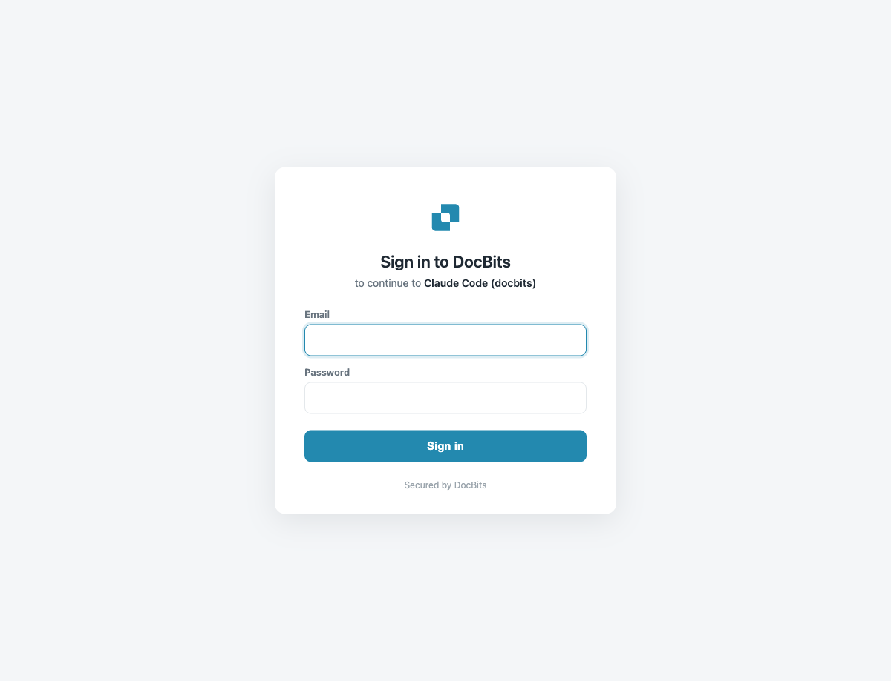
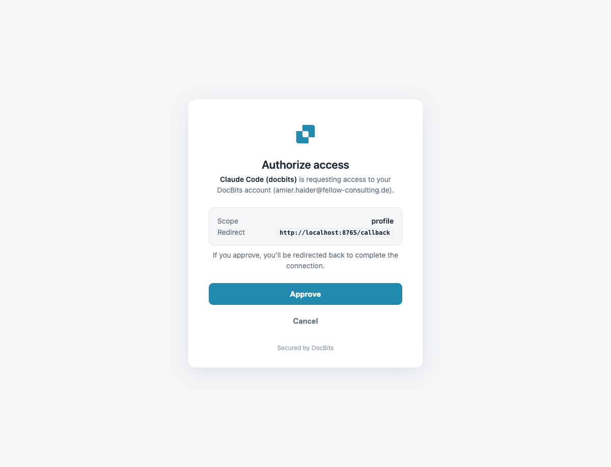

# Setup & Configuration

Connecting an AI assistant to DocBits MCP takes one command, then a one-time sign-in. The recommended way to sign in is **OAuth** — the same DocBits login you already use, in your browser. For automation you can connect with an API key instead.

## 1. Pick your endpoint

The MCP server lives on the DocBits API host. Use the host for **your region (EU or US)**:

| Environment | EU endpoint | US endpoint |
|-------------|-------------|-------------|
| Production | `https://eu.api.docbits.com/v3/mcp` | `https://us.api.docbits.com/v3/mcp` |
| Sandbox | `https://eu.sandbox.api.docbits.com/v3/mcp` | `https://us.sandbox.api.docbits.com/v3/mcp` |


`api.docbits.com` is the single endpoint customers use. Always pick the **region your organization lives in** (EU or US) — the MCP automatically points the login at the matching auth server, you do not configure it separately. The examples below use the EU production host; swap in your own.


## 2. Sign in with OAuth (recommended)

OAuth is the easy path — no secrets to copy. After you add the server, the **first connection opens the DocBits login in your browser**, you approve a consent screen, and the client is connected.

**What you'll see, for every client:**

1. The client opens the DocBits login page in your browser.
2. You sign in with your DocBits account (if you are already signed in to the DocBits web app, the session is reused — no re-login).
3. You approve the consent screen ("Authorize access").
4. The browser hands the client a token and the connection is live.

OAuth issues a short-lived access token (8 h) plus a refresh token (30 days), so the client refreshes automatically and stays connected — **you only log in once.**


**You must be signed in to DocBits — your existing session is reused.** The MCP login does not ask you to log in again if your browser already has a DocBits session. If you are already signed in to the DocBits web app, you go **straight to the consent screen**. If you are not signed in, the DocBits sign-in page appears first; after signing in once, the session carries over to the MCP automatically.


<figure><figcaption><p>Not signed in yet — the branded DocBits sign-in page (you only see this if your browser has no DocBits session)</p></figcaption></figure>

<figure><figcaption><p>Already signed in — the session is reused and you go straight to the consent screen. Approve to connect; what the client requests (scope and redirect) is shown.</p></figcaption></figure>



```bash
# 1) add the server
claude mcp add --transport http docbits https://eu.api.docbits.com/v3/mcp

# 2) sign in (opens browser → DocBits login + consent → connected)
claude mcp login docbits
```

`claude mcp login docbits` is the OAuth step. After it succeeds, confirm by asking Claude: *"check the DocBits API health"*.



```bash
gemini mcp add --transport http docbits https://eu.api.docbits.com/v3/mcp
```

Gemini CLI discovers the OAuth server automatically. The **first time** it uses the server it opens the DocBits login in your browser (dynamic client registration + token management are handled for you). Approve consent and you're connected. You can re-trigger sign-in from the `/mcp` menu in Gemini if needed.



```bash
codex mcp add docbits \
  --url https://eu.api.docbits.com/v3/mcp \
  --oauth-resource https://eu.api.docbits.com/v3/mcp
```

The `--oauth-resource` flag tells Codex to run the OAuth login for this server. On first use Codex opens the DocBits login in your browser; approve consent and you're connected.



## 3. Connect with an API key (automation)

For headless agents, CI, or any environment without a browser, skip OAuth and pass your organization API key as the `X-API-KEY` header.



```bash
claude mcp add --transport http docbits https://eu.api.docbits.com/v3/mcp \
  --header "X-API-KEY: <your-api-key>"
```



Add to `~/.gemini/settings.json`:

```json
{
  "mcpServers": {
    "docbits": {
      "httpUrl": "https://eu.api.docbits.com/v3/mcp",
      "headers": { "X-API-KEY": "<your-api-key>" }
    }
  }
}
```



Add to `~/.codex/config.toml`:

```toml
[mcp_servers.docbits]
url = "https://eu.api.docbits.com/v3/mcp"
http_headers = { "X-API-KEY" = "<your-api-key>" }
```

Or keep the key out of the file and read it from the environment:

```toml
[mcp_servers.docbits]
url = "https://eu.api.docbits.com/v3/mcp"
env_http_headers = { "X-API-KEY" = "DOCBITS_API_KEY" }
```



## How the OAuth login works (under the hood)

DocBits implements the standard **MCP OAuth 2.1** flow, so any compliant client connects without manual configuration:

1. The client calls the MCP endpoint and gets a `401` with a `WWW-Authenticate` header pointing to the protected-resource metadata.
2. It reads `/.well-known/oauth-protected-resource`, which names the DocBits auth server.
3. It reads the auth server's metadata and **registers itself** dynamically (RFC 7591) — no client secret needed.
4. Your browser opens the DocBits login + consent. If you are already logged in to the web app, the session is reused.
5. The client exchanges the authorization code (PKCE) for an access token + refresh token and calls the MCP.


Logging out of the DocBits **web app does not disconnect the MCP** — the MCP holds its own tokens and keeps working until the refresh token expires (30 days) or you remove the server from your client.


## Troubleshooting

| Symptom | Cause / fix |
|---------|-------------|
| Login page never opens | Confirm the endpoint host/region is correct and reachable; some headless environments cannot open a browser — use an API key instead. |
| `401` after connecting | Token expired and no refresh token (API-key mode never refreshes) — reconnect / re-login. |
| Tools missing | Your user/API key may lack permission for those features; check your DocBits role. |
| Wrong data / region | Make sure you used **your** region's endpoint (EU vs US). |
