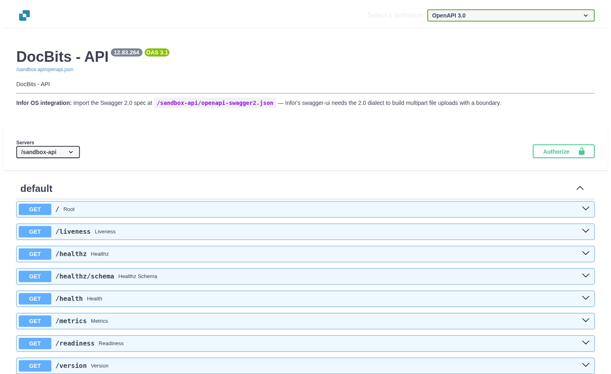
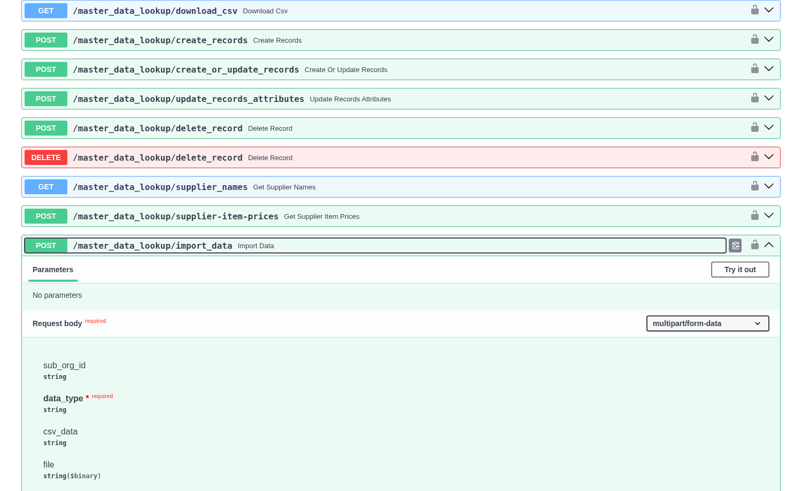
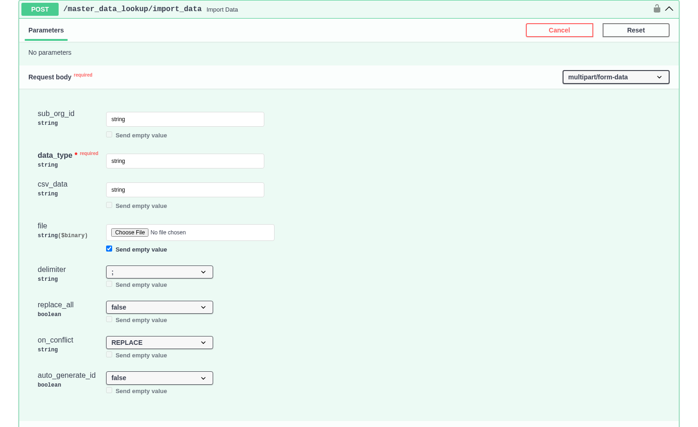
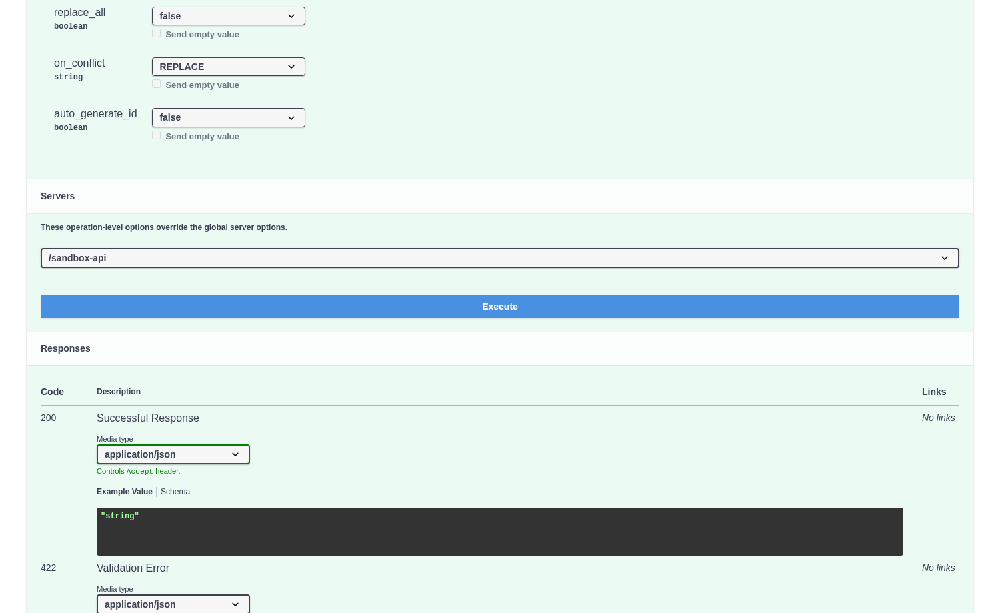

# Importing Supplier and Purchase Order Data into DocBits from CSV Files

## Overview

This page explains how to import supplier or purchase order data from a CSV file through the DocBits API form. The screenshots show the **Sandbox** API with empty fields; no data was imported while preparing this guide.

**Important:** Before importing any data, it is crucial to **review the .csv file thoroughly** to ensure data accuracy and proper configuration. Importing incorrect data can lead to inconsistencies. Refer to the [**CSV Specifications for Purchase Order**](importing-supplier-and-purchase-order-data-into-docbits-from-csv-files.md#csv-specifications-for-purchase-order) or [**CSV Specifications for Supplier**](importing-supplier-and-purchase-order-data-into-docbits-from-csv-files.md#csv-specifications-for-supplier) sections for details on required and optional fields. If required fields are missing, the import process will fail.

**Validation:** Always verify that your .csv file contains all the necessary columns as outlined in the respective specifications section before attempting the import.

## General requirements

**Date Format:**

All dates provided in the .csv sheet **must** adhere to the following format:

YYYY-MM-DD HH:MM:SS

**Required Fields:**

For both Supplier and Purchase Order imports, all columns marked as "Required" in their respective specifications **must exist in the .csv file and must contain a value in each row**. If any required field is missing or empty for a row, the import process will fail.

### CSV Specifications for Purchase Order

**Fields which are Required** - (column with name must exist & must contain data)

* `purchase_order_number`

**Fields which can be included**

* `warehouse_id`
* `location_id`
* `supplier_id`
* `supplier_name`
* `order_date`
* `requested_shipment_date`
* `promised_delivery_date`
* `payment_terms_code`
* `total_amount`
* `buyer_contact_id`
* `buyer_contact_name`
* `order_last_modified_by`
* `order_last_modified_on`
* `ship_to_party_id`
* `ship_to_party_name`
* `ship_to_address_id`
* `disponent_id`
* `disponent_name`
* `extended_amount`
* `extended_base_amount`
* `extended_report_amount`
* `canceled_amount`
* `canceled_base_amount`
* `canceled_reporting_amount`
* `geo_code`
* `preview_path`
* `type_code`
* `type_description`
* `custom_field_1`
* `custom_field_2`
* `custom_field_3`
* `custom_field_4`
* `custom_field_5`
* `status`
* `line_number`
* `sub_line_number`
* `item_id`
* `supplier_item_id`
* `description`
* `note`
* `quantity`
* `open_quantity`
* `confirmed_quantity`
* `received_quantity`
* `received_base_mou_quantity`
* `promised_delivery_date`
* `requested_ship_date`
* `unit_code`
* `unit_code_price`
* `unit_price`
* `unit_price_per`
* `extended_amount`
* `total_amount`
* `currency`
* `status`
* `buyer_id`
* `buyer_name`
* `geo_code`
* `delivery_method`

### CSV Specifications for Supplier

**Fields which are Required** - (column with name must exist & must contain data)

* `customer_number`
* `supplier_number`
* `supplier_name`
* `country_code`

**Fields which can be included**

* `address_1`
* `address_2`
* `address_3`
* `address_4`
* `town_city`
* `zip_code`
* `supplier_phone`
* `supplier_vat`
* `payment_term_id`
* `payment_method_code`
* `buyer_person_reference_id`
* `buyer_person_reference`
* `supplier_category`
* `supplier_group`
* `discount_term`
* `discount_term_description`
* `bank_id`
* `custom_field_1`
* `custom_field_2`
* `custom_field_3`
* `custom_field_4`
* `custom_field_5`
* `custom_field_6`
* `custom_field_7`
* `custom_field_8`
* `custom_field_9`
* `custom_field_10`
* `status`
* `account_number`
* `financial_partner_id`
* `financial_partner_name`
* `iban`
* `currency`

## Open the import form

1. Open the API documentation for the environment you intend to use: [Sandbox](https://sandbox.api.docbits.com/docs) for a trial run or [Production](https://api.docbits.com/docs) for live data. The screenshots below show Sandbox. Check the **Servers** selector before submitting anything.
2. Select **Authorize**. Use the API key for the target organization from DocBits [Settings → Integration](../administration-and-setup/settings/global-settings/integration/README.md). The key identifies the organization for this request. Keep the key private; the screenshots intentionally show no credential.
3. Use your browser's find function to locate `POST /master_data_lookup/import_data` under **master data lookup**. Expand **Import Data**, then select **Try it out**. **Cancel** leaves edit mode; **Reset** clears the form.

<figure><figcaption>
Choose the correct environment and authorize with that organization's key.
</figcaption></figure>

<figure><figcaption>
Open Import Data and select Try it out.
</figcaption></figure>

## Fill in the CSV request

The form uses **multipart/form-data**. For an ordinary CSV file import, use these fields:

| Field | What to enter |
| --- | --- |
| `data_type` | Required. Enter `supplier` or `purchase_order` to match the file. |
| `file` | Select the CSV file. Leave `csv_data` empty when uploading a file. |
| `sub_org_id` | Optional. Leave it unset for the organization selected by the API key; enter a sub-organization ID only when you intend to import there. |
| `delimiter` | Choose the separator actually used in the file. The Sandbox form currently shows `;` by default; choose `,` for a comma-separated file. |
| `replace_all` | Leave at `false` for a normal import. Setting it to `true` requests replacement of existing data for this data type and organization; use it only when that is intended. |
| `on_conflict`, `auto_generate_id` | The form shows `REPLACE` and `false` by default. Keep these defaults unless your integration owner has verified a different setting for your import. |

Check the first rows of the CSV in a text editor to confirm the delimiter and the [required columns](#csv-specifications-for-purchase-order) or [supplier columns](#csv-specifications-for-supplier). Do not put an API key or customer data into screenshots or Jira tickets.

<figure><figcaption>
Choose the file and check the separator and replacement setting.
</figcaption></figure>

## Submit and check the result

Review the environment, organization, `data_type`, file, delimiter and `replace_all` once more. **Execute** sends the import request; the response appears below the form. A successful HTTP response alone does not prove every CSV row is correct, so check the imported supplier or purchase order records in DocBits afterward. For purchase orders, see the [Purchase Order Dashboard](../end-user-and-partner-section/end-user-section/purchase-order-dashboard.md).

<figure><figcaption>
Execute submits the request; inspect the response and the resulting records.
</figcaption></figure>
