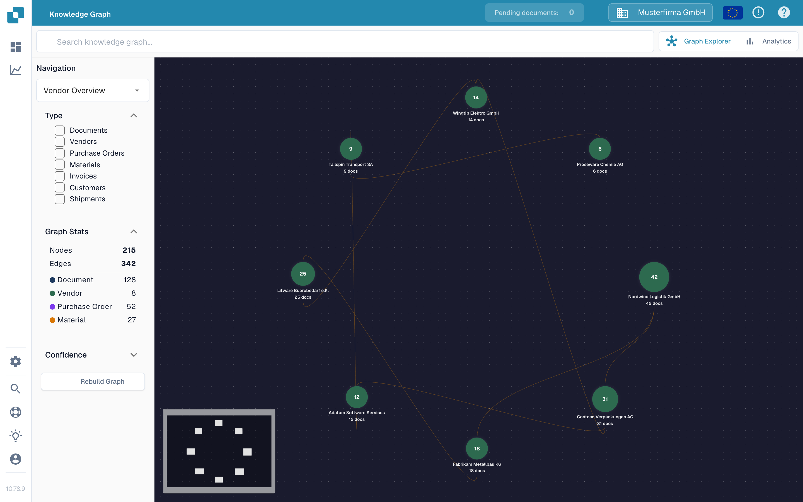

# Knowledge Graph Explorer

The Knowledge Graph Explorer helps you see connections between vendors, documents, purchase orders, and other records. Use it when you want to follow a relationship or check how many connected items are available. The example below shows an empty graph in the English Sandbox test organization.

<figure><figcaption>
An empty graph has zero nodes and edges. Search for an item or rebuild the graph to get started.
</figcaption></figure>

## Get started

1. Open **Knowledge Graph Explorer** in DocBits. Check that the organization shown at the top is the one you intend to inspect.
2. If the center says **Search for a node or compute the graph to get started**, choose **Rebuild Graph** and wait for the progress message to finish. This prepares the graph data; it can take time. If the organization has no matching relationships yet, **Nodes** and **Edges** can remain at zero.
3. Enter a name or other search term in **Search knowledge graph** and press Enter or select the search icon. When several results appear, choose the one you need. A single result opens its graph directly.
4. Select a node to see its details. Close the detail panel with **X** when you want to return to the graph.

## Choose what you see

| Control | What it does |
| --- | --- |
| **Navigation** | Switch between **Vendor Overview** (connected vendors), **Vendor Intelligence** (a vendor table), **Document Journey** (steps and variants in document processing), and **Anomalies** (unusual relationships). |
| **Type** | Select the kinds of items to focus on, such as Documents, Vendors, Purchase Orders, or Invoices. Selected types also limit search results. |
| **Graph Stats** | Shows the number of nodes (items) and edges (connections) currently available. Expand or collapse this section as needed. |
| **Confidence** | Open this section to set the minimum relationship confidence when expanding a node. A higher value narrows the displayed connections. |
| **Rebuild Graph** | Starts a new graph computation. Wait for its progress to finish before searching again. |
| **Graph Explorer / Analytics** | Switch between the interactive graph and summary charts. Analytics shows counts and charts when graph data exists; an empty graph also leaves Analytics empty. |

If you need to resolve a difference between an invoice and its order, continue with the [Purchase Order Matching Screen](../end-user-and-partner-section/end-user-section/purchase-order-matching/README.md). For broader metrics outside the graph, see the [Analytics Dashboard](../administration-and-setup/analytics-dashboard.md).
