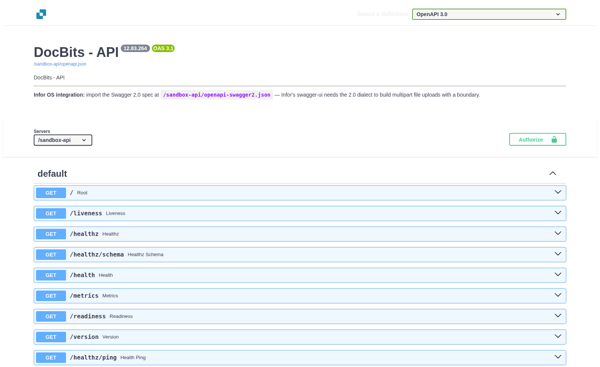
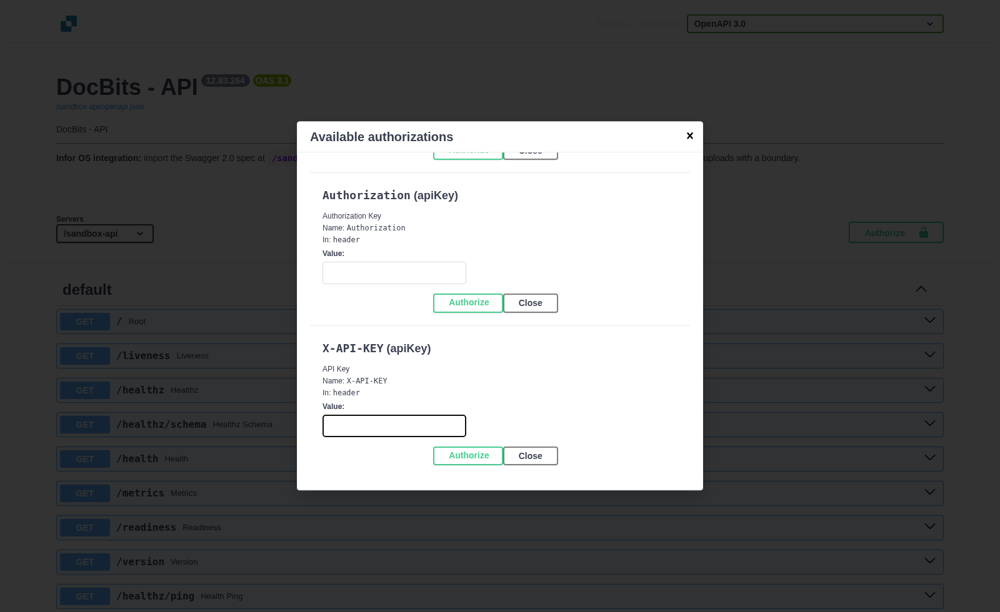

# Postman for DocBits

Postman can send HTTP requests to the DocBits API. Use it first with a read-only request in **Sandbox**. Ask a DocBits administrator for the organisation and permissions needed for other endpoints. Do not put an API key, user data or invoice content in a shared Postman collection or a screenshot.

## 1. Choose the matching environment

The current interactive API documentation is available at [Sandbox API](https://sandbox.api.docbits.com/docs) and [Production API](https://api.docbits.com/docs). Open the documentation for the same environment as the DocBits organisation you intend to use. The old `api.polydocs.io` examples on this page were outdated; do not copy their URLs. The API documentation shows the current paths, request fields and response shapes.

In Postman, create a private workspace or collection and an environment variable named `base_url`. Set it to `https://sandbox.api.docbits.com` for Sandbox. Keep the production URL in a separate Postman environment so a test request cannot accidentally target live data. Postman's [environment guide](https://learning.postman.com/docs/use/send-requests/variables/environment-variables) explains local values.

## 2. Send a safe first request

Create a request with method **GET** and URL `{{base_url}}/version`. Select **No Auth** for this first request and choose **Send**. The Sandbox endpoint was checked for this update: it returned HTTP 200 with a version and health status, without modifying data. If it fails, confirm the selected Postman environment and URL before adding credentials.

## 3. Add credentials only for an endpoint that needs them

Open the desired endpoint in the interactive API documentation and check its **Authorize** and operation details. The current specification defines header schemes named **X-ORG-ID**, **Authorization** and **X-API-KEY**. These are different headers; use only the values and schemes required for the particular operation and organisation. Do not assume that one global API key works for every operation.

If an operation uses the API key, configure Postman **Authorization → API Key** with key `X-API-KEY`, value from a private [Postman Vault secret](https://learning.postman.com/docs/use/postman-vault/use-vault-secrets), and **Add to: Header**. If the operation also requires the organisation ID, add `X-ORG-ID` in the request's **Headers** tab. Use the exact value for the target organisation and environment. An `Authorization` header can represent a separate auth mechanism; add it only when the endpoint's documentation and your administrator require it. Never paste a real key into a screenshot or Jira ticket.

## 4. Build a request from the live API specification

Choose the operation and HTTP method in the matching environment's documentation. Copy its **path**, required parameters and body schema into Postman. Start with a **GET** operation that only reads data. For **POST** or **PUT**, verify the request body and expected effect with an administrator. **DELETE** can remove data; use it only for a deliberate, approved task. For a file upload, follow the operation's current request schema and choose Postman's matching body type, such as **form-data** when the schema says multipart. Do not reuse screenshots of an older API version to decide field names.

Check the status code and response body after each request. A response from `/version` proves the API is reachable; it does not prove that an authenticated organisation request or a document upload works.

**Verification scope:** The current Sandbox API documentation, its blank authorization dialog and the read-only `/version` response were checked. No real API key was entered; authenticated reads, uploads, user creation, updates and deletes were not executed. The old Postman and API screenshots were removed because their versions and example data could not be verified.
