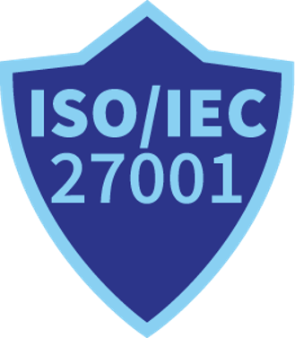
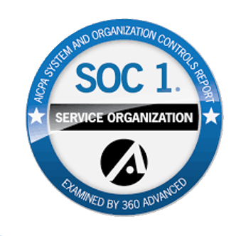
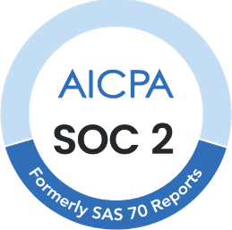

# Sertifikacije

DocBits vodi kompanija **Fellowpro AG** u okviru sveobuhvatnog programa informacione bezbednosti, privatnosti i internih kontrola. Sertifikacije navedene u nastavku se svake godine nezavisno revidiraju; klijenti mogu da preuzmu zvanične revizorske izveštaje direktno sa ove stranice.


Treba vam sertifikat za tim za nabavku, bezbednost ili usklađenost? Svi izveštaji povezani na ovoj stranici su potpisani revizorski dokumenti — NDA nije potreban. Za pitanja o obuhvatu, kontrolama ili predstojećim revizijama, kontaktirajte **compliance@fellowpro.com**.


## 1. ISO/IEC 27001

<figure><figcaption></figcaption></figure>

Ovaj međunarodni standard definiše zahteve za uspostavljanje, sprovođenje, održavanje i kontinuirano unapređivanje Sistema menadžmenta informacionom bezbednošću (ISMS). Pomaže organizacijama da štite podatke na sistematičan i isplativ način, uključujući procese za upravljanje rizicima i kontrole informacione bezbednosti.

**Uticaj na klijente:** Osigurava da DocBits poštuje najviše standarde informacione bezbednosti, pružajući sigurnost da su osetljivi podaci dobro zaštićeni.

**Poslednja revizija:** Nadzorna revizija SA1, 2025 — ISMS kompanije Fellowpro AG.



## 2. SOC 1 (Service Organization Control 1)

<figure><figcaption></figcaption></figure>

SOC 1 izveštaji su namenjeni organizacijama koje treba da dokažu efektivnost internih kontrola nad finansijskim izveštavanjem. Posebno su relevantni za pružaoce usluga koji utiču na finansijsko izveštavanje svojih klijenata.

**Relevantnost za DocBits:** Pokazuje našu posvećenost održavanju strogih internih kontrola nad finansijskim podacima, pružajući klijentima sigurnost u pogledu pouzdanosti naših procesa.

**Poslednja revizija:** SOC 1 Type II — izveštajni period 2025.



## 3. SOC 2 (Service Organization Control 2)

<figure><figcaption></figcaption></figure>

SOC 2 se fokusira na kontrole organizacije za pružanje usluga koje su relevantne za bezbednost, dostupnost, integritet obrade, poverljivost i privatnost podataka. Ključan je za tehnološke i cloud kompanije koje rukuju osetljivim informacijama.

**Vrednost za klijente:** Pruža nezavisnu validaciju da je DocBits uveo efektivne kontrole za zaštitu podataka klijenata, garantujući pouzdanost našeg softvera i usluga.

**Poslednja revizija:** SOC 2 Type II — izveštajni period 2026.



## 4. GDPR (General Data Protection Regulation) Compliance

<figure><figcaption></figcaption></figure>

GDPR je uredba iz prava EU o zaštiti podataka i privatnosti u Evropskoj uniji i Evropskom ekonomskom prostoru. Takođe se bavi prenosom ličnih podataka izvan zona EU i EEP.

**Sigurnost za klijente:** Usklađenost sa GDPR-om osigurava da DocBits obrađuje lične podatke u skladu sa propisima EU, štiteći privatnost korisnika i pridržavajući se strogih smernica za rukovanje podacima.

**Poslednja revizija:** Nezavisni izveštaj o reviziji GDPR, 2025.



---

Za dodatnu dokumentaciju — DPA šablone, liste sub-procesora, sažetke penetracionog testiranja ili bezbednosne upitnike — obratite se na **compliance@fellowpro.com** ili svom kontaktu u DocBits Customer Success timu.
