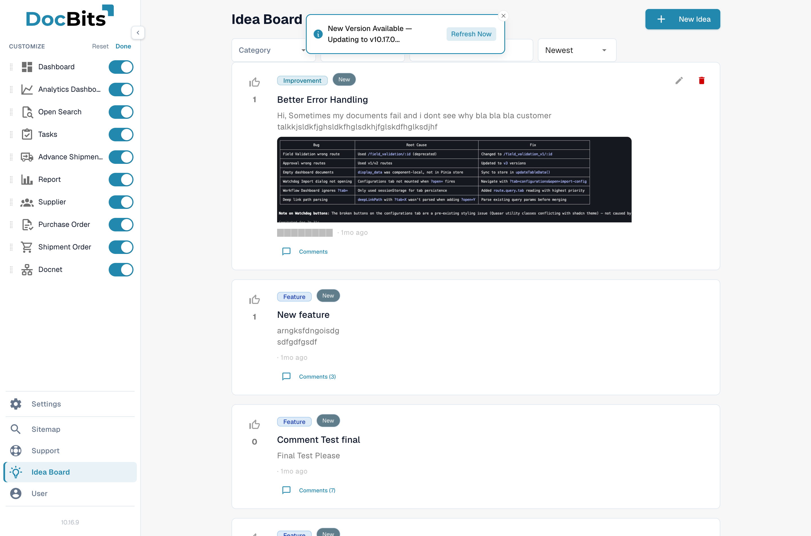

# Konfigurowalny Pasek Boczny

Pasek boczny można przeorganizować, aby pasował do twojego sposobu pracy. Przeciągaj wpisy w wybranej kolejności, ukryj te, których nigdy nie używasz, i przypnij na górę te, które otwierasz najczęściej. Twój układ jest zapamiętywany przy następnym logowaniu.

## Jak otworzyć

Rozwiń pasek boczny (w trybie mini kliknij przełącznik na górze), przewiń do dołu i kliknij **Dostosuj**. Pasek boczny wchodzi w tryb edycji.

<figure><figcaption>
W trybie edycji każdy wpis pokazuje uchwyt do przeciągania i przełącznik widoczności.
</figcaption></figure>

## Zmiana kolejności wpisów

W trybie edycji każdy wpis pokazuje po lewej uchwyt do przeciągania (ikona sześciu kropek). Kliknij i przeciągnij wpis na nową pozycję. Inne wpisy odsuwają się, aby zrobić miejsce. Zwolnij, aby upuścić.

Kolejność jest osobna dla każdego użytkownika. Inne osoby w twojej organizacji widzą własną kolejność.

## Ukrywanie wpisów

Każdy wpis ma po prawej przełącznik widoczności. Wyłącz go, aby ukryć wpis z paska bocznego. Ukryte wpisy są w trybie edycji wyszarzone, aby można je było później ponownie włączyć.

Ukrycie wpisu usuwa go z paska bocznego — strona pod spodem pozostaje dostępna przez [Globalne Szybkie Wyszukiwanie](global-quick-search.md), [Mapę Witryny](sitemap.md) lub bezpośredni adres URL.

## Przypinanie na górze

Niektóre wpisy można przypinać. Przypięte wpisy zawsze pozostają na górze paska bocznego, niezależnie od pozycji w kolejności przeciągania. Użyj tego dla jednego lub dwóch ekranów, które otwierasz wiele razy dziennie.

## Zapisywanie i resetowanie

* **Gotowe** — kończy tryb edycji i stosuje nową kolejność, widoczność oraz przypięte wpisy.
* **Resetuj** — czyści wszystkie dostosowania i przywraca domyślny pasek boczny.

Twoje preferencje są zapisywane automatycznie po naciśnięciu **Gotowe** i utrzymują się między sesjami.

## Nowe funkcje

Gdy w przyszłej wersji do DocBits zostanie dodana nowa funkcja, dołącza do końca twojego paska bocznego z domyślną widocznością. Zmień jej położenie lub ukryj ją w trybie edycji, aby pasowała do twojej rutyny.

<mark>Funkcje, do których nie masz uprawnień, nigdy nie pojawiają się na liście dostosowania — nie możesz przypadkowo włączyć czegoś, czego twoja rola nie potrafi otworzyć.</mark>
