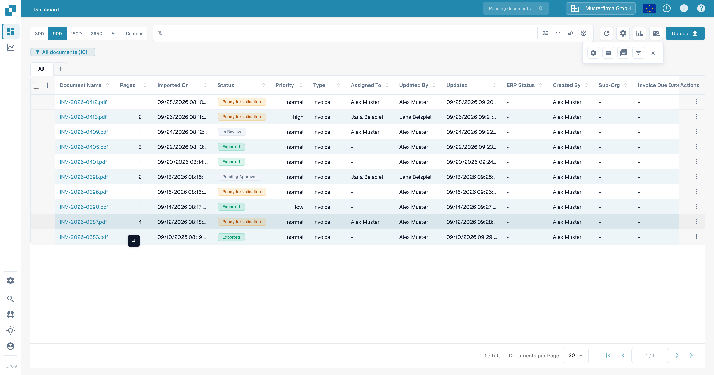
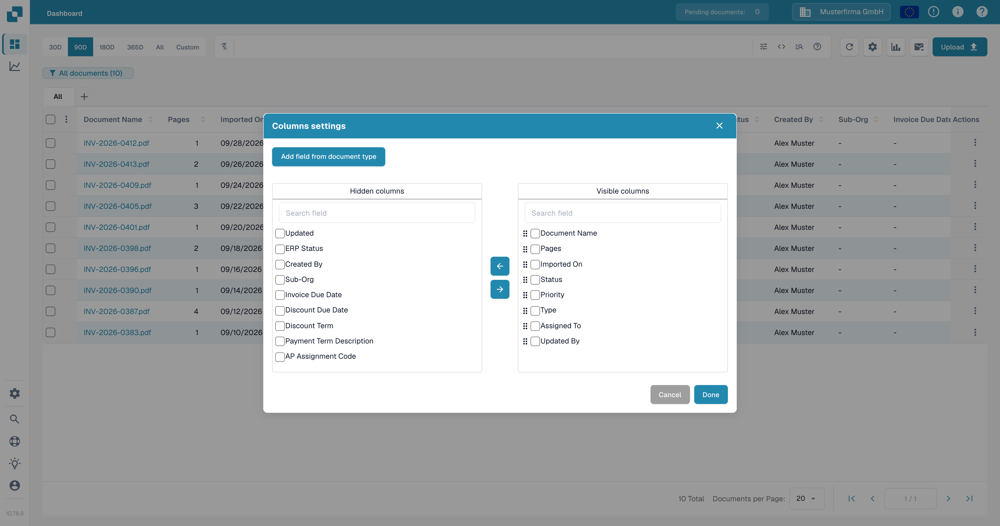

# Change Document Columns

**From the Dashboard, click on the Advanced Settings icon as shown below:**

<figure><figcaption></figcaption></figure>

The following menu will then be displayed:

<figure><figcaption>
The advanced settings menu.
</figcaption></figure>

Select the button labeled “Set dashboard columns for organization” and a list of all the column names will be shown.

From this menu, you can select the column names and use the arrows to add and remove the columns you desire.

<figure><figcaption>
Move columns between hidden and visible columns.
</figcaption></figure>

<figure><figcaption></figcaption></figure>

You can set the order of the columns by clicking on the dots next to the column name and dragging them to the appropriate position.

Another option also allows you to add fields of a document type:

<figure><figcaption></figcaption></figure>

<figure><figcaption>
Select document type field window
</figcaption></figure>

Here you can choose from the different document types:

<figure><figcaption></figcaption></figure>

For each document type there are different fields that you can add:

<figure><figcaption>
Select document type field window
</figcaption></figure>

Select the fields you need and click "Add to visible Columns", they will then appear in the column settings.

<figure><figcaption></figcaption></figure>
