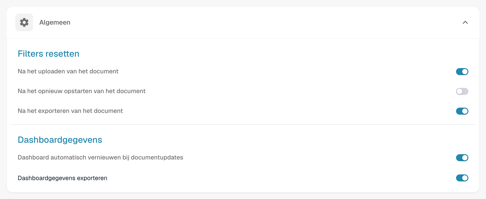

# Dashboard-Werkzeuge

Rechts neben der Suchleiste finden Sie einige Dashboard-Werkzeuge.

<figure><figcaption></figcaption></figure>

## Tabelle aktualisieren

Klicken Sie auf diese Schaltfläche, um das Dashboard zu aktualisieren und die aktuellsten Daten und Status zu laden.

<figure><figcaption></figcaption></figure>

## Erweiterte Einstellungen

Klicken Sie auf das Zahnradsymbol, um das Menü „Erweiterte Einstellungen“ zu öffnen.

<figure><figcaption></figcaption></figure>

Im Menü „Erweiterte Einstellungen“ stehen die folgenden Optionen zur Verfügung:

### Weitere Einstellungen

Verwenden Sie diese Schaltfläche, um auf die Admin-Einstellungen für das Dashboard zuzugreifen. Die vollständige Dokumentation zu diesen Einstellungen finden Sie [hier](../../../administration-and-setup/settings/global-settings/dashboard/).

<figure><figcaption></figcaption></figure>

### Tastenkombinationen

Verwenden Sie diese Schaltfläche, um alle Tastenkombinationen für das Dashboard anzuzeigen. Detaillierte Erläuterungen zu den einzelnen Tastenkombinationen finden Sie [hier](keyboard-shortcuts.md).

<figure><figcaption></figcaption></figure>

### Importprotokoll

Verwenden Sie diese Schaltfläche, um eine Tabelle zu öffnen, die alle kürzlich per E-Mail importierten Dokumente zusammen mit relevanten Informationen zu jedem einzelnen anzeigt.

<figure><figcaption></figcaption></figure>

<figure><figcaption></figcaption></figure>

Sie können die Protokolle nach Betreff oder Absender filtern, Spalten durch Klicken auf die Spaltenüberschriften auf- oder absteigend sortieren und sie per Drag-and-drop neu anordnen.

### Tabellenspalten für die Organisation festlegen

<figure><figcaption></figcaption></figure>

Klicken Sie auf diese Schaltfläche, um ein Menü zu öffnen, in dem Sie die Sichtbarkeit der Dashboard-Spalten verwalten können. Wählen Sie Spaltennamen aus und verwenden Sie die Pfeile, um sie zur Dashboard-Ansicht hinzuzufügen oder daraus zu entfernen. Klicken Sie auf **Fertig**, um Ihre Änderungen zu speichern.

<figure><figcaption></figcaption></figure>

Sie können die Spaltenreihenfolge festlegen, indem Sie auf die Punkte neben einem Spaltennamen klicken und ihn an die gewünschte Position ziehen.

#### Felder aus einem Dokumenttyp als Spalten im Dashboard hinzufügen

Sie haben außerdem die Möglichkeit, zusätzliche Spalten aus bestimmten Feldern bestimmter Dokumenttypen hinzuzufügen, um Ihre Dashboard-Ansicht anzupassen. Klicken Sie dazu einfach auf **Feld aus Dokumenttyp hinzufügen**.

<figure><figcaption></figcaption></figure>

Wählen Sie einen Dokumenttyp aus, um zu sehen, welche Felder für den ausgewählten Typ verfügbar sind. Für jeden Dokumenttyp gibt es unterschiedliche Felder, die Sie hinzufügen können. Über die Suchleiste oben können Sie nach einem bestimmten Feld suchen.

<figure><figcaption></figcaption></figure>

Wählen Sie die Felder aus, die Sie als Spalten anzeigen möchten, und klicken Sie dann auf **Zu sichtbaren Spalten hinzufügen**. Die ausgewählten Felder erscheinen als Spalten im Dashboard und zeigen ihre entsprechenden Werte an.

## Dokument scannen

Verwenden Sie diese Schaltfläche, um ein Dokument direkt zu scannen.

<figure><figcaption></figcaption></figure>

<figure><figcaption></figcaption></figure>

Um diese Funktion zu nutzen, muss ein Scanner mit Ihrem System verbunden sein. Wenn ein Scanner verfügbar ist, können Sie ihn auf der rechten Seite auswählen, Ihrem Dokument einen Namen geben und auf **Scannen** klicken. Optional können Sie vor dem Start des Vorgangs die Scaneinstellungen auf der rechten Seite anpassen.

<mark style="color:red;">**Hinweis**</mark>: Diese Funktion muss unter **Einstellungen -> Dokumentenverarbeitung -> Modul -> Dokumenttyp -> Dokumentscan** aktiviert werden.

<figure><figcaption></figcaption></figure>

## Analytik

Wenn Sie auf diese Schaltfläche klicken, wird ein neuer Bereich angezeigt, der die aktuelle Anzahl der Dokumente in jeder Kategorie zeigt.

<figure><figcaption></figcaption></figure>

Klicken Sie auf eine beliebige Kategorie, um die Dokumente nach dieser bestimmten Kategorie zu filtern.

## E-Mail-Import starten

Wenn Sie auf diese Schaltfläche klicken, wird Ihr E-Mail-Posteingang gemäß der E-Mail-Importkonfiguration überprüft und alle neuen Dokumente werden importiert.

<figure><figcaption></figcaption></figure>

## Diese Tabelle exportieren

Verwenden Sie diese Schaltfläche, um alle derzeit im Dashboard angezeigten Dokumente zu exportieren, basierend auf der Anzahl der pro Seite angezeigten Dokumente.\
Sie können die Tabelle als **.csv**- oder **.xlsx**-Datei exportieren.

<figure><figcaption></figcaption></figure>

<mark style="color:red;">**Hinweis**</mark>: Diese Funktion muss unter **Einstellungen -> Globale Einstellungen -> Dashboard -> Allgemein -> Dashboard-Daten exportieren** aktiviert werden.

<figure><figcaption></figcaption></figure>

## Hochladen

Klicken Sie auf diese Schaltfläche, um eine oder mehrere Dateien manuell hochzuladen.

<figure><figcaption></figcaption></figure>

<figure><figcaption></figcaption></figure>

Sie können Dateien entweder per Drag-and-drop in das Pop-up-Fenster ziehen oder auf **Dokumente hochladen** klicken, um sie aus Ihrem Datei-Explorer auszuwählen.

Wenn Sie den Dokumenttyp lieber manuell angeben möchten, anstatt **DocBits** ihn automatisch klassifizieren zu lassen, aktivieren Sie die Option **Klassifizieren als** und wählen Sie den passenden Dokumenttyp aus der Liste aus.

<figure><figcaption></figcaption></figure>

Nachdem Sie Ihre Dateien ausgewählt haben, klicken Sie auf **Hochladen**, um den Upload-Vorgang zu starten.

## Debugging-Modus

Sie können den Debugging-Modus aktivieren, um eine zusätzliche Option zu erhalten.\
Um den Debug-Modus aufzurufen, fügen Sie einfach `?debug=true` zur URL hinzu. Nun sollten Sie eine zusätzliche Option haben.

<figure><figcaption></figcaption></figure>

### Ladezeiten anzeigen

<figure><figcaption></figcaption></figure>

Wenn Sie auf diese Schaltfläche klicken, öffnet sich ein Pop-up-Fenster, das die Ladezeiten für jeden Dienst anzeigt, wobei die Gesamtladezeit unten dargestellt wird.

<figure><figcaption></figcaption></figure>
