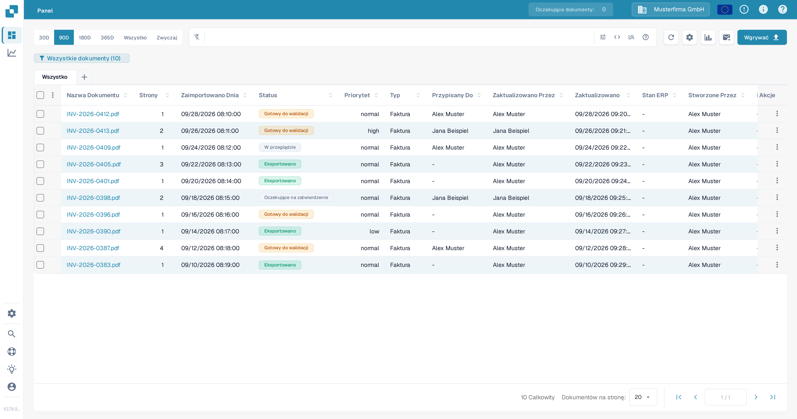
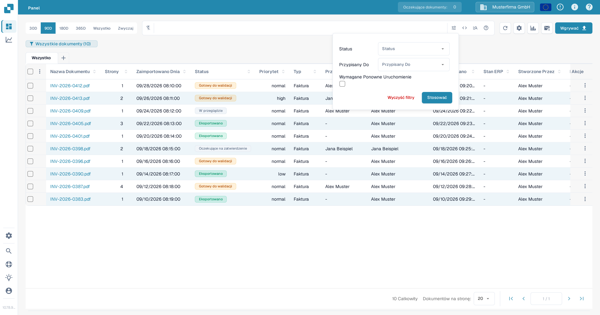
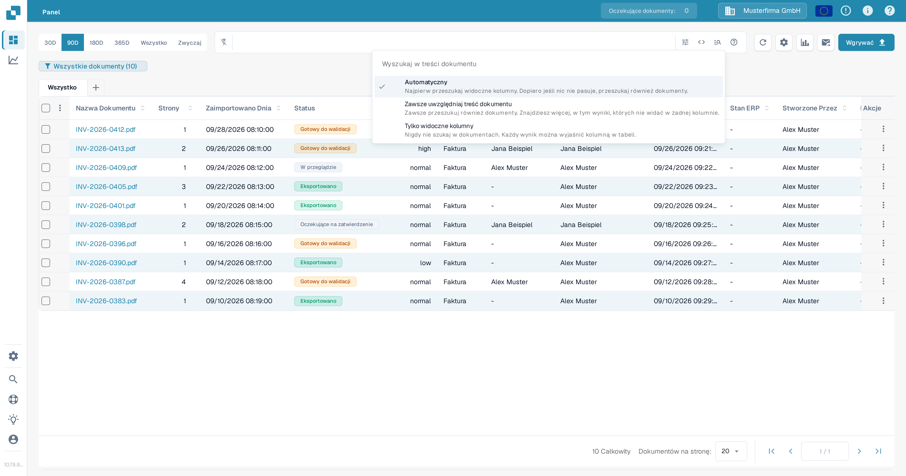
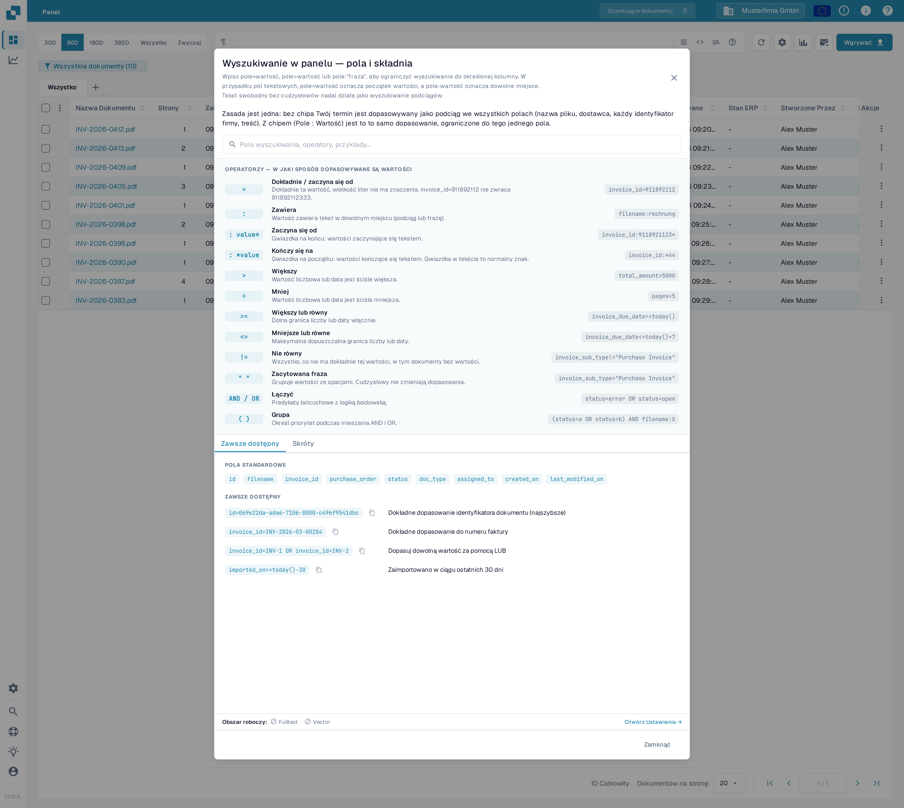
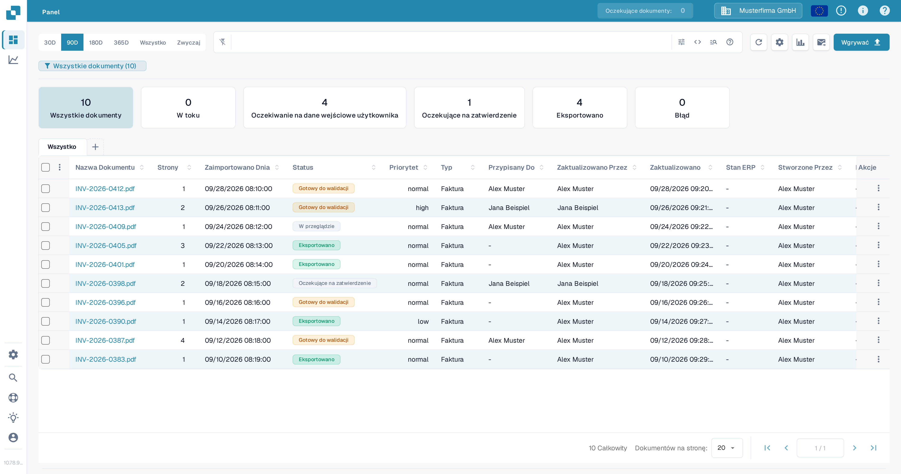
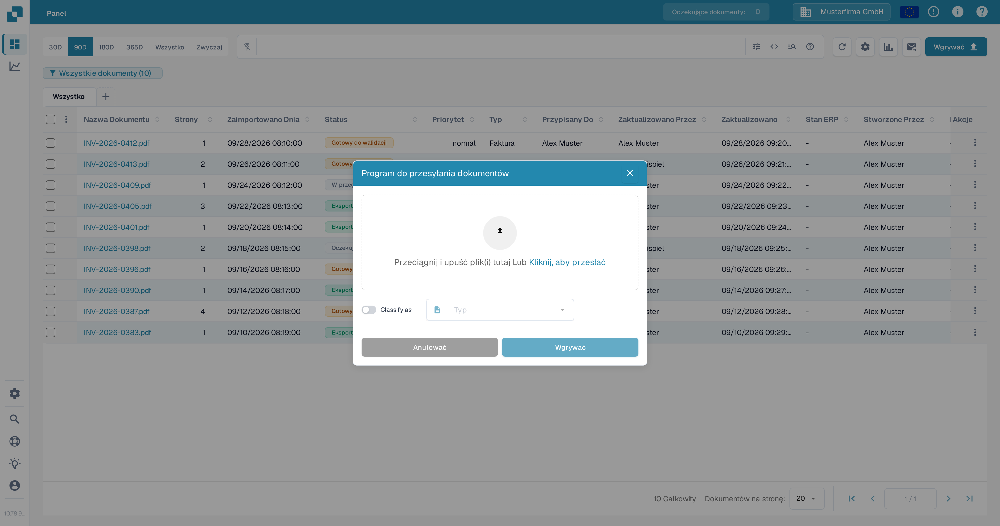
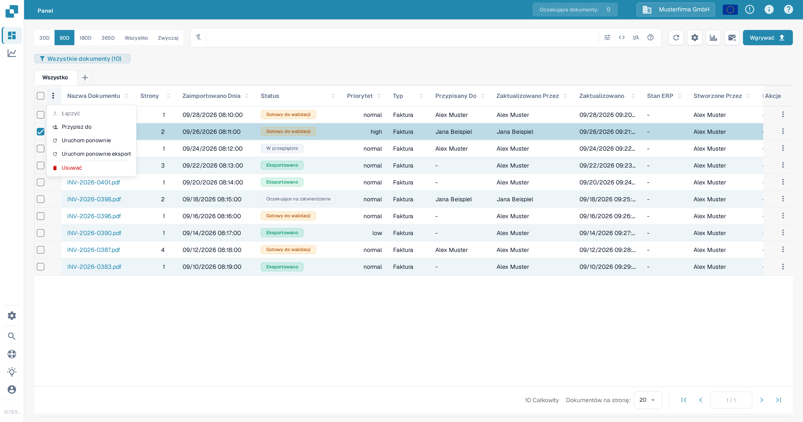
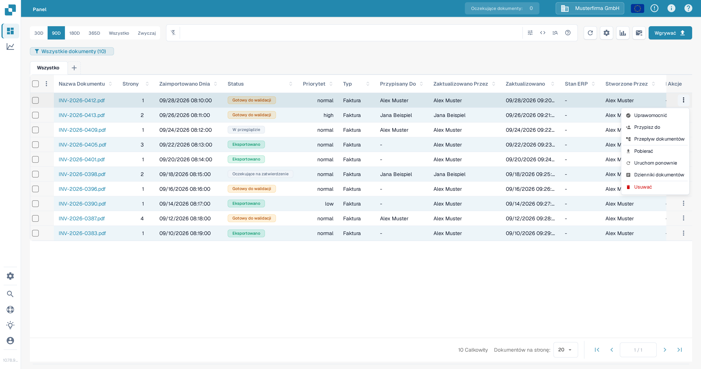

# Narzędzia panelu

Panel to Twoja lista dokumentów. Otwórz dokument, wybierając jego nazwę. Elementy nad tabelą pomagają znajdować dokumenty, zmieniać widok i przesyłać nowe pliki. Niektóre elementy zależą od ustawień organizacji i Twoich uprawnień, dlatego Twój panel może pokazywać mniej przycisków niż w przykładzie poniżej.

<figure><figcaption>
Panel w organizacji testowej w języku polskim.
</figcaption></figure>

## Znajdowanie dokumentów

1. Wybierz po lewej zakres dat: **30D**, **90D**, **180D**, **365D**, **Wszystko** lub **Zwyczaj**. Ogranicza on dokumenty wyświetlane, gdy kontrolki daty są dostępne.
2. Wpisz nazwę lub identyfikator dokumentu w pasku wyszukiwania. Wyszukiwanie obsługuje też zapytania wskazujące pole. Wybierz **?** obok paska wyszukiwania, aby zobaczyć przykłady i dostępne operatory.
3. Wybierz ikonę suwaków w pasku wyszukiwania, aby zawęzić listę według **Status**, **Przypisany Do** lub **Wymagane Ponowne Uruchomienie**, a następnie wybierz **Stosować**. Użyj **Wyczyść filtry**, aby usunąć ten wybór.
4. Wybierz nagłówek kolumny, aby posortować tabelę. Użyj kontrolek stron na dole, aby przechodzić między stronami wyników lub zmienić **Dokumentów na stronę:**.

Ikona na początku pola wyszukiwania otwiera listę dostępnych pól i pokazuje, jakie możliwości wyszukiwania ma Twoja organizacja. Ikona **code** przełącza widok zwykłego wyszukiwania i widok surowej kwerendy; używaj widoku zwykłego, chyba że znasz już składnię kwerend. Ikona lupy otwiera **Wyszukaj w treści dokumentu**: **Automatyczny** najpierw przeszukuje widoczne pola, **Zawsze uwzględniaj treść dokumentu** obejmuje też tekst w plikach, a **Tylko widoczne kolumny** ogranicza trafienia do pól tabeli. Wyszukiwanie w plikach wymaga włączenia odpowiedniej możliwości wyszukiwania dla Twojej organizacji.

<figure><figcaption>
Filtry w pasku wyszukiwania.
</figcaption></figure>

<figure><figcaption>
Wybierz, z czym może zgodzić się proste wyszukiwanie.
</figcaption></figure>

Aby wyszukiwać krok po kroku, zobacz [Szybkie wyszukiwanie](quick-search.md) i [Filtrowanie dokumentów](filtering-documents.md). Panel **?** wyjaśnia zaawansowaną składnię wyszukiwania; nie potrzebujesz jej do prostego wyszukiwania po nazwie.

<figure><figcaption>
Pomoc wyszukiwania w panelu.
</figcaption></figure>

## Odświeżanie i dostosowywanie widoku

- Wybierz kołową strzałkę nad tabelą, aby wczytać listę dokumentów ponownie. Nie uruchamia ona ponownie przetwarzania dokumentów.
- Wybierz koło zębate, aby otworzyć menu ustawień panelu. Znajdziesz w nim skróty klawiaturowe, dziennik importu e-mail oraz zarządzanie widocznymi kolumnami tabeli. Administratorzy mogą dodatkowo widzieć link do ustawień panelu. Zobacz [Skróty Klawiaturowe](keyboard-shortcuts.md) i [Zmiana Kolumn Dokumentu](change-document-columns.md), aby przejść do kolejnych kroków.
- Wybierz wykres słupkowy, aby pokazać **Analityka** nad tabelą. Wybierz kartę kategorii, na przykład **Oczekiwanie na dane wejściowe użytkownika**, aby przefiltrować dokumenty. Wybierz wykres ponownie, aby ukryć karty.
- Wybierz plakietkę zapisanego panelu pod paskiem wyszukiwania, aby przełączyć lub zarządzać własnym panelem. Zobacz [Osobiste Panele](personal-dashboards.md).
- Wybierz **+** obok karty **Wszystko**, aby dodać kartę dla typu dokumentu. W organizacji testowej dostępna jest **Faktura**. Wybierz kartę, aby pokazać dokumenty tego typu.

<figure><figcaption>
Otwórz menu koła zębatego, aby zobaczyć opcje panelu.
</figcaption></figure>

<figure><figcaption>
Karty Analityka nad listą dokumentów.
</figcaption></figure>

## Wgrywanie dokumentów

Wybierz **Wgrywać**. Przeciągnij pliki do **Program do przesyłania dokumentów** lub wybierz **Kliknij, aby przesłać**, aby wybrać je z komputera. Jeśli znasz typ dokumentu, włącz **Classify as** i wybierz typ; w przeciwnym razie zostaw tę opcję wyłączoną, aby dokumenty sklasyfikowano automatycznie. Wybierz **Wgrywać**, aby przesłać pliki. Co dzieje się potem, opisano w [Przegląd Przesłanych Dokumentów](overview-of-uploaded-documents.md).

<figure><figcaption>
Aktualne okno przesyłania dokumentów.
</figcaption></figure>

## Praca na wielu dokumentach

Zaznacz pola wyboru obok dokumentów, które chcesz obsłużyć, a następnie otwórz menu trzech kropek w nagłówku tabeli. W zależności od dokumentów i Twoich uprawnień menu oferuje **Łączyć**, **Przypisz do**, **Uruchom ponownie**, **Uruchom ponownie eksport** i **Usuwać**. Sprawdź zaznaczone wiersze przed wybraniem akcji; **Usuwać** usuwa dokumenty. Aby łączyć pliki, postępuj zgodnie z [Scalanie Dokumentów](document-merging.md).

<figure><figcaption>
Akcje masowe obok pól wyboru tabeli.
</figcaption></figure>

Dla jednego dokumentu otwórz menu trzech kropek na końcu jego wiersza. Oferuje ono akcje takie jak **Uprawomocnić**, **Przypisz do**, **Przepływ dokumentów**, **Pobierać**, **Uruchom ponownie**, **Dzienniki dokumentów** i **Usuwać** — w zależności od dokumentu i Twoich uprawnień. **Uprawomocnić** otwiera dokument do sprawdzenia; **Przepływ dokumentów** pokazuje historię przetwarzania; **Uruchom ponownie** zaczyna przetwarzanie od nowa; **Usuwać** usuwa dokument. Zobacz [Przepływ Dokumentów](document-flow.md) i [Status Dokumentu](document-status.md), zanim zmienisz dokument właśnie przetwarzany.

<figure><figcaption>
Akcje dla jednego dokumentu.
</figcaption></figure>

## Inne przyciski, które może pokazywać Twoja organizacja

- Przycisk z kopertą uruchamia import e-mail według istniejącej konfiguracji importu e-mail organizacji. Zapytaj administratora, jeśli nie masz pewności, czy Twoja skrzynka jest skonfigurowana; wybranie tego przycisku rozpoczyna import.
- **Skanuj dokument** pojawia się tylko, gdy skanowanie dokumentów jest włączone i dostępny jest skaner.
- **Eksportuj tę tabelę** pojawia się tylko, gdy eksport panelu jest włączony. Menu oferuje pliki CSV i Excel. Eksport obejmuje dokumenty aktualnie wyświetlane w tabeli.

Dostępne przyciski mogą różnić się w zależności od szerokości ekranu. Na wąskim ekranie otwórz **Więcej**, aby znaleźć część akcji, które na ekranie komputera wyświetlane są osobno.
