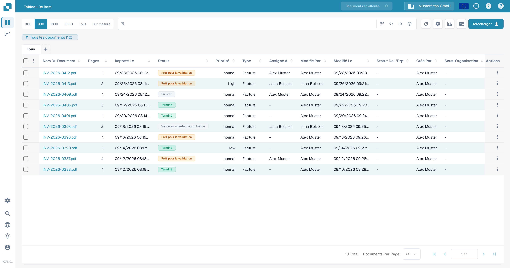
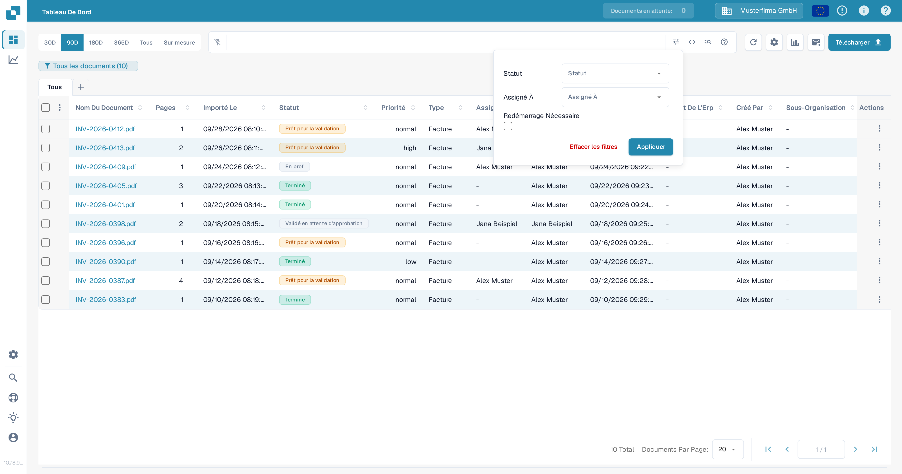
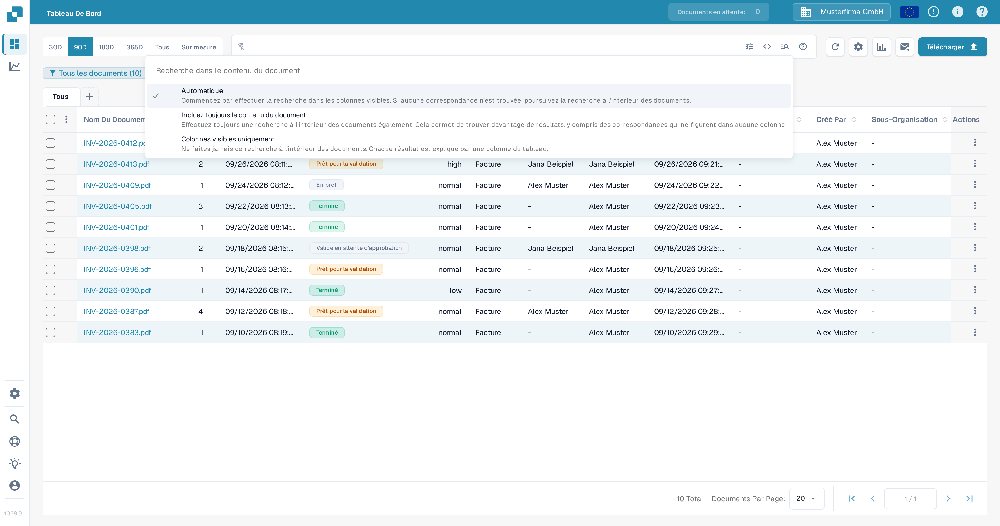
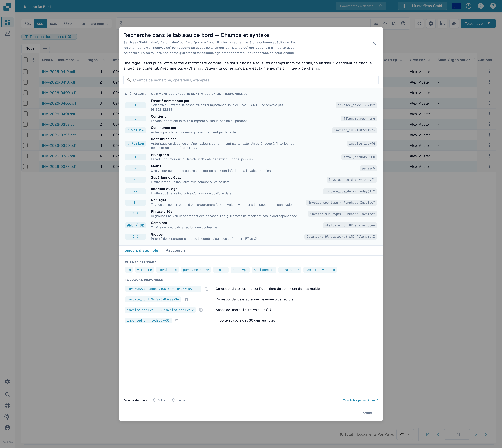
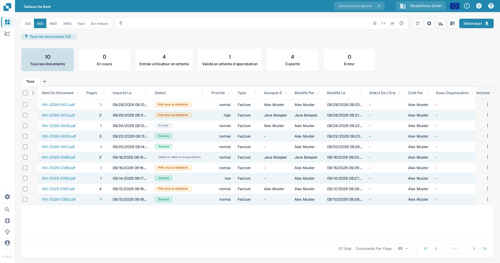
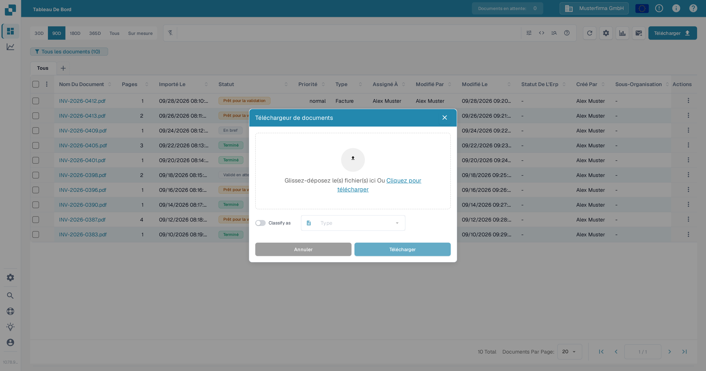
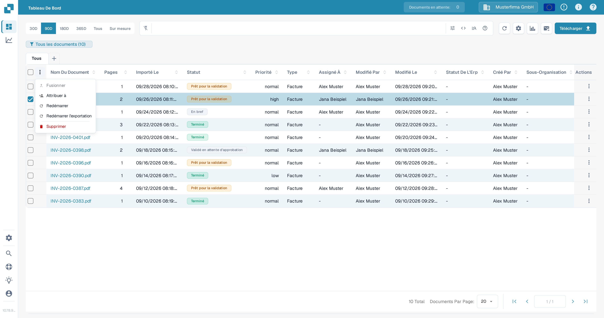
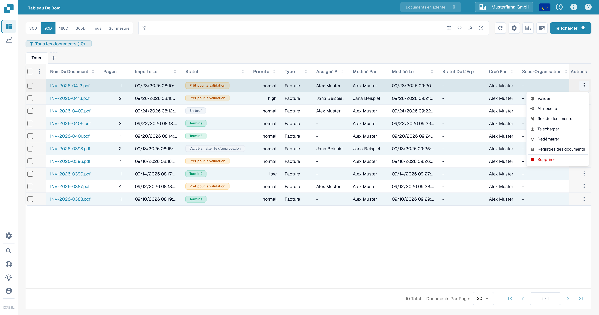

# Outils du tableau de bord

Le tableau de bord est votre liste de documents. Ouvrez un document en sélectionnant son nom. Les commandes situées au-dessus du tableau vous aident à trouver des documents, à modifier ce qui s'affiche et à télécharger de nouveaux fichiers. Certaines commandes dépendent des paramètres de votre organisation et de vos droits, de sorte que votre tableau de bord peut afficher moins de boutons que l'exemple ci-dessous.

<figure><figcaption>Le tableau de bord dans une organisation de test configurée en français.</figcaption></figure>

## Trouver des documents

1. Choisissez une plage de dates à gauche : **30D**, **90D**, **180D**, **365D**, **Tous** ou **Sur mesure**. Cela limite les documents affichés lorsque les commandes de date sont disponibles.
2. Saisissez un nom ou un identifiant de document dans la barre de recherche. La recherche prend aussi en charge les requêtes sur un champ précis. Sélectionnez le **?** à côté de la barre de recherche pour voir des exemples et les opérateurs disponibles.
3. Sélectionnez l'icône de réglages dans la barre de recherche pour restreindre la liste par **Statut**, **Assigné À** ou **Redémarrage Nécessaire**, puis sélectionnez **Appliquer**. Utilisez **Effacer les filtres** pour retirer ces choix.
4. Sélectionnez un en-tête de colonne pour trier le tableau. Utilisez les commandes de page en bas pour passer d'une page de résultats à l'autre ou modifier **Documents Par Page:**.

L'icône au début du champ de recherche ouvre un sélecteur des champs disponibles et indique quelles fonctions de recherche votre organisation possède. L'icône **code** bascule entre la vue de recherche normale et une vue de requête brute ; utilisez la vue normale sauf si vous connaissez déjà la syntaxe de requête. L'icône de loupe ouvre **Recherche dans le contenu du document** : **Automatique** cherche d'abord dans les colonnes visibles, **Incluez toujours le contenu du document** inclut le texte à l'intérieur des fichiers, et **Colonnes visibles uniquement** limite les correspondances aux champs du tableau. La recherche à l'intérieur des fichiers exige que la fonction de recherche correspondante soit activée pour votre organisation.

<figure><figcaption>Les filtres à l'intérieur de la barre de recherche.</figcaption></figure>

<figure><figcaption>Définissez ce qu'une recherche simple peut comparer.</figcaption></figure>

Pour une recherche guidée, consultez [Recherche rapide](quick-search.md) et [Filtrage des documents](filtering-documents.md). Le panneau **?** explique la syntaxe de recherche avancée ; vous n'avez pas besoin de cette syntaxe pour une simple recherche par nom.

<figure><figcaption>Aide à la recherche dans le tableau de bord.</figcaption></figure>

## Actualiser et personnaliser la vue

- Sélectionnez la flèche circulaire au-dessus du tableau pour recharger la liste des documents. Elle ne relance pas le traitement des documents.
- Sélectionnez l'engrenage pour ouvrir les **Paramètres avancés**. Vous pouvez y ouvrir les raccourcis clavier, consulter le journal d'importation des e-mails ou gérer les colonnes visibles du tableau. Les administrateurs peuvent aussi voir un lien vers les paramètres du tableau de bord. Voir [Raccourcis Clavier](keyboard-shortcuts.md) et [Modifier les colonnes de document](change-document-columns.md) pour les étapes suivantes.
- Sélectionnez le diagramme à barres pour afficher **Analytique** au-dessus du tableau. Choisissez une carte de catégorie, par exemple **Entrée utilisateur en attente**, pour filtrer les documents. Sélectionnez de nouveau le diagramme pour masquer les cartes.
- Sélectionnez la pastille du tableau de bord enregistré sous la barre de recherche pour changer ou gérer votre propre tableau de bord. Voir [Tableaux de bord personnels](personal-dashboards.md).
- Sélectionnez **+** à côté de l'onglet **Tous** pour ajouter un onglet pour un type de document. Dans l'organisation de test, **Facture** est disponible. Sélectionnez un onglet pour afficher ce type de document.

<figure><figcaption>Ouvrez le menu de l'engrenage pour les options du tableau de bord.</figcaption></figure>

<figure><figcaption>Cartes Analytique au-dessus de la liste des documents.</figcaption></figure>

## Télécharger des documents

Sélectionnez **Télécharger**. Faites glisser des fichiers dans le **Téléchargeur de documents** ou sélectionnez **Cliquez pour télécharger** pour les choisir sur votre ordinateur. Si vous connaissez le type de document, activez **Classify as** et sélectionnez le type ; sinon laissez-le désactivé pour un classement automatique. Sélectionnez **Télécharger** pour envoyer les fichiers. Voir [Aperçu des documents téléchargés](overview-of-uploaded-documents.md) pour la suite.

<figure><figcaption>La boîte de dialogue de téléchargement actuelle.</figcaption></figure>

## Travailler avec plusieurs documents

Cochez les cases à côté des documents sur lesquels vous voulez agir, puis ouvrez le menu à trois points dans l'en-tête du tableau. Selon les documents et vos droits, le menu propose **Fusionner**, **Attribuer à**, **Redémarrer**, **Redémarrer l'exportation** et **Supprimer**. Vérifiez les lignes sélectionnées avant de choisir une action ; **Supprimer** efface des documents. Pour combiner des fichiers, suivez [Fusion de Documents](document-merging.md).

<figure><figcaption>Actions groupées à côté des cases de sélection du tableau.</figcaption></figure>

Pour un seul document, ouvrez le menu à trois points à la fin de sa ligne. Il propose des actions telles que **Valider**, **Attribuer à**, **flux de documents**, **Télécharger**, **Redémarrer**, **Registres des documents** et **Supprimer**, selon le document et vos droits. **Valider** ouvre le document pour révision ; **flux de documents** affiche son historique de traitement ; **Redémarrer** relance le traitement ; **Supprimer** l'efface. Voir [Flux De Documents](document-flow.md) et [État du document](document-status.md) avant de modifier un document en cours de traitement.

<figure><figcaption>Actions pour un seul document.</figcaption></figure>

## Autres boutons que votre organisation peut afficher

- Le bouton en forme d'enveloppe lance un import d'e-mails à partir de la configuration d'import existante de l'organisation. Demandez à un administrateur si vous n'êtes pas sûr que votre boîte aux lettres soit configurée ; le fait de sélectionner ce bouton lance un import.
- **Numériser un document** n'apparaît que si la numérisation de documents est activée et qu'un scanner est disponible.
- **Exporter ce tableau** n'apparaît que si l'exportation du tableau de bord est activée. Son menu propose des fichiers CSV et Excel. L'exportation utilise les documents actuellement affichés dans le tableau.

Les boutons disponibles peuvent varier selon la largeur de l'écran. Sur un écran étroit, ouvrez **Plus** pour retrouver certaines actions qui apparaissent séparément sur un écran de bureau.
