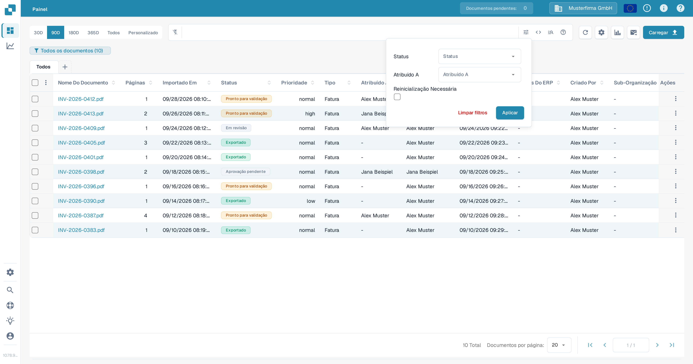
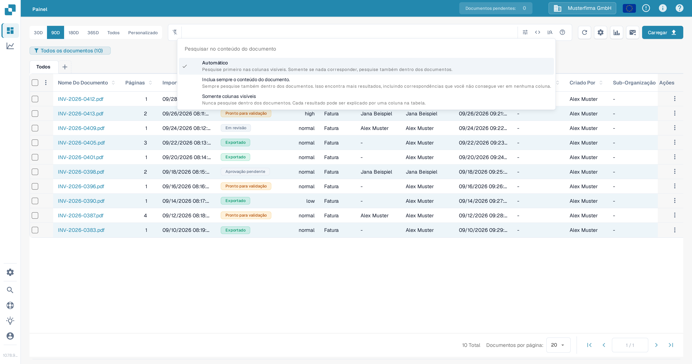
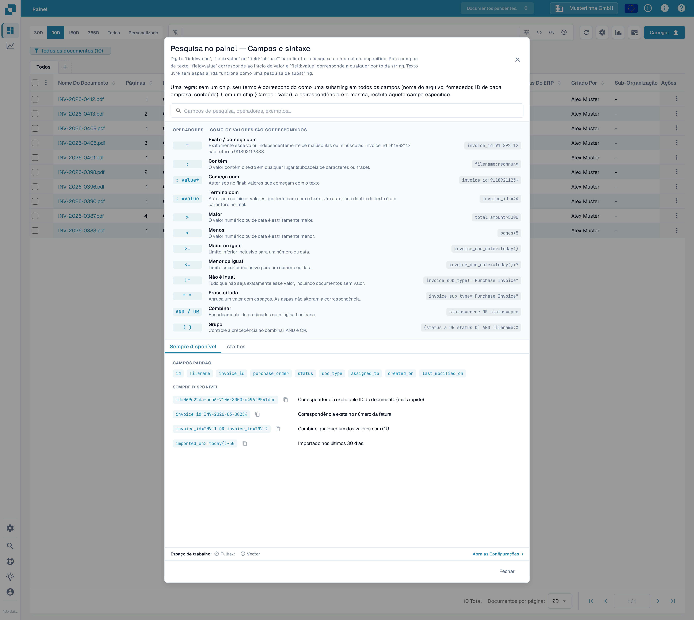
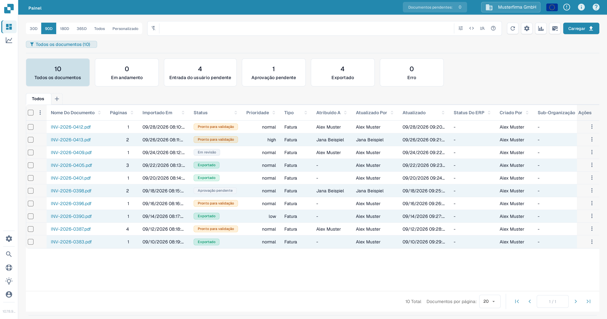
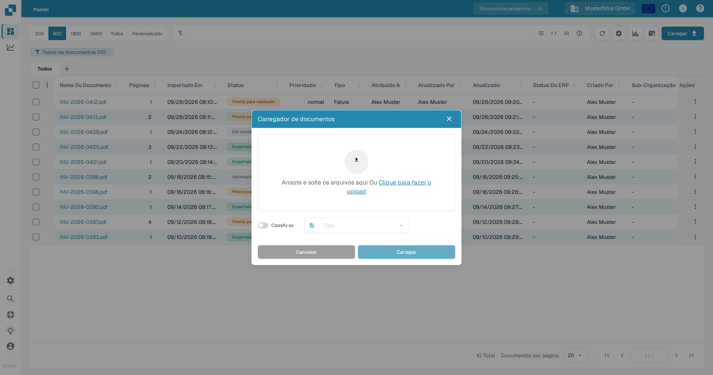
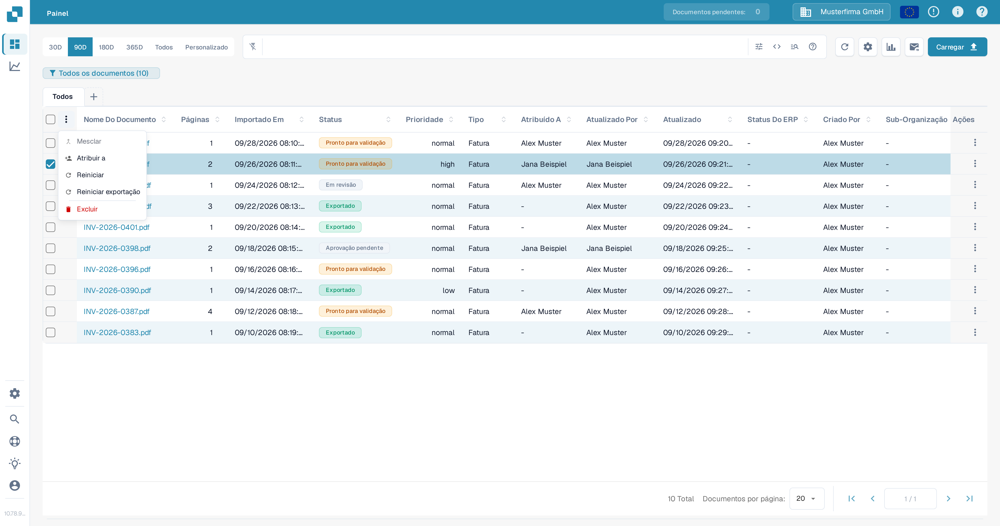
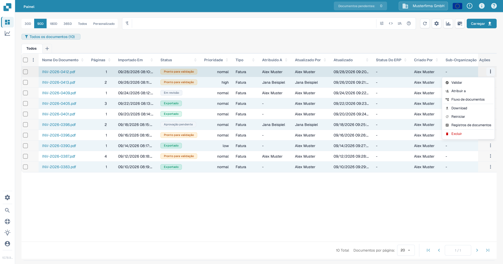

# Ferramentas do painel

O painel é a sua lista de documentos. Abra um documento selecionando o seu nome. Os controlos acima da tabela ajudam-no a encontrar documentos, a alterar o que vê e a carregar novos ficheiros. Alguns controlos dependem das configurações da sua organização e das suas permissões, por isso o seu painel pode mostrar menos botões do que o exemplo abaixo.

<figure><figcaption>O painel numa organização de teste em português.</figcaption></figure>

## Encontrar documentos

1. Escolha um intervalo de datas à esquerda: **30D**, **90D**, **180D**, **365D**, **Todos** ou **Personalizado**. Isto limita os documentos mostrados quando os controlos de data estão disponíveis.
2. Digite um nome ou ID de documento na barra de pesquisa. A pesquisa também suporta consultas por campo. Selecione o **?** junto à barra de pesquisa para ver exemplos e os operadores disponíveis.
3. Selecione o ícone de deslizadores dentro da barra de pesquisa para limitar a lista por **Status**, **Atribuído A** ou **Reinicialização Necessária** e, em seguida, selecione **Aplicar**. Use **Limpar filtros** para remover essas escolhas.
4. Selecione um cabeçalho de coluna para ordenar a tabela. Use os controlos de página na parte inferior para navegar entre as páginas de resultados ou alterar **Documentos por página**.

O ícone no início do campo de pesquisa abre um seletor dos campos disponíveis e mostra quais as capacidades de pesquisa que a sua organização tem. O ícone de **código** alterna entre a vista de pesquisa normal e uma vista de consulta bruta; use a vista normal a menos que já conheça a sintaxe de consulta. O ícone de lupa abre **Pesquisar no conteúdo do documento**: **Automático** pesquisa primeiro nas colunas visíveis, **Inclua sempre o conteúdo do documento.** inclui o texto dentro dos ficheiros e **Somente colunas visíveis** limita as correspondências aos campos da tabela. Pesquisar dentro de ficheiros requer que a capacidade de pesquisa relevante esteja ativada para a sua organização.

<figure><figcaption>Os filtros dentro da barra de pesquisa.</figcaption></figure>

<figure><figcaption>Escolha o que uma pesquisa simples pode corresponder.</figcaption></figure>

Para uma pesquisa orientada, consulte [Pesquisa rápida](quick-search.md) e [Filtrar documentos](filtering-documents.md). O painel **?** explica a sintaxe de pesquisa avançada; não precisa dessa sintaxe para uma pesquisa simples por nome.

<figure><figcaption>Ajuda de pesquisa no painel.</figcaption></figure>

## Atualizar e personalizar a vista

- Selecione a seta circular acima da tabela para recarregar a lista de documentos. Ela não reinicia o processamento de documentos.
- Selecione a engrenagem para abrir o menu de configurações avançadas (ícone de teclado). Aí pode abrir os atalhos de teclado, ver o registo de importação de e-mail ou gerir as colunas visíveis da tabela. Os administradores também podem ver uma ligação para as configurações do painel. Consulte [Atalhos de teclado](keyboard-shortcuts.md) e [Alterar colunas do documento](change-document-columns.md) para os próximos passos.
- Selecione o gráfico de barras para mostrar a **Análise** acima da tabela. Escolha um cartão de categoria, como **Entrada do usuário pendente**, para filtrar os documentos. Selecione o gráfico novamente para ocultar os cartões.
- Selecione o distintivo do painel guardado abaixo da barra de pesquisa para alternar ou gerir o seu próprio painel. Consulte [Painéis pessoais](personal-dashboards.md).
- Selecione **+** junto ao separador **Todos** para adicionar um separador para um tipo de documento. Na organização de teste, está disponível **Fatura**. Selecione um separador para mostrar esse tipo de documento.

<figure><figcaption>Abra o menu da engrenagem para ver as opções do painel.</figcaption></figure>

<figure><figcaption>Cartões de Análise acima da lista de documentos.</figcaption></figure>

## Carregar documentos

Selecione **Carregar**. Arraste os ficheiros para o **Carregador de documentos** ou selecione **Clique para fazer o upload** para os escolher no seu computador. Se conhecer o tipo de documento, ative **Classify as** e selecione o tipo; caso contrário, deixe desativado para uma classificação automática. Selecione **Carregar** para enviar os ficheiros. Consulte [Visão geral dos documentos carregados](overview-of-uploaded-documents.md) para saber o que acontece a seguir.

<figure><figcaption>O diálogo de carregamento atual.</figcaption></figure>

## Trabalhar com vários documentos

Selecione as caixas de verificação junto aos documentos sobre os quais deseja agir e, em seguida, abra o menu de três pontos no cabeçalho da tabela. Dependendo dos documentos e das suas permissões, o menu oferece **Mesclar**, **Atribuir a**, **Reiniciar**, **Reiniciar exportação** e **Excluir**. Verifique as linhas selecionadas antes de escolher uma ação; **Excluir** remove documentos. Para combinar ficheiros, siga [Fusão de documentos](document-merging.md).

<figure><figcaption>Ações em massa junto às caixas de verificação de seleção da tabela.</figcaption></figure>

Para um único documento, abra o menu de três pontos no final da sua linha. Ele oferece ações como **Validar**, **Atribuir a**, **Fluxo de documentos**, **Download**, **Reiniciar**, **Registros de documentos** e **Excluir**, dependendo do documento e das suas permissões. **Validar** abre o documento para revisão; **Fluxo de documentos** mostra o seu histórico de processamento; **Reiniciar** começa o processamento novamente; **Excluir** remove-o. Consulte [Fluxo de documentos](document-flow.md) e [Status do documento](document-status.md) antes de alterar um documento que está a ser processado.

<figure><figcaption>Ações para um único documento.</figcaption></figure>

## Outros botões que a sua organização pode mostrar

- O botão do envelope inicia uma importação de e-mail usando a configuração de importação de e-mail existente da organização. Pergunte a um administrador se não tiver a certeza se a sua caixa de correio está configurada; selecioná-lo inicia uma importação.
- **Digitalizar documento** aparece apenas quando a digitalização de documentos está ativada e existe um scanner disponível.
- **Exportar esta tabela** aparece apenas quando a exportação do painel está ativada. O seu menu oferece ficheiros CSV e Excel. A exportação usa os documentos atualmente mostrados na tabela.

Os botões disponíveis podem diferir consoante a largura do ecrã. Numa tela estreita, abra **Mais** para encontrar algumas das ações que aparecem separadamente num ecrã de computador.
