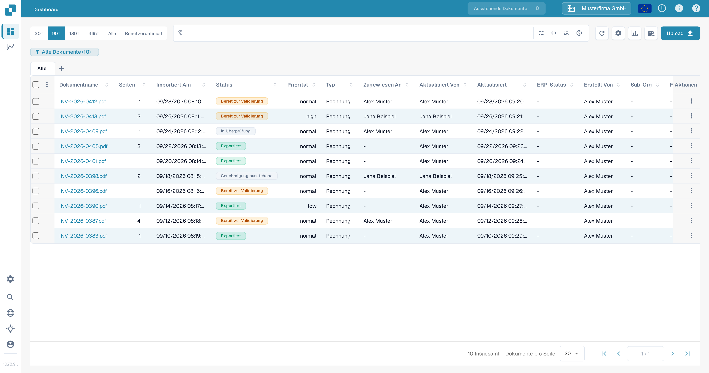
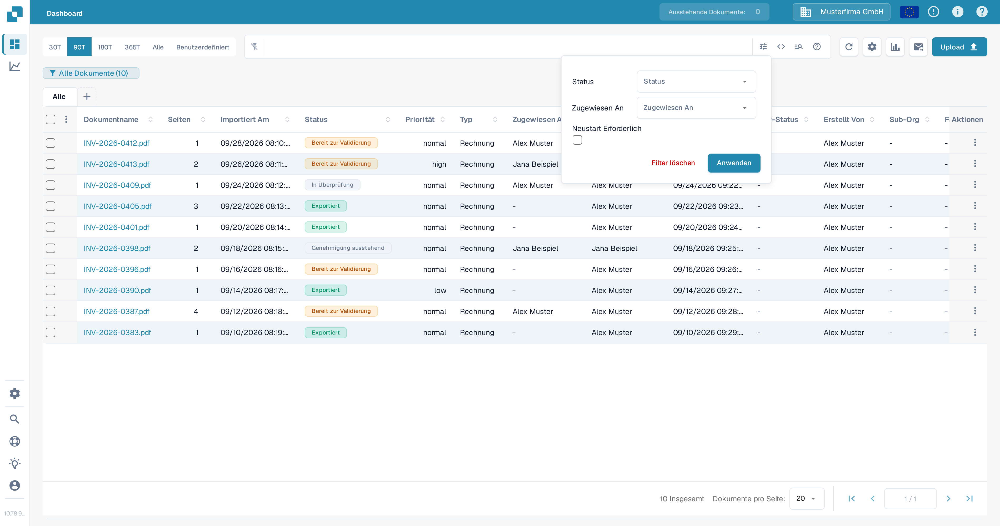
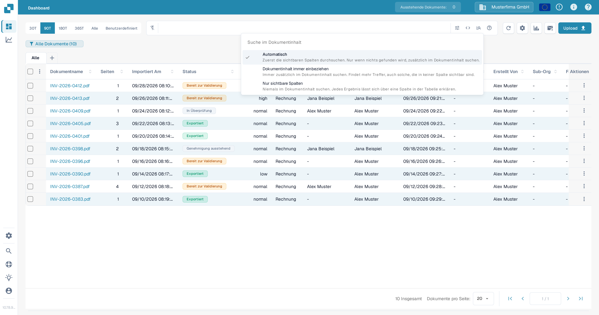
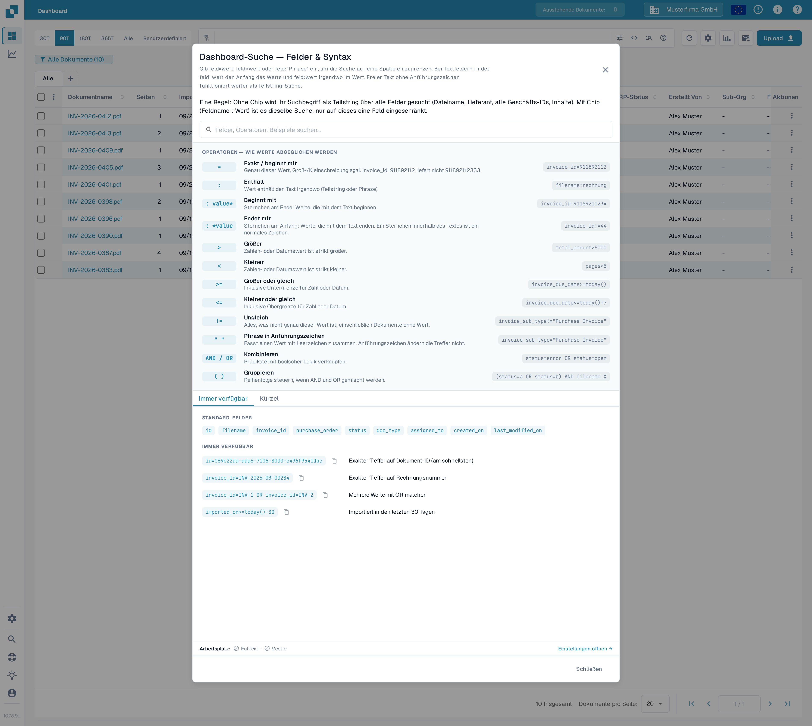
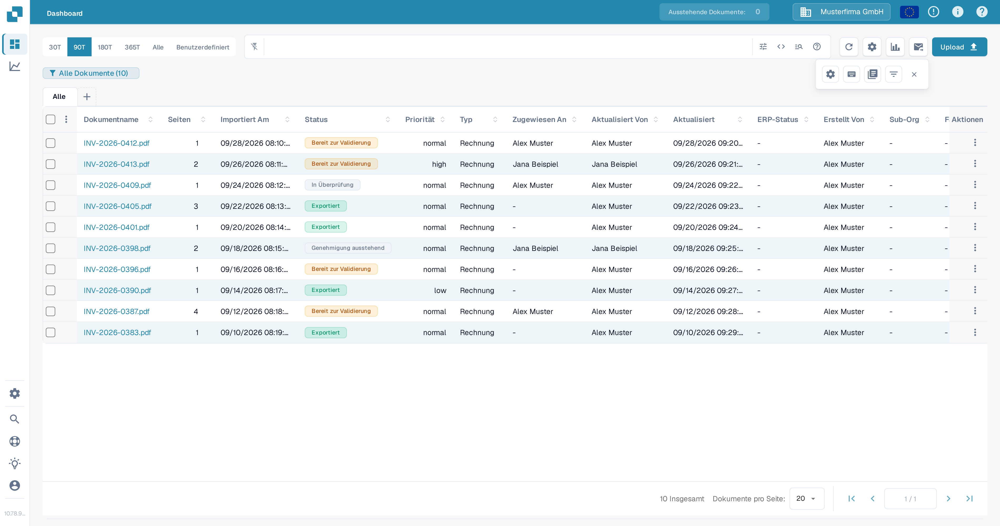
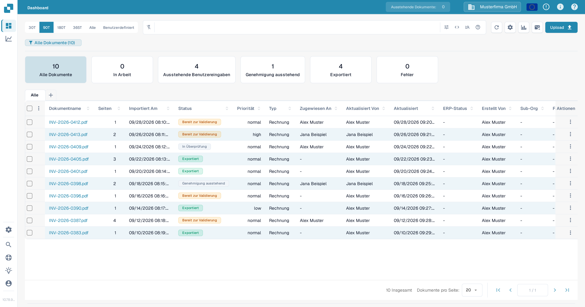
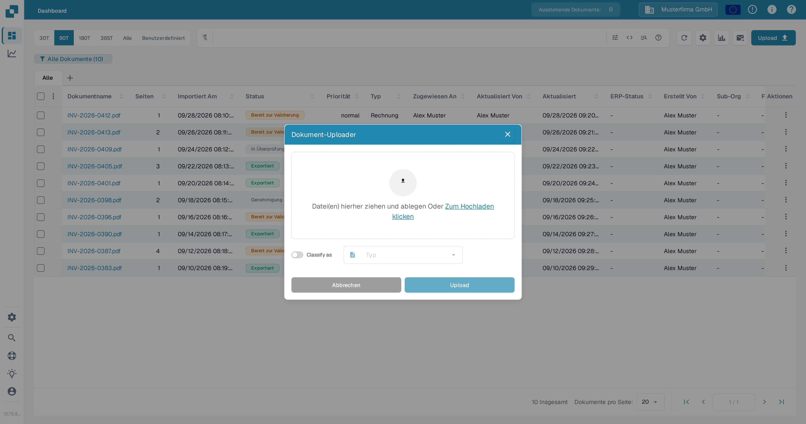
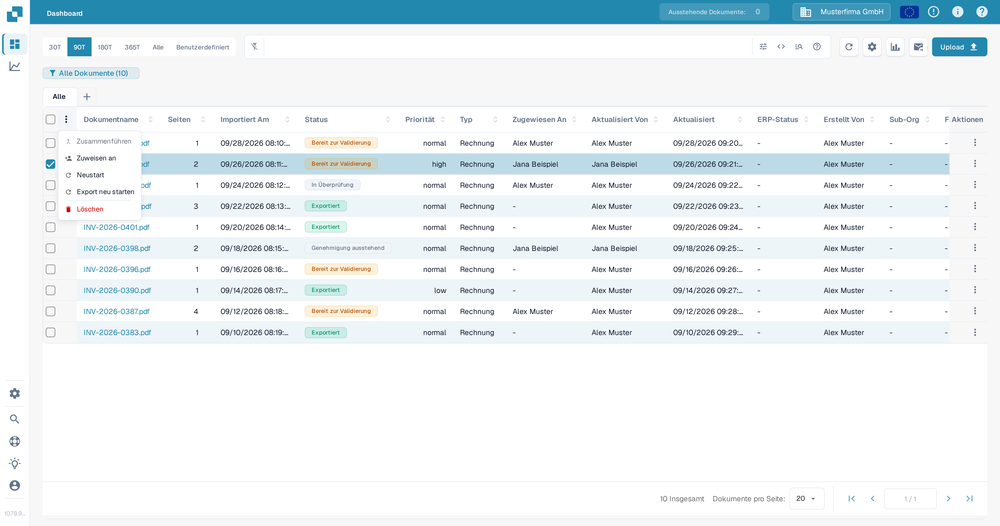

# Dashboard-Werkzeuge

Das Dashboard ist Ihre Dokumentliste. Öffnen Sie ein Dokument, indem Sie seinen Namen auswählen. Die Bedienelemente über der Tabelle helfen Ihnen, Dokumente zu finden, die Ansicht zu ändern und neue Dateien hochzuladen. Einige Bedienelemente hängen von den Einstellungen Ihrer Organisation und Ihren Berechtigungen ab, daher kann Ihr Dashboard weniger Schaltflächen anzeigen als das Beispiel unten.

<figure><figcaption>Das Dashboard in einer deutschsprachigen Testorganisation.</figcaption></figure>

## Dokumente finden

1. Wählen Sie links einen Zeitraum: **30T**, **90T**, **180T**, **365T**, **Alle** oder **Benutzerdefiniert**. Damit begrenzen Sie die angezeigten Dokumente, sofern die Datumssteuerung verfügbar ist.
2. Geben Sie einen Dokumentnamen oder eine ID in die Suchleiste ein. Die Suche unterstützt außerdem feldspezifische Abfragen. Wählen Sie das **?** neben der Suchleiste, um Beispiele und die verfügbaren Operatoren zu sehen.
3. Wählen Sie das Schieberegler-Symbol in der Suchleiste, um die Liste nach **Status**, **Zugewiesen An** oder **Neustart Erforderlich** einzuschränken, und wählen Sie dann **Anwenden**. Mit **Filter löschen** entfernen Sie diese Auswahl wieder.
4. Wählen Sie eine Spaltenüberschrift, um die Tabelle zu sortieren. Verwenden Sie die Seitensteuerung unten, um zwischen Ergebnisseiten zu wechseln oder **Dokumente pro Seite:** zu ändern.

Das Symbol am Beginn des Suchfelds öffnet eine Auswahl der verfügbaren Felder und zeigt, welche Suchfunktionen Ihre Organisation hat. Das **code**-Symbol wechselt zwischen der normalen Suchansicht und einer Rohabfrage-Ansicht; verwenden Sie die normale Ansicht, sofern Sie die Abfragesyntax nicht bereits kennen. Das Lupensymbol öffnet **Suche im Dokumentinhalt**: **Automatisch** durchsucht zuerst sichtbare Felder, **Dokumentinhalt immer einbeziehen** bezieht Text innerhalb von Dateien ein, und **Nur sichtbare Spalten** beschränkt Treffer auf die Tabellenfelder. Die Suche innerhalb von Dateien erfordert, dass die entsprechende Suchfunktion für Ihre Organisation aktiviert ist.

<figure><figcaption>Die Filter innerhalb der Suchleiste.</figcaption></figure>

<figure><figcaption>Legen Sie fest, was eine einfache Suche abgleichen darf.</figcaption></figure>

Für eine geführte Suche lesen Sie [Schnellsuche](quick-search.md) und [Dokumente filtern](filtering-documents.md). Das **?**-Fenster erklärt die erweiterte Suchsyntax; für eine einfache Namenssuche benötigen Sie diese Syntax nicht.

<figure><figcaption>Suchhilfe im Dashboard.</figcaption></figure>

## Ansicht aktualisieren und anpassen

- Wählen Sie den kreisförmigen Pfeil über der Tabelle, um die Dokumentliste neu zu laden. Er startet die Dokumentverarbeitung nicht neu.
- Wählen Sie das Zahnrad, um die **Erweiterten Einstellungen** zu öffnen. Dort können Sie Tastenkombinationen öffnen, das E-Mail-Importprotokoll ansehen oder sichtbare Tabellenspalten verwalten. Administratoren sehen möglicherweise zusätzlich einen Link zu den Dashboard-Einstellungen. Die nächsten Schritte finden Sie unter [Tastenkombinationen](keyboard-shortcuts.md) und [Dokumentspalten ändern](change-document-columns.md).
- Wählen Sie das Balkendiagramm, um **Analytik** über der Tabelle anzuzeigen. Wählen Sie eine Kategoriekarte wie **Ausstehende Benutzereingaben**, um die Dokumente zu filtern. Wählen Sie das Diagramm erneut, um die Karten auszublenden.
- Wählen Sie die Kennzeichnung des gespeicherten Dashboards unter der Suchleiste, um Ihr eigenes Dashboard zu wechseln oder zu verwalten. Siehe [Persönliche Dashboards](personal-dashboards.md).
- Wählen Sie **+** neben der Registerkarte **Alle**, um eine Registerkarte für einen Dokumenttyp hinzuzufügen. In der Testorganisation ist **Rechnung** verfügbar. Wählen Sie eine Registerkarte, um diesen Dokumenttyp anzuzeigen.

<figure><figcaption>Öffnen Sie das Zahnradmenü für Dashboard-Optionen.</figcaption></figure>

<figure><figcaption>Analytik-Karten über der Dokumentliste.</figcaption></figure>

## Dokumente hochladen

Wählen Sie **Upload**. Ziehen Sie Dateien in den **Dokument-Uploader** oder wählen Sie **Zum Hochladen klicken**, um sie von Ihrem Computer auszuwählen. Wenn Sie den Dokumenttyp kennen, aktivieren Sie **Classify as** und wählen Sie den Typ; andernfalls lassen Sie die Option aus, damit automatisch klassifiziert wird. Wählen Sie **Upload**, um die Dateien zu übermitteln. Was danach geschieht, lesen Sie unter [Übersicht der hochgeladenen Dokumente](overview-of-uploaded-documents.md).

<figure><figcaption>Der aktuelle Upload-Dialog.</figcaption></figure>

## Mit mehreren Dokumenten arbeiten

Aktivieren Sie die Kontrollkästchen neben den Dokumenten, auf die Sie einwirken möchten, und öffnen Sie dann das Drei-Punkte-Menü in der Tabellenkopfzeile. Je nach Dokumenten und Ihren Berechtigungen bietet das Menü **Zusammenführen**, **Zuweisen an**, **Neustart**, **Export neu starten** und **Löschen**. Prüfen Sie die ausgewählten Zeilen, bevor Sie eine Aktion wählen; **Löschen** entfernt Dokumente. Zum Zusammenführen von Dateien folgen Sie [Dokumentenzusammenführung](document-merging.md).

<figure><figcaption>Massenaktionen neben den Auswahl-Kontrollkästchen der Tabelle.</figcaption></figure>

Für ein einzelnes Dokument öffnen Sie das Drei-Punkte-Menü am Ende seiner Zeile. Es bietet Aktionen wie **Validiere**, **Zuweisen an**, **Dokumentenfluss**, **Herunterladen**, **Neustart**, **Dokumenten-Logs** und **Löschen**, abhängig vom Dokument und Ihren Berechtigungen. **Validiere** öffnet das Dokument zur Überprüfung; **Dokumentenfluss** zeigt seinen Verarbeitungsverlauf; **Neustart** startet die Verarbeitung erneut; **Löschen** entfernt es. Lesen Sie [Dokument-Flow](document-flow.md) und [Dokumentenstatus](document-status.md), bevor Sie ein Dokument ändern, das gerade verarbeitet wird.

<figure><figcaption>Aktionen für ein einzelnes Dokument.</figcaption></figure>

## Weitere Schaltflächen, die Ihre Organisation anzeigen kann

- Die Umschlag-Schaltfläche startet einen E-Mail-Import mit der vorhandenen E-Mail-Importkonfiguration Ihrer Organisation. Fragen Sie einen Administrator, wenn Sie unsicher sind, ob Ihr Postfach konfiguriert ist; die Auswahl startet einen Import.
- **Dokument scannen** erscheint nur, wenn das Scannen von Dokumenten aktiviert ist und ein Scanner verfügbar ist.
- **Diese Tabelle exportieren** erscheint nur, wenn der Dashboard-Export aktiviert ist. Das Menü bietet CSV- und Excel-Dateien. Der Export verwendet die aktuell in der Tabelle angezeigten Dokumente.

Die verfügbaren Schaltflächen können je nach Bildschirmbreite abweichen. Öffnen Sie auf einem schmalen Bildschirm **Mehr**, um einige der Aktionen zu finden, die auf einem Desktop-Bildschirm einzeln erscheinen.
