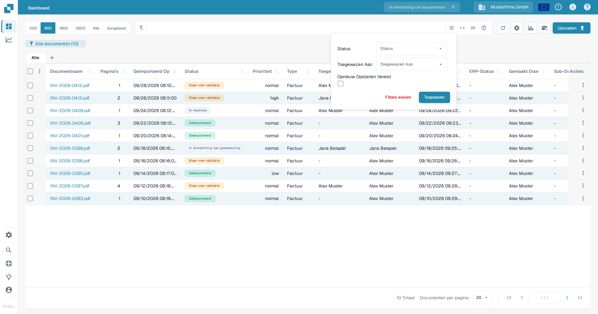
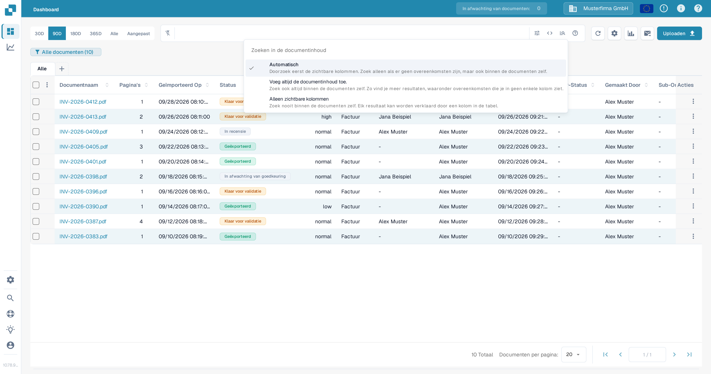
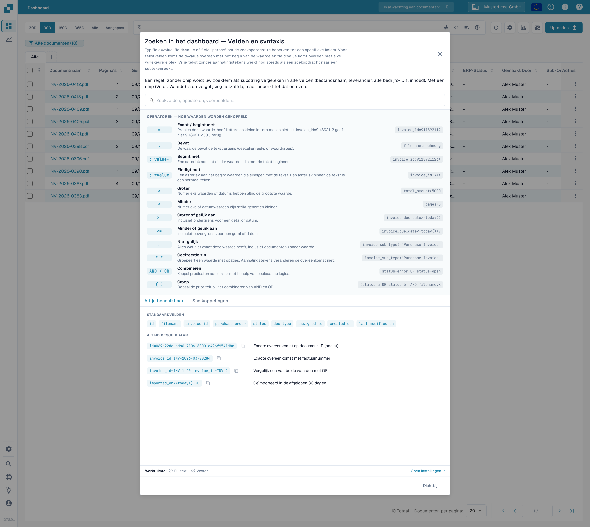
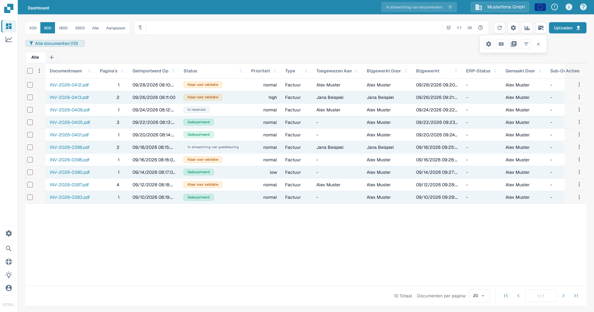
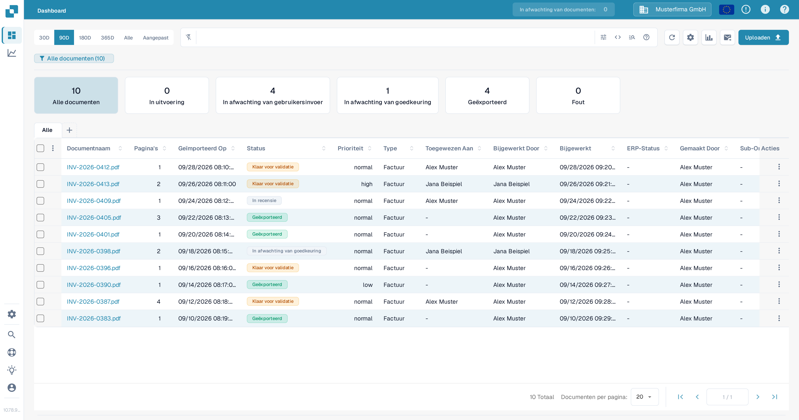
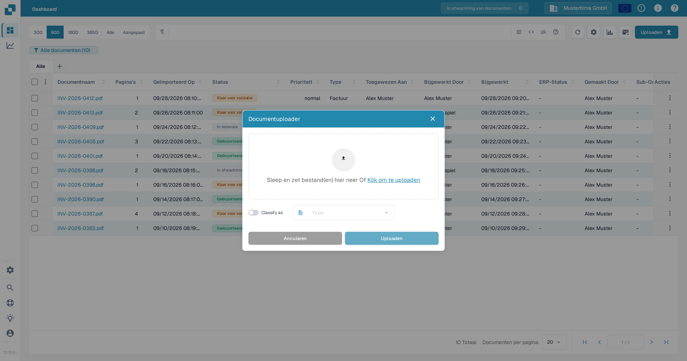
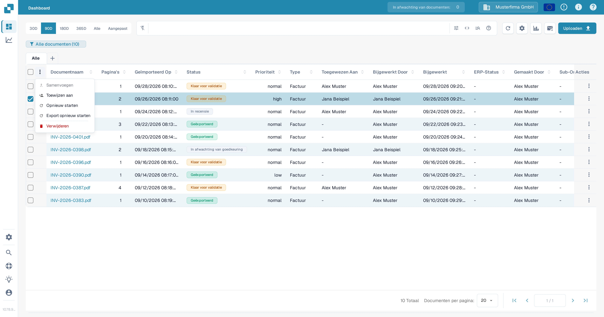
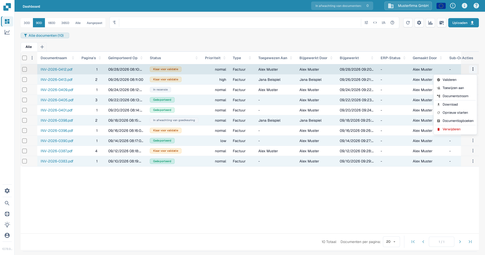

# Dashboard-hulpmiddelen

Het dashboard is uw lijst met documenten. Open een document door de naam te selecteren. De bedieningselementen boven de tabel helpen u documenten te vinden, het beeld aan te passen en nieuwe bestanden te uploaden. Sommige bedieningselementen hangen af van de instellingen van uw organisatie en van uw rechten, dus uw dashboard kan minder knoppen tonen dan het voorbeeld hieronder.

<figure><figcaption>
Het dashboard in een testorganisatie in het Nederlands.
</figcaption></figure>

## Documenten vinden

1. Kies links een datumbereik: **30D**, **90D**, **180D**, **365D**, **Alle** of **Aangepast**. Dit beperkt de getoonde documenten wanneer de datumbediening beschikbaar is.
2. Typ een documentnaam of -ID in de zoekbalk. Zoeken ondersteunt ook veldspecifieke query's. Selecteer de **?** naast de zoekbalk om voorbeelden en de beschikbare operatoren te zien.
3. Selecteer het pictogram met de schuifregelaars in de zoekbalk om de lijst te beperken op **Status**, **Toegewezen Aan** of **Opnieuw Opstarten Vereist**, en selecteer daarna **Toepassen**. Gebruik **Filters wissen** om deze keuzes te verwijderen.
4. Selecteer een kolomkop om de tabel te sorteren. Gebruik de pagina-bediening onderaan om tussen resultaatpagina's te wisselen of **Documenten per pagina:** te wijzigen.

Het pictogram aan het begin van het zoekveld opent een keuzelijst met beschikbare velden en toont welke zoekfuncties uw organisatie heeft. Het **code**-pictogram wisselt tussen de normale zoekweergave en een ruwe queryweergave; gebruik de normale weergave tenzij u de querysyntaxis al kent. Het vergrootglaspictogram opent **Zoeken in de documentinhoud**: **Automatisch** zoekt eerst in zichtbare velden, **Voeg altijd de documentinhoud toe.** neemt ook tekst in bestanden op, en **Alleen zichtbare kolommen** beperkt treffers tot de velden in de tabel. Zoeken in bestanden vereist dat de betreffende zoekfunctie voor uw organisatie is ingeschakeld.

<figure><figcaption>
De filters in de zoekbalk.
</figcaption></figure>

<figure><figcaption>
Kies waarop een eenvoudige zoekopdracht mag overeenkomen.
</figcaption></figure>

Voor een begeleide zoekopdracht, zie [Snel zoeken](quick-search.md) en [Documenten filteren](filtering-documents.md). Het **?**-paneel legt de geavanceerde zoeksyntaxis uit; die syntaxis heeft u voor een eenvoudige zoekopdracht op naam niet nodig.

<figure><figcaption>
Zoekhulp in het dashboard.
</figcaption></figure>

## Vernieuwen en het beeld aanpassen

- Selecteer de cirkelpijl boven de tabel om de documentenlijst opnieuw te laden. Hiermee wordt de documentverwerking niet opnieuw gestart.
- Selecteer het tandwiel voor de geavanceerde dashboardinstellingen. Van daaruit opent u de toetsenbordsneltoetsen, het importlogboek van e-mails of beheert u de zichtbare tabelkolommen. Beheerders zien mogelijk ook een link naar de dashboardinstellingen. Zie [Toetsenbord Sneltoetsen](keyboard-shortcuts.md) en [Wijzig Document Kolommen](change-document-columns.md) voor de volgende stappen.
- Selecteer het staafdiagram om **Analyse** boven de tabel te tonen. Kies een categoriekaart, zoals **In afwachting van gebruikersinvoer**, om de documenten te filteren. Selecteer het diagram opnieuw om de kaarten te verbergen.
- Selecteer het merkteken van het opgeslagen dashboard onder de zoekbalk om uw eigen dashboard te wisselen of te beheren. Zie [Persoonlijke Dashboards](personal-dashboards.md).
- Selecteer **+** naast het tabblad **Alle** om een tabblad voor een documenttype toe te voegen. In de testorganisatie is **Factuur** beschikbaar. Selecteer een tabblad om dat type document te tonen.

<figure><figcaption>
Open het tandwielmenu voor dashboardopties.
</figcaption></figure>

<figure><figcaption>
De Analysekaarten boven de documentenlijst.
</figcaption></figure>

## Documenten uploaden

Selecteer **Uploaden**. Sleep bestanden naar de **Documentuploader** of selecteer **Klik om te uploaden** om ze van uw computer te kiezen. Als u het documenttype kent, schakelt u **Classify as** in en selecteert u het type; laat het anders uit voor automatische classificatie. Selecteer **Uploaden** om de bestanden te verzenden. Zie [Overzicht van Geüploade Documenten](overview-of-uploaded-documents.md) voor wat er daarna gebeurt.

<figure><figcaption>
De huidige uploadvenster.
</figcaption></figure>

## Werken met meerdere documenten

Selecteer de selectievakjes naast de documenten waarmee u iets wilt doen, en open het menu met de drie puntjes in de kop van de tabel. Afhankelijk van de documenten en uw rechten biedt het menu **Samenvoegen**, **Toewijzen aan**, **Opnieuw starten**, **Export opnieuw starten** en **Verwijderen**. Controleer de geselecteerde rijen voordat u een actie kiest; **Verwijderen** verwijdert documenten. Volg voor het combineren van bestanden [Documenten Samenvoegen](document-merging.md).

<figure><figcaption>
Acties voor meerdere documenten naast de selectievakjes van de tabel.
</figcaption></figure>

Open voor één document het menu met de drie puntjes aan het einde van de rij. Het biedt acties zoals **Valideren**, **Toewijzen aan**, **Documentstroom**, **Download**, **Opnieuw starten**, **Documentlogboeken** en **Verwijderen**, afhankelijk van het document en uw rechten. **Valideren** opent het document voor beoordeling; **Documentstroom** toont de verwerkingsgeschiedenis; **Opnieuw starten** begint de verwerking opnieuw; **Verwijderen** verwijdert het document. Zie [Documentflow](document-flow.md) en [Documentstatus](document-status.md) voordat u een document wijzigt dat wordt verwerkt.

<figure><figcaption>
Acties voor één document.
</figcaption></figure>

## Andere knoppen die uw organisatie mogelijk toont

- De knop met de envelop start een e-mailimport met de bestaande e-mailimportconfiguratie van de organisatie. Vraag een beheerder als u niet zeker weet of uw mailbox is geconfigureerd; door deze te selecteren start een import.
- **Document scannen** verschijnt alleen wanneer document scannen is ingeschakeld en er een scanner beschikbaar is.
- **Exporteer deze tabel** verschijnt alleen wanneer exporteren van het dashboard is ingeschakeld. Het menu biedt CSV- en Excel-bestanden. De export gebruikt de documenten die momenteel in de tabel worden weergegeven.

De beschikbare knoppen kunnen per schermbreedte verschillen. Open op een smal scherm **Meer** om enkele acties te vinden die op een desktopscherm apart verschijnen.
