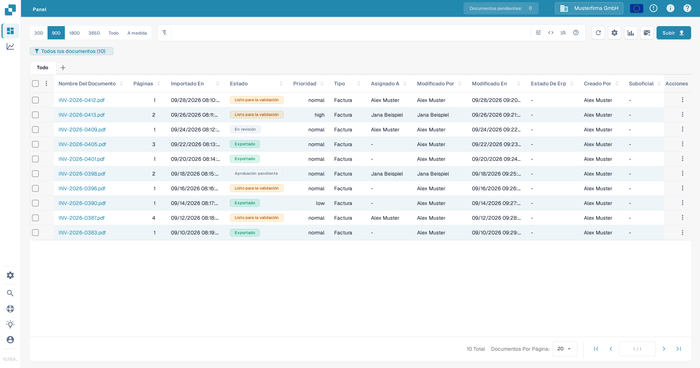
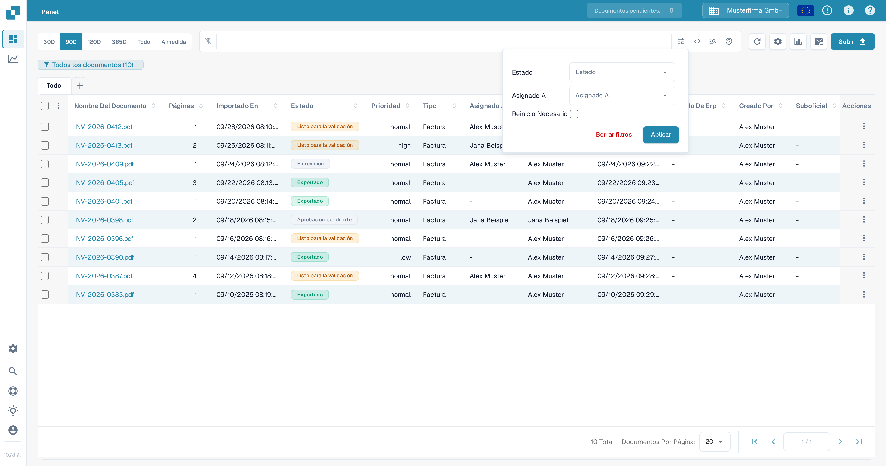
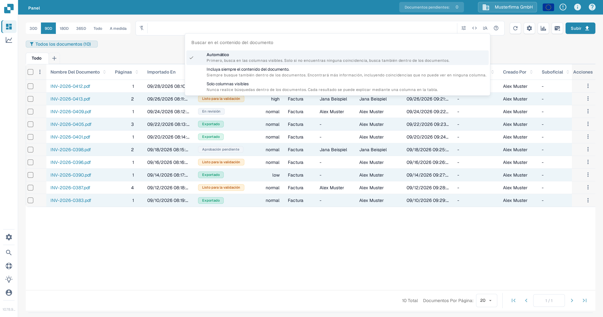
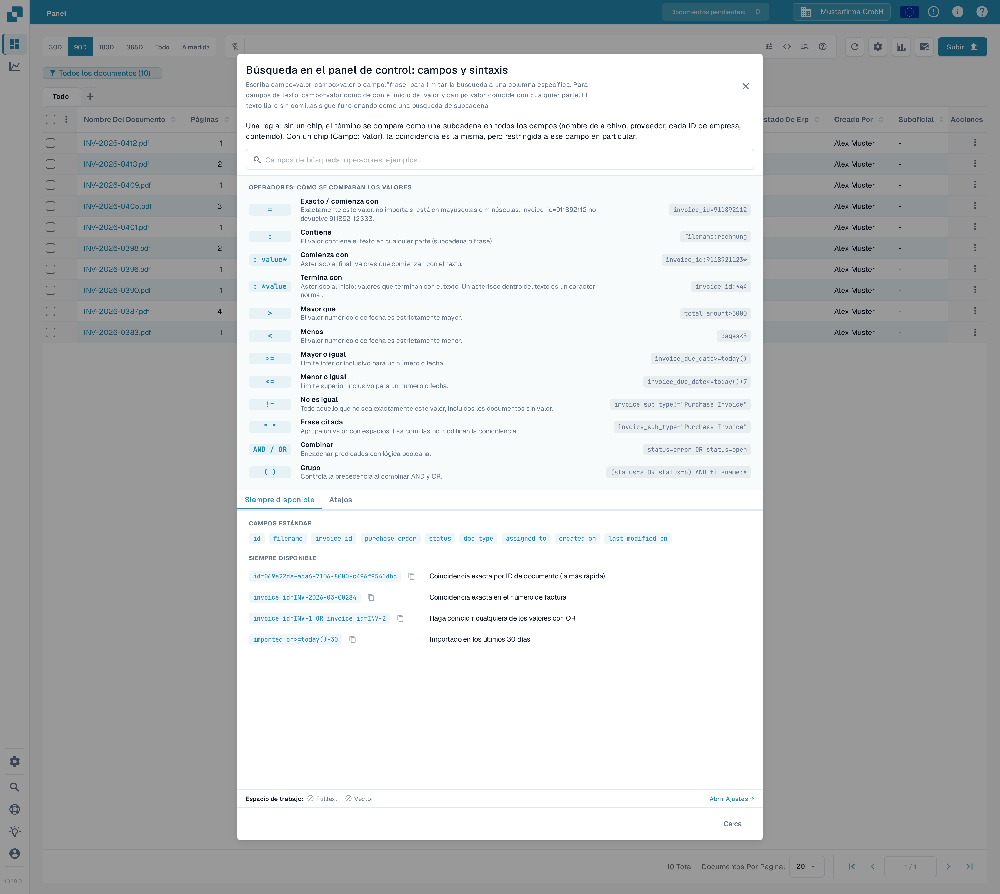
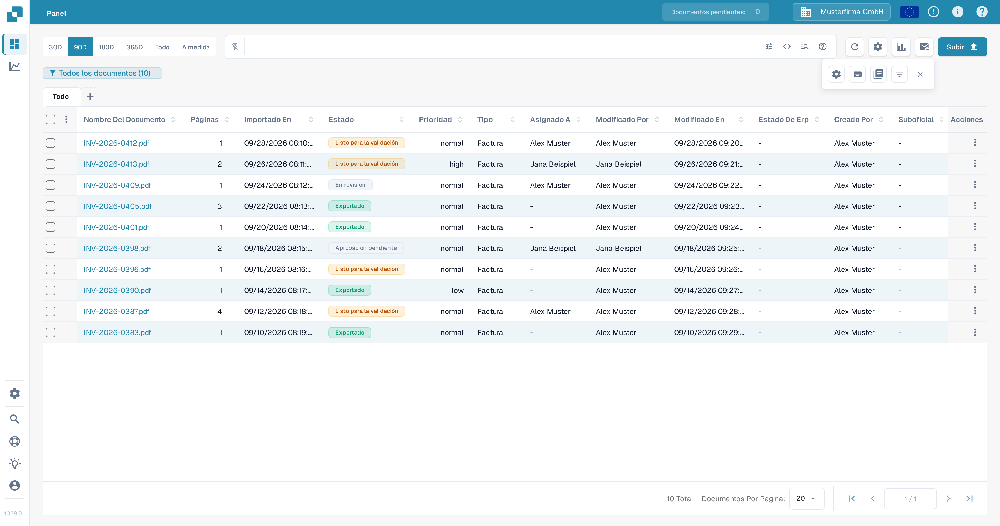
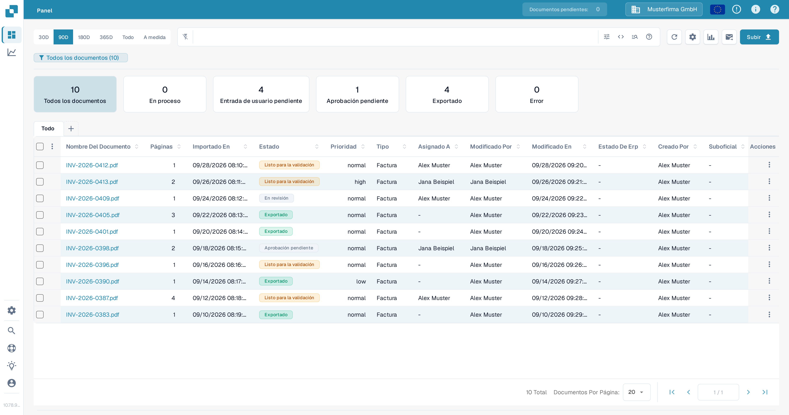
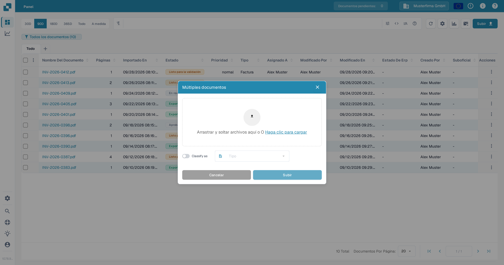
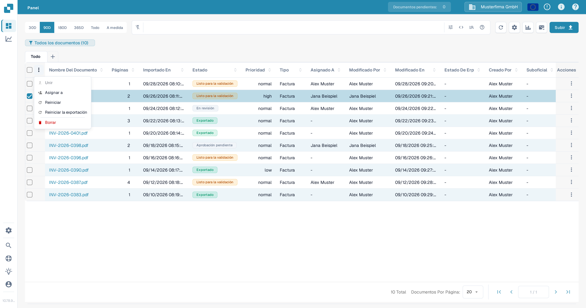
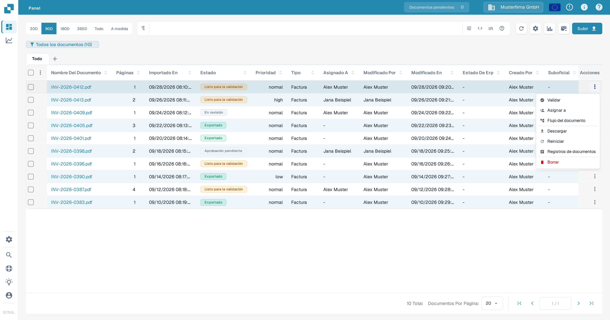

# Herramientas del Panel

El Panel es su lista de documentos. Abra un documento seleccionando su nombre. Los controles situados encima de la tabla le ayudan a encontrar documentos, cambiar lo que ve y subir archivos nuevos. Algunos controles dependen de los ajustes de su organización y de sus permisos, por lo que es posible que su Panel muestre menos botones que el ejemplo siguiente.

<figure><figcaption>El Panel en una organización de pruebas en español.</figcaption></figure>

## Encontrar documentos

1. Elija a la izquierda un rango de fechas: **30D**, **90D**, **180D**, **365D**, **Todo** o **A medida**. Esto limita los documentos mostrados cuando los controles de fecha están disponibles.
2. Escriba un nombre o identificación de documento en la barra de búsqueda (**Buscar por nombre o identificación ...**). La búsqueda también admite consultas por campo específico. Seleccione el **?** junto a la barra de búsqueda para ver ejemplos y los operadores disponibles.
3. Seleccione el icono de deslizadores dentro de la barra de búsqueda para acortar la lista por **Estado**, **Asignado A** o **Reinicio Necesario**, y luego seleccione **Aplicar**. Use **Borrar filtros** para quitar esas selecciones.
4. Seleccione un encabezado de columna para ordenar la tabla. Use los controles de página en la parte inferior para moverse entre las páginas de resultados o cambiar **Documentos Por Página**.

El icono al inicio del campo de búsqueda abre un selector de los campos disponibles y muestra qué capacidades de búsqueda tiene su organización. El icono de **código** alterna entre la vista de búsqueda normal y una vista de consulta sin procesar; use la vista normal salvo que ya conozca la sintaxis de consultas. El icono de lupa abre **Buscar en el contenido del documento**: **Automático** busca primero en los campos visibles, **Incluya siempre el contenido del documento.** incluye el texto dentro de los archivos y **Solo columnas visibles** limita las coincidencias a los campos de la tabla. Buscar dentro de los archivos requiere que la capacidad de búsqueda correspondiente esté activada para su organización.

<figure><figcaption>Los filtros dentro de la barra de búsqueda.</figcaption></figure>

<figure><figcaption>Elija qué puede coincidir una búsqueda simple.</figcaption></figure>

Para una búsqueda guiada, consulte [Búsqueda rápida](quick-search.md) y [Filtrado de documentos](filtering-documents.md). El panel **?** explica la sintaxis de búsqueda avanzada; no necesita esa sintaxis para una búsqueda simple por nombre.

<figure><figcaption>Ayuda de búsqueda en el Panel.</figcaption></figure>

## Actualizar y personalizar la vista

- Seleccione la flecha circular encima de la tabla para recargar la lista de documentos. No reinicia el procesamiento de documentos.
- Seleccione el engranaje para abrir el menú de opciones del Panel. Desde ahí puede abrir los atajos de teclado, ver el registro de importación por correo o gestionar las columnas visibles de la tabla. Los administradores también pueden ver un enlace a los ajustes del Panel. Consulte [Atajos de Teclado](keyboard-shortcuts.md) y [Cambiar columnas del documento](change-document-columns.md) para los siguientes pasos.
- Seleccione el gráfico de barras para mostrar la analítica encima de la tabla. Elija una tarjeta de categoría, como **Entrada de usuario pendiente**, para filtrar los documentos. Seleccione el gráfico de nuevo para ocultar las tarjetas.
- Seleccione la insignia del panel guardado debajo de la barra de búsqueda (**Todos los documentos (10)** en el ejemplo) para cambiar o gestionar su propio Panel. Consulte [Paneles personales](personal-dashboards.md).
- Seleccione **+** junto a la pestaña **Todo** para añadir una pestaña de un tipo de documento. En la organización de pruebas está disponible **Factura**. Seleccione una pestaña para mostrar ese tipo de documento.

<figure><figcaption>Abra el menú del engranaje para las opciones del Panel.</figcaption></figure>

<figure><figcaption>Tarjetas de analítica encima de la lista de documentos.</figcaption></figure>

## Subir documentos

Seleccione **Subir**. Arrastre archivos al área de **Arrastrar y soltar archivos aquí** o seleccione **Haga clic para cargar** para elegirlos desde su equipo. Si conoce el tipo de documento, active **Classify as** y seleccione el tipo; en caso contrario, déjelo desactivado para la clasificación automática. Seleccione **Subir** para enviar los archivos. Consulte [Resumen de documentos cargados](overview-of-uploaded-documents.md) para saber qué ocurre después.

<figure><figcaption>El diálogo de subida actual.</figcaption></figure>

## Trabajar con varios documentos

Seleccione las casillas junto a los documentos sobre los que quiera actuar y abra después el menú de tres puntos en el encabezado de la tabla. Según los documentos y sus permisos, el menú ofrece **Unir**, **Asignar a**, **Reiniciar**, **Reiniciar la exportación** y **Borrar**. Revise las filas seleccionadas antes de elegir una acción; **Borrar** elimina documentos. Para combinar archivos, siga [Unir Documentos](document-merging.md).

<figure><figcaption>Acciones masivas junto a las casillas de selección de la tabla.</figcaption></figure>

Para un solo documento, abra el menú de tres puntos al final de su fila. Ofrece acciones como **Validar**, **Asignar a**, **Flujo del documento**, **Descargar**, **Reiniciar**, **Registros de documentos** y **Borrar**, según el documento y sus permisos. **Validar** abre el documento para revisión; **Flujo del documento** muestra su historial de procesamiento; **Reiniciar** vuelve a empezar el procesamiento; **Borrar** lo elimina. Consulte [Documento-Flujo](document-flow.md) y [Estado del documento](document-status.md) antes de cambiar un documento que está siendo procesado.

<figure><figcaption>Acciones para un documento.</figcaption></figure>

## Otros botones que su organización puede mostrar

- El botón de sobre inicia una importación de correo electrónico con la configuración de importación existente de la organización. Pregunte a un administrador si no está seguro de que su buzón esté configurado; seleccionarlo inicia una importación.
- **Escanear documento** aparece solo cuando el escaneado de documentos está activado y hay un escáner disponible.
- **Exportar esta tabla** aparece solo cuando la exportación del Panel está activada. Su menú ofrece archivos CSV y Excel. La exportación usa los documentos mostrados actualmente en la tabla.

Los botones disponibles pueden variar según el ancho de la pantalla. En una pantalla estrecha, abra **Más** para encontrar algunas de las acciones que aparecen por separado en un escritorio.
