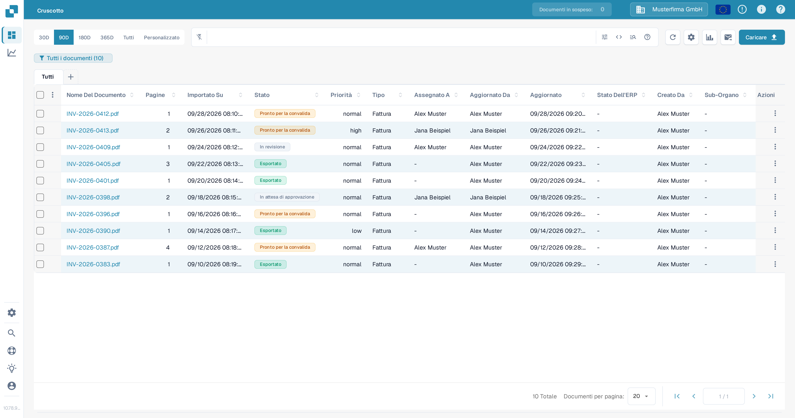
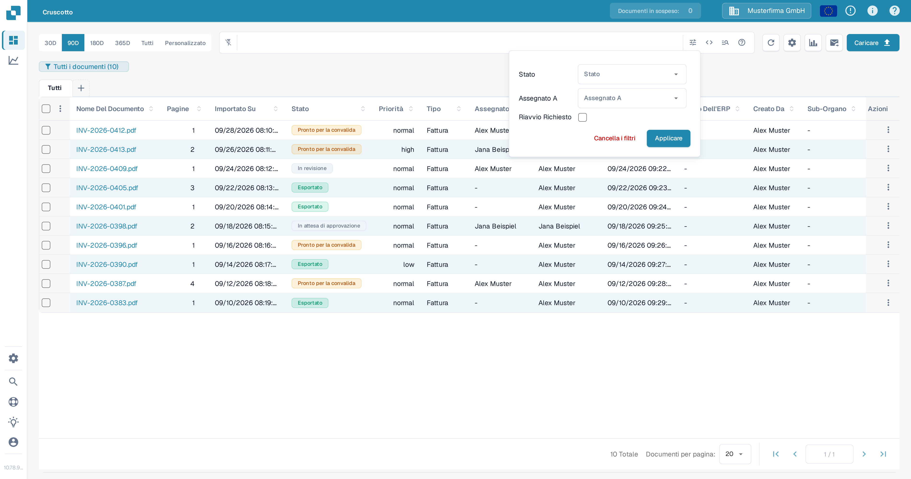
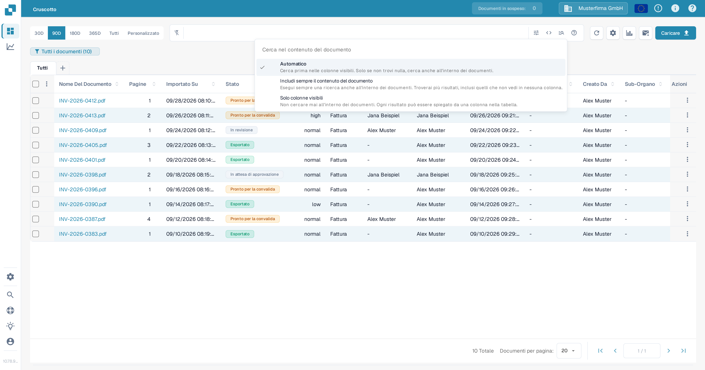
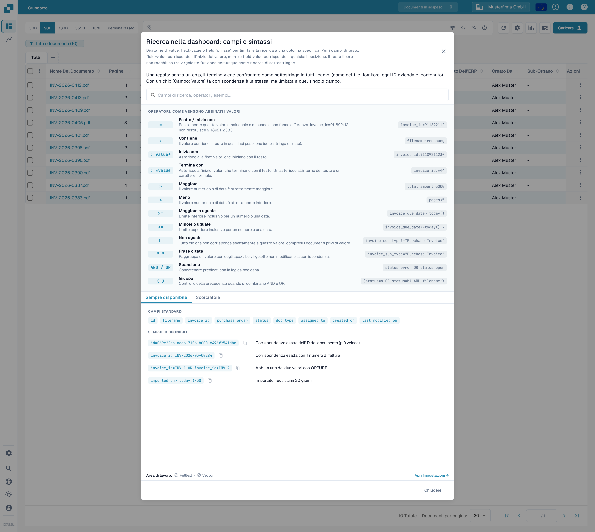
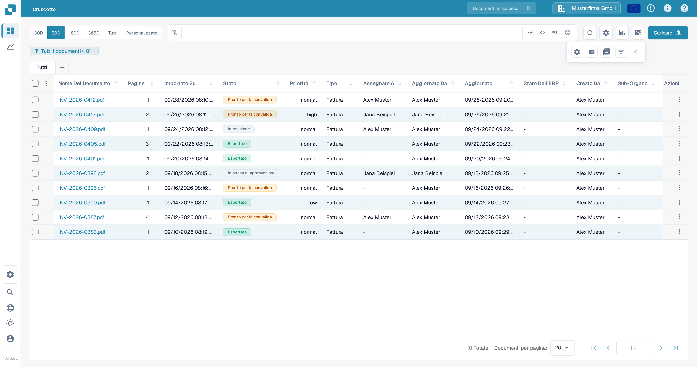
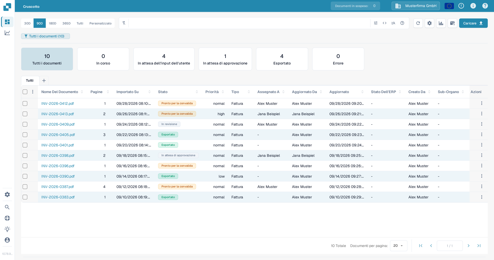
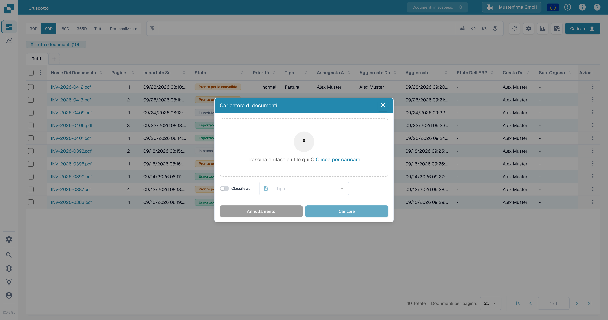
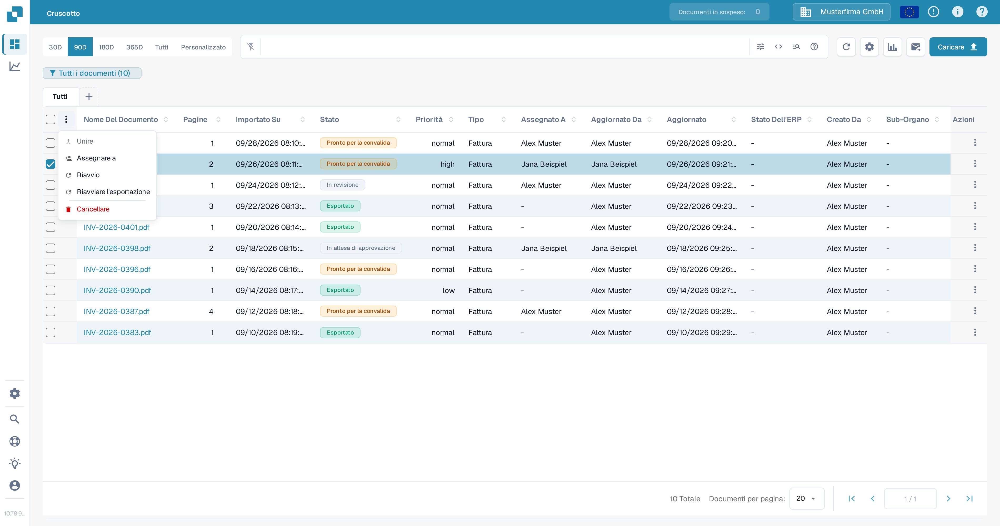
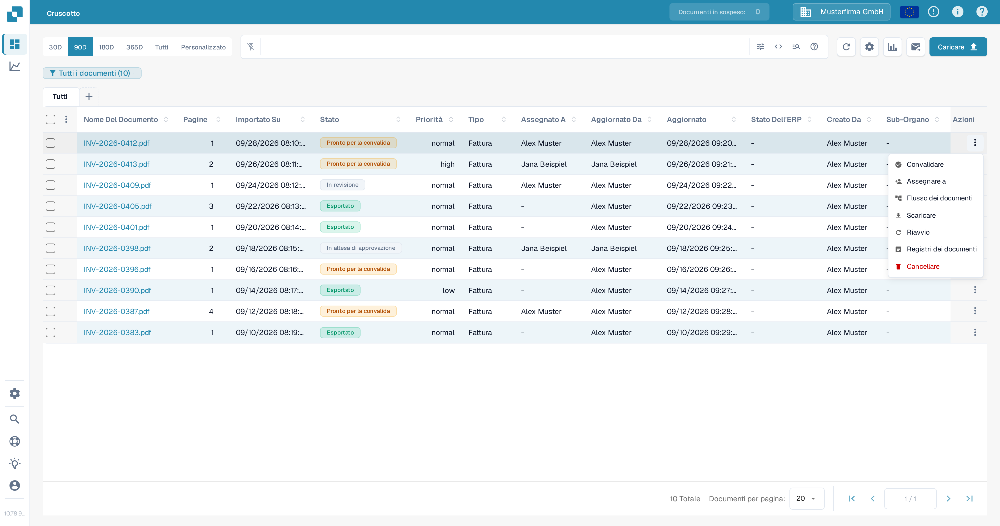

# Strumenti del cruscotto

Il cruscotto è l'elenco dei tuoi documenti. Apri un documento selezionandone il nome. I controlli sopra la tabella ti aiutano a trovare i documenti, a modificare la vista e a caricare nuovi file. Alcuni controlli dipendono dalle impostazioni della tua organizzazione e dai tuoi permessi, quindi il tuo cruscotto potrebbe mostrare meno pulsanti rispetto all'esempio qui sotto.

<figure><figcaption>
Il cruscotto in un'organizzazione di prova in lingua italiana.
</figcaption></figure>

## Trovare i documenti

1. Scegli un intervallo di date a sinistra: **30D**, **90D**, **180D**, **365D**, **Tutti** o **Personalizzato**. Questo limita i documenti mostrati quando i controlli delle date sono disponibili.
2. Digita il nome o l'ID di un documento nella barra di ricerca. La ricerca supporta anche query specifiche per campo. Seleziona il **?** accanto alla barra di ricerca per vedere esempi e gli operatori disponibili.
3. Seleziona l'icona dei cursori dentro la barra di ricerca per restringere l'elenco per **Stato**, **Assegnato A** o **Riavvio Richiesto**, poi seleziona **Applicare**. Usa **Cancella i filtri** per rimuovere queste scelte.
4. Seleziona l'intestazione di una colonna per ordinare la tabella. Usa i controlli di pagina in basso per passare da una pagina di risultati all'altra o per modificare **Documenti per pagina:**.

L'icona all'inizio del campo di ricerca apre un selettore dei campi disponibili e mostra quali funzionalità di ricerca ha la tua organizzazione. L'icona del **codice** alterna la vista di ricerca normale e una vista di query grezza; usa la vista normale a meno che tu non conosca già la sintassi delle query. L'icona della lente d'ingrandimento apre **Cerca nel contenuto del documento**: **Automatico** cerca prima nei campi visibili, **Includi sempre il contenuto del documento** include il testo dentro i file e **Solo colonne visibili** limita i risultati ai campi della tabella. La ricerca dentro i file richiede che la relativa funzionalità di ricerca sia abilitata per la tua organizzazione.

<figure><figcaption>
I filtri dentro la barra di ricerca.
</figcaption></figure>

<figure><figcaption>
Scegli cosa può corrispondere una ricerca semplice.
</figcaption></figure>

Per una ricerca guidata, vedi [Ricerca rapida](quick-search.md) e [Filtraggio dei documenti](filtering-documents.md). Il pannello **?** spiega la sintassi di ricerca avanzata; non ti serve quella sintassi per una semplice ricerca per nome.

<figure><figcaption>
La guida alla ricerca nel cruscotto.
</figcaption></figure>

## Aggiornare e personalizzare la vista

- Seleziona la freccia circolare sopra la tabella per ricaricare l'elenco dei documenti. Non riavvia l'elaborazione dei documenti.
- Seleziona l'ingranaggio per aprire le impostazioni avanzate del cruscotto. Da lì puoi aprire le scorciatoie da tastiera, vedere il registro di importazione delle e-mail o gestire le colonne visibili della tabella. Gli amministratori possono vedere anche un collegamento alle impostazioni del cruscotto. Vedi [Scorciatoie da Tastiera](keyboard-shortcuts.md) e [Modificare le Colonne del Documento](change-document-columns.md) per i passaggi successivi.
- Seleziona il grafico a barre per mostrare l'**Analisi** sopra la tabella. Scegli una carta di categoria, come **In attesa dell'input dell'utente**, per filtrare i documenti. Seleziona di nuovo il grafico per nascondere le carte.
- Seleziona il contrassegno del cruscotto salvato sotto la barra di ricerca per cambiare o gestire il tuo cruscotto personale. Vedi [Cruscotti personali](personal-dashboards.md).
- Seleziona **+** accanto alla scheda **Tutti** per aggiungere una scheda per un tipo di documento. Nell'organizzazione di prova è disponibile **Fattura**. Seleziona una scheda per mostrare quel tipo di documento.

<figure><figcaption>
Apri il menu dell'ingranaggio per le opzioni del cruscotto.
</figcaption></figure>

<figure><figcaption>
Le carte di Analisi sopra l'elenco dei documenti.
</figcaption></figure>

## Caricare documenti

Seleziona **Caricare**. Trascina i file nel **Caricatore di documenti** o seleziona **Clicca per caricare** per sceglierli dal tuo computer. Se conosci il tipo di documento, attiva **Classify as** e seleziona il tipo; altrimenti lascialo spento per la classificazione automatica. Seleziona **Caricare** per inviare i file. Vedi [Panoramica dei documenti caricati](overview-of-uploaded-documents.md) per cosa succede dopo.

<figure><figcaption>
La finestra di caricamento attuale.
</figcaption></figure>

## Lavorare con più documenti

Seleziona le caselle di controllo accanto ai documenti su cui vuoi agire, poi apri il menu a tre punti nell'intestazione della tabella. A seconda dei documenti e dei tuoi permessi, il menu offre **Unire**, **Assegnare a**, **Riavvio**, **Riavviare l'esportazione** e **Cancellare**. Controlla le righe selezionate prima di scegliere un'azione; **Cancellare** rimuove i documenti. Per unire più file, segui [Unione di Documenti](document-merging.md).

<figure><figcaption>
Azioni massive accanto alle caselle di selezione della tabella.
</figcaption></figure>

Per un solo documento, apri il menu a tre punti in fondo alla sua riga. Offre azioni come **Convalidare**, **Assegnare a**, **Flusso dei documenti**, **Scaricare**, **Riavvio**, **Registri dei documenti** e **Cancellare**, a seconda del documento e dei tuoi permessi. **Convalidare** apre il documento in revisione; **Flusso dei documenti** mostra la sua cronologia di elaborazione; **Riavvio** riavvia l'elaborazione; **Cancellare** lo rimuove. Vedi [Flusso Documento](document-flow.md) e [Stato del documento](document-status.md) prima di modificare un documento in elaborazione.

<figure><figcaption>
Azioni per un singolo documento.
</figcaption></figure>

## Altri pulsanti che la tua organizzazione potrebbe mostrare

- Il pulsante della busta avvia un'importazione di e-mail usando la configurazione di importazione delle e-mail esistente dell'organizzazione. Chiedi a un amministratore se non sei sicuro che la tua casella di posta sia configurata; selezionarlo avvia un'importazione.
- **Scansione del documento** appare solo quando la scansione dei documenti è abilitata e uno scanner è disponibile.
- **Esportazione della tabella** appare solo quando l'esportazione del cruscotto è abilitata. Il suo menu offre file CSV ed Excel. L'esportazione usa i documenti attualmente visualizzati nella tabella.

I pulsanti disponibili possono variare in base alla larghezza dello schermo. Su uno schermo stretto, apri **Altro** per trovare alcune delle azioni che su uno schermo desktop appaiono separatamente.
