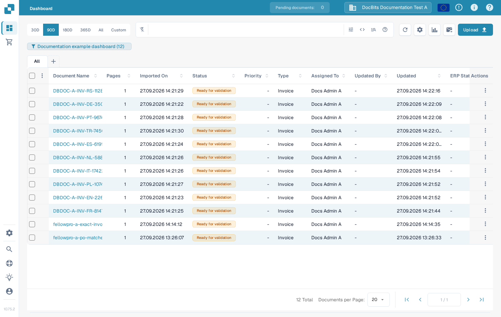
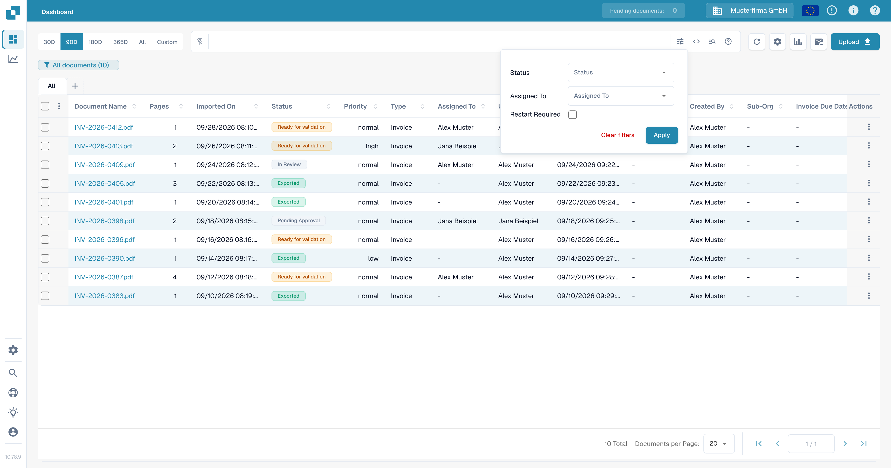
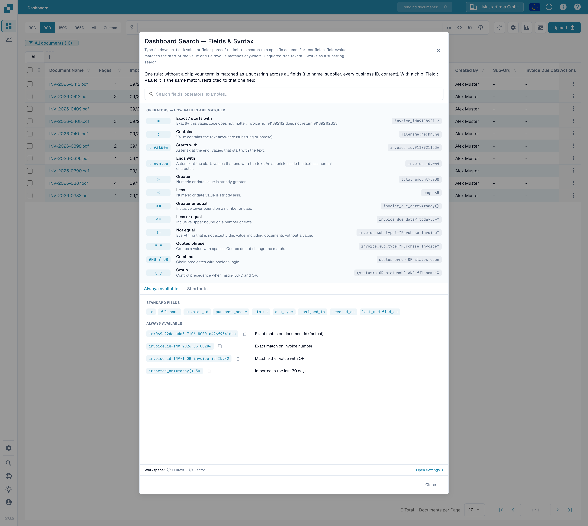
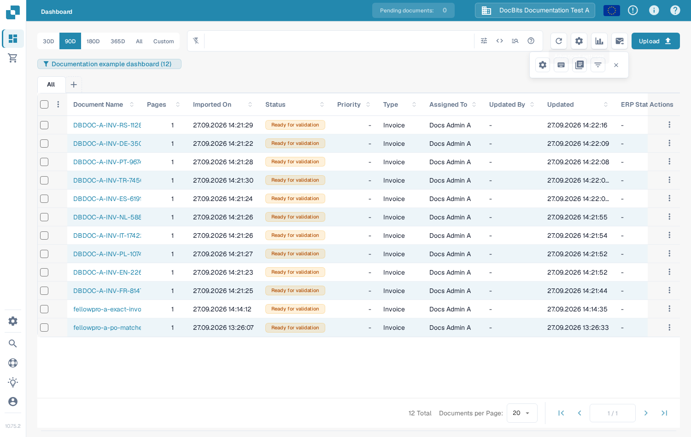
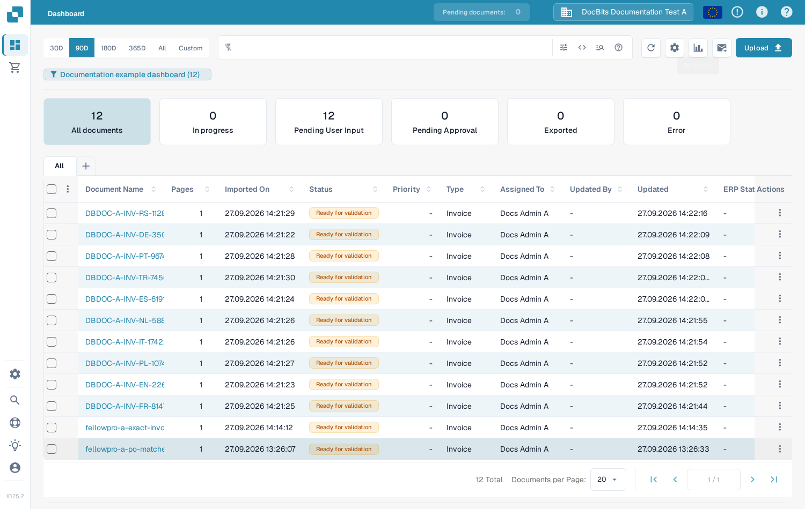
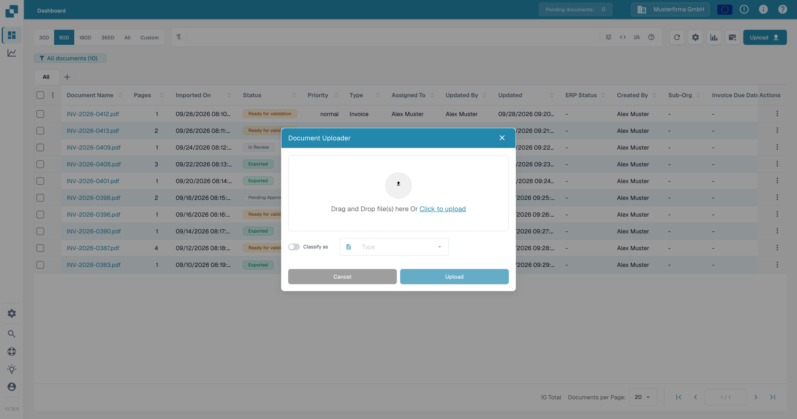
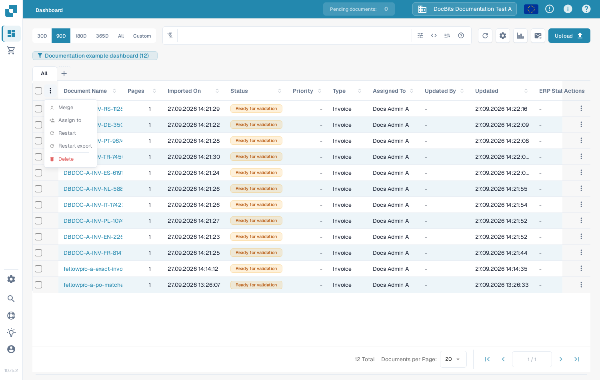

# Dashboard tools

The dashboard is your list of documents. Open a document by selecting its name. The controls above the table help you find documents, change what you see, and upload new files. Some controls depend on your organization's settings and your permissions, so your dashboard may show fewer buttons than the example below.

<figure><figcaption>The dashboard in an English-language test organization.</figcaption></figure>

## Find documents

1. Choose a date range on the left: **30D**, **90D**, **180D**, **365D**, **All**, or **Custom**. This limits the documents shown when the date controls are available.
2. Type a document name or ID into the search bar. The search also supports field-specific queries. Select the **?** beside the search bar to see examples and the available operators.
3. Select the sliders icon inside the search bar to narrow the list by **Status**, **Assigned To**, or **Restart Required**, then select **Apply**. Use **Clear filters** to remove those choices.
4. Select a column heading to sort the table. Use the page controls at the bottom to move between result pages or change **Documents per Page**.

<figure><figcaption>The filters inside the search bar.</figcaption></figure>

For a guided search, see [Quick Search](quick-search.md) and [Filtering Documents](filtering-documents.md). The **?** panel explains advanced search syntax; you do not need that syntax for a simple name search.

<figure><figcaption>Search help in the dashboard.</figcaption></figure>

## Refresh and customize the view

- Select the circular arrow above the table to reload the document list. It does not restart document processing.
- Select the gear to open **Advanced settings**. There you can open keyboard shortcuts, view the email import log, or manage visible table columns. Administrators may also see a link to dashboard settings. See [Keyboard Shortcuts](keyboard-shortcuts.md) and [Change Document Columns](change-document-columns.md) for the next steps.
- Select the bar chart to show **Analytics** above the table. Choose a category card, such as **Pending User Input**, to filter the documents. Select the chart again to hide the cards.
- Select the saved dashboard badge below the search bar to switch or manage your own dashboard. See [Personal Dashboards](personal-dashboards.md).

<figure><figcaption>Open the gear menu for dashboard options.</figcaption></figure>

<figure><figcaption>Analytics cards above the document list.</figcaption></figure>

## Upload documents

Select **Upload**. Drag files into the **Document Uploader** or select **Click to upload** to choose them from your computer. If you know the document type, turn on **Classify as** and select the type; otherwise leave it off for automatic classification. Select **Upload** to submit the files. See [Overview of Uploaded Documents](overview-of-uploaded-documents.md) for what happens next.

<figure><figcaption>The current upload dialog.</figcaption></figure>

## Work with several documents

Select the checkboxes beside the documents you want to act on, then open the three-dot menu in the table header. Depending on the documents and your permissions, the menu offers **Merge**, **Assign to**, **Restart**, **Restart export**, and **Delete**. Check the selected rows before choosing an action; **Delete** removes documents. For combining files, follow [Document Merging](document-merging.md).

<figure><figcaption>Bulk actions beside the table selection checkboxes.</figcaption></figure>

## Other buttons your organization may show

- The envelope button starts an email import using the organization's existing email import configuration. Ask an administrator if you are unsure whether your mailbox is configured; selecting it starts an import.
- **Scan document** appears only when document scanning is enabled and a scanner is available.
- **Export this table** appears only when dashboard export is enabled. Its menu offers CSV and Excel files. The export uses the documents currently displayed in the table.

The available buttons can differ by screen width. On a narrow screen, open **More** to find some of the actions that appear separately on a desktop screen.
