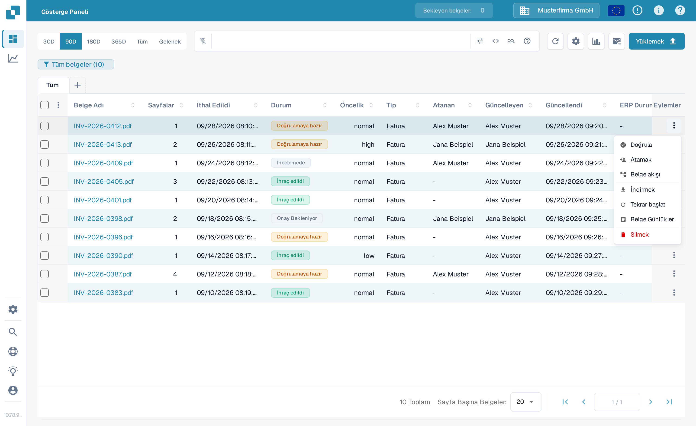
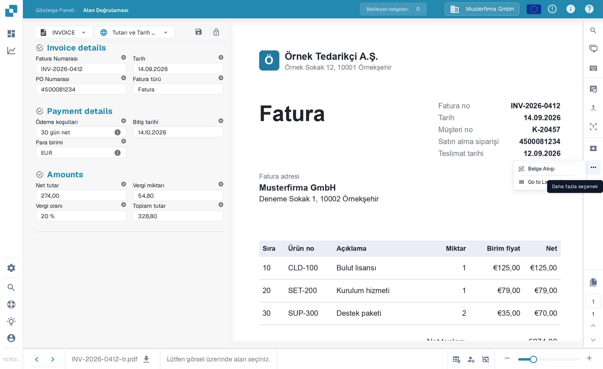
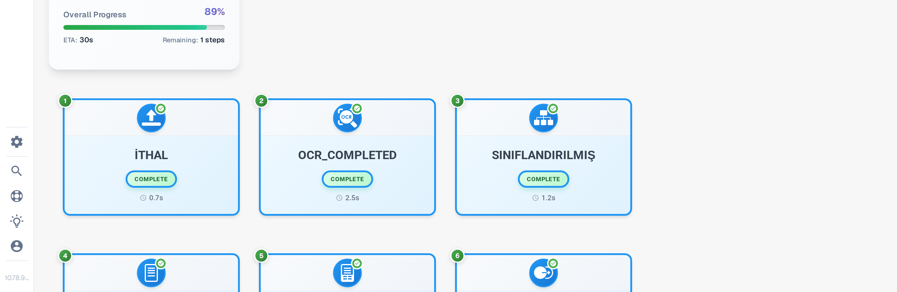
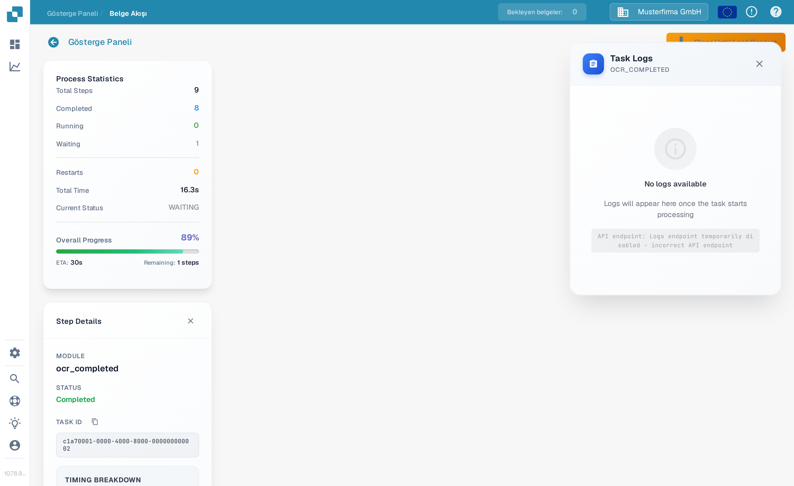

# Belge Akışı

**Belge Akışı**, bir belgenin işleme adımlarını gösterir. Hangi adımların tamamlandığını, hangisinin beklediğini ve işlemenin ne kadar sürdüğünü görmek için kullanın. Aşağıdaki örnekte İngilizce Sandbox ortamındaki sentetik bir fatura kullanılmıştır.

## Gösterge Panosundan açma

[Gösterge Paneli](../../../overview/dashboard/README.md) üzerinde belgeyi bulun. **Eylemler** sütunundaki üç noktayı seçin ve ardından **Belge akışı**'nı tıklayın. Bu seçenek o belgenin akışını açar; belgenin kendisini değiştirmez.

<figure><figcaption>Belgenin Eylemler menüsünden Belge akışı'nı seçin.</figcaption></figure>

## Alan Doğrulamasından açma

Belgeyi açın. [Doğrulama Ekranı](../../../readme-1/validation-screen.md) üzerinde, sağdaki eylem çubuğundaki üç noktayı seçin ve ardından **Daha fazla seçenek** altında **Belge Akışı**'nı tıklayın.

<figure><figcaption>Aynı akışa belge görünümünden de ulaşılır.</figcaption></figure>

## Akışı okuma

Soldaki **Process Statistics** paneli adım sayısını, tamamlanan ve bekleyen adımları, yeniden başlatmaları, toplam süreyi, geçerli durumu ve genel ilerlemeyi özetler. Her numaralı kart bir işleme adımını ve o anki durumunu gösterir. Sonraki adımları görmek için aşağı kaydırın.

<figure><figcaption>Sentetik bir faturanın akışındaki ilk adımlar.</figcaption></figure>

<figure><figcaption>Sırayı sonraki adımlara kadar takip etmek için kaydırın.</figcaption></figure>

Bir adım kartını seçerek solda **Step Details** panelini açın. Bu panel modülü ve durumunu gösterir. Sağda bir **Task Logs** paneli de açılabilir; günlük ayrıntıları o görev için neyin mevcut olduğuna bağlıdır. Step Details panelini kapatmak için **×** simgesini seçin.

<figure><figcaption>Step Details, seçili modülün durumunu açıklar.</figcaption></figure>
