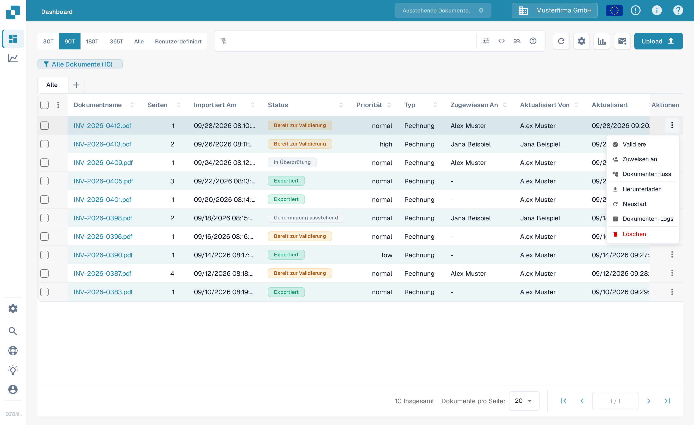
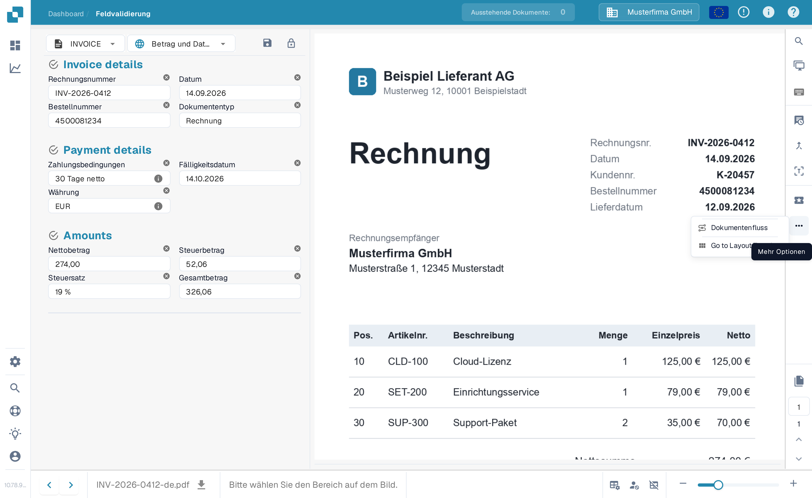
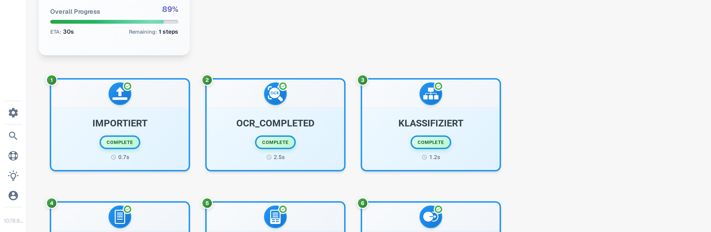
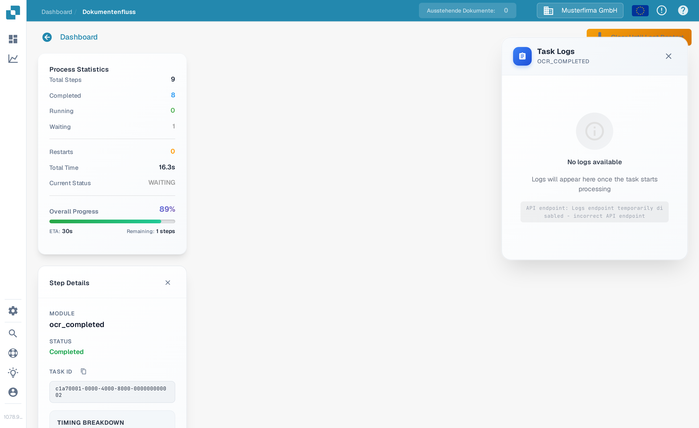

# Dokument-Flow

**Dokument-Flow** zeigt die Verarbeitungsschritte eines Dokuments. Damit sehen Sie, welche Schritte abgeschlossen sind, welcher wartet und wie lange die Verarbeitung gedauert hat. Das Beispiel unten verwendet eine synthetische Rechnung im Deutschen Sandbox.

## Öffnen über das Dashboard

Suchen Sie im [Dashboard](../dashboard/) das Dokument. Wählen Sie in der Spalte **Aktionen** die drei Punkte und dann **Dokumentenfluss**. Die Option öffnet den Flow dieses Dokuments; sie ändert das Dokument nicht.

<figure><figcaption>Wählen Sie Dokumentenfluss im Aktionen-Menü des Dokuments.</figcaption></figure>

## Öffnen über die Feldvalidierung

Öffnen Sie das Dokument. Wählen Sie im [Validierungsbildschirm](../validation-screen/) die drei Punkte in der rechten Aktionsleiste und dann unter **Mehr Optionen** **Dokumentenfluss**.

<figure><figcaption>Derselbe Flow ist über die Dokumentenansicht erreichbar.</figcaption></figure>

## Den Flow lesen

Die **Prozessstatistik** links fasst die Anzahl der Schritte, abgeschlossene und wartende Schritte, Neustarts, die Gesamtdauer, den aktuellen Status und den Gesamtfortschritt zusammen. Jede nummerierte Karte zeigt einen Verarbeitungsschritt und seinen aktuellen Zustand. Scrollen Sie nach unten, um spätere Schritte zu sehen.

<figure><figcaption>Die ersten Schritte im Flow einer synthetischen Rechnung.</figcaption></figure>

<figure><figcaption>Scrollen Sie, um der Reihenfolge bis zu den späteren Schritten zu folgen.</figcaption></figure>

Wählen Sie eine Schritt-Karte aus, um die **Step Details** links zu öffnen. Sie zeigen das Modul und seinen Status. Rechts kann sich zusätzlich ein **Task Logs**-Bereich öffnen; die Logdetails hängen davon ab, was für diesen Task verfügbar ist. Wählen Sie in Step Details das **×**, um den Bereich zu schließen.

<figure><figcaption>Step Details erklärt den Status des ausgewählten Moduls.</figcaption></figure>
