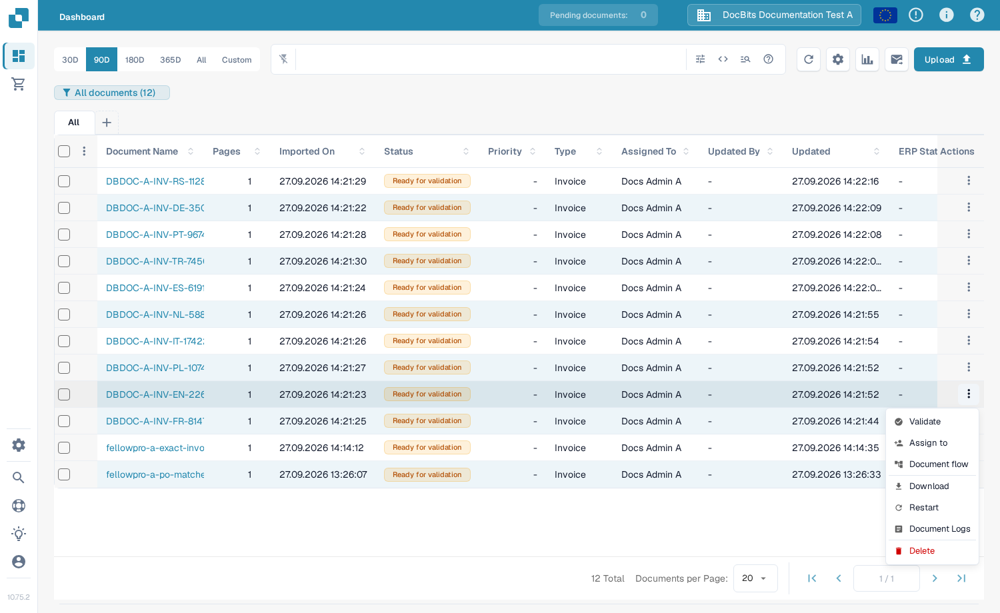
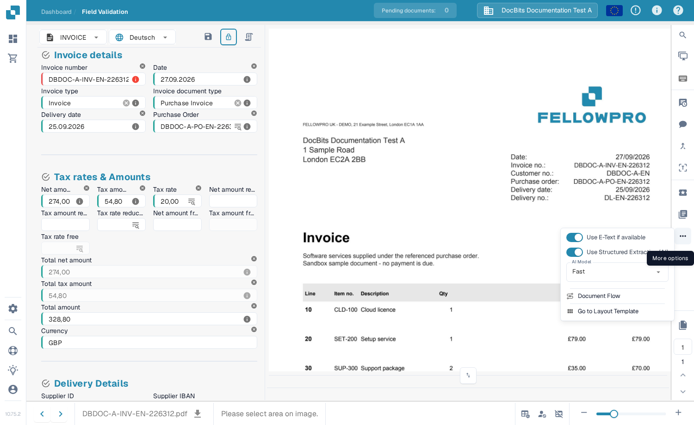
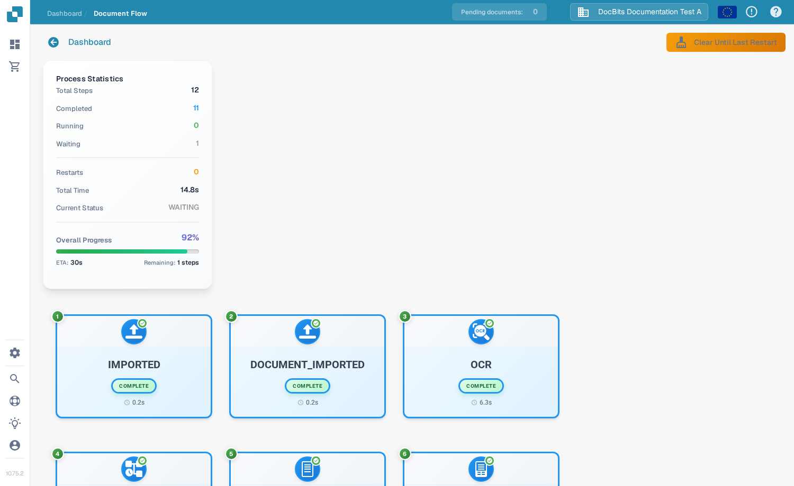
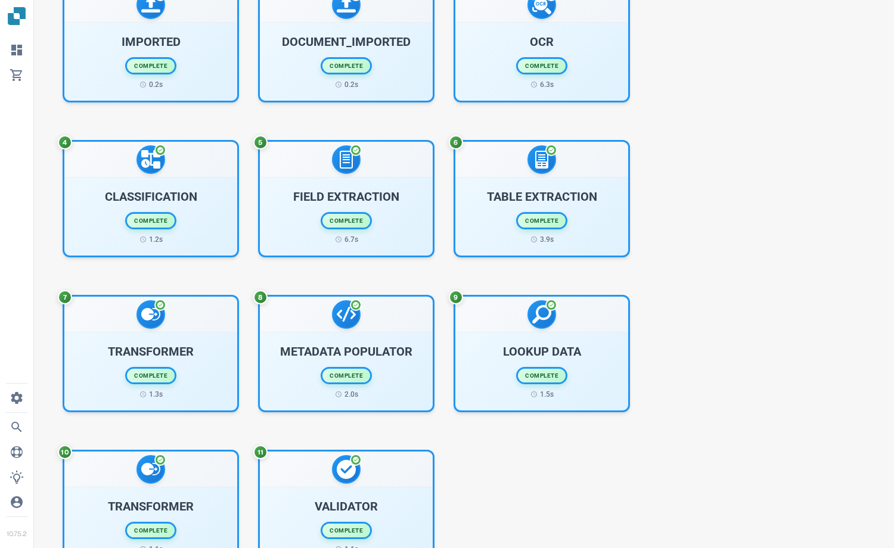
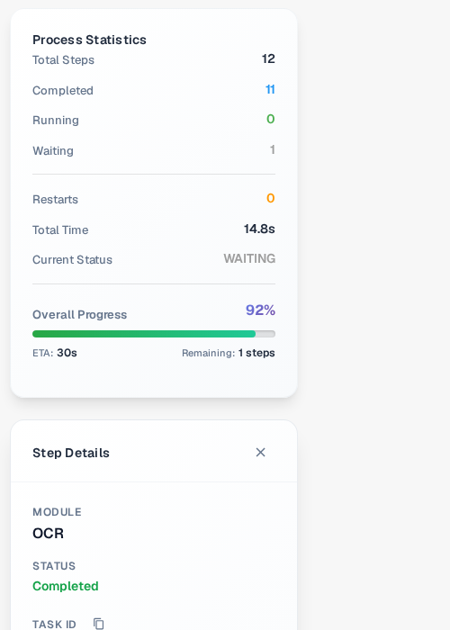

# Document Flow

**Document Flow** shows the processing steps for one document. Use it to see which steps have completed, which one is waiting, and how long processing has taken. The example below uses a synthetic invoice in the English Sandbox.

## Open from the dashboard

On the **Dashboard**, find the document. In its **Actions** column, select the three dots, then **Document flow**. The option opens the flow for that document; it does not change the document.

<figure><figcaption>Choose Document flow from the document's Actions menu.</figcaption></figure>

## Open from Field Validation

Open the document. In **Field Validation**, select the three dots in the right action bar, then **Document Flow** under **More options**.

<figure><figcaption>The same flow is available from the document view.</figcaption></figure>

## Read the flow

**Process Statistics** on the left summarizes the number of steps, completed and waiting steps, restarts, total time, current status, and overall progress. Each numbered card shows a processing step and its current state. Scroll down to see later steps.

<figure><figcaption>The first steps of a synthetic invoice's flow.</figcaption></figure>

<figure><figcaption>Scroll to follow the sequence through later steps.</figcaption></figure>

Select a step card to open **Step Details** on the left. It shows the module and its status. A **Task Logs** panel may also open on the right; log details depend on what is available for that task. Select **×** in Step Details to close the panel.

<figure><figcaption>Step Details explains the selected module's status.</figcaption></figure>
