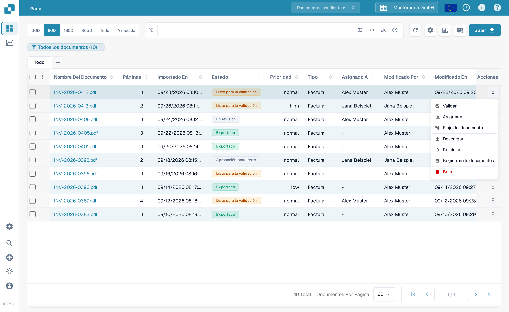
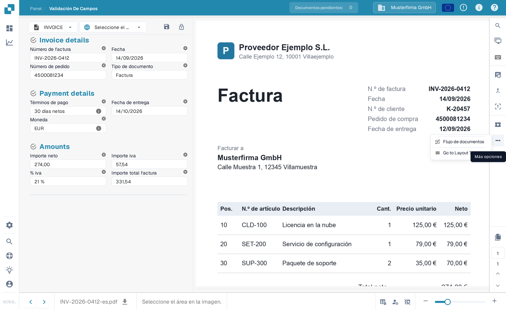
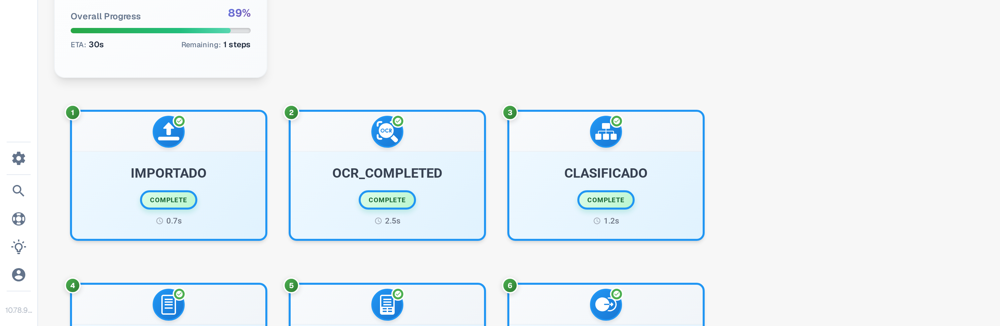
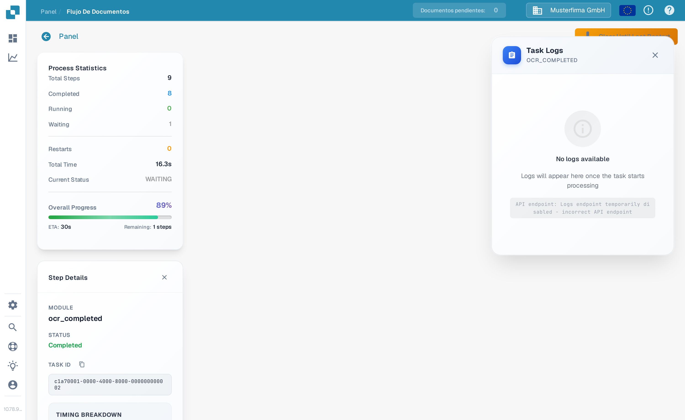

# Flujo de documentos

**Flujo de documentos** muestra los pasos de procesamiento de un documento. Úselo para ver qué pasos se han completado, cuál está en espera y cuánto ha durado el procesamiento. El ejemplo siguiente utiliza una factura sintética en el Sandbox en español.

## Abrir desde el Panel

En el **Panel**, busque el documento. En su columna **Acciones**, seleccione los tres puntos y luego **Flujo del documento**. La opción abre el flujo de ese documento; no modifica el documento.

<figure><figcaption>Elija Flujo del documento en el menú de acciones del documento.</figcaption></figure>

## Abrir desde la Validación De Campos

Abra el documento. En la **Validación De Campos**, seleccione los tres puntos en la barra de acciones de la derecha y luego **Flujo de documentos** en **Más opciones**.

<figure><figcaption>El mismo flujo está disponible desde la vista del documento.</figcaption></figure>

## Leer el flujo

Las **Process Statistics** de la izquierda resumen el número de pasos, los pasos completados y en espera, los reinicios, el tiempo total, el estado actual y el progreso general. Cada tarjeta numerada muestra un paso de procesamiento y su estado actual. Desplácese hacia abajo para ver los pasos posteriores.

<figure><figcaption>Los primeros pasos del flujo de una factura sintética.</figcaption></figure>

<figure><figcaption>Desplácese para seguir la secuencia hasta los pasos posteriores.</figcaption></figure>

Seleccione una tarjeta de paso para abrir **Step Details** a la izquierda. Muestra el módulo y su estado. A la derecha puede abrirse además un panel **Task Logs**; los detalles del registro dependen de lo que esté disponible para esa tarea. Seleccione la **×** en Step Details para cerrar el panel.

<figure><figcaption>Step Details explica el estado del módulo seleccionado.</figcaption></figure>
