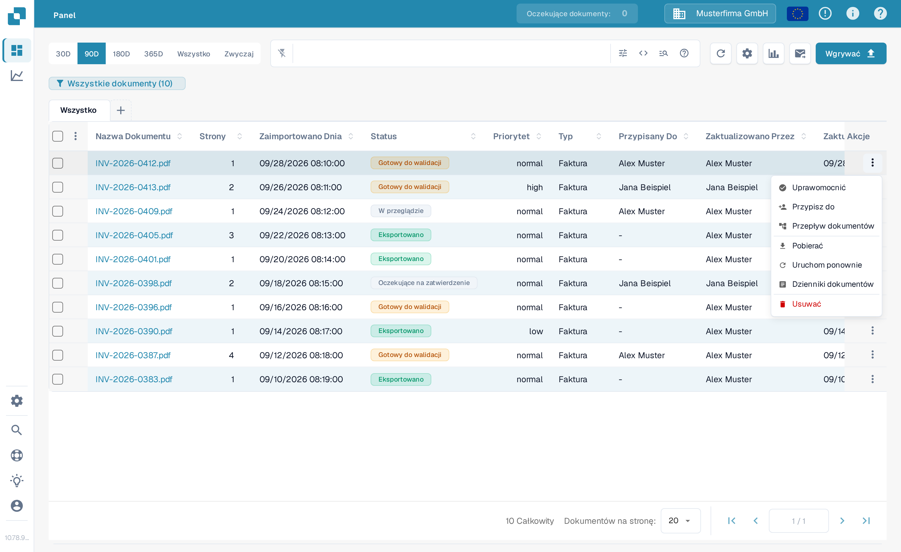
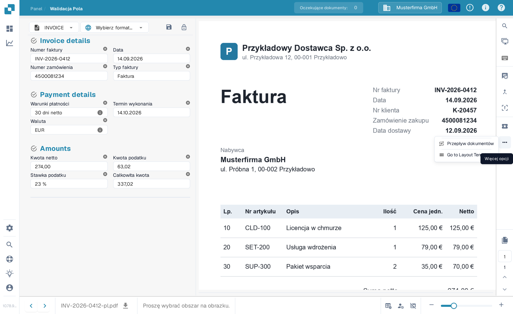
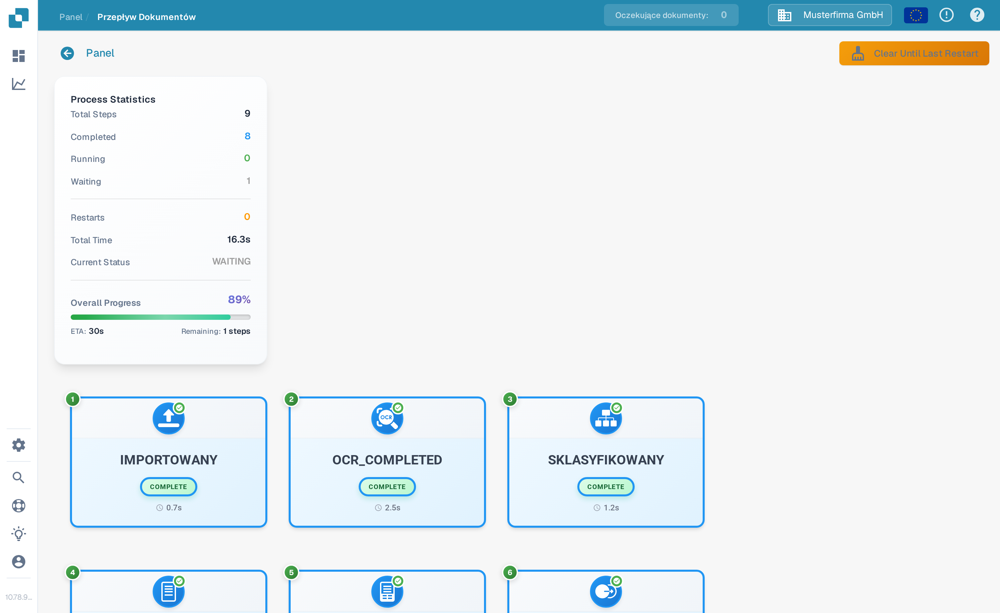
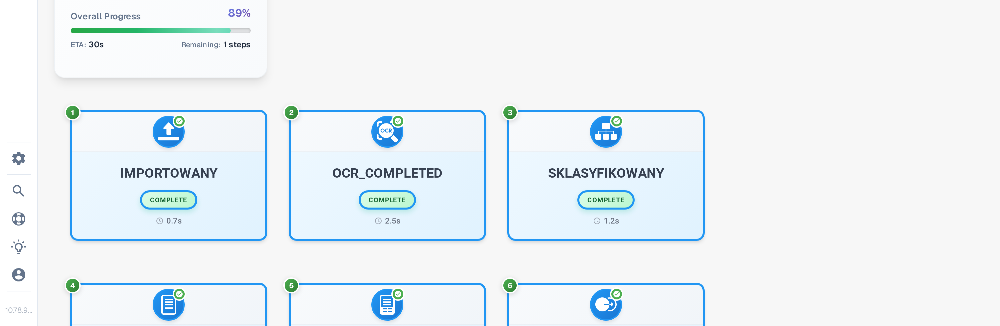

# Przepływ Dokumentów

**Przepływ Dokumentów** pokazuje kroki przetwarzania jednego dokumentu. Użyj go, aby zobaczyć, które kroki zostały ukończone, który oczekuje, i jak długo trwało przetwarzanie. Poniższy przykład używa syntetycznej faktury w polskojęzycznym Sandbox.

## Otwieranie z pulpitu

Na **Pulpicie** znajdź dokument. W kolumnie **Akcje** wybierz trzy kropki, a następnie **Przepływ dokumentów**. Opcja otwiera przepływ tego dokumentu; nie zmienia dokumentu.

<figure><figcaption>
Wybierz Przepływ dokumentów z menu Akcje dokumentu.
</figcaption></figure>

## Otwieranie z Walidacji Pola

Otwórz dokument. W **Walidacji Pola** wybierz trzy kropki na prawym pasku akcji, a następnie **Przepływ dokumentów** w menu **Więcej opcji**.

<figure><figcaption>
Ten sam przepływ jest dostępny z widoku dokumentu.
</figcaption></figure>

## Czytanie przepływu

Panel **Process Statistics** po lewej stronie podsumowuje liczbę kroków, kroki ukończone i oczekujące, ponowne uruchomienia, całkowity czas, bieżący status oraz postęp całkowity. Każda ponumerowana karta pokazuje krok przetwarzania i jego bieżący stan. Przewiń w dół, aby zobaczyć późniejsze kroki.

<figure><figcaption>
Pierwsze kroki przepływu syntetycznej faktury.
</figcaption></figure>

<figure><figcaption>
Przewijaj, aby śledzić kolejność przez późniejsze kroki.
</figcaption></figure>

Wybierz kartę kroku, aby otworzyć panel **Step Details** po lewej stronie. Pokazuje on moduł i jego status. Po prawej stronie może również otworzyć się panel **Task Logs**; szczegóły logów zależą od tego, co jest dostępne dla tego zadania. Wybierz **×** w panelu Step Details, aby go zamknąć.

<figure><figcaption>
Step Details wyjaśnia status wybranego modułu.
</figcaption></figure>
