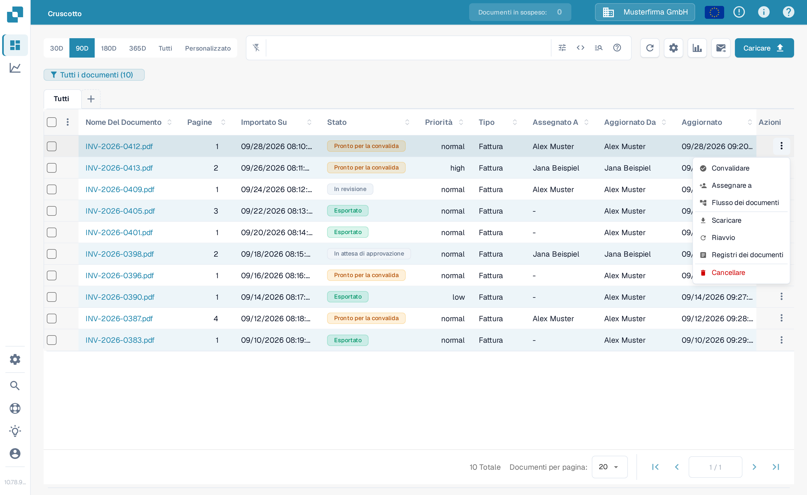
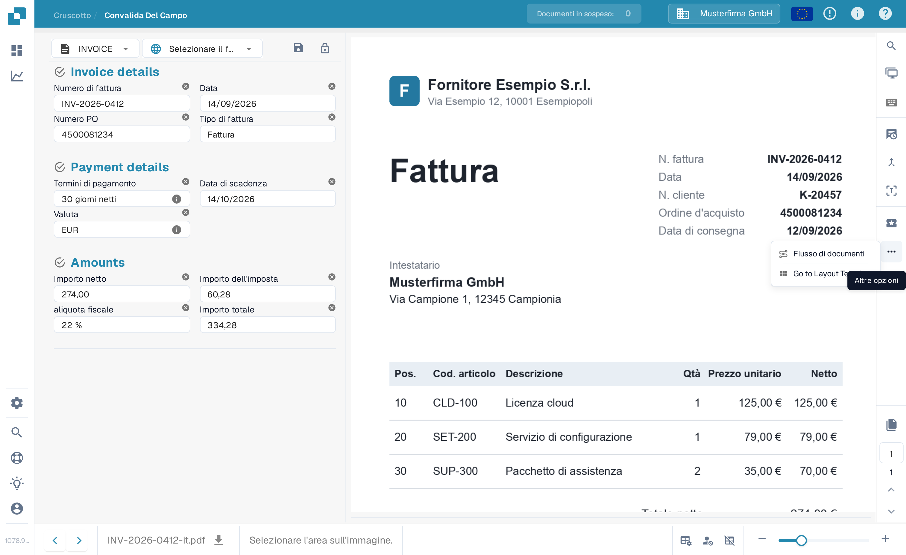
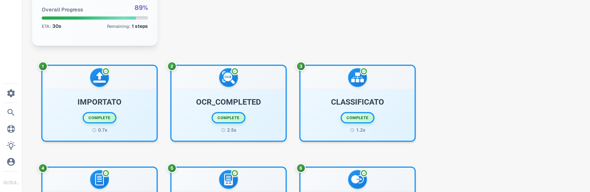
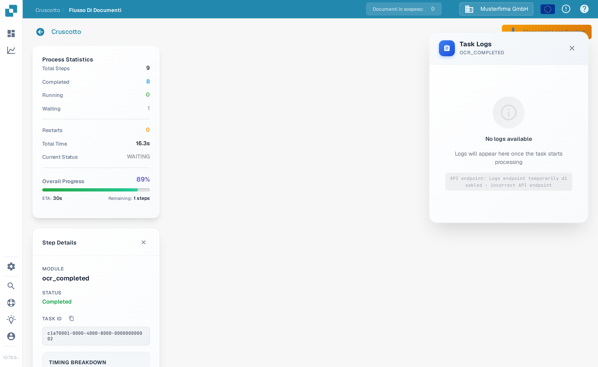

# Flusso dei documenti

**Flusso dei documenti** mostra i passaggi di elaborazione di un documento. Usalo per vedere quali passaggi sono stati completati, quale è in attesa e quanto è durata l'elaborazione. L'esempio seguente utilizza una fattura sintetica nella Sandbox inglese.

## Aprire dal Dashboard

Nel **Dashboard**, trova il documento. Nella sua colonna **Azioni**, seleziona i tre puntini, poi **Flusso dei documenti**. L'opzione apre il flusso di quel documento; non modifica il documento.

<figure><figcaption>Scegli Flusso dei documenti dal menu Azioni del documento.</figcaption></figure>

## Aprire dalla Convalida dei campi

Apri il documento. In **Convalida dei campi**, seleziona i tre puntini nella barra delle azioni a destra, poi **Flusso di documenti** sotto **Altre opzioni**.

<figure><figcaption>Lo stesso flusso è disponibile dalla vista del documento.</figcaption></figure>

## Leggere il flusso

**Process Statistics** a sinistra riepiloga il numero di passaggi, i passaggi completati e in attesa, i riavvii, il tempo totale, lo stato attuale e l'avanzamento complessivo. Ogni scheda numerata mostra un passaggio di elaborazione e il suo stato attuale. Scorri verso il basso per vedere i passaggi successivi.

<figure><figcaption>I primi passaggi del flusso di una fattura sintetica.</figcaption></figure>

<figure><figcaption>Scorri per seguire la sequenza attraverso i passaggi successivi.</figcaption></figure>

Seleziona una scheda del passaggio per aprire **Step Details** a sinistra. Mostra il modulo e il suo stato. Può aprirsi anche un pannello **Task Logs** a destra; i dettagli dei log dipendono da ciò che è disponibile per quel task. Seleziona **×** in Step Details per chiudere il pannello.

<figure><figcaption>Step Details spiega lo stato del modulo selezionato.</figcaption></figure>
