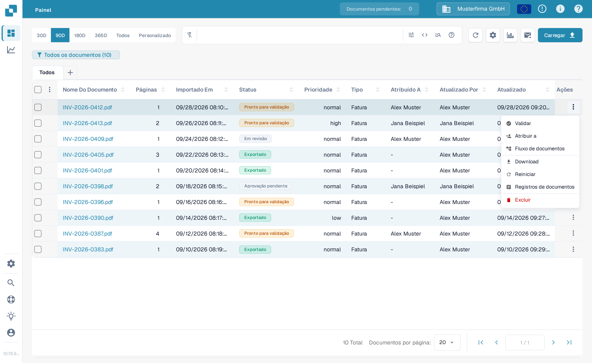
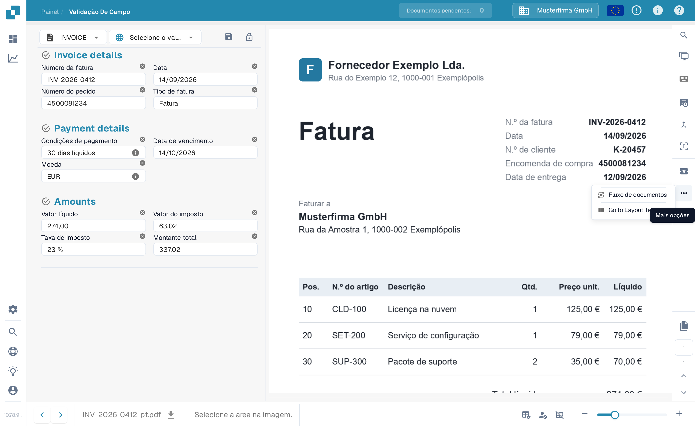
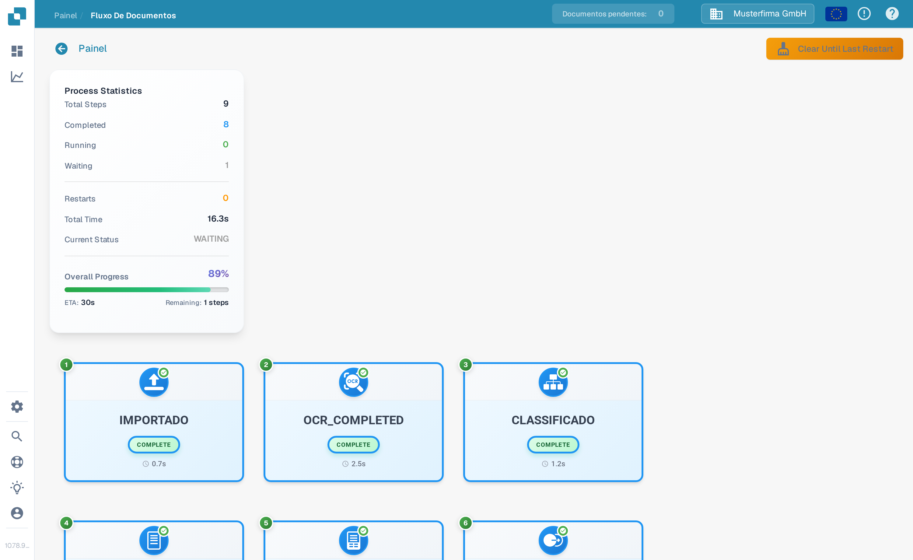
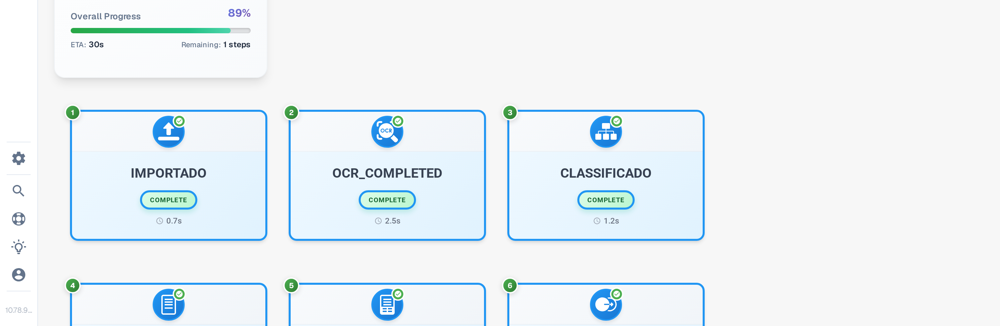
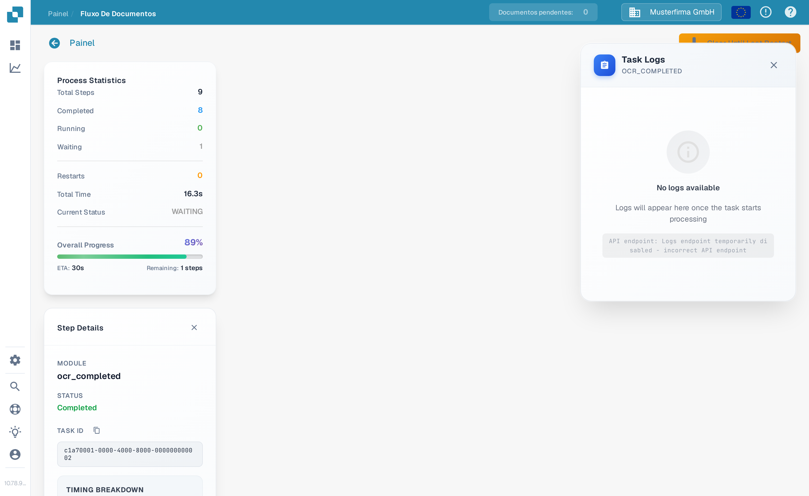

# Fluxo de Documentos

O **Fluxo de Documentos** mostra as etapas de processamento de um documento. Use-o para ver quais etapas foram concluídas, qual está em espera e quanto tempo o processamento levou. O exemplo abaixo usa uma fatura sintética no Sandbox em português.

## Abrir a partir do Painel

No [Painel](../dashboard/), localize o documento. Na coluna **Ações**, selecione os três pontos e, em seguida, **Fluxo de documentos**. A opção abre o fluxo desse documento; ela não altera o documento.

<figure><figcaption>Escolha Fluxo de documentos no menu de ações do documento.</figcaption></figure>

## Abrir a partir da Validação De Campo

Abra o documento. Na tela **Validação De Campo** (capítulo [Tela de Validação](../validation-screen/)), selecione os três pontos na barra de ações à direita e, em seguida, **Fluxo de documentos** em **Mais opções**.

<figure><figcaption>O mesmo fluxo está disponível a partir da visualização do documento.</figcaption></figure>

## Ler o fluxo

As **Process Statistics** à esquerda resumem o número de etapas, as etapas concluídas e em espera, as reinicializações, o tempo total, o estado atual e o progresso geral. Cada cartão numerado mostra uma etapa de processamento e o seu estado atual. Role a página para baixo para ver as etapas posteriores.

<figure><figcaption>As primeiras etapas do fluxo de uma fatura sintética.</figcaption></figure>

<figure><figcaption>Role a página para acompanhar a sequência até as etapas posteriores.</figcaption></figure>

Selecione um cartão de etapa para abrir **Step Details** à esquerda. Ele mostra o módulo e o seu estado. À direita, também pode abrir-se um painel **Task Logs**; os detalhes do registo dependem do que está disponível para essa tarefa. Selecione a **×** em Step Details para fechar o painel.

<figure><figcaption>Step Details explica o estado do módulo selecionado.</figcaption></figure>
