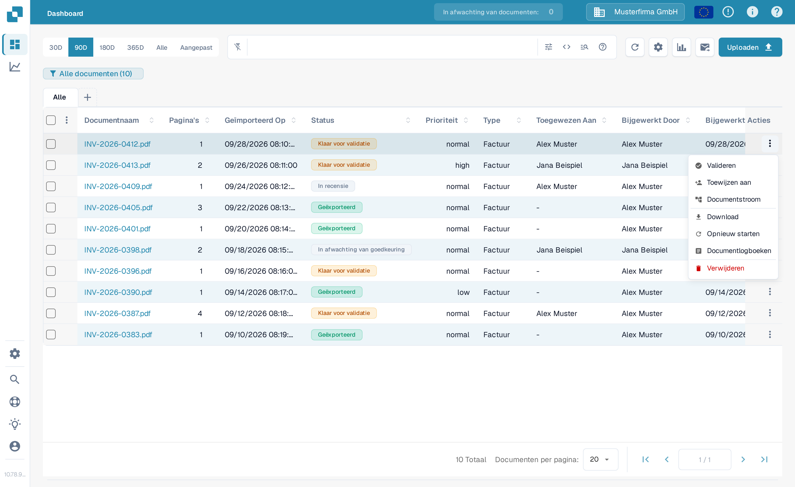
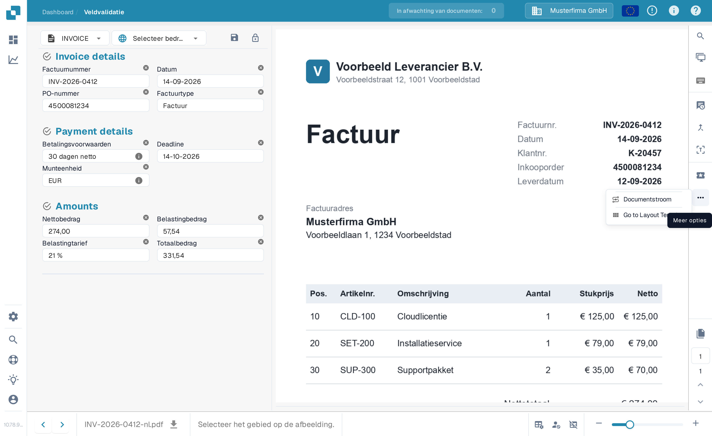
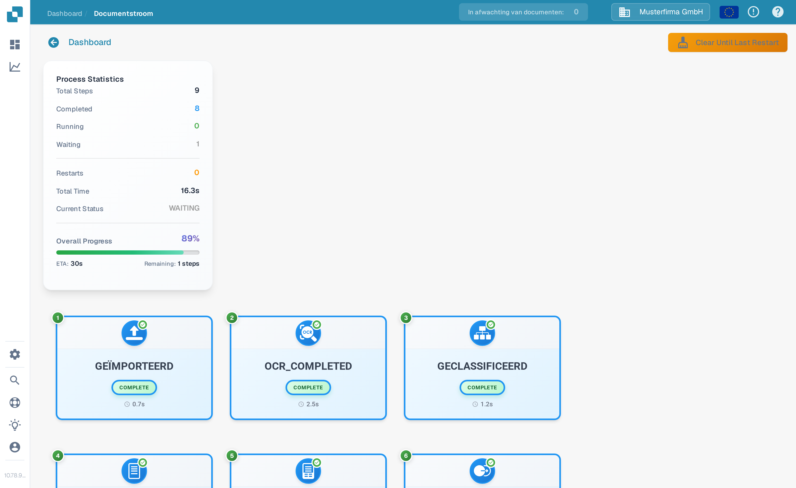

# Documentflow

**Documentflow** toont de verwerkingsstappen van één document. Zo ziet u welke stappen zijn voltooid, welke stap wacht en hoe lang de verwerking heeft geduurd. Het voorbeeld hieronder gebruikt een synthetische factuur in de Engelse Sandbox.

## Openen vanaf het dashboard

Zoek in het [Dashboard](../dashboard/) het document. Kies in de kolom **Acties** de drie puntjes en vervolgens **Documentstroom**. Deze optie opent de flow van dat document; het document zelf verandert niet.

<figure><figcaption>Kies Documentstroom in het Acties-menu van het document.</figcaption></figure>

## Openen vanaf de Veldvalidatie

Open het document. Kies in het [Validatiescherm](../validation-screen/) de drie puntjes in de actiebalk rechts en vervolgens onder **Meer opties** **Documentstroom**.

<figure><figcaption>Dezelfde flow is bereikbaar vanuit de documentweergave.</figcaption></figure>

## De flow lezen

De **Process Statistics** links vat het aantal stappen samen, voltooide en wachtende stappen, herstarts, de totale tijd, de huidige status en de totale voortgang. Elke genummerde kaart toont een verwerkingsstap en de huidige staat ervan. Scroll naar beneden om latere stappen te zien.

<figure><figcaption>De eerste stappen in de flow van een synthetische factuur.</figcaption></figure>

<figure><figcaption>Scroll om de volgorde tot de latere stappen te volgen.</figcaption></figure>

Kies een stapkaart om **Step Details** links te openen. Deze tonen de module en de status ervan. Rechts kan ook een paneel **Task Logs** openen; de logdetails hangen af van wat voor die taak beschikbaar is. Kies in Step Details het **×** om het paneel te sluiten.

<figure><figcaption>Step Details legt de status van de gekozen module uit.</figcaption></figure>
