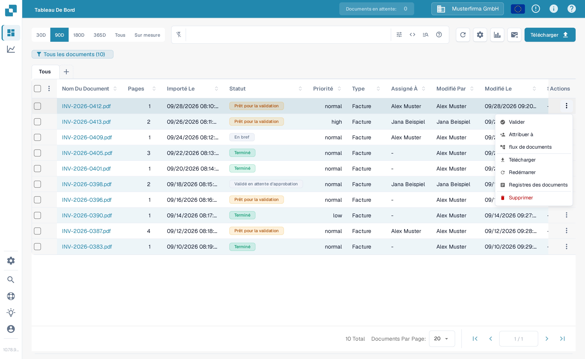
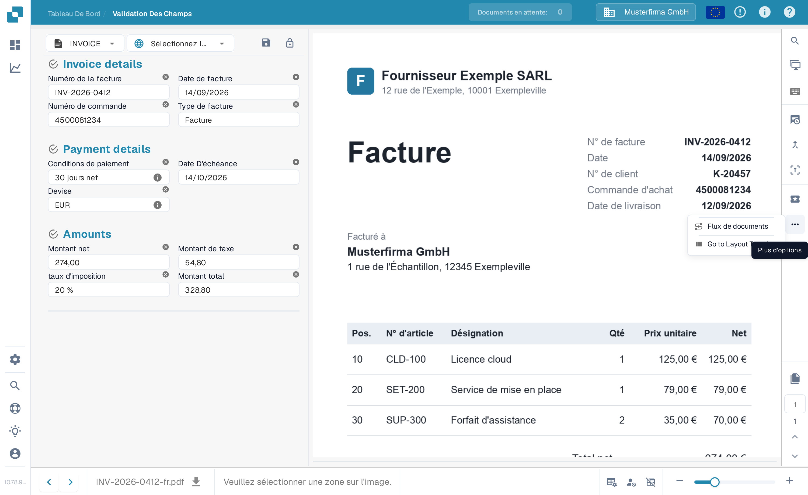
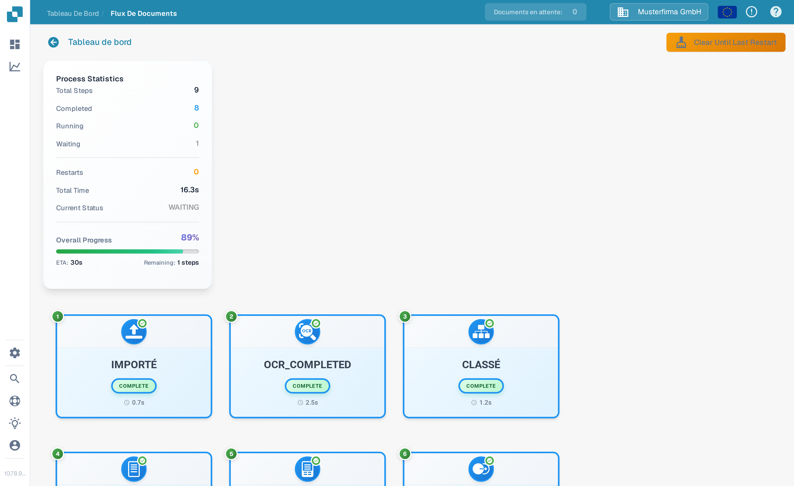
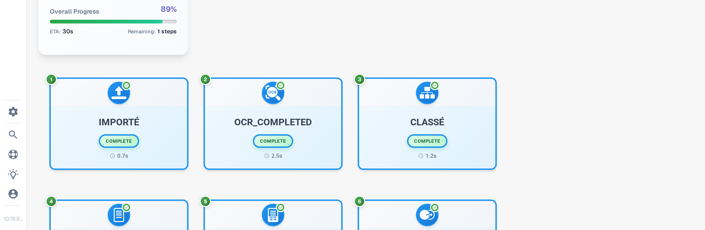

# Flux De Documents

**Flux de documents** affiche les étapes de traitement d'un document. Utilisez-le pour voir quelles étapes sont terminées, laquelle est en attente et combien de temps le traitement a pris. L'exemple ci-dessous utilise une facture synthétique dans le Sandbox en français.

## Ouvrir depuis le tableau de bord

Sur le [tableau de bord](../dashboard/), trouvez le document. Dans sa colonne **Actions**, sélectionnez les trois points, puis **flux de documents**. Cette option ouvre le flux du document ; elle ne modifie pas le document.

<figure><figcaption>Choisissez flux de documents dans le menu Actions du document.</figcaption></figure>

## Ouvrir depuis la Validation Des Champs

Ouvrez le document. Dans **[Validation Des Champs](../validation-screen/)**, sélectionnez les trois points dans la barre d'actions de droite, puis **Flux de documents** sous **Plus d'options**.

<figure><figcaption>Le même flux est disponible depuis la vue du document.</figcaption></figure>

## Lire le flux

**Process Statistics** à gauche résume le nombre d'étapes, les étapes terminées et en attente, les redémarrages, la durée totale, l'état actuel et la progression globale. Chaque carte numérotée montre une étape de traitement et son état actuel. Faites défiler vers le bas pour voir les étapes suivantes.

<figure><figcaption>Les premières étapes du flux d'une facture synthétique.</figcaption></figure>

<figure><figcaption>Faites défiler pour suivre la séquence jusqu'aux étapes suivantes.</figcaption></figure>

Sélectionnez une carte d'étape pour ouvrir **Step Details** à gauche. Elle affiche le module et son statut. Un panneau **Task Logs** peut également s'ouvrir à droite ; les détails des journaux dépendent de ce qui est disponible pour cette tâche. Sélectionnez **×** dans Step Details pour fermer le panneau.

<figure><figcaption>Step Details explique le statut du module sélectionné.</figcaption></figure>
