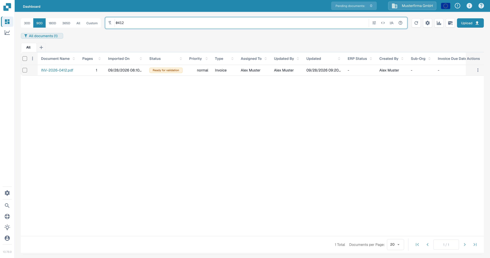
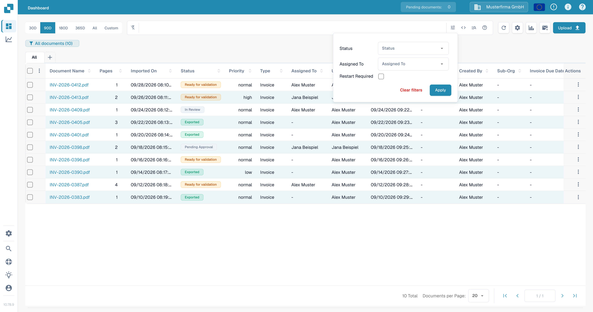
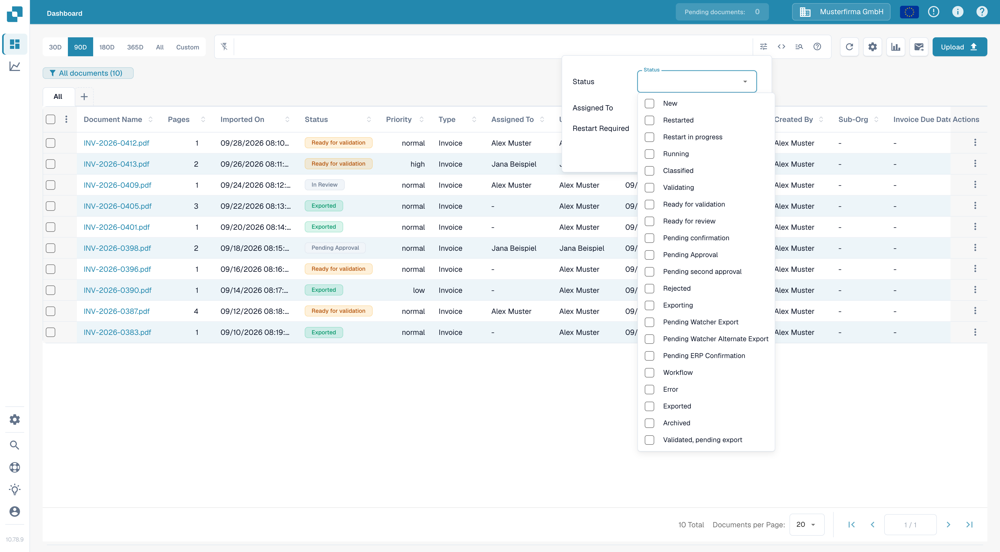
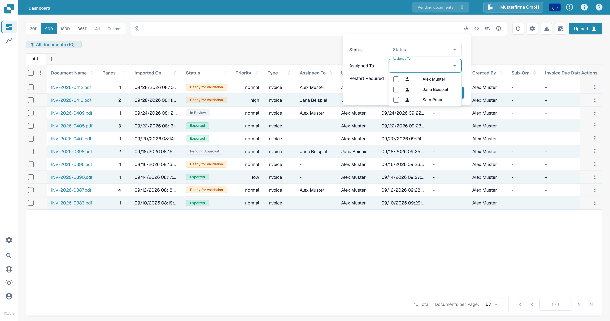
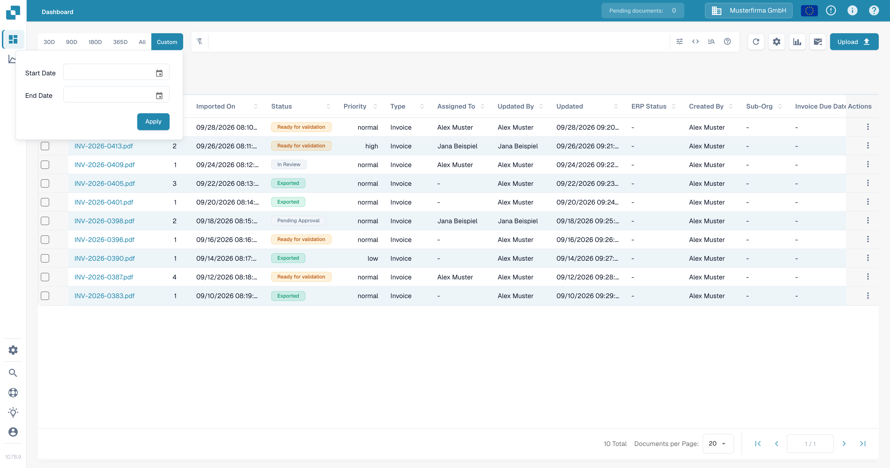
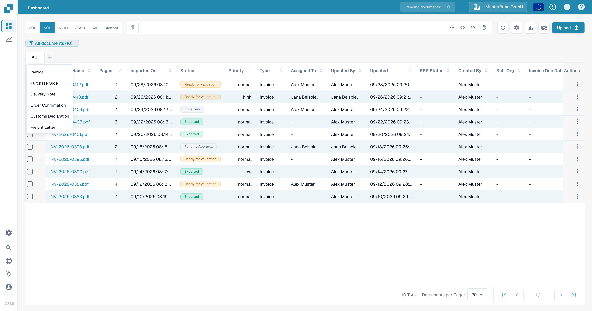
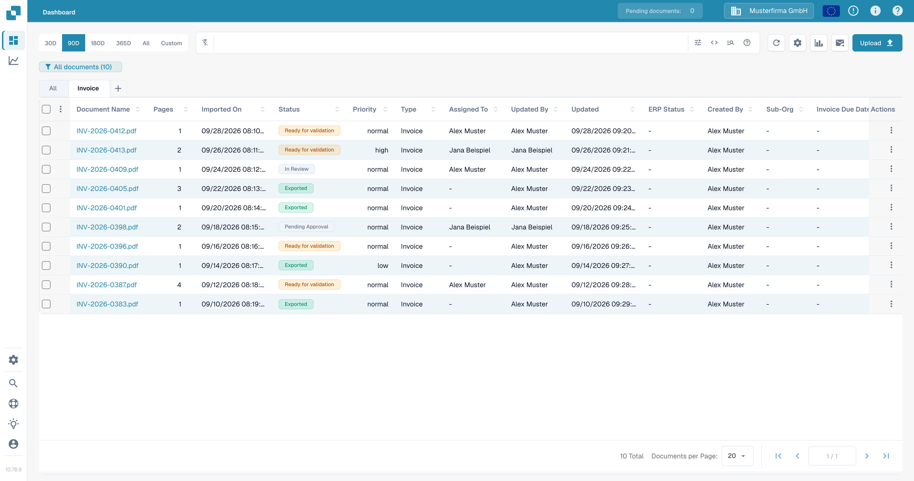

# Filtering Documents

Use the Dashboard search bar, filter panel, date range, and document type tabs to narrow the document list. The controls work together: a document must match the active search and filters to remain in the table.

## Find a document by name

1. Open the **Dashboard**.
2. Enter part of a document name in the search bar above the table and press **Enter**. The count in the dashboard badge and the table update to show matching documents.
3. Replace the search term when you want to look for another document. For field searches and search syntax, see [Quick Search](quick-search.md).

<figure><figcaption>A document-name search narrows the test document list.</figcaption></figure>

## Filter by status, assignee, or restart requirement

1. Select the **Filters** icon (sliders) at the right end of the search bar.
2. Choose one or more **Status** values. You can select several statuses at once.
3. In **Assigned To**, select the users whose documents you want to see. If your organization has group permissions enabled, groups can appear in this same list. There is no separate **Assigned to Group** field in this panel.
4. Select **Restart Required** to show documents that need a restart.
5. Select **Apply**. Select **Clear filters** in this panel to remove these selections; search text and the date range are separate controls.

<figure><figcaption>The current filter panel has three criteria and two actions.</figcaption></figure>

<figure><figcaption>Select the processing statuses you need.</figcaption></figure>

<figure><figcaption>Select a user from Assigned To.</figcaption></figure>

For an explanation of what each processing status means, see [Document Status](document-status.md).

## Choose an import date range

Above the search bar, select **30D**, **90D**, **180D**, **365D**, or **All** to change the import-date range. Select **Custom**, choose **Start Date** and **End Date**, then select **Apply** for a specific range. The current choice is highlighted.

<figure><figcaption>Use Custom when the preset date ranges do not fit.</figcaption></figure>

## Use document type tabs

1. Select **+** beside **All**. The menu lists document types available to your organization.
2. Select a type, such as **Invoice**, to add its tab. Then select the new tab to filter the table to that type. **All** removes the type restriction without deleting the tab.
3. To remove a type tab, select its **×**. The **All** tab cannot be removed.

<figure><figcaption>Add a document type tab from the plus menu.</figcaption></figure>

<figure><figcaption>Choose the tab to apply the type filter; use × to remove the tab.</figcaption></figure>

If the **+** menu has no types, ask an administrator to check which document types are active for your organization. See [Document Types](../../../administration-and-setup/settings/global-settings/document-types/README.md). To save a combination of filters for later, see [Personal Dashboards](personal-dashboards.md).
