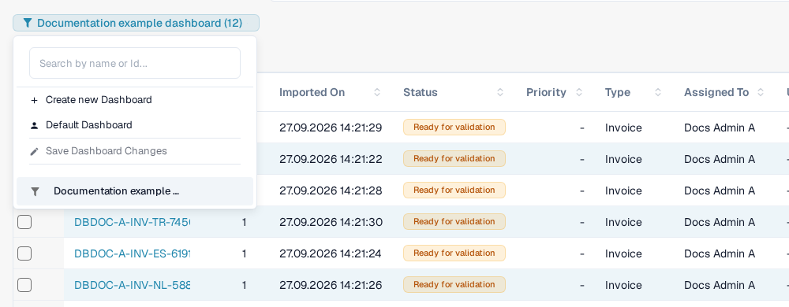
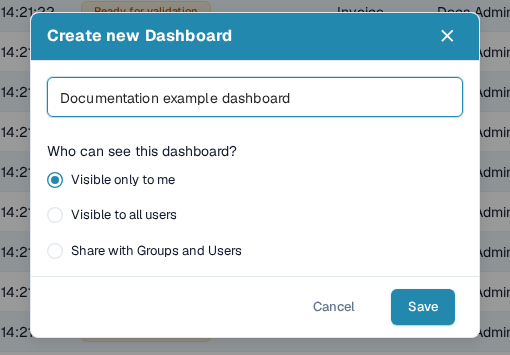
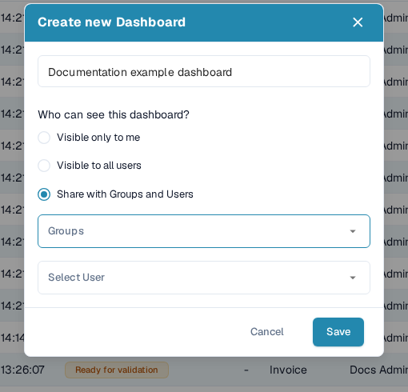
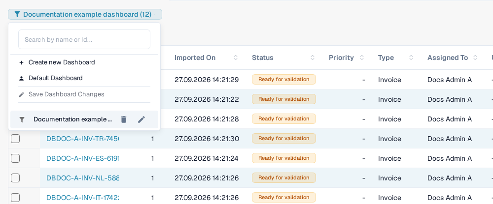
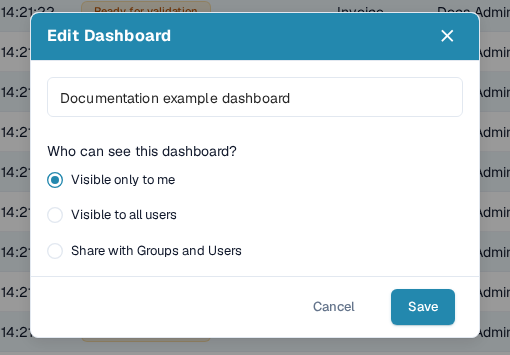

# Personal Dashboards

A personal dashboard saves a view of the document list so you can return to the filters and columns you use often. You can keep it private, make it visible to everyone in your organization, or share it with selected groups and users. To learn how to filter the document list before saving a view, see [Quick Search](quick-search.md).

## Create a dashboard

1. On the **Dashboard**, set the filters and columns you want to save.
2. Select the dashboard badge below the search bar. It shows the current view and document count, such as **All documents (12)**.
3. Select **Create new Dashboard**.

<figure><figcaption>
Open the current dashboard badge to create a saved view.
</figcaption></figure>

4. Enter a name and choose who can see the dashboard:
   * **Visible only to me** keeps the view private.
   * **Visible to all users** makes it available to your organization.
   * **Share with Groups and Users** lets you select specific groups or people.
5. Select **Save**.

<figure><figcaption>
Name the dashboard and choose its visibility before saving it.
</figcaption></figure>

<figure><figcaption>
Select groups or users when you want to share a dashboard with specific people.
</figcaption></figure>

## Open or change a dashboard

Select the dashboard badge, then choose a saved dashboard from the list. Select **Default Dashboard** to return to the default view. The badge displays the name of the active dashboard.

To change a dashboard that you own, hover over its name in the list and select the **pencil** icon. In **Edit Dashboard**, change its name or visibility and select **Save**. A dashboard shared with you by someone else cannot be edited from your account.

<figure><figcaption>
Hover over a dashboard you own to reveal its edit and delete controls.
</figcaption></figure>

<figure><figcaption>
Use the Edit Dashboard dialog to rename the dashboard or change who can see it.
</figcaption></figure>

## Save changes to the current view

After changing filters or columns in a dashboard you own, select **Save Dashboard Changes** from the dashboard menu. The action is unavailable if no dashboard is selected, the view has not changed, or the selected dashboard belongs to someone else.

## Delete a dashboard

Open the dashboard list, hover over a dashboard you own, and select the **trash** icon. Confirm with **Delete**. The delete control is unavailable for a dashboard that another person shared with you.
