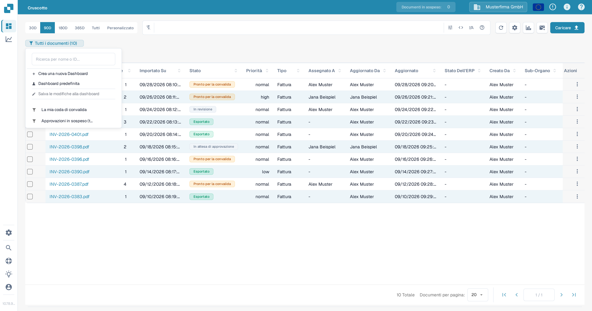
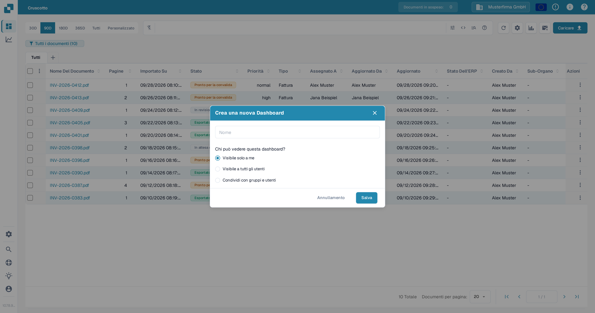
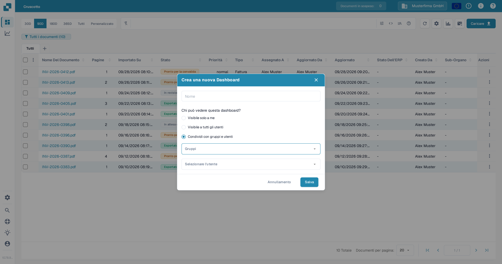
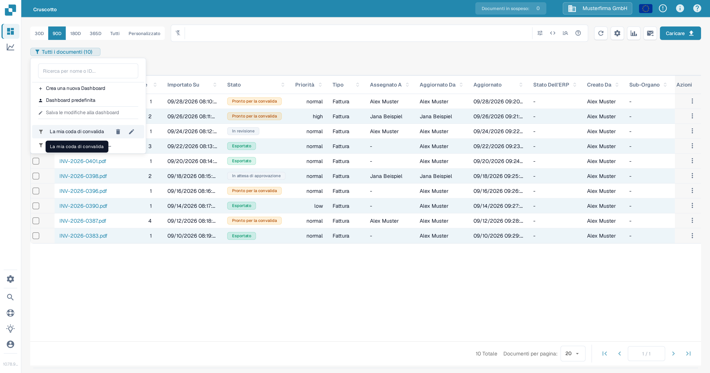
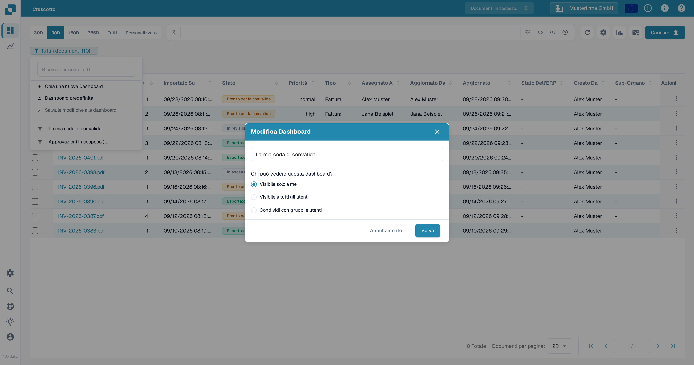

# Cruscotti personali

Un cruscotto personale salva una vista dell'elenco dei documenti, così puoi ritrovare i filtri e le colonne che usi spesso. Puoi mantenerlo privato, renderlo visibile a tutta la tua organizzazione oppure condividerlo con gruppi e utenti selezionati. Per imparare a filtrare l'elenco dei documenti prima di salvare una vista, consulta [Ricerca rapida](quick-search.md).

## Creare un cruscotto

1. Nel **Cruscotto**, imposta i filtri e le colonne che vuoi salvare.
2. Seleziona il badge del cruscotto sotto la barra di ricerca. Mostra la vista corrente e il numero di documenti, ad esempio **Tutti i documenti (10)**.
3. Seleziona **Crea una nuova Dashboard**.

<figure><figcaption>
Apri il badge del cruscotto corrente per creare una vista salvata.
</figcaption></figure>

4. Inserisci un nome e scegli chi può vedere il cruscotto:
   * **Visibile solo a me** mantiene la vista privata.
   * **Visibile a tutti gli utenti** la rende disponibile alla tua organizzazione.
   * **Condividi con gruppi e utenti** ti permette di selezionare gruppi o persone specifiche.
5. Seleziona **Salva**.

<figure><figcaption>
Assegna un nome al cruscotto e scegli la sua visibilità prima di salvarlo.
</figcaption></figure>

<figure><figcaption>
Seleziona gruppi o utenti quando vuoi condividere un cruscotto con persone specifiche.
</figcaption></figure>

## Aprire o cambiare un cruscotto

Seleziona il badge del cruscotto, poi scegli un cruscotto salvato dall'elenco. Seleziona **Dashboard predefinita** per tornare alla vista predefinita. Il badge mostra il nome del cruscotto attivo.

Per modificare un cruscotto che ti appartiene, passa il mouse sul suo nome nell'elenco e seleziona l'icona della **matita**. In **Modifica Dashboard**, cambia il nome o la visibilità e seleziona **Salva**. Un cruscotto condiviso con te da un'altra persona non può essere modificato dal tuo account.

<figure><figcaption>
Passa il mouse su un cruscotto che ti appartiene per mostrarne i controlli di modifica ed eliminazione.
</figcaption></figure>

<figure><figcaption>
Usa la finestra Modifica Dashboard per rinominare il cruscotto o cambiare chi può vederlo.
</figcaption></figure>

## Salvare le modifiche alla vista corrente

Dopo aver modificato filtri o colonne in un cruscotto che ti appartiene, seleziona **Salva le modifiche alla dashboard** dal menu del cruscotto. L'azione non è disponibile se non è selezionato alcun cruscotto, se la vista non è cambiata o se il cruscotto selezionato appartiene a un'altra persona.

## Eliminare un cruscotto

Apri l'elenco dei cruscotti, passa il mouse su un cruscotto che ti appartiene e seleziona l'icona del **cestino**. Conferma con **Elimina**. Il controllo di eliminazione non è disponibile per un cruscotto che un'altra persona ha condiviso con te.
