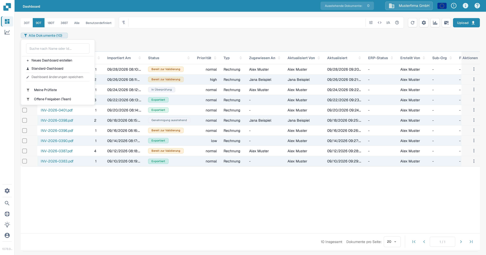
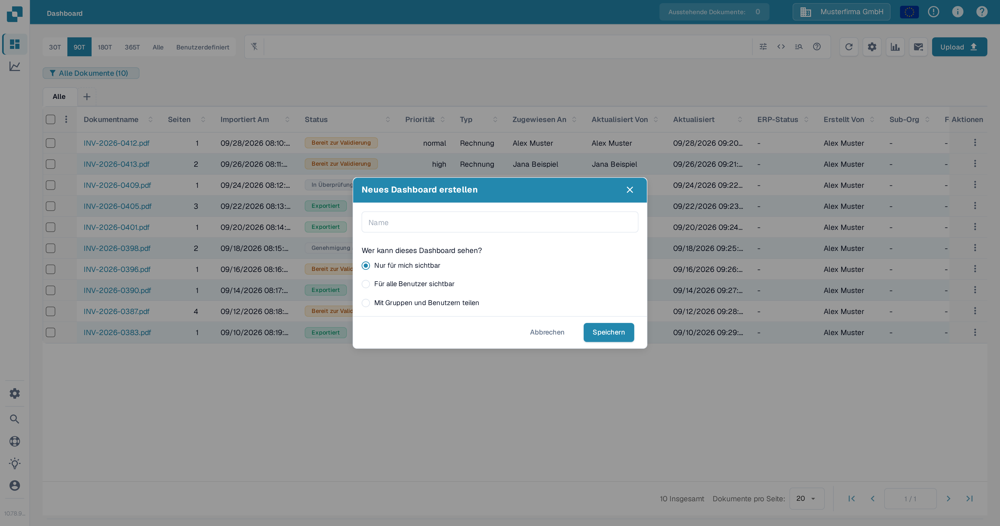
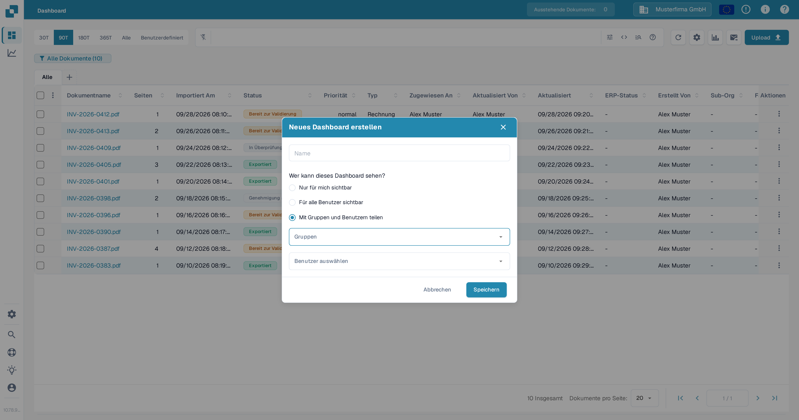
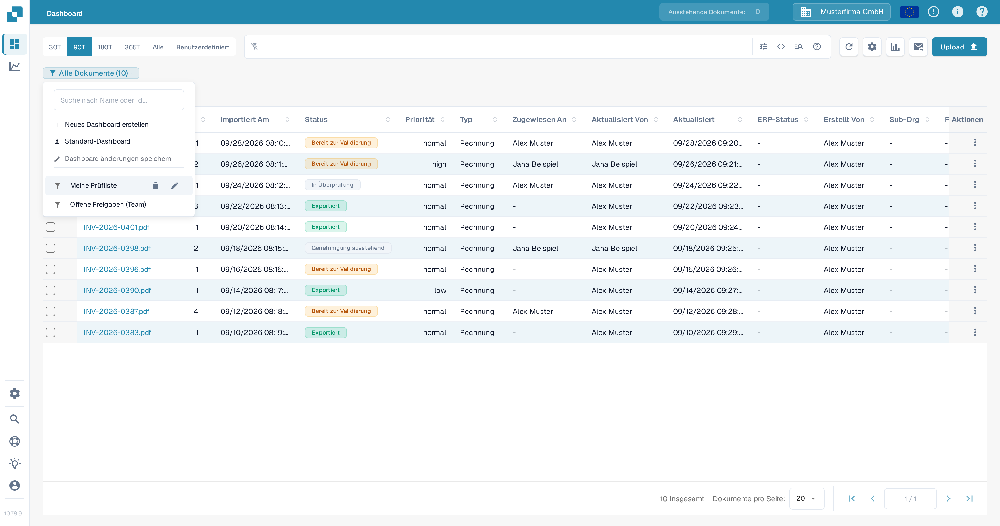
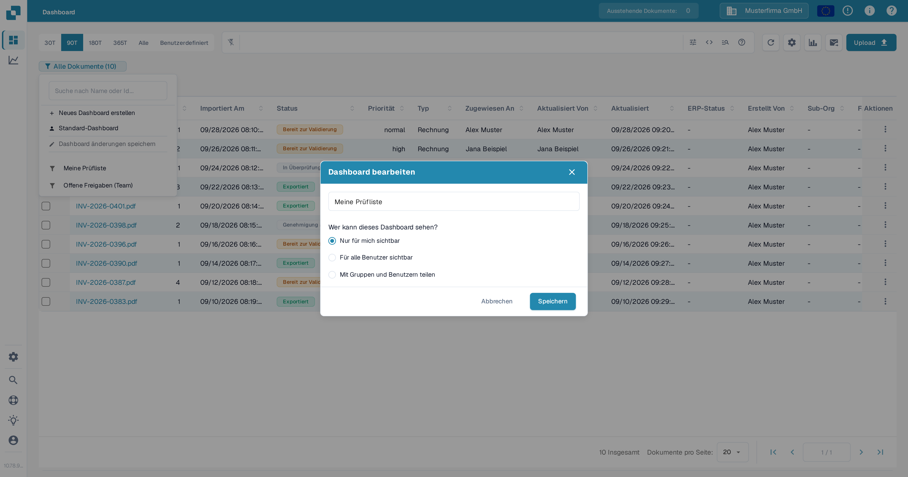

# Persönliche Dashboards

Ein persönliches Dashboard speichert eine Ansicht der Dokumentenliste, damit Sie jederzeit zu den Filtern und Spalten zurückkehren können, die Sie häufig verwenden. Sie können es privat halten, für alle in Ihrer Organisation sichtbar machen oder mit ausgewählten Gruppen und Benutzern teilen. Wie Sie die Dokumentenliste filtern, bevor Sie eine Ansicht speichern, beschreibt [Schnellsuche](quick-search.md).

## Ein Dashboard erstellen

1. Stellen Sie im **Dashboard** die Filter und Spalten ein, die Sie speichern möchten.
2. Wählen Sie die Dashboard-Schaltfläche unterhalb der Suchleiste. Sie zeigt die aktuelle Ansicht und die Anzahl der Dokumente, zum Beispiel **Alle Dokumente (10)**.
3. Wählen Sie **Neues Dashboard erstellen**.

<figure><figcaption>
Öffnen Sie die Dashboard-Schaltfläche, um eine gespeicherte Ansicht zu erstellen.
</figcaption></figure>

4. Geben Sie einen Namen ein und wählen Sie, wer das Dashboard sehen darf:
   * **Nur für mich sichtbar** hält die Ansicht privat.
   * **Für alle Benutzer sichtbar** macht sie für Ihre Organisation verfügbar.
   * **Mit Gruppen und Benutzern teilen** lässt Sie bestimmte Gruppen oder Personen auswählen.
5. Wählen Sie **Speichern**.

<figure><figcaption>
Benennen Sie das Dashboard und legen Sie die Sichtbarkeit fest, bevor Sie es speichern.
</figcaption></figure>

<figure><figcaption>
Wählen Sie Gruppen oder Benutzer aus, wenn Sie ein Dashboard mit bestimmten Personen teilen möchten.
</figcaption></figure>

## Ein Dashboard öffnen oder wechseln

Wählen Sie die Dashboard-Schaltfläche und dann ein gespeichertes Dashboard aus der Liste. Wählen Sie **Standard-Dashboard**, um zur Standardansicht zurückzukehren. Die Schaltfläche zeigt den Namen des aktiven Dashboards.

Um ein Dashboard zu ändern, das Ihnen gehört, zeigen Sie mit der Maus auf seinen Namen in der Liste und wählen Sie das **Stift**-Symbol. Ändern Sie im Dialog **Dashboard bearbeiten** den Namen oder die Sichtbarkeit und wählen Sie **Speichern**. Ein Dashboard, das eine andere Person mit Ihnen geteilt hat, können Sie von Ihrem Konto aus nicht bearbeiten.

<figure><figcaption>
Fahren Sie mit der Maus über ein Dashboard, das Ihnen gehört, um die Symbole zum Bearbeiten und Löschen einzublenden.
</figcaption></figure>

<figure><figcaption>
Im Dialog Dashboard bearbeiten benennen Sie das Dashboard um oder ändern, wer es sehen darf.
</figcaption></figure>

## Änderungen an der aktuellen Ansicht speichern

Nachdem Sie Filter oder Spalten in einem Dashboard geändert haben, das Ihnen gehört, wählen Sie **Dashboard änderungen speichern** im Dashboard-Menü. Die Aktion ist nicht verfügbar, wenn kein Dashboard ausgewählt ist, sich die Ansicht nicht geändert hat oder das ausgewählte Dashboard einer anderen Person gehört.

## Ein Dashboard löschen

Öffnen Sie die Dashboard-Liste, zeigen Sie mit der Maus auf ein Dashboard, das Ihnen gehört, und wählen Sie das **Papierkorb**-Symbol. Bestätigen Sie den Löschvorgang im Dialog. Für ein Dashboard, das eine andere Person mit Ihnen geteilt hat, ist das Löschen nicht verfügbar.
